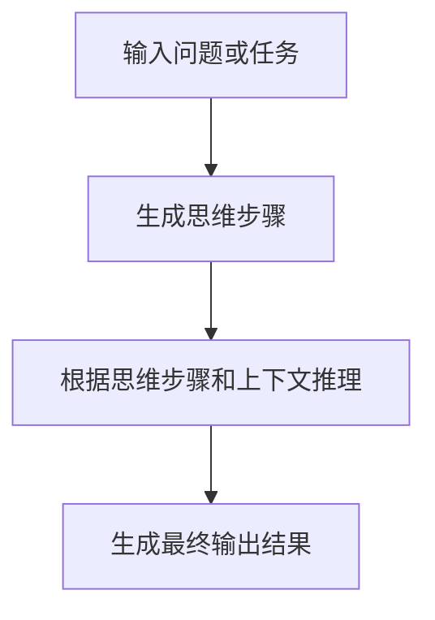

# 【大模型应用开发 动手做AI Agent】思维链

## 1. 背景介绍

随着人工智能技术的不断发展,大型语言模型(Large Language Models, LLMs)已经成为当前最前沿的人工智能技术之一。这些模型通过在海量文本数据上进行预训练,掌握了丰富的自然语言知识和推理能力,可以用于多种自然语言处理任务,如问答、总结、创作等。

然而,尽管大型语言模型拥有强大的语言能力,但它们仍然存在一些局限性,例如缺乏持久的记忆和推理能力、难以进行多步骤推理等。为了解决这些问题,研究人员提出了一种新的范式——思维链(Thought Chain)。思维链旨在赋予语言模型更强的推理和决策能力,使其能够像人类一样进行多步骤推理、形成持久记忆并根据上下文做出合理决策。

在本文中,我们将深入探讨思维链的核心概念、算法原理和实现方法,并通过实际案例展示如何开发一个基于思维链的AI Agent。无论您是AI开发者、研究人员还是对这一领域感兴趣的读者,相信这篇文章都能为您提供有价值的见解和实践指导。

## 2. 核心概念与联系

### 2.1 思维链(Thought Chain)

思维链是一种新兴的人工智能范式,旨在赋予语言模型更强的推理和决策能力。它的核心思想是将语言模型的输出不仅限于最终结果,还包括推理过程中的中间思维步骤。通过这种方式,语言模型可以像人类一样进行多步骤推理,形成持久记忆,并根据上下文做出合理决策。

思维链的基本工作流程如下:

1. 语言模型接收输入问题或任务。
2. 模型生成一系列思维步骤,描述它是如何逐步推理并得出最终结果的。
3. 模型根据这些思维步骤,结合已有的知识和上下文信息,生成最终的输出结果。

通过这种方式,思维链不仅可以提高语言模型的推理能力,还能增强其可解释性和可控性,因为我们可以观察到模型的推理过程,并在必要时进行干预和调整。

### 2.2 思维链与其他AI范式的关系

思维链与其他一些AI范式有着密切的联系,例如:

- 可解释AI(Explainable AI): 思维链通过生成推理步骤,使语言模型的决策过程更加透明和可解释。
- 人工通用智能(Artificial General Intelligence, AGI): 思维链旨在赋予语言模型更强的推理和决策能力,这是实现AGI的一个重要步骤。
- 元认知(Metacognition): 思维链要求语言模型能够监控和调节自身的推理过程,这与人类的元认知能力类似。

## 3. 核心算法原理具体操作步骤

思维链的核心算法原理可以概括为以下几个步骤:



1. **输入问题或任务**

首先,我们需要向语言模型提供一个具体的问题或任务,作为推理的起点。这个输入可以是一个自然语言问题,也可以是一个特定的任务描述。

2. **生成思维步骤**

接下来,语言模型需要生成一系列思维步骤,描述它是如何逐步推理并得出最终结果的。这些思维步骤可以包括:

- 提出子问题或分解任务
- 回忆相关知识或经验
- 应用特定的推理规则或策略
- 进行假设和验证
- 评估中间结果并调整思路

生成思维步骤的过程实际上是一种自回归(自我注意)的过程,语言模型需要根据当前的上下文和已生成的思维步骤,预测下一个合理的思维步骤。

3. **根据思维步骤和上下文推理**

在生成了思维步骤之后,语言模型需要根据这些步骤,结合已有的知识和上下文信息,进行实际的推理过程。这可能涉及到检索相关知识、应用推理规则、进行计算或模拟等操作。

4. **生成最终输出结果**

经过上述推理过程后,语言模型最终会生成一个最终的输出结果,作为对输入问题或任务的回答或解决方案。

需要注意的是,上述步骤并不是一次性完成的,而是一个迭代的过程。语言模型可能需要根据中间结果调整思路,重新生成新的思维步骤,直到得到令人满意的最终结果为止。

## 4. 数学模型和公式详细讲解举例说明

思维链的核心算法通常基于序列到序列(Sequence-to-Sequence, Seq2Seq)模型,例如Transformer等。这些模型旨在学习将一个输入序列(如问题或任务描述)映射到一个输出序列(如思维步骤和最终结果)的概率分布。

### 4.1 序列到序列模型

序列到序列模型的基本思想是将输入序列 $X = (x_1, x_2, \dots, x_n)$ 映射到输出序列 $Y = (y_1, y_2, \dots, y_m)$,其中 $n$ 和 $m$ 分别表示输入和输出序列的长度。

该模型的目标是最大化输出序列 $Y$ 给定输入序列 $X$ 的条件概率:

$$P(Y|X) = \prod_{t=1}^{m} P(y_t|y_{<t}, X)$$

其中 $y_{<t}$ 表示输出序列中位于 $t$ 之前的所有标记。

在思维链的场景中,输入序列 $X$ 可以是问题或任务描述,而输出序列 $Y$ 则包含了思维步骤和最终结果。

### 4.2 自注意力机制(Self-Attention)

自注意力机制是序列到序列模型中的一个关键组件,它允许模型在生成每个输出标记时,充分利用输入序列和已生成的输出序列中的信息。

对于每个输出位置 $t$,自注意力机制计算一个上下文向量 $c_t$,它是输入序列 $X$ 和已生成的输出序列 $y_{<t}$ 的加权和:

$$c_t = \text{Attention}(Q_t, K, V)$$

其中 $Q_t$、$K$ 和 $V$ 分别表示查询(Query)、键(Key)和值(Value)向量,它们是通过线性变换从输入序列和已生成的输出序列中得到的。

自注意力机制允许模型在生成每个输出标记时,动态地关注输入序列和已生成的输出序列中的不同部分,从而捕获长距离依赖关系,并生成更加连贯和上下文相关的输出。

### 4.3 示例:思维链的数学表示

假设我们有一个问题 "2 + 3 = ?",我们希望语言模型能够生成如下的思维步骤和最终结果:

```
思维步骤 1: 2 + 3 是一个加法运算
思维步骤 2: 我需要将 2 和 3 相加
思维步骤 3: 2 + 3 = 5
最终结果: 5
```

在这个例子中,输入序列 $X$ 是 "2 + 3 = ?",而输出序列 $Y$ 是上述的思维步骤和最终结果。

我们可以将输出序列 $Y$ 表示为:

$$Y = (\text{"思维步骤 1: 2 + 3 是一个加法运算"}, \text{"思维步骤 2: 我需要将 2 和 3 相加"}, \text{"思维步骤 3: 2 + 3 = 5"}, \text{"最终结果: 5"})$$

序列到序列模型的目标是最大化 $P(Y|X)$,即给定输入 "2 + 3 = ?" 时,生成上述思维步骤和最终结果的概率。

在生成每个输出标记时,自注意力机制允许模型关注输入序列 "2 + 3 = ?" 和已生成的输出序列中的不同部分,从而捕获相关信息并生成合理的下一步思维步骤或最终结果。

通过这种方式,序列到序列模型结合自注意力机制,能够学习生成思维链所需的推理能力。

## 5. 项目实践:代码实例和详细解释说明

在本节中,我们将通过一个实际的代码示例,展示如何使用Python和Hugging Face的Transformers库来开发一个基于思维链的AI Agent。

### 5.1 项目概述

我们将开发一个命名为"ThoughtChainAgent"的AI Agent,它能够接收自然语言问题作为输入,并生成包含思维步骤和最终结果的响应。该Agent将基于GPT-2模型进行fine-tuning,以学习生成思维链所需的推理能力。

### 5.2 数据准备

为了训练ThoughtChainAgent,我们需要准备一个包含问题、思维步骤和结果的数据集。在本示例中,我们将使用一个简单的数学问题数据集,其中每个样本都包含一个算术问题、相应的思维步骤和最终结果。

下面是一个样本数据的示例:

```
问题: 5 + 7 = ?
思维步骤 1: 5 + 7 是一个加法运算
思维步骤 2: 我需要将 5 和 7 相加
思维步骤 3: 5 + 7 = 12
最终结果: 12
```

### 5.3 数据预处理

在训练模型之前,我们需要对数据进行预处理,将问题、思维步骤和结果组合成一个单独的输入序列,并添加特殊标记来分隔不同部分。

```python
import re

def preprocess_data(sample):
    """
    将问题、思维步骤和结果组合成一个单独的输入序列
    """
    question = sample["question"]
    thought_steps = sample["thought_steps"]
    result = sample["result"]

    input_text = f"问题: {question}\n"
    for i, step in enumerate(thought_steps):
        input_text += f"思维步骤 {i+1}: {step}\n"
    input_text += f"最终结果: {result}"

    return input_text
```

### 5.4 模型训练

接下来,我们将使用Hugging Face的Transformers库来fine-tune一个GPT-2模型,以学习生成思维链。

```python
from transformers import GPT2LMHeadModel, GPT2Tokenizer, TextDataset, DataCollatorForLanguageModeling, Trainer, TrainingArguments

# 加载预训练模型和分词器
model = GPT2LMHeadModel.from_pretrained("gpt2")
tokenizer = GPT2Tokenizer.from_pretrained("gpt2")

# 准备数据集
train_dataset = TextDataset(
    tokenizer=tokenizer,
    file_path="train_data.txt",
    block_size=128,
)

data_collator = DataCollatorForLanguageModeling(
    tokenizer=tokenizer, mlm=False,
)

# 设置训练参数
training_args = TrainingArguments(
    output_dir="./thought_chain_model",
    overwrite_output_dir=True,
    num_train_epochs=3,
    per_device_train_batch_size=8,
    save_steps=10_000,
    save_total_limit=2,
)

# 创建Trainer并开始训练
trainer = Trainer(
    model=model,
    args=training_args,
    data_collator=data_collator,
    train_dataset=train_dataset,
)

trainer.train()
```

在上述代码中,我们首先加载预训练的GPT-2模型和分词器。然后,我们将预处理后的数据集转换为Hugging Face的TextDataset格式,并使用DataCollatorForLanguageModeling对数据进行批处理。

接下来,我们设置训练参数,包括输出目录、训练轮数、批大小等。最后,我们创建一个Trainer对象,并调用train()方法开始训练过程。

### 5.5 模型推理

训练完成后,我们可以使用训练好的模型来生成思维链。下面是一个示例代码:

```python
from transformers import pipeline

# 加载训练好的模型
model = GPT2LMHeadModel.from_pretrained("./thought_chain_model")
tokenizer = GPT2Tokenizer.from_pretrained("gpt2")

# 创建文本生成管道
text_generator = pipeline("text-generation", model=model, tokenizer=tokenizer)

# 输入问题
question = "8 * 6 = ?"

# 生成思维链