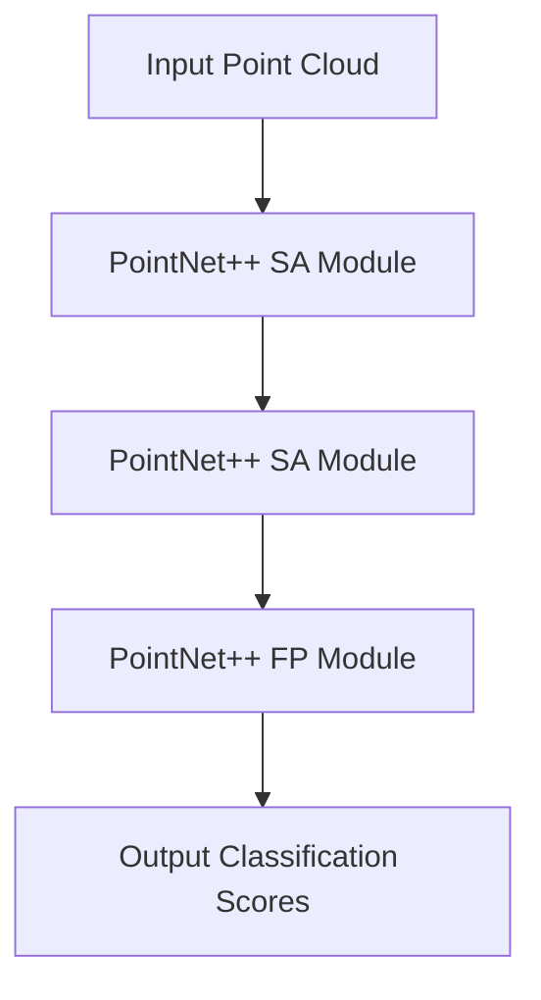

## 1. 背景介绍

随着人工智能技术的不断发展，3D建模技术也在不断地进步和完善。然而，传统的3D建模技术仍然存在一些问题，例如需要大量的人力和时间投入，难以处理复杂的场景等。为了解决这些问题，近年来，越来越多的研究者开始将深度学习技术应用于3D建模领域，取得了一些令人瞩目的成果。本文将介绍3D建模与深度学习技术的融合，探讨其在实际应用中的优势和挑战。

## 2. 核心概念与联系

3D建模是指利用计算机技术对三维物体进行建模和渲染的过程。深度学习是一种机器学习技术，其核心思想是通过构建深层神经网络来实现对数据的自动学习和特征提取。3D建模与深度学习技术的融合，主要是将深度学习技术应用于3D建模中，以实现更加高效、准确和自动化的建模过程。

## 3. 核心算法原理具体操作步骤

3D建模与深度学习技术的融合，主要涉及以下几个方面的算法原理和操作步骤：

### 3.1 点云处理

点云是3D建模中常用的一种数据表示方式，其本质是由大量的点组成的三维坐标集合。在深度学习中，点云数据的处理主要包括点云采样、点云分类、点云分割等。其中，点云采样是指从原始点云数据中提取出一部分点，以减少数据量和计算复杂度；点云分类是指将点云数据分为不同的类别，以实现对不同物体的识别和分类；点云分割是指将点云数据分割成不同的部分，以实现对物体的分割和重建。

### 3.2 生成模型

生成模型是指通过深度学习技术生成三维模型的方法。其中，基于图像的生成模型是指通过对图像进行学习，生成对应的三维模型；基于点云的生成模型是指通过对点云数据进行学习，生成对应的三维模型。生成模型的主要优势是可以自动化地生成三维模型，减少了人力和时间的投入。

### 3.3 重建模型

重建模型是指通过深度学习技术对已有的三维模型进行重建和优化的方法。其中，基于点云的重建模型是指通过对点云数据进行学习，重建对应的三维模型；基于图像的重建模型是指通过对图像进行学习，重建对应的三维模型。重建模型的主要优势是可以对已有的三维模型进行优化和改进，提高模型的准确性和质量。

## 4. 数学模型和公式详细讲解举例说明

3D建模与深度学习技术的融合涉及到许多数学模型和公式，下面以点云处理为例，详细讲解其中的数学模型和公式。

### 4.1 点云采样

点云采样的目的是从原始点云数据中提取出一部分点，以减少数据量和计算复杂度。常用的点云采样方法包括随机采样、均匀采样、最远点采样等。其中，最远点采样的数学模型和公式如下：

假设有一个点云数据集 $P=\{p_1,p_2,...,p_n\}$，其中 $p_i$ 表示第 $i$ 个点的坐标。现在需要从中选取 $m$ 个点作为采样点，使得这 $m$ 个点之间的距离最大。则最远点采样的数学模型和公式如下：

1. 首先随机选取一个点 $p_1$ 作为第一个采样点。
2. 对于第 $i$ 个采样点，计算其与已有采样点之间的距离 $d_i=\min_{j=1}^{i-1}\|p_i-p_j\|$。
3. 选取距离最大的点 $p_{i+1}=\arg\max_{p_j\in P}\{d_j\}$ 作为第 $i+1$ 个采样点。

重复上述步骤，直到选取 $m$ 个采样点为止。

### 4.2 点云分类

点云分类的目的是将点云数据分为不同的类别，以实现对不同物体的识别和分类。常用的点云分类方法包括基于深度学习的分类方法和基于传统机器学习的分类方法。其中，基于深度学习的分类方法主要是通过构建深层神经网络来实现对点云数据的分类。其数学模型和公式如下：

假设有一个点云数据集 $P=\{p_1,p_2,...,p_n\}$，其中 $p_i$ 表示第 $i$ 个点的坐标。现在需要将其分为 $k$ 个类别。则基于深度学习的点云分类模型可以表示为：

$$
y=f_{\theta}(x)
$$

其中，$x$ 表示输入的点云数据，$y$ 表示输出的类别标签，$f_{\theta}$ 表示深层神经网络模型，$\theta$ 表示模型参数。模型的训练过程可以通过最小化损失函数来实现，其数学模型和公式如下：

$$
\min_{\theta}\frac{1}{n}\sum_{i=1}^{n}L(y_i,f_{\theta}(x_i))
$$

其中，$L$ 表示损失函数，$y_i$ 表示第 $i$ 个点的真实类别标签，$f_{\theta}(x_i)$ 表示模型对第 $i$ 个点的预测类别标签。

## 5. 项目实践：代码实例和详细解释说明

下面以基于深度学习的点云分类为例，介绍其具体的代码实现和详细解释说明。

### 5.1 数据准备

首先需要准备点云数据集，可以使用公开的数据集，例如ModelNet40、ShapeNet等。这些数据集包含了大量的三维模型数据，可以用于点云分类、点云分割等任务。在本文中，我们以ModelNet40数据集为例，介绍点云分类的实现过程。

### 5.2 模型构建

点云分类的模型构建主要包括网络结构的设计和参数的初始化。在本文中，我们使用PointNet++作为点云分类的模型，其网络结构如下图所示：

其中，SA Module是指采样和聚合模块，FP Module是指反卷积和插值模块。模型的参数初始化可以使用随机初始化或预训练模型初始化等方法。

### 5.3 模型训练

模型训练的主要目的是通过最小化损失函数来优化模型参数，以实现对点云数据的分类。在本文中，我们使用交叉熵损失函数作为损失函数，其数学模型和公式如下：

$$
L=-\frac{1}{n}\sum_{i=1}^{n}\sum_{j=1}^{k}y_{ij}\log(p_{ij})
$$

其中，$y_{ij}$ 表示第 $i$ 个点的真实类别标签，$p_{ij}$ 表示模型对第 $i$ 个点属于第 $j$ 个类别的预测概率。模型的训练过程可以使用随机梯度下降等优化算法来实现。

### 5.4 模型测试

模型测试的主要目的是评估模型的性能和准确性。在本文中，我们使用准确率作为评估指标，其数学模型和公式如下：

$$
Accuracy=\frac{\text{Number of Correct Predictions}}{\text{Total Number of Predictions}}
$$

其中，正确预测的数量是指模型预测的类别标签与真实类别标签相同的点的数量，总预测数量是指模型对所有点的预测数量。

## 6. 实际应用场景

3D建模与深度学习技术的融合在实际应用中具有广泛的应用场景，例如：

### 6.1 工业制造

在工业制造领域，3D建模与深度学习技术的融合可以用于产品设计、模具制造、零件检测等方面。例如，可以使用深度学习技术对零件进行分类和检测，以提高生产效率和质量。

### 6.2 游戏开发

在游戏开发领域，3D建模与深度学习技术的融合可以用于游戏场景的建模和渲染。例如，可以使用深度学习技术对游戏场景进行自动化建模和优化，以提高游戏的画面质量和性能。

### 6.3 虚拟现实

在虚拟现实领域，3D建模与深度学习技术的融合可以用于虚拟场景的建模和渲染。例如，可以使用深度学习技术对真实场景进行自动化建模和优化，以实现更加逼真的虚拟现实体验。

## 7. 工具和资源推荐

3D建模与深度学习技术的融合涉及到许多工具和资源，下面列举一些常用的工具和资源：

### 7.1 3D建模工具

3D建模工具是指用于创建和编辑三维模型的软件工具。常用的3D建模工具包括Blender、Maya、3ds Max等。

### 7.2 深度学习框架

深度学习框架是指用于构建和训练深度学习模型的软件工具。常用的深度学习框架包括TensorFlow、PyTorch、Caffe等。

### 7.3 数据集

数据集是指用于训练和测试深度学习模型的数据集合。常用的数据集包括ModelNet40、ShapeNet等。

## 8. 总结：未来发展趋势与挑战

3D建模与深度学习技术的融合在未来将会有更加广泛的应用和发展。然而，其仍然存在一些挑战和问题，例如数据量不足、模型复杂度高等。未来，需要进一步研究和探索3D建模与深度学习技术的融合，以实现更加高效、准确和自动化的建模过程。

## 9. 附录：常见问题与解答

Q：3D建模与深度学习技术的融合有哪些优势？

A：3D建模与深度学习技术的融合可以实现更加高效、准确和自动化的建模过程，减少了人力和时间的投入。

Q：3D建模与深度学习技术的融合有哪些应用场景？

A：3D建模与深度学习技术的融合可以应用于工业制造、游戏开发、虚拟现实等领域。

Q：3D建模与深度学习技术的融合存在哪些挑战和问题？

A：3D建模与深度学习技术的融合存在数据量不足、模型复杂度高等问题。