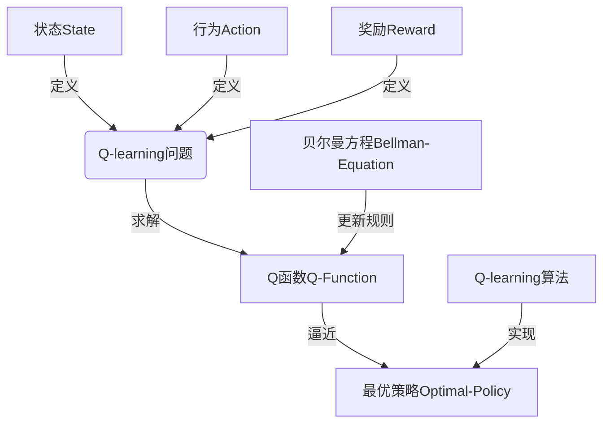
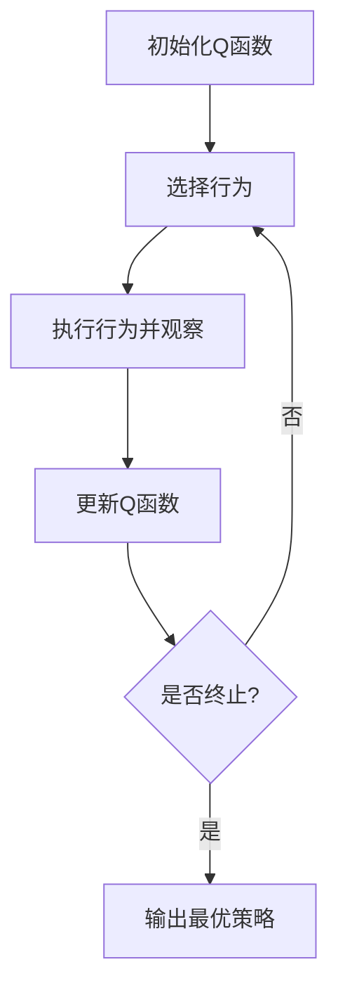

# 一切皆是映射：AI Q-learning国际研究前沿速览

## 1.背景介绍

在人工智能领域中,强化学习(Reinforcement Learning)作为一种重要的机器学习范式,近年来受到了广泛关注和研究。其中,Q-learning是强化学习中最著名和最成功的算法之一。它通过学习一个行为价值函数(Action-Value Function),来指导智能体(Agent)在各种状态下选择最优行为,从而获得最大的长期累积奖励。

Q-learning的核心思想是利用贝尔曼方程(Bellman Equation)迭代更新行为价值函数,使其逐步逼近最优策略。这种基于价值函数的方法,避免了对环境的建模,使算法具有很强的通用性和适用性。自从1989年被提出以来,Q-learning及其变体在机器人控制、游戏AI、资源管理等领域取得了卓越的应用成果。

然而,传统的Q-learning算法也存在一些局限性,比如在解决大规模、高维、连续状态空间的问题时,会遇到"维数灾难"(Curse of Dimensionality)和收敛性等挑战。为了克服这些困难,研究人员提出了诸多改进方法,例如利用深度神经网络来逼近Q函数(Deep Q-Network, DQN)、采用策略梯度方法(Policy Gradient)等。这些新兴技术极大地提高了Q-learning的性能和适用范围。

## 2.核心概念与联系

Q-learning的核心概念包括:

1. **状态(State)**: 环境的一个instantaneous配置。
2. **行为(Action)**: 智能体在某个状态下可执行的操作。
3. **奖励(Reward)**: 环境给予智能体的反馈,指导智能体朝着积极的方向发展。
4. **Q函数(Q-Function)**: 也称为行为价值函数,表示在某个状态执行某个行为后,可获得的预期的长期累积奖励。
5. **贝尔曼方程(Bellman Equation)**: 描述了Q函数与后继状态的Q函数之间的递推关系。
6. **Q-learning算法**: 利用贝尔曼方程迭代更新Q函数,逐步逼近最优策略。

这些概念之间存在紧密的联系,构成了Q-learning的理论基础。状态、行为和奖励定义了强化学习问题,而Q函数则是寻找最优策略的关键。贝尔曼方程提供了Q函数的更新规则,而Q-learning算法则是具体实现这一过程的方法。



## 3.核心算法原理具体操作步骤

Q-learning算法的核心思想是通过不断互动与环境,并根据获得的经验更新Q函数,从而逐渐发现最优策略。算法的具体步骤如下:

1. **初始化**: 初始化Q函数,通常将所有状态-行为对应的Q值设置为任意值(如0)或小的正数。

2. **选择行为**: 在当前状态下,根据一定的策略(如$\epsilon$-greedy策略)选择一个行为执行。$\epsilon$-greedy策略是指有$\epsilon$的概率随机选择一个行为,有$1-\epsilon$的概率选择当前Q值最大的行为。

3. **执行行为并观察**: 执行所选行为,环境转移到新的状态,并返回对应的奖励值。

4. **更新Q函数**: 根据贝尔曼方程,使用新获得的经验更新Q函数:

$$Q(s_t, a_t) \leftarrow Q(s_t, a_t) + \alpha \left[ r_t + \gamma \max_a Q(s_{t+1}, a) - Q(s_t, a_t) \right]$$

其中:
- $s_t$和$a_t$分别表示当前状态和行为
- $r_t$是执行$a_t$后获得的奖励
- $s_{t+1}$是转移到的新状态
- $\alpha$是学习率,控制了新经验对Q函数的影响程度
- $\gamma$是折扣因子,表示对未来奖励的衰减程度

5. **重复步骤2-4**: 不断重复选择行为、执行行为并更新Q函数,直到收敛或达到预设条件。

通过上述过程,Q函数将逐渐逼近最优行为价值函数,从而发现最优策略。



## 4.数学模型和公式详细讲解举例说明

Q-learning算法的数学基础是贝尔曼方程,用于描述Q函数与后继状态的Q函数之间的递推关系。对于任意状态$s$和行为$a$,其Q函数满足:

$$Q^*(s, a) = \mathbb{E}\left[r_t + \gamma \max_{a'} Q^*(s_{t+1}, a') | s_t=s, a_t=a\right]$$

其中:

- $Q^*(s, a)$表示在状态$s$执行行为$a$后,可获得的最大预期累积奖励(最优Q函数)
- $r_t$是执行$a_t$后获得的即时奖励
- $\gamma \in [0, 1]$是折扣因子,用于权衡当前奖励和未来奖励的权重
- $\max_{a'} Q^*(s_{t+1}, a')$表示在后继状态$s_{t+1}$下,执行任意行为$a'$可获得的最大预期累积奖励
- $\mathbb{E}[\cdot]$是期望运算符,表示对所有可能的后继状态和奖励进行加权平均

上式表明,最优Q函数等于当前获得的即时奖励,加上后继状态下最优Q函数的折扣和期望值。

为了逼近最优Q函数,Q-learning算法使用以下迭代更新规则:

$$Q(s_t, a_t) \leftarrow Q(s_t, a_t) + \alpha \left[ r_t + \gamma \max_a Q(s_{t+1}, a) - Q(s_t, a_t) \right]$$

其中$\alpha$是学习率,控制了新经验对Q函数的影响程度。可以证明,如果满足适当的条件,上述更新规则将使Q函数收敛到最优Q函数$Q^*$。

以下是一个简单的网格世界(Gridworld)示例,用于说明Q-learning算法的工作原理:

```python
import numpy as np

# 定义网格世界
grid = np.array([
    [-1, -1, -1, -1, -1],
    [-1,  0,  0, -1, -1],
    [-1,  0,  0,  0, -1],
    [-1,  0,  0,  0,  1],
    [-1, -1, -1, -1, -1]
])

# 定义行为
actions = {
    0: (-1, 0),  # 上
    1: (0, 1),   # 右
    2: (1, 0),   # 下
    3: (0, -1)   # 左
}

# 初始化Q函数
Q = np.zeros((grid.shape[0], grid.shape[1], len(actions)))

# 设置超参数
alpha = 0.1  # 学习率
gamma = 0.9  # 折扣因子
epsilon = 0.1  # epsilon-greedy策略

# Q-learning算法
for episode in range(1000):
    state = (1, 1)  # 起始状态
    done = False
    while not done:
        # 选择行为
        if np.random.uniform() < epsilon:
            action = np.random.choice(list(actions.keys()))
        else:
            action = np.argmax(Q[state])
        
        # 执行行为并观察
        next_state = (state[0] + actions[action][0], state[1] + actions[action][1])
        reward = grid[next_state]
        done = (reward == 1) or (reward == -1)
        
        # 更新Q函数
        Q[state][action] += alpha * (reward + gamma * np.max(Q[next_state]) - Q[state][action])
        
        state = next_state

# 输出最优策略
policy = np.argmax(Q, axis=2)
print("最优策略:")
print(policy)
```

在这个示例中,我们定义了一个5x5的网格世界,其中-1表示障碍物,0表示可通过的空地,1表示目标状态。智能体的目标是从起始状态(1,1)出发,找到通往目标状态的最短路径。

我们初始化了Q函数,并设置了学习率、折扣因子和$\epsilon$-greedy策略的参数。然后,在每个episode中,智能体根据当前状态和$\epsilon$-greedy策略选择一个行为执行,观察到新的状态和奖励,并根据贝尔曼方程更新Q函数。

经过1000次迭代后,Q函数收敛到最优解,我们可以从最优Q函数推导出最优策略。在这个示例中,最优策略是从(1,1)出发,先向右移动两步,然后向下移动两步,到达目标状态(3,3)。

通过上述示例,我们可以直观地理解Q-learning算法的工作原理,以及贝尔曼方程在算法中的应用。

## 5.项目实践:代码实例和详细解释说明

为了更好地理解和掌握Q-learning算法,我们将通过一个实际项目来进行实践。这个项目是基于OpenAI Gym环境的经典控制问题——山地车(Mountain Car)。

山地车问题描述如下:一辆无力的车被困在一个凹陷的山谷中,它的目标是通过向左向右摇摆来获得足够的动能,最终到达山顶。这个问题具有连续的状态空间和离散的行为空间,是一个典型的强化学习任务。

我们将使用Q-learning算法训练一个智能体,让它学会如何控制山地车到达山顶。代码如下:

```python
import gym
import numpy as np

# 创建环境
env = gym.make('MountainCar-v0')

# 离散化状态空间
num_positions = 40  # 位置分为40个区间
num_velocities = 40  # 速度分为40个区间
positions = np.linspace(-1.2, 0.6, num_positions)  # 位置区间
velocities = np.linspace(-0.07, 0.07, num_velocities)  # 速度区间

# 初始化Q函数
Q = np.zeros((num_positions, num_velocities, env.action_space.n))

# 设置超参数
alpha = 0.1  # 学习率
gamma = 0.99  # 折扣因子
epsilon = 0.1  # epsilon-greedy策略

# Q-learning算法
for episode in range(10000):
    state = env.reset()  # 重置环境
    done = False
    while not done:
        # 离散化状态
        position_idx = np.digitize(state[0], positions)
        velocity_idx = np.digitize(state[1], velocities)
        state_idx = (position_idx, velocity_idx)
        
        # 选择行为
        if np.random.uniform() < epsilon:
            action = env.action_space.sample()
        else:
            action = np.argmax(Q[state_idx])
        
        # 执行行为并观察
        next_state, reward, done, _ = env.step(action)
        
        # 离散化新状态
        next_position_idx = np.digitize(next_state[0], positions)
        next_velocity_idx = np.digitize(next_state[1], velocities)
        next_state_idx = (next_position_idx, next_velocity_idx)
        
        # 更新Q函数
        Q[state_idx][action] += alpha * (reward + gamma * np.max(Q[next_state_idx]) - Q[state_idx][action])
        
        state = next_state

# 测试智能体
state = env.reset()
done = False
total_reward = 0
while not done:
    env.render()  # 渲染环境
    position_idx = np.digitize(state[0], positions)
    velocity_idx = np.digitize(state[1], velocities)
    state_idx = (position_idx, velocity_idx)
    action = np.argmax(Q[state_idx])
    state, reward, done, _ = env.step(action)
    total_reward += reward
print(f"总奖励: {total_reward}")
```

代码解释:

1. 我们首先创建了OpenAI Gym的山地车环境,并离散化了连续的状态空间(位置和速度)。

2. 初始化Q函数,并设置超参数(学习率、折扣因子和$\epsilon$-greedy策略参数)。