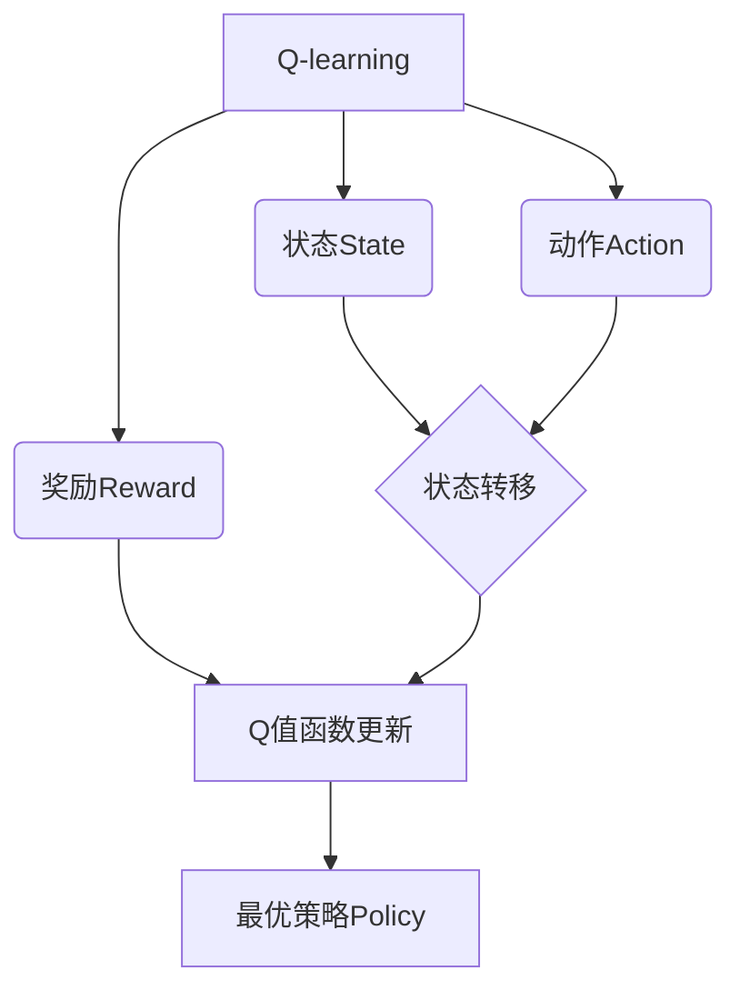

# 一切皆是映射：AI Q-learning在物联网系统中的应用

## 1.背景介绍

### 1.1 物联网系统的挑战

随着物联网(IoT)设备的不断增加,物联网系统面临着日益复杂的管理和优化挑战。物联网涉及大量异构设备、动态网络拓扑和不确定的环境条件,使得传统的基于规则的控制策略难以应对。因此,需要一种自适应、智能化的方法来管理和优化这些复杂系统。

### 1.2 强化学习的优势

强化学习(Reinforcement Learning,RL)作为机器学习的一个分支,专注于如何基于环境反馈来学习最优策略,从而实现智能决策。RL算法能够通过试错和reward机制自主学习,无需提前的规则集或训练数据,使其非常适合应用于复杂、动态的环境。

### 1.3 Q-learning算法简介  

Q-learning是强化学习中最成功和广泛使用的算法之一。它通过构建Q值函数来估计在给定状态下采取某个动作的长期回报,并不断更新Q值函数以获得最优策略。Q-learning具有无模型(model-free)、离线(off-policy)等特点,能够有效应对物联网系统的动态复杂性。

## 2.核心概念与联系



Q-learning算法的核心概念包括:

1. **状态(State) $s$**: 描述系统当前的环境状态。
2. **动作(Action) $a$**: 智能体可以在当前状态下采取的行为选择。
3. **奖励(Reward) $r$**: 环境对智能体当前动作的反馈,用于指导策略优化方向。
4. **Q值函数(Q-function) $Q(s,a)$**: 估计在当前状态$s$下采取动作$a$的长期累积奖励。
5. **状态转移(State Transition) $s' = f(s,a)$**: 描述当前状态和动作如何转移到下一个状态。
6. **策略(Policy) $\pi(s)$**: 定义在给定状态下如何选择动作的规则,最优策略对应最大化长期累积奖励。

Q-learning通过不断更新Q值函数,逐步逼近最优策略,实现智能决策。

## 3.核心算法原理具体操作步骤

Q-learning算法的核心思想是通过试探和奖惩机制,不断更新Q值函数,从而获得最优策略。算法步骤如下:

1. **初始化**:初始化Q值函数$Q(s,a)$,通常设置为任意值或0。
2. **选择动作**:对于当前状态$s_t$,根据策略$\pi$选择动作$a_t$。一种常用的策略是$\epsilon$-greedy,它在$1-\epsilon$的概率下选择当前Q值最大的动作,在$\epsilon$的概率下随机选择动作,以保证探索。
3. **执行动作**:执行选择的动作$a_t$,观察环境反馈的奖励$r_{t+1}$和转移到下一状态$s_{t+1}$。
4. **更新Q值**:根据观察到的$r_{t+1}$和$s_{t+1}$,使用贝尔曼方程更新Q值函数:

$$Q(s_t,a_t) \leftarrow Q(s_t,a_t) + \alpha\left[r_{t+1} + \gamma\max_{a'}Q(s_{t+1},a') - Q(s_t,a_t)\right]$$

其中:
- $\alpha$是学习率,控制更新幅度。
- $\gamma$是折扣因子,表示对未来奖励的衰减程度。
- $\max_{a'}Q(s_{t+1},a')$是在新状态$s_{t+1}$下可获得的最大Q值,作为目标值。

5. **重复迭代**:重复步骤2-4,不断更新Q值函数,直至收敛到最优策略。

通过上述试探-奖惩-更新的循环过程,Q-learning算法能够自主发现最优策略,而无需事先的环境模型或规则集。

## 4.数学模型和公式详细讲解举例说明

### 4.1 Q值函数的数学模型

Q值函数$Q(s,a)$定义为在当前状态$s$下执行动作$a$后,能获得的期望的长期累积奖励。数学上可表示为:

$$Q(s,a) = \mathbb{E}\left[\sum_{k=0}^{\infty}\gamma^kr_{t+k+1} \big| s_t=s, a_t=a, \pi\right]$$

其中:
- $r_{t+k+1}$是在时刻$t+k+1$获得的即时奖励。
- $\gamma \in [0,1]$是折扣因子,控制对未来奖励的衰减程度。
- $\pi$是执行策略,决定了在每个状态下选择动作的方式。
- $\mathbb{E}[\cdot]$表示期望值运算。

根据马尔可夫决策过程(MDP)的性质,Q值函数满足贝尔曼期望方程:

$$Q(s,a) = \mathbb{E}_{s'\sim P(s'|s,a)}\left[r(s,a,s') + \gamma \max_{a'}Q(s',a')\right]$$

其中$P(s'|s,a)$是状态转移概率,表示从状态$s$执行动作$a$后转移到状态$s'$的概率。

### 4.2 Q-learning更新规则推导

Q-learning算法的更新规则源自对贝尔曼期望方程的采样估计。设在时刻$t$,状态为$s_t$,执行动作$a_t$,获得即时奖励$r_{t+1}$并转移到状态$s_{t+1}$。则可构造一个采样估计:

$$r_{t+1} + \gamma \max_{a'}Q(s_{t+1},a')$$

作为$Q(s_t,a_t)$的一个无偏估计。通过不断采样并更新Q值函数,可以逐步逼近真实的Q值函数。

具体的Q-learning更新规则为:

$$Q(s_t,a_t) \leftarrow Q(s_t,a_t) + \alpha\left[r_{t+1} + \gamma\max_{a'}Q(s_{t+1},a') - Q(s_t,a_t)\right]$$

其中$\alpha$是学习率,控制更新幅度。当$\alpha=1$时,等价于直接用采样估计代替旧的Q值;当$\alpha \in (0,1)$时,则是在旧Q值的基础上进行渐进式更新。

通过大量迭代更新,Q-learning算法能够最终收敛到最优Q值函数$Q^*(s,a)$,对应的贪婪策略$\pi^*(s) = \arg\max_aQ^*(s,a)$即为最优策略。

### 4.3 Q-learning收敛性证明(简化版)

在满足以下条件时,Q-learning算法能够确保收敛到最优Q值函数:

1. 马尔可夫决策过程是可终止的(episode终止)。
2. 策略在所有状态-动作对上持续探索(如$\epsilon$-greedy)。
3. 学习率$\alpha$满足某些条件(如$\sum\alpha(s,a,t)=\infty$且$\sum\alpha^2(s,a,t)<\infty$)。

证明思路:

令$Q_t(s,a)$为第$t$次迭代后的Q值估计。令$Q^*(s,a)$为最优Q值函数,满足贝尔曼最优方程:

$$Q^*(s,a) = \mathbb{E}_{s'\sim P(s'|s,a)}\left[r(s,a,s') + \gamma \max_{a'}Q^*(s',a')\right]$$

我们需证明:$\lim_{t\rightarrow\infty}Q_t(s,a)=Q^*(s,a)$。

定义TD误差:

$$\delta_t(s_t,a_t) = r_{t+1} + \gamma\max_{a'}Q_t(s_{t+1},a') - Q_t(s_t,a_t)$$

根据Q-learning更新规则,有:

$$Q_{t+1}(s_t,a_t) = Q_t(s_t,a_t) + \alpha_t(s_t,a_t)\delta_t(s_t,a_t)$$

可证明,当满足上述条件时,$\delta_t(s_t,a_t)$是$Q_t(s_t,a_t)-Q^*(s_t,a_t)$的无偏估计,且$\mathbb{E}[\delta_t(s_t,a_t)^2]$有界。

由随机逼近理论可知,Q-learning算法最终会以概率1收敛到$Q^*(s,a)$。

## 5.项目实践:代码实例和详细解释说明

以下是一个简单的Python实现Q-learning算法的示例,用于控制一个简单的网格世界智能体:

```python
import numpy as np

# 定义网格世界
WORLD = np.array([
    [0, 0, 0, 1],
    [0, None, 0, -1],
    [0, 0, 0, 0]
])

# 定义动作
ACTIONS = ['left', 'right', 'up', 'down']

# 初始化Q表
Q = np.zeros((WORLD.shape[0], WORLD.shape[1], len(ACTIONS)))

# 超参数设置
ALPHA = 0.1  # 学习率
GAMMA = 0.9  # 折扣因子
EPSILON = 0.1  # 探索概率

# 定义奖励函数
def get_reward(state, action):
    next_state = get_next_state(state, action)
    if WORLD[next_state] == 1:
        return 1
    elif WORLD[next_state] == -1:
        return -1
    else:
        return 0

# 获取下一状态
def get_next_state(state, action):
    row, col = state
    if action == 'left':
        col = max(col - 1, 0)
    elif action == 'right':
        col = min(col + 1, WORLD.shape[1] - 1)
    elif action == 'up':
        row = max(row - 1, 0)
    elif action == 'down':
        row = min(row + 1, WORLD.shape[0] - 1)
    return row, col

# 选择动作
def choose_action(state, epsilon):
    if np.random.uniform() < epsilon:
        action = np.random.choice(ACTIONS)
    else:
        action = ACTIONS[np.argmax(Q[state])]
    return action

# Q-learning主循环
for episode in range(1000):
    state = (0, 0)  # 初始状态
    done = False
    while not done:
        action = choose_action(state, EPSILON)
        next_state = get_next_state(state, action)
        reward = get_reward(state, action)
        next_q = np.max(Q[next_state])
        Q[state][ACTIONS.index(action)] += ALPHA * (reward + GAMMA * next_q - Q[state][ACTIONS.index(action)])
        state = next_state
        if WORLD[state] == 1 or WORLD[state] == -1:
            done = True

# 输出最优策略
policy = np.argmax(Q, axis=2)
print("Optimal policy:")
for row in policy:
    print(ACTIONS[row])
```

代码解释:

1. 定义一个简单的网格世界,其中0表示可到达的状态,1表示目标状态(奖励+1),None表示障碍物,不可到达,-1表示陷阱状态(奖励-1)。
2. 定义四个基本动作:`left`,`right`,`up`,`down`。
3. 初始化Q表,大小为`(世界行数,世界列数,动作数量)`。
4. 设置超参数:学习率`ALPHA`,折扣因子`GAMMA`,探索概率`EPSILON`。
5. 定义奖励函数`get_reward`,根据当前状态和动作计算获得的即时奖励。
6. 定义`get_next_state`函数,根据当前状态和动作计算下一个状态。
7. 定义`choose_action`函数,根据$\epsilon$-greedy策略选择动作。
8. 进入Q-learning主循环,每个episode从初始状态开始,通过选择动作、获取奖励、更新Q表的方式进行训练,直到到达终止状态。
9. 循环结束后,输出根据最终Q表计算得到的最优策略。

在上述示例中,Q-learning算法通过不断探索和更新Q表,最终学习到了一个能够从起点到达目标状态的最优策略。

## 6.实际应用场景

Q-learning算法在物联网系统中有广泛的应用前景,例如:

### 6.1 网络路由优化

在动态网络拓扑下,Q-learning可以用于智能路由决策,动态选择最优路径以实现网