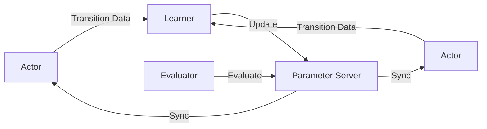
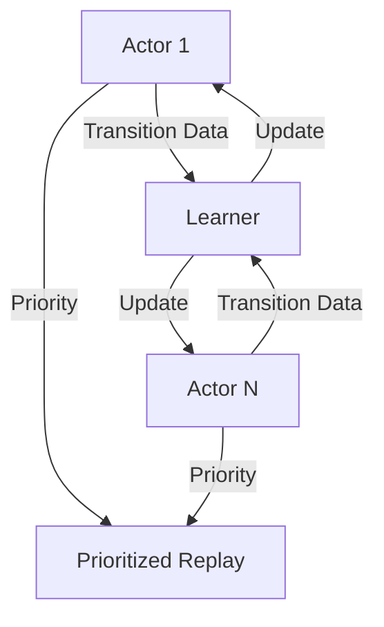

# 一切皆是映射：DQN的并行化处理：加速学习与实施

## 1. 背景介绍
### 1.1 强化学习概述
#### 1.1.1 强化学习的定义与特点
强化学习(Reinforcement Learning, RL)是机器学习的一个重要分支,它研究如何让智能体(Agent)通过与环境的交互来学习最优策略,以获得最大的累积奖励。与监督学习和非监督学习不同,强化学习不需要预先准备好训练数据,而是通过探索和利用(Exploration and Exploitation)的方式来学习。

#### 1.1.2 马尔可夫决策过程
强化学习通常被建模为马尔可夫决策过程(Markov Decision Process, MDP)。一个MDP由状态集合S、动作集合A、状态转移概率P、奖励函数R和折扣因子γ组成。智能体与环境交互的过程可以看作在MDP中序列决策的过程。

### 1.2 Q-Learning 与DQN
#### 1.2.1 Q-Learning算法
Q-Learning是一种经典的值迭代型强化学习算法,其核心是学习动作-状态值函数Q(s,a),表示在状态s下采取动作a可以获得的期望长期回报。Q-Learning的更新规则为:
$$Q(s_t,a_t) \leftarrow Q(s_t,a_t)+\alpha[r_t+\gamma \max_a Q(s_{t+1},a)-Q(s_t,a_t)]$$

#### 1.2.2 DQN算法
然而,当状态空间和动作空间很大时,Q表格难以存储和更新。为解决这一问题,Deep Q-Network(DQN)算法使用深度神经网络来近似Q函数。DQN将状态作为神经网络的输入,输出各个动作的Q值。网络参数通过最小化时序差分(TD)误差来更新:
$$L(\theta)=\mathbb{E}_{s_t,a_t,r_t,s_{t+1}}[(r_t+\gamma \max_{a'}Q(s_{t+1},a';\theta^-)-Q(s_t,a_t;\theta))^2]$$

其中$\theta^-$为目标网络的参数,用于计算TD目标值,每隔一定步数从在线网络复制得到,以保持学习的稳定性。

### 1.3 DQN存在的问题与并行化动机
#### 1.3.1 DQN训练的采样效率不高
DQN使用经验回放(Experience Replay)机制来打破数据的相关性,但采样效率仍然不高。回放存储中的转移数据(s,a,r,s')使用一次后就被丢弃,没有得到充分利用。

#### 1.3.2 DQN的探索能力有限
DQN使用ε-greedy探索策略,以ε的概率随机选择动作,以1-ε的概率选择Q值最大的动作。这种探索方式比较盲目,难以发现更好的策略。

#### 1.3.3 并行化处理的动机
为了提高DQN的采样效率和探索能力,一个很自然的想法就是利用多个智能体并行与环境交互,产生更多的转移数据,同时从不同的初始状态开始探索,覆盖更广的状态空间。这就是我们要讨论的DQN并行化处理技术。

## 2. 核心概念与联系
### 2.1 Gorila框架
#### 2.1.1 Gorila的基本思想
Gorila(General Reinforcement Learning Architecture)是DeepMind提出的一种用于大规模分布式强化学习的框架。其基本思想是将DQN的学习过程分解为4个部分:
1. 多个Actor与环境并行交互,生成转移数据
2. 一个中央的Learner从Actor收集数据,更新Q网络参数
3. 一个参数服务器负责存储和同步最新的网络参数
4. 一个评估器(Evaluator)定期评估当前策略的性能

#### 2.1.2 Gorila的并行架构
Gorila的并行化架构可以用下面的Mermaid图来表示:



### 2.2 APE-X框架
#### 2.2.1 APE-X的动机
Gorila虽然实现了DQN的分布式训练,但其架构比较复杂,对计算资源要求高。为了在单机多核环境下更高效地并行化DQN,DeepMind又提出了APE-X(Asynchronous Proximal-policy Optimization with Experience Replay)框架。

#### 2.2.2 APE-X的关键设计
APE-X的关键设计有以下几点:
1. 使用多个Actor,每个Actor有自己独立的环境副本和回放存储
2. Actor异步地与环境交互,将转移数据存入回放存储,并定期将回放存储中的数据发送给中央的Learner
3. Learner使用从Actor收到的数据来更新Q网络,并将最新的网络参数广播给所有Actor
4. 引入了分布式优先级回放(Distributed Prioritized Experience Replay),根据TD误差为每个转移数据分配优先级,提高重要数据的采样概率

#### 2.2.3 APE-X的并行架构 
APE-X的并行化架构可以用下面的Mermaid图来表示:



### 2.3 Ape-X DQN与R2D2
#### 2.3.1 Ape-X DQN算法
Ape-X DQN算法是将APE-X框架应用于DQN的一个具体实例。其主要特点包括:
1. 每个Actor使用ε-greedy策略与环境交互,生成转移数据
2. Actor将转移数据存入自己的回放存储,并计算每个数据的优先级
3. Learner从所有Actor的回放存储中按优先级采样数据,计算TD误差并更新Q网络
4. Learner定期将最新的Q网络参数同步给所有Actor

#### 2.3.2 R2D2算法
R2D2(Recurrent Replay Distributed DQN)是将Ape-X DQN与循环神经网络(RNN)相结合的一种算法。其主要特点包括:
1. 使用LSTM网络来表示Q函数,可以处理部分可观测环境
2. 引入burn-in机制,即在每个训练序列开始时,先使用若干步的历史状态来初始化LSTM的隐藏状态
3. 使用时序差分目标平均(Temporal Difference Target Averaging)来计算TD目标,提高学习稳定性

R2D2的训练过程与Ape-X DQN类似,也是通过多个Actor并行与环境交互,生成转移序列数据,再由中央的Learner来更新LSTM-Q网络。

## 3. 核心算法原理具体操作步骤
本节将详细介绍Ape-X DQN算法的核心原理和具体操作步骤。

### 3.1 算法伪代码
Ape-X DQN的算法伪代码如下:

```python
# 初始化N个Actor,每个Actor有独立的环境env、回放存储buffer、Q网络Q和目标网络Q_target
for i in range(N):
    actor[i] = Actor(env[i], buffer[i], Q[i], Q_target[i])

# 初始化中央Learner,包括Q网络Q和目标网络Q_target
learner = Learner(Q, Q_target)

# 并行训练
for step in range(num_steps):
    # 每个Actor与环境交互,生成转移数据并存入回放存储
    for i in range(N):
        actor[i].interact()
        
    # Learner从所有Actor的回放存储中按优先级采样数据
    batch = learner.sample_from_buffers()
    
    # Learner更新Q网络
    learner.update(batch)
    
    # Learner将最新的Q网络参数同步给所有Actor
    if step % sync_interval == 0:
        for i in range(N):
            actor[i].Q = learner.Q
```

### 3.2 Actor的交互过程
每个Actor使用ε-greedy策略与环境交互,生成转移数据(s,a,r,s')。其具体步骤如下:
1. 根据当前状态s,以ε的概率随机选择动作a,否则选择Q值最大的动作
2. 执行动作a,得到奖励r和下一状态s'
3. 将转移数据(s,a,r,s')存入回放存储,并计算其优先级p
4. 如果回放存储已满,则将数据发送给中央Learner,并清空回放存储
5. 更新状态s=s',重复步骤1-4

其中,转移数据的优先级p通常使用TD误差的绝对值来计算:
$$p=|r+\gamma \max_{a'}Q_{\text{target}}(s',a')-Q(s,a)|$$

### 3.3 Learner的更新过程
Learner从所有Actor的回放存储中按优先级采样一个批次的转移数据,然后使用DQN的损失函数来更新Q网络。其具体步骤如下:
1. 从每个Actor的回放存储中按优先级采样一定数量的转移数据,组成一个批次
2. 对每个转移数据(s,a,r,s'),计算TD目标:
$$y=r+\gamma \max_{a'}Q_{\text{target}}(s',a')$$
3. 计算TD误差:
$$\delta=y-Q(s,a)$$
4. 更新转移数据的优先级:
$$p=|\delta|$$
5. 根据TD误差和重要性采样权重计算损失:
$$L(\theta)=\frac{1}{N}\sum_{i=1}^N w_i \delta_i^2$$
其中$w_i$为第i个转移数据的重要性采样权重,用于校正优先级采样引入的偏差。
6. 使用梯度下降法更新Q网络的参数$\theta$
7. 每隔一定步数,将Q网络的参数复制给目标网络:
$$\theta^-=\theta$$
8. 重复步骤1-7,直到收敛

## 4. 数学模型和公式详细讲解举例说明
本节将详细讲解Ape-X DQN中用到的几个关键的数学模型和公式,并给出具体的例子说明。

### 4.1 ε-greedy探索策略
ε-greedy是一种常用的探索策略,可以在探索和利用之间进行权衡。给定一个状态s,ε-greedy策略以ε的概率随机选择一个动作,以1-ε的概率选择Q值最大的动作。其数学表达式为:

$$
\pi(a|s)=\begin{cases}
\frac{\varepsilon}{|\mathcal{A}|} & \text{if } a \neq \arg\max_{a'}Q(s,a') \\
1-\varepsilon+\frac{\varepsilon}{|\mathcal{A}|} & \text{if } a = \arg\max_{a'}Q(s,a')
\end{cases}
$$

其中$\mathcal{A}$为动作空间。

举例说明:假设在某个状态s下,有3个可选动作a1,a2,a3,它们的Q值分别为1.0,2.0,1.5。如果ε=0.1,则选择各个动作的概率为:

$$
\begin{aligned}
P(a=a1)&=0.1/3=0.033 \\
P(a=a2)&=0.9+0.1/3=0.933 \\
P(a=a3)&=0.1/3=0.033
\end{aligned}
$$

可以看出,ε-greedy策略以较大的概率选择Q值最大的动作a2,同时以较小的概率随机探索其他动作。

### 4.2 优先级回放
优先级回放(Prioritized Experience Replay, PER)是一种提高经验回放效率的技术。其基本思想是,根据转移数据的重要程度为其分配优先级,在采样时以较大概率选择重要的数据。

给定一个转移数据(s,a,r,s'),其优先级p通常定义为TD误差的绝对值:

$$p=|r+\gamma \max_{a'}Q(s',a')-Q(s,a)|$$

直观地说,TD误差越大,说明该转移数据包含的信息越多,应该被更频繁地采样。

在实现时,为了平衡优先级和多样性,通常使用优先级的α次幂来定义采样概率:

$$P(i)=\frac{p_i^\alpha}{\sum_k p_k^\alpha}$$

其中i为转移数