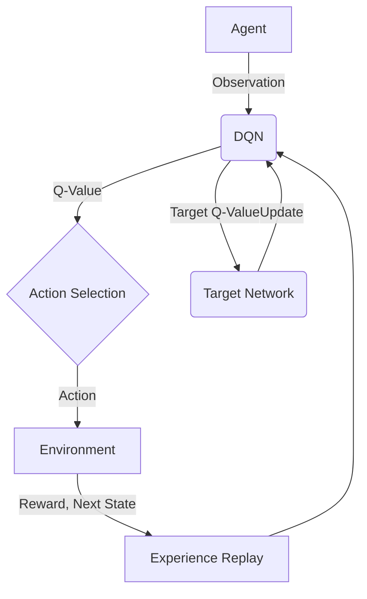
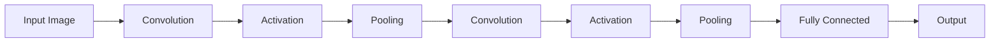
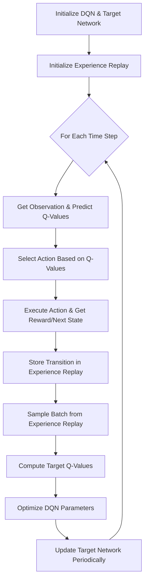

# 一切皆是映射：使用DQN处理高维输入：视觉信息在强化学习的运用

## 1.背景介绍

### 1.1 强化学习的挑战

强化学习是一种基于环境交互的学习方式,通过试错和奖惩机制来优化策略。与监督学习不同,强化学习没有给定的标签数据集,需要从环境中探索获取经验。这使得强化学习在处理高维观测数据时面临巨大挑战。

### 1.2 视觉信息在强化学习中的重要性

在现实世界中,视觉信息是最丰富和最重要的信息源之一。很多任务都需要从视觉输入中提取有用的特征,如自动驾驶、机器人控制等。然而,原始像素级视觉数据通常具有高维度、冗余和噪声等特点,给强化学习算法带来了巨大挑战。

### 1.3 深度强化学习的兴起

近年来,深度学习技术在计算机视觉等领域取得了巨大成功,激发了将深度学习与强化学习相结合的深度强化学习方法。深度强化学习旨在利用深度神经网络从高维观测中提取有用特征,并学习最优策略。

## 2.核心概念与联系

### 2.1 深度Q网络(DQN)

深度Q网络(Deep Q-Network, DQN)是深度强化学习中的里程碑式算法,它使用深度神经网络来近似Q值函数,从而能够处理高维输入。DQN的核心思想是使用Experience Replay和目标网络两种技术来提高训练稳定性。



### 2.2 卷积神经网络

卷积神经网络(Convolutional Neural Network, CNN)是一种专门用于处理网格结构数据(如图像)的神经网络。CNN通过局部连接、权值共享和池化操作,能够有效地从图像中提取空间和时间上的局部相关特征。



### 2.3 DQN与CNN的结合

将DQN与CNN相结合,可以构建一个端到端的深度强化学习系统,用于处理高维视觉输入。CNN用于从原始像素数据中提取特征,而DQN则基于这些特征学习最优策略。这种结合使得强化学习智能体能够直接从视觉输入中学习,而不需要人工设计特征提取器。

## 3.核心算法原理具体操作步骤

### 3.1 DQN算法流程

1. 初始化深度Q网络和目标Q网络,两个网络参数相同。
2. 初始化Experience Replay内存池。
3. 对于每一个时间步:
    a. 从当前状态获取观测,通过深度Q网络预测Q值。
    b. 根据Q值及探索策略选择行为。
    c. 执行选择的行为,获得奖励和下一个状态。
    d. 将(状态,行为,奖励,下一状态)的转换存入Experience Replay内存池。
    e. 从内存池中随机采样一个批次的转换。
    f. 计算目标Q值,并优化深度Q网络的参数。
    g. 每隔一定步数将深度Q网络的参数复制到目标Q网络。



### 3.2 Experience Replay

Experience Replay是DQN算法的一个关键技术,它通过存储过往的转换经验,打破数据样本之间的相关性,提高数据利用效率。在训练时,从Experience Replay内存池中随机采样一个批次的转换,而不是按序使用最新的转换。这种方式能够减小相邻数据之间的相关性,从而提高训练稳定性。

### 3.3 目标网络

目标网络是DQN算法中另一个重要技术,它是一个延迟更新的Q网络副本。目标网络的作用是给出期望的Q值,用于计算损失函数和更新主Q网络的参数。通过使用目标网络,可以避免主Q网络的不断变化导致的不稳定性。目标网络会每隔一定步数复制主Q网络的参数。

## 4.数学模型和公式详细讲解举例说明

### 4.1 Q-Learning

Q-Learning是强化学习中的一种基于价值的算法,它旨在学习一个行为价值函数Q(s,a),表示在状态s下执行行为a之后的预期回报。Q-Learning的更新规则如下:

$$Q(s_t, a_t) \leftarrow Q(s_t, a_t) + \alpha \left[ r_t + \gamma \max_{a}Q(s_{t+1}, a) - Q(s_t, a_t) \right]$$

其中:
- $\alpha$ 是学习率
- $\gamma$ 是折现因子
- $r_t$ 是立即奖励
- $\max_{a}Q(s_{t+1}, a)$ 是下一状态的最大Q值

### 4.2 深度Q网络

在DQN中,我们使用一个深度神经网络来近似Q值函数,即:

$$Q(s, a; \theta) \approx Q^{\pi}(s, a)$$

其中$\theta$是网络参数。网络的输入是状态s,输出是每个行为a对应的Q值。

为了训练网络,我们需要最小化一个损失函数,该损失函数衡量了预测的Q值与目标Q值之间的差异:

$$L(\theta) = \mathbb{E}_{(s, a, r, s')\sim U(D)}\left[\left(r + \gamma \max_{a'} Q(s', a'; \theta^-) - Q(s, a; \theta)\right)^2\right]$$

其中:
- $U(D)$ 是Experience Replay内存池的均匀分布
- $\theta^-$ 是目标网络的参数
- $\max_{a'} Q(s', a'; \theta^-)$ 是下一状态的最大目标Q值

通过最小化这个损失函数,我们可以更新主Q网络的参数$\theta$,使其逼近最优Q值函数。

### 4.3 CNN特征提取

在处理视觉输入时,我们使用卷积神经网络从原始像素数据中提取特征。CNN的基本运算包括卷积、激活函数和池化操作。

卷积操作将一个小窗口(卷积核)在输入数据上滑动,计算输入数据与卷积核的点积,得到一个特征映射。数学上可以表示为:

$$x_{j}^{l} = f\left(\sum_{i\in M_j} x_{i}^{l-1} * k_{ij}^{l} + b_j^l\right)$$

其中:
- $x_j^l$ 是第l层的第j个特征映射
- $M_j$ 是输入特征映射的选择
- $k_{ij}^l$ 是连接第i个输入映射和第j个输出映射的卷积核
- $b_j^l$ 是偏置项
- $f$ 是激活函数,如ReLU

池化操作则是在局部区域上进行下采样,提取区域内的统计特征,如最大值或平均值。这种操作能够减少特征维度,提高对平移和缩放的鲁棒性。

通过多层卷积和池化操作,CNN能够从原始像素数据中提取出高级语义特征,为后续的决策提供有效的特征表示。

## 5.项目实践:代码实例和详细解释说明

以下是一个使用PyTorch实现的简单DQN代码示例,用于解决经典的CartPole问题。

```python
import torch
import torch.nn as nn
import torch.optim as optim
import gym

# 定义DQN网络
class DQN(nn.Module):
    def __init__(self, state_dim, action_dim):
        super(DQN, self).__init__()
        self.fc1 = nn.Linear(state_dim, 64)
        self.fc2 = nn.Linear(64, action_dim)

    def forward(self, x):
        x = torch.relu(self.fc1(x))
        return self.fc2(x)

# 定义Experience Replay内存池
class ReplayBuffer:
    def __init__(self, capacity):
        self.buffer = []
        self.capacity = capacity
        self.position = 0

    def push(self, transition):
        if len(self.buffer) < self.capacity:
            self.buffer.append(None)
        self.buffer[self.position] = transition
        self.position = (self.position + 1) % self.capacity

    def sample(self, batch_size):
        return random.sample(self.buffer, batch_size)

    def __len__(self):
        return len(self.buffer)

# 定义DQN Agent
class DQNAgent:
    def __init__(self, state_dim, action_dim):
        self.device = torch.device("cuda" if torch.cuda.is_available() else "cpu")
        self.policy_net = DQN(state_dim, action_dim).to(self.device)
        self.target_net = DQN(state_dim, action_dim).to(self.device)
        self.target_net.load_state_dict(self.policy_net.state_dict())
        self.optimizer = optim.RMSprop(self.policy_net.parameters())
        self.memory = ReplayBuffer(10000)
        self.steps_done = 0

    def select_action(self, state, eps_threshold):
        sample = random.random()
        if sample > eps_threshold:
            with torch.no_grad():
                state = torch.from_numpy(state).float().unsqueeze(0).to(self.device)
                q_values = self.policy_net(state)
                return q_values.max(1)[1].view(1, 1)
        else:
            return torch.tensor([[random.randrange(2)]], device=self.device, dtype=torch.long)

    def optimize_model(self):
        if len(self.memory) < BATCH_SIZE:
            return
        transitions = self.memory.sample(BATCH_SIZE)
        batch = Transition(*zip(*transitions))

        non_final_mask = torch.tensor(tuple(map(lambda s: s is not None, batch.next_state)), device=self.device, dtype=torch.bool)
        non_final_next_states = torch.cat([s for s in batch.next_state if s is not None])

        state_batch = torch.cat(batch.state)
        action_batch = torch.cat(batch.action)
        reward_batch = torch.cat(batch.reward)

        state_action_values = self.policy_net(state_batch).gather(1, action_batch)

        next_state_values = torch.zeros(BATCH_SIZE, device=self.device)
        next_state_values[non_final_mask] = self.target_net(non_final_next_states).max(1)[0].detach()

        expected_state_action_values = (next_state_values * GAMMA) + reward_batch

        loss = F.smooth_l1_loss(state_action_values, expected_state_action_values.unsqueeze(1))

        self.optimizer.zero_grad()
        loss.backward()
        for param in self.policy_net.parameters():
            param.grad.data.clamp_(-1, 1)
        self.optimizer.step()

# 训练循环
env = gym.make('CartPole-v0')
agent = DQNAgent(env.observation_space.shape[0], env.action_space.n)
eps_threshold = ...  # 探索率
for episode in range(NUM_EPISODES):
    state = env.reset()
    done = False
    while not done:
        action = agent.select_action(state, eps_threshold)
        next_state, reward, done, _ = env.step(action.item())
        agent.memory.push(Transition(state, action, next_state, reward))
        state = next_state
        agent.optimize_model()
        if done:
            break
    if episode % TARGET_UPDATE == 0:
        agent.target_net.load_state_dict(agent.policy_net.state_dict())
```

在这个示例中,我们首先定义了一个简单的全连接DQN网络和Experience Replay内存池。然后定义了DQNAgent类,包含了选择行为、优化模型和更新目标网络的方法。

在训练循环中,我们对每个episode进行如下操作:

1. 重置环境,获取初始状态
2. 根据当前状态和探索率选择行为
3. 执行选择的行为,获得奖励和下一个状态
4. 将(状态,行为,下一状态,奖励)的转换存入Experience Replay内存池
5. 从内存池中随机采样一个批次的转换
6. 计算目标Q值,并优化