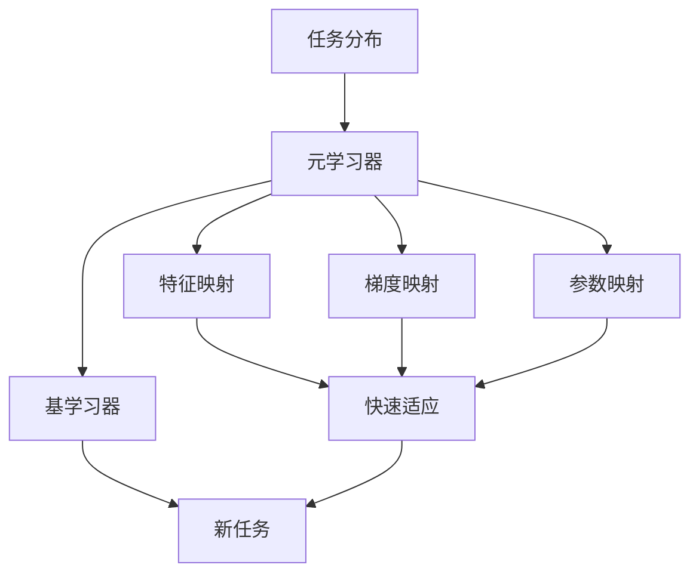

# 一切皆是映射：元学习在快速适应新任务中的作用

## 1. 背景介绍
### 1.1 机器学习的局限性
#### 1.1.1 传统机器学习模型的不足
#### 1.1.2 小样本学习的挑战
#### 1.1.3 快速适应新任务的需求

### 1.2 元学习的兴起 
#### 1.2.1 元学习的定义和目标
#### 1.2.2 元学习研究的发展历程
#### 1.2.3 元学习的优势和潜力

## 2. 核心概念与联系
### 2.1 学习算法
#### 2.1.1 基学习器
#### 2.1.2 元学习器
#### 2.1.3 两者之间的关系

### 2.2 任务分布
#### 2.2.1 任务的定义
#### 2.2.2 任务分布的概念
#### 2.2.3 任务分布对元学习的影响

### 2.3 映射与适应
#### 2.3.1 特征映射
#### 2.3.2 梯度映射 
#### 2.3.3 参数映射
#### 2.3.4 快速适应的重要性

## 3. 核心算法原理具体操作步骤
### 3.1 基于度量的元学习
#### 3.1.1 孪生网络 
#### 3.1.2 匹配网络
#### 3.1.3 原型网络

### 3.2 基于优化的元学习  
#### 3.2.1 MAML算法
#### 3.2.2 Reptile算法
#### 3.2.3 元SGD算法

### 3.3 基于模型的元学习
#### 3.3.1 记忆增强神经网络
#### 3.3.2 元网络
#### 3.3.3 SNAIL

## 4. 数学模型和公式详细讲解举例说明
### 4.1 基于度量的元学习模型
#### 4.1.1 孪生网络的目标函数和优化
#### 4.1.2 匹配网络的注意力机制
#### 4.1.3 原型网络的聚类思想

### 4.2 基于优化的元学习模型
#### 4.2.1 MAML的双重优化目标
$$ \theta^* = \arg \min_{\theta} \mathbb{E}_{T_i \sim p(\mathcal{T})} \mathcal{L}_{T_i} (f_{\theta_i'}) $$
$$ \theta_i' = \theta - \alpha \nabla_{\theta} \mathcal{L}_{T_i} (f_\theta) $$

#### 4.2.2 Reptile的一阶近似
#### 4.2.3 元SGD的二阶导数计算

### 4.3 基于模型的元学习模型 
#### 4.3.1 记忆增强RNN的外部记忆机制
#### 4.3.2 元网络的快速权重生成
#### 4.3.3 SNAIL的时间卷积和注意力机制

## 5. 项目实践：代码实例和详细解释说明
### 5.1 基于度量的元学习代码实例
#### 5.1.1 孪生网络的PyTorch实现
#### 5.1.2 匹配网络的TensorFlow实现  
#### 5.1.3 原型网络的Keras实现

### 5.2 基于优化的元学习代码实例
#### 5.2.1 MAML算法的PyTorch实现
#### 5.2.2 Reptile算法的TensorFlow实现
#### 5.2.3 元SGD算法的Keras实现

### 5.3 基于模型的元学习代码实例
#### 5.3.1 记忆增强神经网络的PyTorch实现
#### 5.3.2 元网络的TensorFlow实现
#### 5.3.3 SNAIL的Keras实现

## 6. 实际应用场景
### 6.1 计算机视觉
#### 6.1.1 少样本图像分类
#### 6.1.2 单样本学习
#### 6.1.3 零样本学习

### 6.2 自然语言处理
#### 6.2.1 少样本文本分类
#### 6.2.2 关系抽取
#### 6.2.3 机器翻译

### 6.3 强化学习
#### 6.3.1 多任务强化学习
#### 6.3.2 连续控制
#### 6.3.3 机器人操作

## 7. 工具和资源推荐
### 7.1 元学习研究常用数据集
#### 7.1.1 Omniglot
#### 7.1.2 Mini-ImageNet
#### 7.1.3 CIFAR-FS

### 7.2 元学习常用的深度学习框架
#### 7.2.1 PyTorch
#### 7.2.2 TensorFlow
#### 7.2.3 Keras

### 7.3 开源代码库和教程
#### 7.3.1 Torchmeta
#### 7.3.2 learn2learn
#### 7.3.3 元学习论文列表

## 8. 总结：未来发展趋势与挑战
### 8.1 元学习的研究进展
#### 8.1.1 算法改进
#### 8.1.2 理论分析
#### 8.1.3 应用拓展

### 8.2 元学习面临的挑战
#### 8.2.1 任务分布的选择
#### 8.2.2 元优化的效率
#### 8.2.3 泛化能力的提升

### 8.3 元学习的未来发展方向
#### 8.3.1 元学习与迁移学习的结合
#### 8.3.2 元学习在持续学习中的应用
#### 8.3.3 元学习与因果推理的融合

## 9. 附录：常见问题与解答
### 9.1 元学习与迁移学习有何区别？
### 9.2 元学习是否需要大量的训练数据和计算资源？
### 9.3 元学习能否应用于非监督学习任务？
### 9.4 元学习的泛化能力如何评估？
### 9.5 元学习是否存在过拟合的风险？

作者：禅与计算机程序设计艺术 / Zen and the Art of Computer Programming