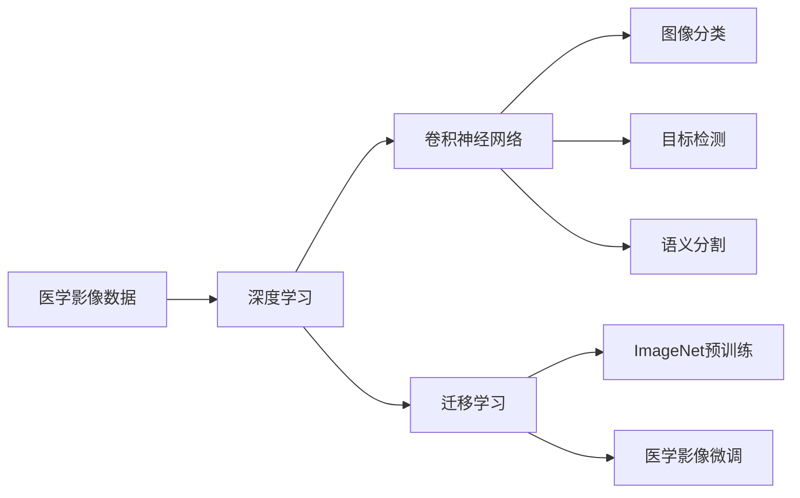

# 一切皆是映射：深度学习在医疗影像分析中的革命

## 1.背景介绍
### 1.1 医疗影像分析的重要性
医疗影像分析是现代医学诊断和治疗的重要组成部分。各种医学影像技术如X射线、CT、MRI、超声等为医生提供了人体内部结构和功能的可视化信息,帮助医生进行疾病的早期诊断、治疗方案制定和疗效评估。然而,随着影像设备分辨率的不断提高,医疗影像数据呈现爆炸式增长,给医生的诊断工作带来巨大挑战。人工智能技术尤其是深度学习在医疗影像分析领域的应用,为解决这一难题提供了新的思路和方法。

### 1.2 深度学习的发展历程
深度学习是机器学习的一个分支,其本质是通过构建具有多个隐藏层的人工神经网络,并利用大量数据对网络进行训练,使其能够自动学习数据中蕴含的特征和规律。深度学习的概念最早由Hinton等人于2006年提出,此后在语音识别、图像分类等领域取得了突破性进展。2012年,Krizhevsky使用深度卷积神经网络AlexNet在ImageNet图像分类比赛中大幅刷新纪录,掀起了深度学习的研究热潮。近年来,随着算法模型的不断改进、数据量的持续增长以及GPU等硬件计算能力的飞速发展,深度学习在众多领域展现出了超越人类的性能,深刻改变了人们的生产生活方式。

### 1.3 深度学习与医疗影像分析的结合
医疗影像分析是深度学习的一个理想应用场景。首先,医疗影像数据具有天然的高维特性,非常适合深度学习所擅长的复杂特征提取和抽象。其次,医疗领域积累了大量有标注的数据,这为深度学习模型的训练提供了优质的数据基础。再次,影像分析任务的标准化使得深度学习算法的泛化和评估相对容易。最后,医疗健康事关人类福祉,人工智能在其中的应用价值巨大。近年来,深度学习在医学影像分割、分类、检测、配准、重建等方面取得了长足进展,有望成为放射科医生的得力助手,促进精准医疗的发展。

## 2.核心概念与联系
### 2.1 医学影像数据
医学影像是对人体内部结构和功能的数字化可视化表示。常见的医学影像种类包括:
- X射线:利用X射线穿透人体成像,主要用于骨骼、胸腔疾病的诊断。
- CT(Computed Tomography):利用X射线围绕人体旋转成像,可以重建人体断层图像,广泛应用于全身各个系统疾病的诊断。  
- MRI(Magnetic Resonance Imaging):利用强磁场和射频脉冲激发人体组织中的氢原子,接收其释放的信号成像,可以对软组织进行任意方位成像,在神经、肌肉骨骼系统疾病诊断中应用广泛。
- 超声:利用高频声波反射成像,主要用于腹部、妇产科、心脏等器官的检查。
- 核医学:利用放射性示踪剂示踪人体器官代谢功能,主要用于肿瘤、心脏等疾病的诊断。

这些影像数据一般以DICOM(Digital Imaging and Communications in Medicine)格式存储和传输。DICOM文件除了包含图像矩阵数据,还含有丰富的元数据如患者信息、扫描参数等。医学影像数据具有维度高(如CT图像可达512x512x1000)、模态多(上述几种成像原理差异很大)、病例少(一个特定疾病的有标注数据很难收集)等特点,给机器学习模型的训练带来挑战。

### 2.2 卷积神经网络
卷积神经网络(Convolutional Neural Network, CNN)是深度学习中最重要的网络结构之一,特别适用于图像数据的处理。CNN主要由以下几个部分组成:

- 卷积层:通过卷积运算提取图像局部特征。卷积运算可以看作一种权值共享的特殊全连接。
- 池化层:对卷积特征图下采样,降低数据维度,提取主要特征。常见的池化操作包括最大池化和平均池化。  
- 激活函数:在卷积层或全连接层后增加非线性变换,提高网络的表达能力。常用的激活函数包括ReLU、sigmoid、tanh等。
- 全连接层:对卷积和池化提取到的特征进行组合,生成最终的预测结果。

CNN通过局部连接和权值共享,大大减少了网络参数数量,使得超大规模网络的训练成为可能。CNN在图像分类、目标检测、语义分割等计算机视觉任务上取得了广泛成功,是当前医学影像分析的主流模型。

### 2.3 迁移学习
迁移学习是将一个领域学习到的知识迁移应用到另一个领域的机器学习方法。其核心思想是,不同领域的数据可能共享某些相似的特征模式,模型可以通过学习一个领域的知识,实现在另一个领域的快速适配。

在医学影像分析中,受限于数据量和标注成本,从头训练一个性能优异的深度学习模型非常困难。研究者通常采用迁移学习的方法,将ImageNet等大规模自然图像数据集上预训练的模型如ResNet等,迁移到医学影像数据上进行微调。实验表明,这种预训练+微调的方式可以大幅提升模型性能,加速模型的收敛。迁移学习已成为医学影像AI开发的标准流程。

### 2.4 小结
深度学习是对多层神经网络的统称,能够学习数据的层次化特征表示。卷积神经网络是深度学习处理图像数据的利器,通过局部连接和权值共享,极大提升了图像识别的性能。针对医学影像数据少、标注难的问题,迁移学习成为业界默认的解决方案,可显著改善模型的泛化能力。这些概念和方法构成了深度学习医疗影像分析的核心要素。

## 3.核心算法原理具体操作步骤
### 3.1 医学影像分类
影像分类是判断一张图像属于哪个类别的任务,是医学影像分析的基础。基于深度学习的影像分类一般分为以下几个步骤:

1. 数据预处理:将原始医学影像数据统一成固定大小的图像块,并进行归一化。
2. 网络设计:选择一个适合的CNN网络结构如ResNet、DenseNet等,并根据任务对网络进行适当的修改如更改输入大小、替换分类层等。
3. 模型训练:利用训练集数据对网络进行训练,优化目标一般为交叉熵损失函数。为了防止过拟合,一般还会采用数据增强、L2正则化、dropout等策略。  
4. 模型评估:利用测试集数据对训练好的模型进行性能评估,常用的指标包括准确率、AUC值、敏感性、特异性等。也可以通过混淆矩阵、ROC曲线等进行更详细的分析。
5. 模型优化:根据评估结果对模型进行优化,如调整网络结构、损失函数、训练策略等,并重复步骤3-4,直到满足预期性能。
6. 模型部署:将训练好的模型集成到临床诊断流程中,辅助医生进行疾病诊断。

以肺结节良恶性诊断为例。首先,将CT图像切割成以结节为中心的固定大小的图像块,并进行灰度归一化。然后,选择ResNet-50作为基础网络,并根据数据量对其进行适当的修改如缩小网络宽度、减少网络深度等。接着,利用带有良恶性标签的训练集数据对网络进行训练,并采用数据增强、L2正则化等方法防止过拟合。在测试集上评估模型性能,若不理想则返回调整模型。最终,将训练好的模型部署到医院PACS系统中,对新的肺部CT图像进行良恶性预测,辅助放射科医生诊断。

### 3.2 医学影像分割
影像分割是将图像像素划分到不同语义类别的任务,在医疗领域主要用于器官、病灶的自动勾画。基于深度学习的影像分割一般分为以下几个步骤:  

1. 数据预处理:将原始医学影像数据统一成固定大小的图像块,并进行归一化。将像素标注转换为与原图大小相同的掩膜。
2. 网络设计:选择一个适合的分割网络结构如U-Net、DeepLab等,并根据任务对网络进行适当的修改如更改编码器主干网络、调整解码器结构等。
3. 模型训练:利用训练集数据对网络进行训练,优化目标一般为像素级交叉熵损失函数或Dice损失函数。为了防止过拟合,一般还会采用数据增强、L2正则化等策略。
4. 模型评估:利用测试集数据对训练好的模型进行性能评估,常用的指标包括Dice系数、IoU系数、像素级准确率等。也可以通过可视化分割结果与金标准的差异,进行更直观的分析。  
5. 模型优化:根据评估结果对模型进行优化,如调整网络结构、损失函数、训练策略等,并重复步骤3-4,直到满足预期性能。
6. 模型部署:将训练好的模型集成到临床诊断流程中,辅助医生进行器官、病灶的精确定位和描述。

以肝脏肿瘤分割为例。首先,将腹部CT或MRI图像切割成固定大小的图像块,并进行灰度归一化,将像素标注转换为二值掩膜。然后,选择U-Net作为基础网络,并采用ImageNet预训练的ResNet作为其编码器主干网络以加快收敛。接着,利用带有肿瘤掩膜标注的训练集数据对网络进行训练,并采用数据增强、L2正则化等方法防止过拟合。在测试集上评估模型性能,若不理想则返回调整模型。最终,将训练好的模型部署到医院PACS系统中,对新的肝脏CT或MRI图像进行肿瘤区域自动分割,辅助放射科医生诊断。

### 3.3 小结
医学影像分类和分割是深度学习在医疗影像领域应用的两个核心任务。它们在数据预处理、网络设计、模型训练、模型评估等方面有许多共通之处,但也有一些差异如损失函数的选择、性能评估指标等。掌握这两个任务的标准流程和关键技术细节,对于开发医疗AI算法至关重要。此外,还需要密切关注在网络结构、学习策略等方面的最新研究进展,并根据实际医学应用场景对算法进行针对性优化,才能开发出安全、有效、鲁棒的智能医疗系统。

## 4.数学模型和公式详细讲解举例说明
### 4.1 卷积运算
卷积是CNN的核心运算,可以提取图像的局部特征。二维卷积的数学定义为:

$$ S(i,j) = (I * K)(i, j) = \sum_m \sum_n I(i-m, j-n) K(m, n) $$

其中,$I$为输入图像,$K$为卷积核,$S$为输出特征图。卷积运算可以看作是卷积核在图像上滑动,并在每个位置进行加权求和。卷积核的权值可以通过反向传播算法进行学习优化。

举例来说,假设我们有一个3x3的图像:
$$
I = 
\begin{bmatrix}
1 & 2 & 3 \\
4 & 5 & 6 \\
7 & 8 & 9