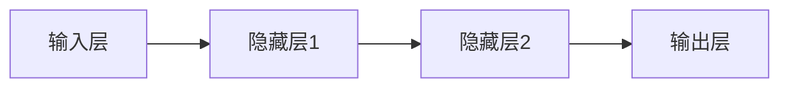

# 一切皆是映射：环境监测中的神经网络算法应用

## 1.背景介绍

### 1.1 环境监测的重要性

在当今世界,环境问题已成为一个日益严峻的挑战。气候变化、空气污染、水资源短缺等问题不仅影响着我们的生活质量,也对整个地球生态系统构成了巨大威胁。为了有效应对这些挑战,我们需要实时、准确地监测环境状况,及时发现问题并采取相应措施。

环境监测涉及多个领域,包括大气、水体、土壤等,需要收集和分析大量数据。传统的监测方法存在诸多缺陷,例如成本高昂、效率低下、准确性有限等。因此,迫切需要开发新的监测技术和方法,以提高监测的精度、效率和可扩展性。

### 1.2 神经网络在环境监测中的应用

近年来,人工智能技术在环境监测领域得到了广泛应用,尤其是神经网络算法。神经网络具有强大的模式识别和预测能力,可以从复杂的数据中提取有价值的信息,并对未来趋势做出精准预测。

神经网络在环境监测中的应用包括:

- 空气质量预测
- 水质监测
- 土壤污染检测
- 气象数据分析
- 生态系统评估

通过神经网络算法,我们可以更好地理解环境数据背后的模式和趋势,从而制定更有效的环境管理和保护策略。

## 2.核心概念与联系

### 2.1 神经网络基础

神经网络是一种模拟生物神经系统的计算模型,由大量互连的节点(神经元)组成。每个神经元接收来自其他神经元的输入信号,经过加权求和和激活函数的处理后,产生自己的输出信号。神经网络通过训练调整连接权重,从而学习到输入和输出之间的映射关系。

神经网络具有以下几个核心概念:

- 输入层(Input Layer)
- 隐藏层(Hidden Layer)
- 输出层(Output Layer)
- 权重(Weight)
- 激活函数(Activation Function)
- 损失函数(Loss Function)
- 优化算法(Optimization Algorithm)



### 2.2 监督学习与非监督学习

根据训练数据的特点,神经网络可以分为监督学习和非监督学习两大类:

1. **监督学习**(Supervised Learning)

   在监督学习中,训练数据包含输入和期望输出,神经网络通过学习这些样本数据,建立输入和输出之间的映射关系。监督学习常用于分类和回归任务,如图像分类、语音识别、时间序列预测等。

2. **非监督学习**(Unsupervised Learning)

   在非监督学习中,训练数据只包含输入,没有对应的期望输出。神经网络需要自行发现数据的内在模式和结构。非监督学习常用于聚类、降维和生成式建模等任务。

在环境监测中,根据具体任务的不同,可以选择合适的神经网络模型和学习方式。例如,空气质量预测属于监督学习任务,而土壤污染检测可能需要非监督学习来发现异常模式。

## 3.核心算法原理具体操作步骤

神经网络算法的核心原理包括前向传播(Forward Propagation)和反向传播(Backward Propagation)两个阶段。

### 3.1 前向传播

前向传播是神经网络对输入数据进行计算和预测的过程。具体步骤如下:

1. 将输入数据传递到输入层
2. 在隐藏层中,每个神经元根据输入和权重进行加权求和,然后通过激活函数计算输出
3. 重复第2步,直到到达输出层
4. 输出层的输出即为神经网络对输入数据的预测结果

数学表示:

$$
\begin{aligned}
z_j^{(l)} &= \sum_{i} w_{ij}^{(l)}a_i^{(l-1)} + b_j^{(l)} \\
a_j^{(l)} &= \sigma(z_j^{(l)})
\end{aligned}
$$

其中:
- $z_j^{(l)}$表示第$l$层第$j$个神经元的加权输入
- $w_{ij}^{(l)}$表示第$l$层第$j$个神经元与第$l-1$层第$i$个神经元之间的权重
- $a_i^{(l-1)}$表示第$l-1$层第$i$个神经元的输出
- $b_j^{(l)}$表示第$l$层第$j$个神经元的偏置项
- $\sigma$表示激活函数,如Sigmoid、ReLU等

### 3.2 反向传播

反向传播是神经网络进行训练和优化的过程,目标是调整权重和偏置,使预测结果与期望输出之间的误差最小化。具体步骤如下:

1. 计算输出层的损失函数,如均方误差(MSE)或交叉熵损失(Cross-Entropy Loss)
2. 计算输出层的误差项,即损失函数对输出的偏导数
3. 从输出层开始,沿着网络反向传播误差项,计算每一层的误差项
4. 使用优化算法(如梯度下降)更新每一层的权重和偏置,以减小误差

数学表示:

$$
\begin{aligned}
\delta_j^{(L)} &= \frac{\partial L}{\partial z_j^{(L)}} \\
\delta_j^{(l)} &= \sum_k \delta_k^{(l+1)}w_{jk}^{(l+1)}\sigma'(z_j^{(l)}) \\
w_{ij}^{(l)} &\leftarrow w_{ij}^{(l)} - \eta\frac{\partial L}{\partial w_{ij}^{(l)}}
\end{aligned}
$$

其中:
- $\delta_j^{(l)}$表示第$l$层第$j$个神经元的误差项
- $L$表示损失函数
- $\sigma'$表示激活函数的导数
- $\eta$表示学习率,控制权重更新的步长

通过不断地前向传播和反向传播,神经网络可以逐步调整权重,从而学习到输入和输出之间的映射关系。

## 4.数学模型和公式详细讲解举例说明

在环境监测中,神经网络常用于建模和预测时间序列数据,如空气质量指数、水质参数等。这些数据通常具有周期性、趋势性和季节性等特征。

### 4.1 长短期记忆网络(LSTM)

长短期记忆网络(Long Short-Term Memory, LSTM)是一种特殊的递归神经网络,擅长处理序列数据。LSTM通过引入门控机制,可以有效地捕捉长期依赖关系,解决传统递归神经网络存在的梯度消失和梯度爆炸问题。

LSTM的核心思想是使用一个细胞状态(Cell State)来传递信息,并通过三个门(Forget Gate、Input Gate和Output Gate)来控制信息的流动。

1. **遗忘门(Forget Gate)**

   遗忘门决定了细胞状态中哪些信息需要被遗忘或保留。

   $$f_t = \sigma(W_f \cdot [h_{t-1}, x_t] + b_f)$$

   其中$f_t$表示遗忘门的输出,范围在0到1之间。0表示完全遗忘,1表示完全保留。

2. **输入门(Input Gate)**

   输入门决定了新的信息如何被更新到细胞状态中。

   $$
   \begin{aligned}
   i_t &= \sigma(W_i \cdot [h_{t-1}, x_t] + b_i) \\
   \tilde{C}_t &= \tanh(W_C \cdot [h_{t-1}, x_t] + b_C)
   \end{aligned}
   $$

   其中$i_t$表示输入门的输出,范围在0到1之间。$\tilde{C}_t$是一个候选值,表示新的细胞状态。

3. **细胞状态更新(Cell State Update)**

   $$C_t = f_t \odot C_{t-1} + i_t \odot \tilde{C}_t$$

   细胞状态$C_t$是通过遗忘门$f_t$和输入门$i_t$来更新的。$\odot$表示元素wise乘积。

4. **输出门(Output Gate)**

   输出门决定了细胞状态中的信息如何输出到隐藏状态。

   $$
   \begin{aligned}
   o_t &= \sigma(W_o \cdot [h_{t-1}, x_t] + b_o) \\
   h_t &= o_t \odot \tanh(C_t)
   \end{aligned}
   $$

   其中$o_t$表示输出门的输出,范围在0到1之间。$h_t$是LSTM在时间步$t$的隐藏状态输出。

通过上述门控机制,LSTM可以有效地捕捉长期依赖关系,从而更好地建模和预测时间序列数据。

### 4.2 卷积神经网络(CNN)

卷积神经网络(Convolutional Neural Network, CNN)是一种常用于图像处理和计算机视觉任务的神经网络模型。在环境监测中,CNN也可以应用于处理卫星遥感图像、地理信息系统(GIS)数据等。

CNN的核心思想是通过卷积操作提取局部特征,并通过池化操作降低特征维度,从而实现对输入数据的有效编码和表示。

1. **卷积层(Convolutional Layer)**

   卷积层通过卷积核(Kernel)在输入数据上滑动,提取局部特征。

   $$
   x_j^l = \sigma\left(\sum_i x_i^{l-1} * k_{ij}^l + b_j^l\right)
   $$

   其中$x_j^l$表示第$l$层第$j$个特征图的输出,由输入特征图$x_i^{l-1}$与卷积核$k_{ij}^l$进行卷积操作得到。$\sigma$表示非线性激活函数,如ReLU。$b_j^l$是偏置项。

2. **池化层(Pooling Layer)**

   池化层通过下采样操作,减小特征图的维度,从而提高计算效率和空间不变性。常见的池化操作包括最大池化(Max Pooling)和平均池化(Average Pooling)。

   $$
   x_j^l = \text{pool}(x_i^{l-1})
   $$

   其中$x_j^l$表示第$l$层第$j$个特征图的输出,由上一层的特征图$x_i^{l-1}$经过池化操作得到。

3. **全连接层(Fully Connected Layer)**

   全连接层类似于传统的神经网络,将卷积层和池化层提取的特征进行整合,用于最终的分类或回归任务。

通过卷积层、池化层和全连接层的组合,CNN可以有效地从环境数据(如卫星图像)中提取特征,并进行相应的分析和预测。

## 5.项目实践:代码实例和详细解释说明

为了更好地理解神经网络在环境监测中的应用,我们将通过一个实际案例来演示如何使用Python和TensorFlow构建LSTM模型,对空气质量数据进行预测。

### 5.1 数据准备

我们将使用北京市2013年至2017年的空气质量数据,包括PM2.5、PM10、SO2、NO2、CO、O3等指标。数据来源于北京市环境保护监测中心。

```python
import pandas as pd

# 读取数据
air_data = pd.read_csv('beijing_air_data.csv')

# 数据预处理
air_data = air_data.dropna()
air_data = air_data[['year', 'month', 'day', 'hour', 'PM2.5', 'PM10', 'SO2', 'NO2', 'CO', 'O3']]

# 将日期时间合并为单一列
air_data['datetime'] = pd.to_datetime(air_data[['year', 'month', 'day', 'hour']])
air_data = air_data.drop(['year', 'month', 'day', 'hour'], axis=1)

# 将数据划分为训练集和测试集
train_data = air_data[air_data['datetime'] < '2017-01-01']
test_data = air_data[air_data['datetime'] >= '2017-01-01']
```

### 5.2 构建LSTM模型

```python
import tensorflow as tf

# 定义输入特征
feature_names = ['PM2.5', 'PM10', 'SO2', 'NO2', 'CO', 'O3']
feature