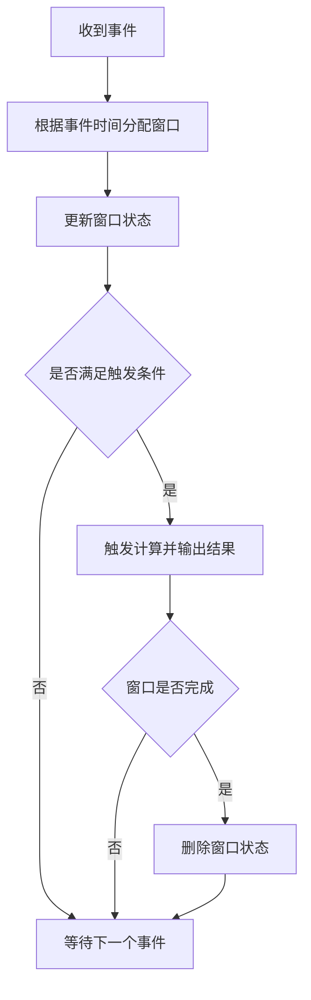

# 事件时间 原理与代码实例讲解

## 1. 背景介绍
### 1.1 事件时间的重要性
在流式数据处理中,数据通常携带时间戳信息,表示事件发生的时间。这个时间戳被称为事件时间(Event Time)。与之相对的是数据到达流处理系统的时间,即处理时间(Processing Time)。在许多流式数据处理场景中,我们更关注事件时间,因为它能够反映事件的真实发生时序,对于时间敏感的计算和分析至关重要。

### 1.2 事件时间带来的挑战
然而,在分布式流式数据处理中,事件时间也带来了一些独特的挑战:

1. 乱序数据:由于网络延迟、多个数据源等原因,事件可能会无序到达,即晚发生的事件先到达,早发生的事件后到达。
2. 延迟数据:某些事件可能会由于各种原因延迟很长时间才到达。
3. 数据倾斜:不同分区的数据到达速率可能不均匀,导致某些任务进度缓慢。

这些问题给基于事件时间的计算带来了困难。流处理框架需要提供合适的机制来应对这些挑战。

## 2. 核心概念与联系
### 2.1 Watermark
Watermark是流处理系统中的一个重要概念,它用于衡量事件时间进展。可以将Watermark理解为一个时间戳,它代表"在此之前,事件已经全部到达"。换句话说,Watermark是一种衡量事件完整性的机制。

举个例子,如果当前的Watermark是12:00,就表示时间戳小于等于12:00的事件都已经到达。系统可以根据Watermark来触发某些操作,如输出窗口计算结果。

### 2.2 Window
Window即窗口,是流处理中对无界数据进行有界处理的一种方式。Window 可以在事件时间或处理时间上定义,将数据流切分成有限的数据集合进行计算。常见的Window类型有:

- 滚动窗口(Tumbling Window):窗口之间没有重叠,每个事件只属于一个窗口。
- 滑动窗口(Sliding Window):窗口之间有重叠,每个事件可能属于多个窗口。
- 会话窗口(Session Window):根据事件之间的间隔动态划分窗口。

### 2.3 触发器(Trigger)
触发器决定了何时触发窗口的计算,输出计算结果。常见的触发器有:

- Watermark触发器:当Watermark到达窗口结束时间时触发。
- 事件数触发器:当窗口中的事件数达到一定阈值时触发。
- 处理时间触发器:根据处理时间定期触发。

## 3. 核心算法原理与具体操作步骤
事件时间的处理涉及Watermark的生成和窗口的计算触发。下面我们详细讨论这两个方面。

### 3.1 Watermark的生成
Watermark的生成需要根据数据源的特点来设计。一般有两种生成方式:

1. 周期性生成:系统周期性地生成Watermark。通常根据最近一段时间内收到的事件的最大时间戳来生成Watermark,即:
   ```
   Watermark = 最大事件时间 - 延迟阈值
   ```
   其中,延迟阈值是一个预定义的常量,表示在最大事件时间之后,我们愿意等待迟到事件的最长时间。

2. 标记生成:数据源在数据中显式插入一些特殊的Watermark事件,系统根据这些事件生成Watermark。

生成Watermark的算法可以总结为:
1. 定期扫描未完成的窗口。
2. 对于每个窗口,找出其中最大的事件时间max_event_time。 
3. 生成Watermark = max_event_time - 延迟阈值。
4. 将Watermark广播到所有下游任务。

### 3.2 窗口的计算触发
对于每一个到达的事件,系统需要:
1. 根据事件时间将其分配到对应的窗口。
2. 更新窗口的状态(如事件数、聚合结果等)。
3. 如果满足触发条件(如Watermark超过窗口结束时间),则触发窗口计算,输出结果。
4. 如果窗口已经完成,则将其状态删除,释放资源。

具体的操作步骤可以概括为:


## 4. 数学模型和公式详细讲解举例说明
事件时间处理涉及的主要数学模型是窗口的定义和Watermark的计算。

### 4.1 窗口的数学定义
假设我们定义一个长度为 $L$、滑动步长为 $S$ 的滑动窗口,对于事件时间为 $t$ 的事件,其所属窗口的起始时间 $w_s$ 和结束时间 $w_e$ 可以计算为:

$$
w_s = \lfloor \frac{t}{S} \rfloor \times S
$$

$$
w_e = w_s + L
$$

例如,假设 $L=10$, $S=5$,对于一个事件时间为12的事件,其所属窗口的起始时间为:
$$
w_s = \lfloor \frac{12}{5} \rfloor \times 5 = 2 \times 5 = 10
$$
窗口的结束时间为:
$$
w_e = 10 + 10 = 20
$$
因此,该事件属于窗口 [10, 20)。

### 4.2 Watermark的计算
假设我们设定的最大延迟阈值为 $D$,在时间 $T$ 收到的事件的最大时间戳为 $max_t$,则此时的Watermark $W$ 为:

$$
W = max_t - D
$$

例如,假设延迟阈值 $D=5$,在时间 $T=100$ 时,收到的最大事件时间为98,则此时的Watermark为:
$$
W = 98 - 5 = 93
$$
这表示在时间100时,时间戳 $\leq 93$ 的事件都已经到达。

## 5. 项目实践:代码实例和详细解释说明
下面我们以Apache Flink为例,演示如何进行事件时间的处理。

### 5.1 设置事件时间
首先,我们需要设置数据流的时间特性为事件时间:
```java
StreamExecutionEnvironment env = StreamExecutionEnvironment.getExecutionEnvironment();
env.setStreamTimeCharacteristic(TimeCharacteristic.EventTime);
```

### 5.2 生成Watermark
然后,我们需要指定如何从事件数据中提取时间戳,并生成Watermark。这通过实现`AssignerWithPeriodicWatermarks`接口来实现:
```java
class MyWatermarkAssigner implements AssignerWithPeriodicWatermarks<MyEvent> {
    private long maxTimestamp = 0;
    private long delay = 5000; // 延迟阈值为5秒

    @Override
    public long extractTimestamp(MyEvent event, long previousElementTimestamp) {
        maxTimestamp = Math.max(maxTimestamp, event.getTimestamp());
        return event.getTimestamp();
    }

    @Override
    public Watermark getCurrentWatermark() {
        return new Watermark(maxTimestamp - delay);
    }
}
```
在上面的代码中,`extractTimestamp`方法从事件中提取时间戳,`getCurrentWatermark`方法根据最大时间戳和延迟阈值生成Watermark。

然后,我们将这个Watermark Assigner应用到数据流上:
```java
DataStream<MyEvent> stream = ...
DataStream<MyEvent> withTimestampsAndWatermarks = stream
    .assignTimestampsAndWatermarks(new MyWatermarkAssigner());
```

### 5.3 定义窗口并应用聚合函数
接下来,我们可以在数据流上定义窗口,并应用聚合函数:
```java
withTimestampsAndWatermarks
    .keyBy(event -> event.getKey())
    .window(TumblingEventTimeWindows.of(Time.seconds(10)))
    .aggregate(new MyAggregateFunction())
    .print();
```
在上面的代码中,我们定义了一个10秒的事件时间滚动窗口,并应用了自定义的聚合函数`MyAggregateFunction`。

### 5.4 处理延迟数据
对于延迟数据,我们可以使用`allowedLateness`方法来指定允许的最大延迟,Flink会保留这些延迟数据,直到Watermark超过窗口结束时间加上允许的延迟时间:
```java
withTimestampsAndWatermarks
    .keyBy(event -> event.getKey())
    .window(TumblingEventTimeWindows.of(Time.seconds(10)))
    .allowedLateness(Time.seconds(30))
    .aggregate(new MyAggregateFunction())
    .print();
```
在上面的代码中,我们允许最大30秒的延迟。Flink会将迟到不超过30秒的数据加入对应的窗口进行计算。

## 6. 实际应用场景
事件时间在许多实际场景中都有重要应用,例如:

1. 日志分析:分析用户在某个时间窗口内的行为,如统计每小时的页面访问量。
2. 异常检测:检测某个时间窗口内是否有异常事件发生,如监控服务器每分钟的错误日志数。
3. 电商场景:统计某个时间窗口内的订单数、销售额等指标。
4. 广告点击:统计某个广告在一定时间窗口内的点击数、点击率等。

在这些场景中,我们关注的是事件的实际发生时间,而不是数据到达系统的时间。使用事件时间处理可以保证分析结果的准确性和一致性。

## 7. 工具和资源推荐
对于事件时间处理,主流的流处理框架都提供了很好的支持,如:

1. Apache Flink:提供了丰富的时间语义和窗口API,支持事件时间处理和Watermark机制。
2. Apache Beam:提供了统一的流批处理模型,支持事件时间处理。
3. Spark Structured Streaming:支持事件时间和Watermark,提供了类似于批处理的高级API。

此外,一些云计算平台也提供了流处理服务,如Google Cloud Dataflow、Amazon Kinesis等,它们同样支持事件时间处理。

对于学习事件时间处理,以下资源可能会有帮助:

1. Flink官方文档:https://ci.apache.org/projects/flink/flink-docs-stable/
2. Beam编程指南:https://beam.apache.org/documentation/programming-guide/
3. 《流处理系统:核心概念与实现》,作者Reuven Lax,这本书系统介绍了流处理的核心概念和技术。

## 8. 总结:未来发展趋势与挑战
事件时间处理是流处理领域的重要课题,未来的发展趋势可能包括:

1. 更智能的Watermark生成机制,如根据数据的特征自适应调整延迟阈值。
2. 更灵活的窗口机制,如支持动态调整窗口大小、支持更复杂的触发条件等。
3. 更好的延迟数据处理,如支持对延迟数据进行补偿计算、支持对延迟数据进行预测等。

同时,事件时间处理也面临一些挑战:

1. 如何在保证准确性的同时提高计算效率,减少状态存储开销。
2. 如何处理更复杂的场景,如事件时间倾斜、时间戳不单调等。
3. 如何与其他时间语义(如处理时间)协同,提供更灵活的时间语义支持。

总的来说,事件时间处理是流处理的基础和关键,未来还有很大的发展空间,需要学术界和工业界的共同努力。

## 9. 附录:常见问题与解答
1. 什么是事件时间和处理时间的区别?
   - 事件时间是事件实际发生的时间,由事件自身的时间戳决定;处理时间是事件到达流处理系统的时间,由系统的时钟决定。
   - 事件时间更能反映事件的真实发生顺序,但处理有一定的延迟和复杂性;处理时间虽然实时性更好,但不能保证事件的因果关系。

2. Watermark是如何解决乱序事件的问题的?
   -