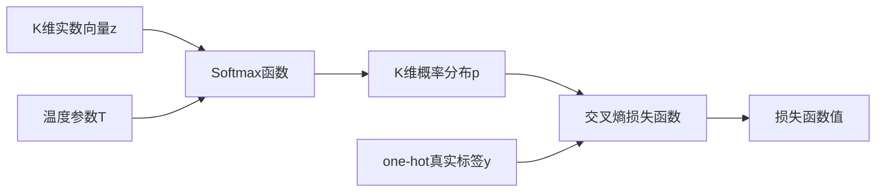

# 从零开始大模型开发与微调：Python代码小练习：计算Softmax函数

## 1. 背景介绍

### 1.1 大模型开发与微调概述

近年来,随着深度学习技术的快速发展,大规模预训练语言模型(Pretrained Language Models, PLM)在自然语言处理(Natural Language Processing, NLP)领域取得了巨大的成功。这些大模型通过在海量无标注文本数据上进行自监督预训练,可以学习到丰富的语言知识和通用语义表示,进而在下游任务上展现出优异的迁移学习能力。

然而,直接使用预训练好的大模型应用于特定领域任务时,往往难以达到理想的效果。这是因为不同任务的数据分布和目标函数差异较大,预训练模型学到的知识无法完全匹配目标任务。为了进一步提升模型在特定领域的性能,需要在目标任务的数据上对预训练模型进行微调(Fine-tuning)。

### 1.2 Softmax函数的重要性

在大模型的预训练和微调过程中,Softmax函数是一个非常重要且广泛使用的组件。它通常出现在模型的输出层,用于将隐藏层的输出转换为一个概率分布。Softmax函数有着优雅的数学性质,可以很好地建模多分类问题。因此,掌握Softmax函数的原理和实现对于从事大模型开发与应用的研究人员和工程师来说至关重要。

### 1.3 本文的目标与贡献

本文旨在通过一个简单的Python代码小练习,帮助读者深入理解Softmax函数的数学原理,并掌握其NumPy和PyTorch的代码实现。我们将从基本概念出发,详细推导Softmax函数的数学表达式,分析其优秀特性。然后给出Softmax函数的NumPy和PyTorch实现代码,并通过实例讲解其应用。

本文的主要贡献如下:

1. 系统梳理了Softmax函数的数学原理,并给出了详细的推导过程。
2. 提供了Softmax函数的NumPy和PyTorch参考实现,并就代码细节进行了讲解。  
3. 结合实际应用场景阐述了Softmax函数的优缺点和局限性,为大模型开发与应用提供了一定的指导。

## 2. 核心概念与联系

### 2.1 Softmax函数的定义

Softmax函数,也称为归一化指数函数,是Logistic函数的多维推广。它将一个K维的实数向量z映射为一个K维的实数向量$\sigma(z)$,向量中的每个元素取值范围都在(0,1)之间,并且所有元素的和为1。Softmax函数的数学定义如下:

$$
\sigma(\mathbf{z})_j = \frac{e^{z_j}}{\sum_{k=1}^K e^{z_k}} \quad \text{for } j = 1, ..., K
$$

其中,$\mathbf{z} = (z_1, ..., z_K) \in \mathbb{R}^K$是输入的K维实数向量,$\sigma(\mathbf{z})_j$表示Softmax函数输出向量的第j个元素。

### 2.2 Softmax函数与其他概念的联系

- Softmax函数与Logistic函数:
Logistic函数是Softmax函数在二分类情况下的特例。当K=2时,Softmax函数退化为Logistic函数。

- Softmax函数与交叉熵损失:
在分类任务中,Softmax函数的输出通常作为模型预测的概率分布,并与真实标签的one-hot编码计算交叉熵损失。Softmax函数与交叉熵损失的组合是解决多分类问题的常用方法。

- Softmax函数与温度参数: 
Softmax函数可以引入一个温度参数T来控制输出分布的"平滑度"。温度参数T越小,Softmax函数的输出分布越趋向于"硬"分布(接近one-hot);温度参数T越大,Softmax函数的输出分布越趋向于均匀分布。

下图展示了Softmax函数的计算流程和与其他概念的联系:



## 3. 核心算法原理与操作步骤

### 3.1 Softmax函数的数学推导

为了更好地理解Softmax函数的工作原理,我们从最基本的定义出发,对其进行详细的数学推导。

首先,我们将指数函数作用于输入向量$\mathbf{z}$的每个元素:

$$
e^{z_j}, \quad j = 1, 2, ..., K
$$

然后,对上述指数结果进行求和,得到归一化因子:

$$
\sum_{k=1}^K e^{z_k}
$$

最后,将每个指数结果除以归一化因子,得到Softmax函数的输出:

$$
\sigma(\mathbf{z})_j = \frac{e^{z_j}}{\sum_{k=1}^K e^{z_k}}, \quad j = 1, 2, ..., K
$$

通过上述推导,我们可以清晰地看出,Softmax函数实际上是将输入向量$\mathbf{z}$中的每个元素映射到(0,1)区间内,并且所有元素的和为1。这种归一化处理使得Softmax函数的输出可以被解释为一个概率分布。

### 3.2 Softmax函数的优秀特性

Softmax函数之所以在深度学习领域广受欢迎,是因为它具有以下优秀特性:

1. 输出范围在(0,1)之间,并且所有元素的和为1,因此可以将其解释为一个概率分布。
2. 函数连续可导,便于梯度计算和优化。
3. 具有良好的数值稳定性,可以有效避免指数溢出问题。
4. 可以引入温度参数T来控制输出分布的"平滑度",提高模型的灵活性。

### 3.3 Softmax函数的计算步骤

根据Softmax函数的数学定义,其计算可以分为以下几个步骤:

1. 对输入向量$\mathbf{z}$的每个元素计算指数函数$e^{z_j}$。
2. 对步骤1得到的所有指数函数值求和,得到归一化因子$\sum_{k=1}^K e^{z_k}$。
3. 将步骤1得到的每个指数函数值除以步骤2的归一化因子,得到Softmax函数的输出$\sigma(\mathbf{z})_j$。

需要注意的是,在实际编程实现中,为了避免指数溢出问题,通常会在步骤1之前对输入向量$\mathbf{z}$减去其最大值。这个技巧不会改变Softmax函数的输出结果,但可以大大提高数值稳定性。

## 4. 数学模型和公式详细讲解

### 4.1 Softmax函数的数学模型

Softmax函数可以看作是将输入空间$\mathbb{R}^K$映射到一个K维概率单纯形的函数。概率单纯形是指一个K维向量空间,其中每个向量的元素非负且和为1。形式化地,我们可以将Softmax函数定义为以下数学模型:

$$
\begin{aligned}
\text{Softmax}: \mathbb{R}^K &\to \Delta^{K-1} \\
\mathbf{z} &\mapsto \sigma(\mathbf{z})
\end{aligned}
$$

其中,$\Delta^{K-1}$表示K维概率单纯形,其定义为:

$$
\Delta^{K-1} = \left\{ \mathbf{p} \in \mathbb{R}^K : p_i \geq 0, \sum_{i=1}^K p_i = 1 \right\}
$$

通过这个数学模型,我们可以清晰地看出Softmax函数的作用:将一个任意的K维实数向量映射为一个合法的概率分布。

### 4.2 Softmax函数的梯度计算

在深度学习中,我们经常需要计算Softmax函数的梯度,以便进行反向传播和参数更新。下面我们来推导Softmax函数的梯度表达式。

首先,我们定义Softmax函数的输出向量为$\mathbf{p} = \sigma(\mathbf{z})$,其中$p_j = \frac{e^{z_j}}{\sum_{k=1}^K e^{z_k}}$。

对于输出向量的第j个元素$p_j$,其关于输入向量的第i个元素$z_i$的偏导数为:

$$
\frac{\partial p_j}{\partial z_i} = \begin{cases}
p_j(1 - p_j), & \text{if } i = j \\
-p_i p_j, & \text{if } i \neq j
\end{cases}
$$

我们可以将上述结果写成一个矩阵的形式:

$$
\frac{\partial \mathbf{p}}{\partial \mathbf{z}} = \text{diag}(\mathbf{p}) - \mathbf{p}\mathbf{p}^T
$$

其中,$\text{diag}(\mathbf{p})$表示以向量$\mathbf{p}$为对角线元素的对角矩阵。

这个梯度矩阵的特点是:对角线元素为$p_j(1 - p_j)$,非对角线元素为$-p_i p_j$。了解Softmax函数的梯度表达式对于实现反向传播算法和优化模型参数非常有帮助。

### 4.3 举例说明

为了更直观地理解Softmax函数的计算过程,我们来看一个具体的例子。

假设我们有一个3维的输入向量$\mathbf{z} = [1, 2, 3]^T$,我们要计算其对应的Softmax函数输出。

首先,对每个元素计算指数函数:

$$
[e^1, e^2, e^3] \approx [2.718, 7.389, 20.086]
$$

然后,计算归一化因子:

$$
2.718 + 7.389 + 20.086 = 30.193
$$

最后,将每个指数函数值除以归一化因子,得到Softmax函数的输出:

$$
\mathbf{p} = \sigma(\mathbf{z}) \approx [0.090, 0.245, 0.665]^T
$$

可以看到,Softmax函数将输入向量$\mathbf{z}$映射为一个合法的概率分布$\mathbf{p}$,其中每个元素都在(0,1)范围内,并且所有元素的和为1。

## 5. 项目实践:代码实例与详细解释

在这一节,我们将使用Python语言,分别基于NumPy库和PyTorch库实现Softmax函数,并对代码进行详细解释。

### 5.1 基于NumPy的实现

```python
import numpy as np

def softmax(z):
    """
    Numpy实现的Softmax函数
    
    参数:
    z -- 一个K维的实数向量
    
    返回:
    softmax_output -- 一个K维的概率分布向量
    """
    # 对输入向量z减去最大值,提高数值稳定性
    z = z - np.max(z)
    
    # 计算指数函数值
    exp_z = np.exp(z)
    
    # 计算归一化因子
    sum_exp_z = np.sum(exp_z)
    
    # 计算Softmax函数的输出
    softmax_output = exp_z / sum_exp_z
    
    return softmax_output
```

在上述代码中,我们首先定义了一个名为`softmax`的函数,它接受一个K维的实数向量`z`作为输入,并返回一个K维的概率分布向量`softmax_output`。

函数内部的计算过程与我们之前讨论的Softmax函数的数学定义完全一致。为了提高数值稳定性,我们在计算指数函数之前,先对输入向量`z`减去其最大值。这个操作不会改变Softmax函数的输出结果,但可以有效避免指数溢出问题。

接下来,我们使用`np.exp()`函数计算指数函数值,并用`np.sum()`函数计算归一化因子。最后,将指数函数值除以归一化因子,得到Softmax函数的输出。

### 5.2 基于PyTorch的实现

```python
import torch

def softmax_pytorch(z):
    """
    PyTorch实现的Softmax函数
    
    参数:
    z -- 一个K维的实数张量
    
    返回:
    softmax_output -- 一个K维的概率分布张量
    """
    # 对输入