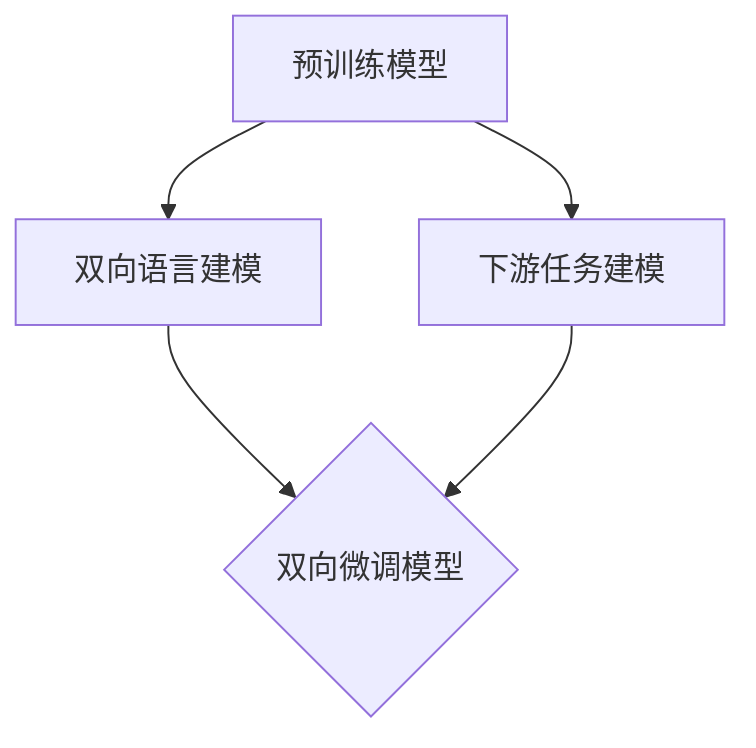

# 从零开始大模型开发与微调：单向不行，那就双向

## 1.背景介绍

### 1.1 大模型的兴起

近年来,大型语言模型在自然语言处理(NLP)领域取得了令人瞩目的成就。这些模型通过在大规模语料库上进行预训练,学习到丰富的语义和上下文知识,从而在下游任务中表现出色。代表性的大模型包括GPT-3、BERT、XLNet等。

然而,这些大模型在推理时需要消耗大量的计算资源,导致推理效率低下、成本高昂。此外,由于预训练过程中采用的是单向语义建模,模型无法很好地捕捉双向上下文信息,从而在某些任务上表现受限。

### 1.2 微调技术的局限性

为了解决上述问题,研究人员提出了微调(fine-tuning)技术。微调是指在大模型的基础上,使用特定任务的数据进行进一步训练,从而使模型在该任务上表现更好。

然而,微调技术也存在一些局限性:

1. **数据需求大**:微调需要大量的任务相关数据,否则容易过拟合。
2. **计算资源消耗高**:微调过程需要对整个大模型进行训练,计算成本高昂。
3. **知识迁移有限**:预训练模型中的知识无法完全迁移到下游任务中。
4. **无法捕捉双向上下文**:微调后的模型仍然无法很好地利用双向上下文信息。

为了克服这些局限性,研究人员提出了一种新的范式:双向微调(Bidirectional Fine-tuning)。

## 2.核心概念与联系

### 2.1 双向语言建模

传统的语言模型通常采用单向建模方式,即只考虑当前词的左侧或右侧上下文。而双向语言建模则同时考虑左右两侧的上下文信息,从而更好地捕捉语义关系。

双向语言建模的核心思想是使用掩码机制(Masked Language Modeling,MLM)。在MLM中,模型需要预测被掩码的词,这就要求模型利用上下文信息进行推理。通过这种方式,模型可以同时学习到左右两侧的语义信息。

### 2.2 双向微调

双向微调的核心思想是在微调过程中,同时对预训练模型进行双向语言建模和下游任务建模。具体来说,包括以下两个步骤:

1. **双向语言建模**:使用MLM的方式,让模型学习到双向上下文信息。
2. **下游任务建模**:使用任务相关的数据,让模型学习到特定任务的知识和模式。

通过这种方式,模型不仅能够学习到双向语义信息,还能够更好地迁移预训练模型中的知识,从而在下游任务上取得更好的表现。

### 2.3 Mermaid流程图

双向微调的核心流程可以用以下Mermaid流程图表示:



该流程图展示了双向微调的两个主要步骤:双向语言建模和下游任务建模。预训练模型作为输入,经过这两个步骤的训练,最终得到双向微调模型。

## 3.核心算法原理具体操作步骤

### 3.1 双向语言建模

双向语言建模的核心是MLM任务。具体操作步骤如下:

1. **数据预处理**:从语料库中随机抽取一批句子,对其中15%的词进行掩码(替换为特殊标记[MASK])。
2. **前向计算**:将带有掩码的句子输入到模型中,模型需要预测被掩码的词。
3. **损失计算**:将模型的预测结果与真实词进行比较,计算交叉熵损失。
4. **反向传播**:根据损失值,对模型参数进行梯度更新。

通过上述步骤的循环训练,模型可以学习到双向语义信息。需要注意的是,MLM任务中,模型无法直接访问被掩码词的上下文,因此必须综合利用左右两侧的上下文信息进行预测。

### 3.2 下游任务建模

下游任务建模的具体操作步骤取决于任务类型,例如文本分类、序列标注等。以文本分类任务为例,步骤如下:

1. **数据预处理**:将任务数据集按比例划分为训练集、验证集和测试集。
2. **输入构建**:将文本输入构建为模型可接受的格式,例如添加特殊标记[CLS]。
3. **前向计算**:将构建好的输入传递给模型,模型输出分类概率。
4. **损失计算**:将模型输出的概率与真实标签计算交叉熵损失。
5. **反向传播**:根据损失值,对模型参数进行梯度更新。

在下游任务建模过程中,模型不仅需要学习任务相关的知识,还需要综合利用预训练阶段学习到的双向语义信息。

### 3.3 双向微调算法

将上述两个步骤结合,我们可以得到完整的双向微调算法:

1. **初始化**:使用预训练模型的参数对双向微调模型进行初始化。
2. **双向语言建模**:使用MLM任务对模型进行双向语言建模训练。
3. **下游任务建模**:使用任务数据集对模型进行下游任务建模训练。
4. **交替训练**:交替进行步骤2和步骤3,直到模型在验证集上的性能不再提升。

在交替训练过程中,双向语言建模和下游任务建模可以共享模型参数,也可以使用不同的参数集。此外,还可以调整两个任务的损失权重,以获得最佳的性能表现。

## 4.数学模型和公式详细讲解举例说明

### 4.1 MLM任务的数学模型

在MLM任务中,给定一个长度为n的句子序列$X = (x_1, x_2, ..., x_n)$,其中某些词被掩码,我们的目标是预测被掩码的词。设$M$为掩码词的集合,对于每个$x_i \in M$,我们需要计算$P(x_i|X\backslash x_i)$,即在给定其他词的情况下,$x_i$的条件概率。

根据贝叶斯公式,我们有:

$$P(x_i|X\backslash x_i) = \frac{P(X\backslash x_i|x_i)P(x_i)}{P(X\backslash x_i)}$$

其中,$P(X\backslash x_i)$是常数,可以忽略。我们的目标是最大化$P(X\backslash x_i|x_i)P(x_i)$。

在transformer模型中,我们可以使用掩码注意力机制(Masked Attention)来计算$P(X\backslash x_i|x_i)$。具体来说,对于每个被掩码的词$x_i$,我们将其替换为特殊标记[MASK],然后使用transformer模型计算[MASK]位置的输出向量$h_i$。接着,我们将$h_i$传递给一个分类器,得到$x_i$的概率分布:

$$P(x_i|X\backslash x_i) = \text{softmax}(W_ch_i + b_c)$$

其中,$W_c$和$b_c$分别是分类器的权重和偏置。

在训练过程中,我们将预测的概率分布与真实词的one-hot编码进行交叉熵损失计算,并通过反向传播算法更新模型参数。

### 4.2 下游任务建模的数学模型

不同的下游任务有不同的数学模型,这里以文本分类任务为例进行说明。

给定一个长度为n的文本序列$X = (x_1, x_2, ..., x_n)$,我们的目标是预测其类别标签$y$。在transformer模型中,我们首先将输入序列$X$编码为一个序列of向量$H = (h_1, h_2, ..., h_n)$。然后,我们取出特殊标记[CLS]对应的向量$h_{\text{[CLS]}}$,并将其传递给一个分类器,得到类别概率分布:

$$P(y|X) = \text{softmax}(W_dh_{\text{[CLS]}} + b_d)$$

其中,$W_d$和$b_d$分别是分类器的权重和偏置。

在训练过程中,我们将预测的概率分布与真实标签的one-hot编码进行交叉熵损失计算,并通过反向传播算法更新模型参数。

### 4.3 双向微调的损失函数

在双向微调过程中,我们需要同时优化MLM任务和下游任务的损失函数。设$\mathcal{L}_{\text{MLM}}$和$\mathcal{L}_{\text{task}}$分别表示MLM任务和下游任务的损失函数,则双向微调的总损失函数可以表示为:

$$\mathcal{L} = \lambda\mathcal{L}_{\text{MLM}} + (1-\lambda)\mathcal{L}_{\text{task}}$$

其中,$\lambda$是一个超参数,用于平衡两个任务的重要性。通过调整$\lambda$的值,我们可以获得最佳的性能表现。

在实际训练过程中,我们可以交替优化$\mathcal{L}_{\text{MLM}}$和$\mathcal{L}_{\text{task}}$,也可以同时优化总损失函数$\mathcal{L}$。

## 5.项目实践:代码实例和详细解释说明

为了更好地理解双向微调的原理和实现,我们提供了一个基于PyTorch的代码示例。该示例实现了一个简单的文本分类任务,使用BERT作为预训练模型,并采用双向微调的方式进行模型训练。

### 5.1 数据预处理

首先,我们需要对数据进行预处理,将文本转换为BERT模型可接受的输入格式。我们使用`transformers`库提供的`BertTokenizer`进行文本tokenization和编码。

```python
from transformers import BertTokenizer

tokenizer = BertTokenizer.from_pretrained('bert-base-uncased')

def preprocess_data(text, max_len=512):
    inputs = tokenizer.encode_plus(
        text,
        add_special_tokens=True,
        max_length=max_len,
        padding='max_length',
        truncation=True,
        return_tensors='pt'
    )
    return inputs
```

### 5.2 MLM任务实现

接下来,我们实现MLM任务的数据生成器和损失函数计算。

```python
import torch
import random

def mlm_data_generator(inputs, tokenizer, mlm_prob=0.15):
    labels = inputs.clone()
    probability_matrix = torch.full(labels.shape, mlm_prob)
    
    # 对特殊标记进行掩码
    special_tokens_mask = [tokenizer.get_special_tokens_mask(val, already_has_special_tokens=True) for val in labels.tolist()]
    probability_matrix.masked_fill_(torch.tensor(special_tokens_mask, dtype=torch.bool), value=0.0)
    
    # 掩码处理
    masked_indices = torch.bernoulli(probability_matrix).bool()
    labels[~masked_indices] = -100  # 忽略非掩码位置的损失
    
    # 80%的掩码位置替换为[MASK]标记
    indices_replaced = torch.bernoulli(torch.full(labels.shape, 0.8)).bool() & masked_indices
    inputs[indices_replaced] = tokenizer.convert_tokens_to_ids(tokenizer.mask_token)
    
    # 10%的掩码位置保持不变
    indices_random = torch.bernoulli(torch.full(labels.shape, 0.5)).bool() & masked_indices & ~indices_replaced
    random_words = torch.randint(len(tokenizer), labels.shape, dtype=torch.long)
    inputs[indices_random] = random_words[indices_random]
    
    return inputs, labels

def mlm_loss(outputs, labels):
    shift_logits = outputs[..., :-1, :].contiguous()
    shift_labels = labels[..., 1:].contiguous()
    loss_fct = torch.nn.CrossEntropyLoss(ignore_index=-100)
    mlm_loss = loss_fct(shift_logits.view(-1, shift_logits.size(-1)), shift_labels.view(-1))
    return mlm_loss
```

### 5.3 下游任务实现

对于下游任务,我们以文本分类为例进行实现。

```python
from transformers import BertForSequenceClassification

model = BertForSequenceClassification.from_pretrained('bert-base-uncased', num_labels=2)

def task_loss(outputs, labels):
    loss_fct = torch.nn.CrossEntropyLoss()
    task_loss = loss_fct(outputs.logits.view