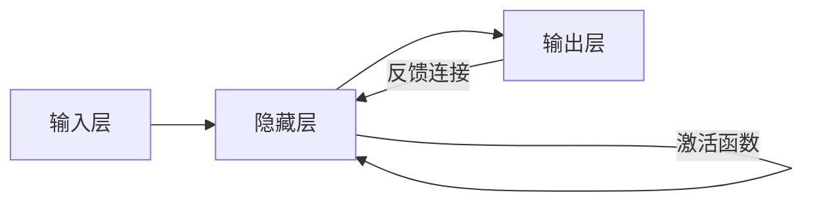

# 从零开始大模型开发与微调：反馈神经网络原理的激活函数

## 1. 背景介绍

近年来,随着深度学习技术的不断进步,大规模预训练语言模型(Pretrained Language Models, PLMs)在自然语言处理(Natural Language Processing, NLP)领域取得了巨大的成功。这些大模型通过在海量语料上进行无监督预训练,学习到了丰富的语言知识和常识,可以应用于各种下游NLP任务,大幅提升了模型的性能。

然而,训练这些大模型需要庞大的计算资源和训练数据,对于很多研究者和开发者来说难以企及。同时,预训练好的大模型往往体积庞大,在实际应用中部署困难。因此,如何从零开始高效地开发和微调适合特定任务的轻量化大模型,成为了NLP领域的一个重要课题。

本文将围绕大模型开发与微调这一主题,重点探讨反馈神经网络(Feedback Neural Network)中的激活函数(Activation Function)。激活函数是神经网络的核心组件之一,它为网络引入了非线性,使得网络能够拟合复杂的函数。合适的激活函数选择对于模型的性能和训练效率有着重要影响。我们将详细介绍几种常用的激活函数,分析其优缺点,并给出在大模型训练中的最佳实践。

希望通过本文的讨论,能够为读者提供一些关于大模型开发与微调的思路和技巧,让更多人能够参与到这一领域的研究和应用中来。

## 2. 核心概念与联系

在深入讨论之前,我们先来了解一下反馈神经网络和激活函数的一些核心概念:

### 2.1 反馈神经网络

反馈神经网络(Feedback Neural Network)是一类重要的神经网络结构。与前馈神经网络(Feedforward Neural Network)不同,FNN允许信息在网络中双向流动。具体来说,FNN在正向传播的同时引入了反向连接,让神经元的输出能够影响到前面层的神经元。这种反馈机制赋予了网络更强的表达能力,使其能够处理一些带有时间依赖的任务,如时间序列预测等。

一些常见的反馈神经网络包括:
- 循环神经网络(Recurrent Neural Network, RNN)
- 长短期记忆网络(Long Short-Term Memory, LSTM) 
- 门控循环单元网络(Gated Recurrent Unit, GRU)

### 2.2 激活函数

激活函数(Activation Function)是神经网络中不可或缺的一部分。它们通常作用于神经元的加权输入,为网络引入非线性,增强了网络的表达能力。没有激活函数,神经网络就退化为线性模型,无法拟合复杂的映射关系。

激活函数一般要求满足以下性质:
- 非线性:这是激活函数最基本的要求,非线性使得神经网络能够逼近任意复杂函数。
- 可微性:为了能够使用梯度下降算法训练网络,激活函数必须在定义域内几乎处处可微。
- 单调性:单调的激活函数更容易优化,加速训练收敛。
- 近似恒等:在原点附近近似恒等映射 f(x)≈x,这有利于梯度的反向传播。

常见的激活函数包括:
- Sigmoid
- Tanh
- ReLU
- Leaky ReLU
- ELU
- GELU

下面我们将重点介绍这些常见的激活函数,分析其优缺点以及在大模型训练中的应用。

### 2.3 反馈神经网络与激活函数的关系

下图展示了反馈神经网络与激活函数之间的关系:

可以看到,激活函数在隐藏层神经元上起作用,将加权输入映射为神经元的输出。同时,这个输出值又通过反馈连接传递到前面的神经元,影响它们的状态。因此,激活函数的选择不仅影响到网络的表达能力,也影响到反馈信号的传递效果。

## 3. 常见激活函数原理与比较

### 3.1 Sigmoid函数

Sigmoid函数是最早被广泛使用的激活函数之一。其数学形式为:

$$f(x) = \frac{1}{1+e^{-x}}$$

函数曲线如下图所示:

Sigmoid函数将实数映射到(0, 1)区间内,具有良好的数学性质:
- 光滑、连续、严格单调递增
- 幂函数形式,求导方便

$$f'(x) = f(x)(1-f(x))$$

- 输出值有明确的概率意义,可用于二分类问题

然而,Sigmoid函数也存在一些缺陷:
- 容易出现梯度消失问题。当|x|较大时,f'(x)趋近于0,反向传播的梯度会变得极小。
- 输出值不以0为中心,这会导致后一层神经元的输入发生偏置偏移,降低学习效率。
- 幂运算相对耗时,计算复杂度较高。

因此,在现代神经网络尤其是大模型的训练中,Sigmoid函数已经较少被直接使用。

### 3.2 Tanh函数

Tanh函数可以看作是Sigmoid函数的变形,其数学形式为:

$$f(x) = \frac{e^x - e^{-x}}{e^x + e^{-x}} = 2 \cdot \text{Sigmoid}(2x) - 1$$

函数曲线如下图所示:

相比Sigmoid函数,Tanh函数具有以下优点:
- 输出值以0为中心,在一定程度上缓解了神经元输入的偏置偏移问题。
- 值域为(-1, 1),相比Sigmoid函数,其输出幅度更大,有利于梯度的反向传播。

但Tanh函数仍然存在梯度消失的问题,且计算复杂度较高。在实际应用中,也逐渐被其他激活函数所取代。

### 3.3 ReLU函数

修正线性单元(Rectified Linear Unit, ReLU)是目前最流行的激活函数之一。其数学形式为:

$$f(x) = \max(0, x)$$

函数曲线如下图所示:

ReLU函数具有以下优点:
- 计算简单,只需要比较x与0的大小,大大降低了计算复杂度。
- 在x>0时,导数恒为1,有效缓解了梯度消失问题。
- 引入了稀疏性,一定程度上起到了正则化的作用,有利于特征提取。

但ReLU函数也存在一些问题:
- 输出值非零中心,仍然存在偏置偏移现象。
- 负半轴导数恒为0,可能出现"神经元死亡"现象。部分参数可能再也无法被更新。
- 函数在0点不可导,给优化算法带来了一定的不便。

尽管有这些缺陷,ReLU函数依然是目前使用最广泛的激活函数,特别是在计算机视觉等领域。

### 3.4 Leaky ReLU函数 

Leaky ReLU函数是为了解决"死亡ReLU"问题而提出的一种改进版ReLU函数。其数学形式为:

$$
f(x) = 
\begin{cases}
x, & x \geq 0 \\
\alpha x, & x < 0
\end{cases}
$$

其中,α是一个很小的正数,通常取0.01。函数曲线如下图所示:

相比ReLU函数,Leaky ReLU在负半轴引入了一个小的负斜率,从而避免了"死亡ReLU"问题。同时又保持了ReLU函数的优点,如单侧抑制、稀疏激活等。在实践中,Leaky ReLU的性能通常优于ReLU函数。

### 3.5 ELU函数

指数线性单元(Exponential Linear Unit, ELU)函数试图结合ReLU和Leaky ReLU的优点,同时进一步缓解偏置偏移问题。其数学形式为:

$$
f(x) = 
\begin{cases}
x, & x \geq 0 \\
\alpha (e^x - 1), & x < 0
\end{cases}
$$

函数曲线如下图所示:

ELU函数在负半轴上使用了指数函数,与Leaky ReLU相比,它对输入变化更加敏感。同时,由于$\lim_{x\to-\infty} f(x)=-\alpha$,ELU函数在一定程度上实现了输出的零中心化。

但ELU函数的计算复杂度相对较高,在实际使用中需要权衡精度和效率。

### 3.6 GELU函数

高斯误差线性单元(Gaussian Error Linear Unit, GELU)函数是最近提出的一种新型激活函数,已经在Transformer等大模型中得到了广泛应用。其数学形式为:

$$f(x) = x \cdot \Phi(x)$$

其中,Φ(x)是标准正态分布的累积分布函数:

$$\Phi(x) = \frac{1}{2} \left[ 1 + \text{erf}\left(\frac{x}{\sqrt{2}}\right) \right]$$

函数曲线如下图所示:

GELU函数可以看作是将ReLU函数与随机正则化技术相结合的一种形式。它在保留ReLU优点的同时,引入了平滑的随机性,使得模型对噪声更加鲁棒。

GELU函数在Transformer、BERT等大模型中取得了非常好的效果,是目前大模型训练的首选激活函数。

## 4. 激活函数的选择与应用实践

前面我们介绍了几种常见的激活函数,它们在不同的应用场景下各有优劣。下面我们就大模型训练这一场景,讨论如何选择合适的激活函数。

### 4.1 常见激活函数的优缺点比较

| 激活函数 | 优点 | 缺点 |
| ------- | --- | ---- |
| Sigmoid | 输出有概率意义,适合二分类 | 梯度消失,计算复杂 |
| Tanh | 输出零中心化 | 梯度消失,计算复杂 |
| ReLU | 计算简单,缓解梯度消失 | 死亡ReLU,输出非零中心 |
| Leaky ReLU | 解决死亡ReLU问题 | 引入超参数α |
| ELU | 负半轴对输入敏感,零中心化 | 计算复杂 |
| GELU | 随机正则化,鲁棒性好 | 计算复杂 |

可以看到,ReLU类激活函数由于其简单高效的特性,在大模型训练中得到了广泛应用。而最新的GELU函数在精度上进一步胜出,代表了未来的一个发展方向。

### 4.2 BERT模型中的激活函数选择

我们以当前NLP领域最具代表性的大模型——BERT为例,来看看其中的激活函数是如何选择的。

BERT模型的骨干网络是Transformer的Encoder部分,其中使用了两种激活函数:
- 前馈网络层:使用GELU函数
- Attention层:使用Softmax函数

其中,前馈网络层起到了特征提取和非线性映射的作用,使用GELU函数可以在提高精度的同时,防止过拟合。而Attention层使用Softmax函数则是为了将注意力权重归一化到[0, 1]区间内,提高注意力机制的表达能力。

BERT模