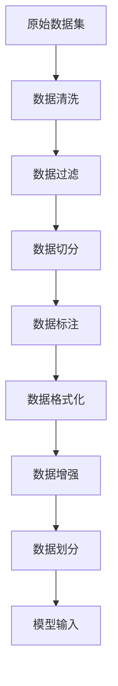

# 从零开始大模型开发与微调：数据集的获取与处理

## 1.背景介绍

### 1.1 大模型的兴起

近年来,大型神经网络模型在自然语言处理、计算机视觉等领域取得了突破性的进展,展现出了令人惊叹的能力。这些大模型通过在海量数据上进行预训练,学习到了丰富的知识表示,能够完成诸如问答、文本生成、图像分类等复杂任务。

代表性的大模型有 GPT-3、BERT、DALL-E 等,它们在特定领域展现出了超越人类的能力。这些模型的出现,标志着人工智能进入了一个新的阶段,将深刻影响未来科技的发展方向。

### 1.2 数据集在大模型中的重要性

然而,要训练出优秀的大模型并非易事。除了需要强大的算力和合理的网络结构之外,高质量的数据集是大模型取得卓越表现的关键因素之一。

数据集决定了模型能够学习到的知识范围和表征能力。优质的数据集应当具备以下特点:

- 数据量大、覆盖面广
- 数据清洁、无噪声
- 标注准确、无偏差
- 分布合理、多样性强

获取并处理满足上述条件的大规模数据集,是大模型开发的重中之重,也是本文的重点内容。

## 2.核心概念与联系  

### 2.1 数据集的类型

根据数据的来源和标注方式,数据集可分为以下几类:

1. **自然数据集**
    - 包括网页数据、书籍、新闻等互联网公开数据
    - 无需人工标注,数据量大但存在噪声
    
2. **人工标注数据集**
    - 由专业人员进行标注
    - 数据质量高但标注成本昂贵

3. **半监督数据集**
    - 结合自然数据和少量人工标注数据
    - 兼具数据量大和质量较高的优点

4. **多语言数据集**
    - 包含多种语言的数据
    - 有助于构建多语言大模型

5. **多模态数据集**
    - 包含文本、图像、视频等多种模态数据
    - 支持训练统一的多模态大模型

### 2.2 数据集处理流程

无论数据集的类型如何,在用于训练大模型之前,都需要进行一系列的处理,主要包括:



1. **数据清洗**: 去除原始数据中的无效数据、重复数据等
2. **数据过滤**: 根据任务需求,过滤掉无关的数据
3. **数据切分**: 将数据切分为合理的单元,如句子、段落等
4. **数据标注**: 对数据进行人工或自动标注,如词性、实体等
5. **数据格式化**: 将数据转换为模型可接受的格式
6. **数据增强**: 通过变换、插入等方式扩充数据量
7. **数据划分**: 将数据划分为训练集、验证集和测试集
8. **模型输入**: 将处理后的数据输入模型进行训练

上述流程中,每一步都对最终模型的性能有重要影响。合理的数据处理策略,可以充分挖掘数据的价值,提高模型的泛化能力。

## 3.核心算法原理具体操作步骤

在对数据集进行处理时,往往需要采用一些核心算法,以提高处理效率和质量。本节将介绍几种常用的核心算法及其具体操作步骤。

### 3.1 数据清洗算法

数据清洗旨在去除原始数据中的无效数据和重复数据,提高数据质量。常用的数据清洗算法包括:

1. **基于规则的清洗**
    - 根据预定义的规则过滤数据,如长度阈值、特殊字符等
    - 操作步骤:
        1) 定义清洗规则集合
        2) 遍历数据,对每条数据应用规则集合
        3) 保留满足规则的数据,丢弃不满足的数据

2. **基于统计的清洗**
    - 利用数据的统计特征进行异常值检测
    - 操作步骤:
        1) 计算数据的统计量,如均值、方差等
        2) 设置异常阈值
        3) 将超出阈值的数据视为异常值并移除

3. **基于聚类的清洗**
    - 对数据进行聚类,将离群值视为异常值并移除
    - 操作步骤:
        1) 选择合适的聚类算法,如K-Means
        2) 对数据进行聚类
        3) 移除离群点,保留聚类中心附近的数据

### 3.2 数据标注算法

对数据进行标注是提高数据质量的重要手段。常用的数据标注算法有:

1. **基于规则的标注**
    - 根据预定义的规则对数据进行标注
    - 操作步骤:
        1) 定义标注规则集合
        2) 遍历数据,对每条数据应用规则集合
        3) 根据匹配的规则对数据进行标注

2. **基于模型的标注**
    - 训练机器学习模型对数据进行自动标注
    - 操作步骤: 
        1) 准备少量的人工标注数据集
        2) 在标注数据集上训练模型
        3) 使用训练好的模型对未标注数据进行标注

3. **主动学习标注**
    - 交互式标注,模型根据不确定性主动请求人工标注
    - 操作步骤:
        1) 训练初始模型
        2) 模型对未标注数据进行标注,并计算不确定性
        3) 选取不确定性最高的数据,请求人工标注
        4) 将新标注数据加入训练集,重新训练模型
        5) 重复步骤2-4,直至满足条件

### 3.3 数据增强算法

由于获取大规模数据集的成本高昂,通常需要对现有数据进行增强,以扩充数据量。常用的数据增强算法有:

1. **基于规则的增强**
    - 根据预定义的规则对数据进行变换
    - 操作步骤:
        1) 定义变换规则集合,如随机插入、随机删除等
        2) 遍历数据集,对每条数据应用规则集合
        3) 将变换后的数据加入数据集

2. **基于模型的增强**
    - 训练生成模型对数据进行变换
    - 操作步骤:
        1) 在现有数据集上训练生成模型
        2) 使用训练好的模型生成新的数据
        3) 将生成的数据加入数据集

3. **对抗增强**
    - 针对模型的弱点,生成对抗样本
    - 操作步骤:  
        1) 训练初始模型
        2) 根据模型的预测结果和损失函数,生成对抗样本
        3) 将对抗样本加入训练集,重新训练模型
        4) 重复步骤2-3,直至满足条件

通过上述算法,可以有效扩充数据集的规模,提高模型的泛化能力。

## 4.数学模型和公式详细讲解举例说明

在数据处理过程中,往往需要借助一些数学模型和公式。本节将详细介绍其中的几种核心模型。

### 4.1 异常值检测

异常值检测是数据清洗的重要环节,用于识别数据集中的离群点和异常值。常用的异常检测模型包括:

1. **基于统计的模型**

$$
\begin{aligned}
\mu &= \frac{1}{n}\sum_{i=1}^{n}x_i\\
\sigma^2 &= \frac{1}{n}\sum_{i=1}^{n}(x_i-\mu)^2\\
z_i &= \frac{x_i-\mu}{\sigma}
\end{aligned}
$$

其中$\mu$为数据均值,$\sigma$为标准差。如果$|z_i|>k$($k$为阈值,通常取3),则将$x_i$视为异常值。

2. **基于密度的模型**

$$
f(x) = \frac{1}{(2\pi)^{d/2}|\Sigma|^{1/2}}e^{-\frac{1}{2}(x-\mu)^T\Sigma^{-1}(x-\mu)}
$$

$f(x)$为多元高斯分布的概率密度函数。如果$f(x)<\epsilon$($\epsilon$为阈值),则将$x$视为异常值。

3. **基于距离的模型**

$$
d(x) = \min_{x_i\in D}\|x-x_i\|
$$

$d(x)$为$x$与数据集$D$中所有点的最小距离。如果$d(x)>\delta$($\delta$为阈值),则将$x$视为异常值。

通过上述模型,可以有效地从数据集中识别并移除异常值,从而提高数据质量。

### 4.2 数据增强

数据增强的目标是通过对现有数据进行变换,生成新的数据,从而扩充数据集的规模。常用的数据增强模型包括:

1. **基于规则的增强**

$$
x' = T(x)
$$

其中$T$为预定义的变换规则,如随机插入、随机删除等。$x$为原始数据,$x'$为变换后的新数据。

2. **基于生成模型的增强**

$$
p(x'|x) = \prod_{t=1}^{T}p(x'_t|x'_{<t},x)
$$

$p(x'|x)$为生成新数据$x'$的条件概率,通过最大化该概率训练生成模型。$x'_{<t}$为已生成的部分序列。

3. **对抗增强**

$$
\begin{aligned}
x^{adv} &= \arg\max_{x'\in\mathcal{N}(x)}J(x',\theta)\\
J(x',\theta) &= \mathcal{L}(f(x';\theta),y) + c\|x'-x\|_p
\end{aligned}
$$

其中$\mathcal{N}(x)$为$x$的邻域,$J$为损失函数,包括模型预测损失$\mathcal{L}$和对抗扰动约束项。$x^{adv}$为生成的对抗样本。

通过上述模型,可以生成多样化的新数据,有效扩充数据集的规模和覆盖面。

## 5.项目实践:代码实例和详细解释说明

为了更好地理解数据处理的流程,本节将提供一个实际项目的代码示例,并对关键步骤进行详细解释。

我们将基于开源的IMDB电影评论数据集,构建一个二分类情感分析模型。数据处理的代码如下:

```python
import pandas as pd
from sklearn.model_selection import train_test_split

# 加载数据集
data = pd.read_csv('imdb_reviews.txt', sep='\t')

# 数据清洗
import re
def clean_text(text):
    text = re.sub(r'[^a-zA-Z0-9\s]', '', text) # 去除特殊字符
    text = text.lower() # 转小写
    text = ' '.join(text.split()) # 去除多余空格
    return text

data['review'] = data['review'].apply(clean_text)

# 数据过滤
data = data[data['review'].str.len() > 10] # 过滤过短的评论

# 数据切分
from nltk.tokenize import sent_tokenize
data['sentences'] = data['review'].apply(sent_tokenize)

# 数据标注
from nltk.tokenize import word_tokenize
from nltk.tag import pos_tag

def get_pos(text):
    tokens = word_tokenize(text)
    pos_tags = pos_tag(tokens)
    return pos_tags

data['pos_tags'] = data['review'].apply(get_pos)

# 数据格式化
from tensorflow.keras.preprocessing.sequence import pad_sequences

MAX_LEN = 100
data['input_ids'] = [pad_sequences([token for token, _ in pos_tags], maxlen=MAX_LEN, padding='post', truncating='post')
                     for pos_tags in data['pos_tags']]

# 数据增强
import nlpaug.augmenter.word as naw

aug = naw.SynonymAug(aug_src='wordnet')
data['augmented'] = data['review'].apply(lambda x: aug.augment(x))

# 数据划分
X = data['input_ids']
y = data['sentiment']
X_train, X_val, y_train,