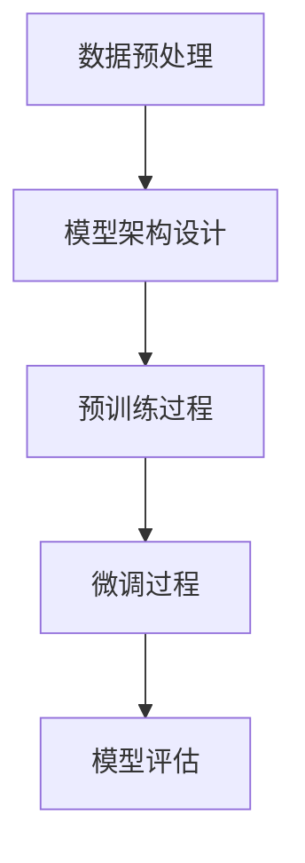

# 从零开始大模型开发与微调：预训练模型BERT

## 1.背景介绍

在自然语言处理（NLP）领域，预训练模型已经成为了不可或缺的工具。BERT（Bidirectional Encoder Representations from Transformers）作为其中的佼佼者，凭借其双向编码器和强大的上下文理解能力，迅速成为了学术界和工业界的宠儿。本文将带领读者从零开始，深入了解BERT的核心概念、算法原理、数学模型、项目实践以及实际应用场景。

## 2.核心概念与联系

### 2.1 预训练与微调

预训练是指在大规模无标签数据上训练模型，使其能够学习到通用的语言表示。微调则是在特定任务上对预训练模型进行进一步训练，以适应具体任务的需求。

### 2.2 BERT的双向性

BERT的核心优势在于其双向性，即在训练过程中同时考虑了句子的前后文信息。这与传统的单向语言模型（如GPT）形成了鲜明对比。

### 2.3 Transformer架构

BERT基于Transformer架构，利用自注意力机制（Self-Attention）来捕捉句子中的长距离依赖关系。Transformer的编码器部分是BERT的基础。

### 2.4 Masked Language Model (MLM)

BERT的预训练任务之一是Masked Language Model，即在输入句子中随机掩盖一些词，然后让模型预测这些被掩盖的词。

### 2.5 Next Sentence Prediction (NSP)

另一个预训练任务是Next Sentence Prediction，模型需要判断两个句子是否是连续的。这有助于模型理解句子之间的关系。

## 3.核心算法原理具体操作步骤

### 3.1 数据预处理

在进行预训练之前，需要对数据进行预处理，包括分词、掩盖部分词汇等。

### 3.2 模型架构设计

BERT的模型架构基于Transformer的编码器部分，包含多个自注意力层和前馈神经网络层。

### 3.3 预训练过程

预训练过程包括两个任务：Masked Language Model和Next Sentence Prediction。通过这两个任务，模型能够学习到丰富的语言表示。

### 3.4 微调过程

在特定任务上进行微调时，需要将预训练好的BERT模型加载进来，并在特定任务的数据集上进行进一步训练。

### 3.5 模型评估

通过准确率、F1分数等指标对模型进行评估，以确定其在特定任务上的表现。



## 4.数学模型和公式详细讲解举例说明

### 4.1 自注意力机制

自注意力机制是Transformer的核心，其计算公式如下：

$$
Attention(Q, K, V) = softmax\left(\frac{QK^T}{\sqrt{d_k}}\right)V
$$

其中，$Q$、$K$、$V$分别表示查询矩阵、键矩阵和值矩阵，$d_k$是键矩阵的维度。

### 4.2 Masked Language Model

在MLM任务中，损失函数为交叉熵损失：

$$
L_{MLM} = -\sum_{i=1}^{N} \log P(x_i | x_{masked})
$$

其中，$x_i$表示被掩盖的词，$x_{masked}$表示掩盖后的句子。

### 4.3 Next Sentence Prediction

在NSP任务中，损失函数同样为交叉熵损失：

$$
L_{NSP} = -\sum_{i=1}^{N} \left[y_i \log P(y_i | x_i) + (1 - y_i) \log (1 - P(y_i | x_i))\right]
$$

其中，$y_i$表示句子对是否连续的标签。

## 5.项目实践：代码实例和详细解释说明

### 5.1 环境配置

首先，确保安装了必要的库，如Transformers和PyTorch。

```bash
pip install transformers torch
```

### 5.2 数据预处理

使用Transformers库中的Tokenizer进行分词和掩盖处理。

```python
from transformers import BertTokenizer

tokenizer = BertTokenizer.from_pretrained('bert-base-uncased')
text = "Hello, how are you?"
inputs = tokenizer(text, return_tensors='pt', max_length=512, truncation=True, padding='max_length')
```

### 5.3 模型加载与预训练

加载预训练的BERT模型，并进行微调。

```python
from transformers import BertForSequenceClassification, Trainer, TrainingArguments

model = BertForSequenceClassification.from_pretrained('bert-base-uncased')
training_args = TrainingArguments(output_dir='./results', num_train_epochs=3, per_device_train_batch_size=8)
trainer = Trainer(model=model, args=training_args, train_dataset=train_dataset, eval_dataset=eval_dataset)
trainer.train()
```

### 5.4 模型评估

使用验证集对模型进行评估。

```python
results = trainer.evaluate()
print(results)
```

## 6.实际应用场景

### 6.1 文本分类

BERT在文本分类任务中表现出色，如情感分析、垃圾邮件检测等。

### 6.2 问答系统

BERT可以用于构建高效的问答系统，通过理解上下文来提供准确的答案。

### 6.3 机器翻译

虽然BERT不是专门为机器翻译设计的，但其强大的语言理解能力也可以在翻译任务中发挥作用。

### 6.4 信息检索

BERT可以用于信息检索系统，通过理解查询和文档的语义关系来提高检索效果。

## 7.工具和资源推荐

### 7.1 Transformers库

Hugging Face的Transformers库是使用BERT的最佳工具之一，提供了丰富的预训练模型和便捷的API。

### 7.2 PyTorch

PyTorch是一个强大的深度学习框架，适合进行BERT的训练和微调。

### 7.3 数据集

推荐使用GLUE、SQuAD等公开数据集进行模型训练和评估。

### 7.4 在线教程和文档

Hugging Face和PyTorch的官方文档提供了详细的使用指南和示例代码。

## 8.总结：未来发展趋势与挑战

### 8.1 发展趋势

BERT的成功引发了对更大、更强模型的探索，如GPT-3、T5等。未来，预训练模型将在更多领域发挥作用，如多模态学习、跨语言模型等。

### 8.2 挑战

尽管BERT表现出色，但其计算资源消耗巨大，训练时间长。此外，如何在特定任务上进一步提高模型的泛化能力也是一个重要挑战。

## 9.附录：常见问题与解答

### 9.1 BERT与GPT的区别是什么？

BERT是双向编码器，能够同时考虑句子的前后文信息；而GPT是单向生成器，只能从左到右生成文本。

### 9.2 如何选择预训练模型？

选择预训练模型时，应根据具体任务的需求和数据集的规模来决定。一般来说，BERT-base适合大多数任务，而BERT-large则适合更复杂的任务。

### 9.3 如何处理BERT的输入长度限制？

BERT的输入长度限制为512个词，对于超过该长度的文本，可以采用截断或分段处理的方法。

### 9.4 如何提高BERT的训练效率？

可以通过使用分布式训练、混合精度训练等方法来提高BERT的训练效率。

### 9.5 BERT在小数据集上的表现如何？

BERT在小数据集上可能表现不佳，因为其预训练过程需要大量数据。可以考虑使用数据增强技术或迁移学习来改善其表现。

---

作者：禅与计算机程序设计艺术 / Zen and the Art of Computer Programming