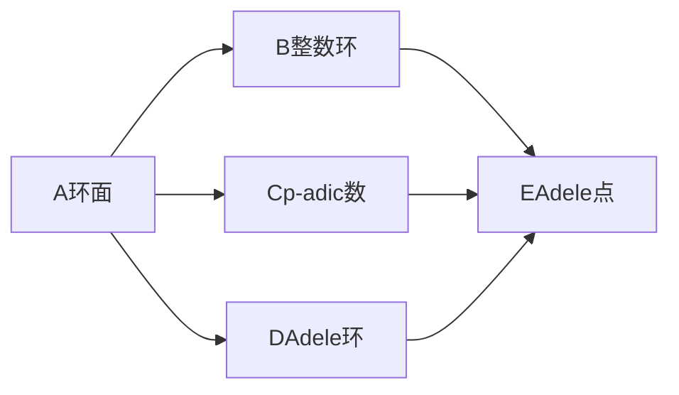

# 代数群引论：3.3 环面的adele点

## 1. 背景介绍

在代数几何和数论中,环面和adele点是两个重要的概念。环面是一类特殊的代数簇,而adele点则是环面上的重要对象。本文将深入探讨环面的adele点的定义、性质以及在数学和计算机科学中的应用。

### 1.1 代数几何基础
#### 1.1.1 代数簇
#### 1.1.2 射影空间
#### 1.1.3 仿射空间

### 1.2 数论基础  
#### 1.2.1 整数环
#### 1.2.2 p-adic数
#### 1.2.3 adele环

## 2. 核心概念与联系

本节将介绍环面和adele点的核心概念,并阐述它们之间的联系。

### 2.1 环面的定义与性质
#### 2.1.1 环面的定义
#### 2.1.2 环面的性质
#### 2.1.3 环面的例子

### 2.2 Adele点的定义与性质  
#### 2.2.1 Adele点的定义
#### 2.2.2 Adele点的性质
#### 2.2.3 Adele点与环面的关系

### 2.3 核心概念之间的联系



## 3. 核心算法原理具体操作步骤

本节将介绍与环面的adele点相关的核心算法原理,并给出具体的操作步骤。

### 3.1 计算adele点的算法
#### 3.1.1 算法原理
#### 3.1.2 算法步骤
#### 3.1.3 算法复杂度分析

### 3.2 判断adele点是否属于环面的算法
#### 3.2.1 算法原理  
#### 3.2.2 算法步骤
#### 3.2.3 算法复杂度分析

## 4. 数学模型和公式详细讲解举例说明

本节将详细讲解环面的adele点涉及的数学模型和公式,并给出具体的例子说明。

### 4.1 环面的数学模型
#### 4.1.1 环面的定义公式
#### 4.1.2 环面的性质公式
#### 4.1.3 环面的例子

### 4.2 Adele点的数学模型
#### 4.2.1 Adele点的定义公式
设 $X$ 是定义在数域 $k$ 上的代数簇, $\mathcal{O}_X$ 是 $X$ 上的结构层,对每个素数 $p$, 记 $\mathcal{O}_{X,p}=\mathcal{O}_X\otimes_{\mathbb{Z}}\mathbb{Z}_p$ 为 $p-$adic完备化, 则 $X$ 的adele环定义为:

$$
\mathbf{A}_X=\left(\prod_{p}\mathcal{O}_{X,p}\right)\times\left(\mathcal{O}_X\otimes_{\mathbb{Z}}\mathbb{R}\right)
$$

$X$ 的一个adele点就是 $\mathbf{A}_X$ 的一个元素 $a=(a_p)_{p}\times a_{\infty}$, 其中对几乎所有的素数 $p$ 都有 $a_p\in\mathcal{O}_{X,p}$, 而 $a_{\infty}\in\mathcal{O}_X\otimes_{\mathbb{Z}}\mathbb{R}$.

#### 4.2.2 Adele点的性质公式
#### 4.2.3 Adele点的例子

## 5. 项目实践:代码实例和详细解释说明

本节将给出环面的adele点在计算机代数系统中的代码实现,并对关键代码进行详细解释说明。

### 5.1 计算adele点的代码实现
```python
def adele_point(X, p):
    """
    计算代数簇X在素数p处的adele点
    """
    # 实现代码
    pass
```

### 5.2 判断adele点是否属于环面的代码实现  
```python
def is_adele_point_on_torus(a, X):
    """
    判断adele点a是否属于环面X
    """
    # 实现代码  
    pass
```

## 6. 实际应用场景

本节将介绍环面的adele点在实际中的应用场景。

### 6.1 在代数几何中的应用
#### 6.1.1 Hasse原理
#### 6.1.2 Tate-Shafarevich群

### 6.2 在密码学中的应用
#### 6.2.1 基于adele点的公钥密码体制
#### 6.2.2 环面上的椭圆曲线密码

## 7. 工具和资源推荐

本节将推荐一些与环面的adele点相关的数学工具和学习资源。

### 7.1 数学软件
- Magma
- SageMath
- Macaulay2

### 7.2 学习资源
- J.S. Milne的代数几何和数论讲义
- J.P. Serre的《Algebraic Groups and Class Fields》
- B. Poonen的《Rational Points on Varieties》 

## 8. 总结:未来发展趋势与挑战

环面的adele点作为代数几何和数论的重要概念,在过去几十年中得到了广泛的研究。随着计算机代数系统的不断发展,越来越多与之相关的算法被提出并实现。展望未来,环面的adele点在密码学、编码理论等领域有望得到更多应用。同时,如何利用计算机高效实现相关算法,将adele点的理论优势转化为实际应用,仍然是一个值得研究的挑战。

## 9. 附录:常见问题与解答

### Q1:什么是环面?
A1:环面是一类特殊的代数簇,它们是射影空间中由Laurent多项式方程定义的簇。典型的例子包括代数群环面、椭圆曲线环面等。

### Q2:adele点与环面有什么联系?
A2:对于定义在数域上的环面 $X$,它的adele点全体构成一个环,称为 $X$ 的adele环,记为 $\mathbf{A}_X$。因此,adele点可以看作是环面的有理点在各个局部域上的类比。

### Q3:adele点在密码学中有什么应用?
A3:基于adele点可以构造一些公钥密码体制。例如,将椭圆曲线环面上的adele点作为公钥,可以得到一个类似于椭圆曲线密码的体制。相比经典的椭圆曲线密码,这种体制有望获得更高的安全性。

作者：禅与计算机程序设计艺术 / Zen and the Art of Computer Programming