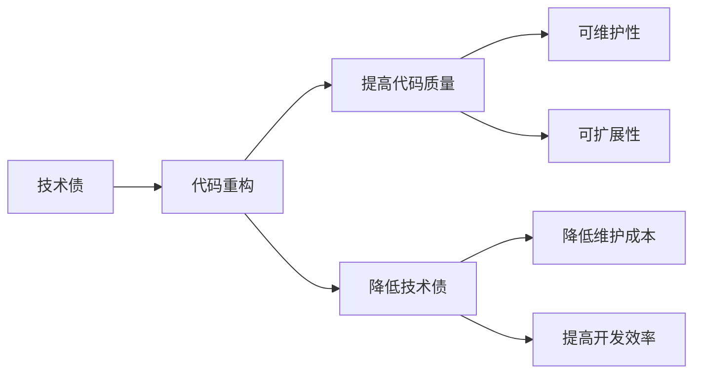

# 代码重构与技术债管理原理与代码实战案例讲解

## 1. 背景介绍
### 1.1 代码重构的定义与意义
#### 1.1.1 代码重构的定义
代码重构（Code Refactoring）是在不改变软件系统外部行为的前提下，对系统内部代码进行优化和重组的过程。它旨在改善代码的可读性、可维护性和可扩展性，同时保持原有功能不变。
#### 1.1.2 代码重构的意义
随着软件系统的不断迭代和演进，代码的复杂度会逐渐增加，导致系统难以维护和扩展。通过代码重构，我们可以消除代码中的坏味道（Bad Smell），提高代码质量，降低系统的维护成本，并为未来的功能扩展奠定良好的基础。
### 1.2 技术债的概念与危害
#### 1.2.1 技术债的概念
技术债（Technical Debt）是指在软件开发过程中，为了快速交付而做出的妥协和折衷所累积的债务。它可能表现为代码质量差、文档缺失、测试不足等问题，这些问题会随着时间的推移而不断累积，最终影响系统的可维护性和可扩展性。
#### 1.2.2 技术债的危害
技术债会导致系统变得脆弱和难以维护，增加了未来修改和扩展的难度和成本。如果不及时处理技术债，它会成为系统发展的障碍，甚至导致系统无法继续演进。因此，有效管理和控制技术债是软件开发过程中的重要任务。

## 2. 核心概念与联系
### 2.1 代码重构的原则
#### 2.1.1 单一职责原则（SRP）
一个类或模块应该只负责一个功能，并且该功能应该由这个类或模块完全封装起来。
#### 2.1.2 开放-封闭原则（OCP） 
软件实体（类、模块、函数等）应该对扩展开放，对修改关闭。
#### 2.1.3 里氏替换原则（LSP）
子类应该可以替换其基类，而不影响程序的正确性。
#### 2.1.4 接口隔离原则（ISP）
客户端不应该依赖它不需要的接口，一个类对另一个类的依赖应该建立在最小的接口上。
#### 2.1.5 依赖倒置原则（DIP）
高层模块不应该依赖低层模块，两者都应该依赖其抽象；抽象不应该依赖细节，细节应该依赖抽象。
### 2.2 技术债的分类
#### 2.2.1 设计债务
由于设计不当或设计缺陷导致的技术债，如系统架构混乱、模块耦合度高等。
#### 2.2.2 编码债务  
由于编码不规范或编码质量低下导致的技术债，如代码重复、命名不规范、注释缺失等。
#### 2.2.3 测试债务
由于测试不充分或测试覆盖率低导致的技术债，如单元测试缺失、集成测试不足等。
#### 2.2.4 文档债务
由于文档缺失或文档更新不及时导致的技术债，如需求文档缺失、设计文档过时等。
### 2.3 代码重构与技术债之间的关系



代码重构是管理和控制技术债的重要手段。通过对代码进行重构，我们可以提高代码质量，消除代码中的坏味道，从而降低技术债的累积。同时，代码重构也有助于提高系统的可维护性和可扩展性，降低未来的维护成本，提高开发效率。

## 3. 核心算法原理具体操作步骤
### 3.1 代码重构的步骤
#### 3.1.1 识别代码中的坏味道
通过代码审查和静态代码分析工具，识别代码中存在的坏味道，如重复代码、过长的方法、过大的类等。
#### 3.1.2 确定重构的目标
根据识别出的坏味道，确定重构的目标，如提取重复代码为独立的方法、拆分过长的方法、拆分过大的类等。
#### 3.1.3 编写测试用例
在进行重构之前，先编写测试用例来验证当前代码的正确性。这样可以在重构过程中及时发现引入的错误，确保重构后的代码仍然正确。
#### 3.1.4 小步重构
将重构过程分解为一系列小的、可控的步骤，每次只进行一个小的改动，并运行测试用例确保改动的正确性。
#### 3.1.5 持续集成和重构
将重构过程与持续集成实践相结合，在每次提交代码时自动运行测试用例，确保重构过程中的改动不会引入新的错误。
### 3.2 技术债管理的步骤
#### 3.2.1 识别技术债
通过代码审查、架构评估、团队讨论等方式，识别系统中存在的技术债，并评估其影响和优先级。
#### 3.2.2 制定偿还计划
根据技术债的优先级和团队的资源情况，制定技术债的偿还计划，确定每个技术债的处理时间和方式。
#### 3.2.3 分配资源
为技术债的偿还分配必要的资源，包括人力、时间和预算，确保技术债能够得到及时和有效的处理。
#### 3.2.4 执行偿还
按照制定的偿还计划，逐步处理技术债，可以通过重构、文档完善、测试补充等方式来偿还技术债。
#### 3.2.5 监控和评估
持续监控技术债的状态，评估偿还计划的执行情况和效果，并根据实际情况对计划进行调整和优化。

## 4. 数学模型和公式详细讲解举例说明
### 4.1 技术债的计算模型
技术债可以用下面的公式来计算：

$TechnicalDebt = (PrincipalDebt + InterestAmount) \times InterestRate^{Time}$

其中：
- $PrincipalDebt$：技术债的本金，即最初引入技术债时的成本。
- $InterestAmount$：技术债的利息，即技术债存在期间所产生的额外成本，如维护成本、机会成本等。
- $InterestRate$：技术债的利率，即技术债随时间增长的速度。
- $Time$：技术债存在的时间。

举例说明：假设一个项目在开发过程中引入了一个技术债，本金为10000元，每个月的利息为500元，利率为5%，经过6个月后，该技术债的总额计算如下：

$$
TechnicalDebt = (10000 + 500 \times 6) \times (1 + 0.05)^6 \\
= 13000 \times 1.34 \\
= 17420 (元)
$$

可以看出，随着时间的推移，技术债会快速累积，对项目造成严重的影响。

### 4.2 代码质量评估模型
代码质量可以用下面的公式来评估：

$CodeQuality = \frac{Functionality + Reliability + Usability + Efficiency + Maintainability + Portability}{6}$

其中：
- $Functionality$：代码的功能性，即代码是否满足用户需求和业务目标。
- $Reliability$：代码的可靠性，即代码在不同条件下的稳定性和正确性。
- $Usability$：代码的可用性，即代码是否易于理解、使用和维护。
- $Efficiency$：代码的效率，即代码的性能和资源利用情况。
- $Maintainability$：代码的可维护性，即代码是否容易修改、扩展和重构。
- $Portability$：代码的可移植性，即代码在不同环境下的适应性和兼容性。

每个指标的取值范围为[0, 1]，分数越高表示代码质量越好。

举例说明：假设一个项目的代码质量评估结果如下：
- Functionality: 0.8
- Reliability: 0.9
- Usability: 0.7
- Efficiency: 0.8
- Maintainability: 0.6
- Portability: 0.7

则该项目的代码质量得分为：

$$
CodeQuality = \frac{0.8 + 0.9 + 0.7 + 0.8 + 0.6 + 0.7}{6} \\
= \frac{4.5}{6} \\
= 0.75
$$

该项目的代码质量得分为0.75，表明代码质量较好，但仍有提升的空间，特别是在可维护性方面。

## 5. 项目实践：代码实例和详细解释说明
### 5.1 重构前的代码实例
下面是一个重构前的Java代码实例，存在多个坏味道：

```java
public class Order {
    private List<Item> items;
    private String customerName;
    private String customerAddress;
    private Date orderDate;
    private double totalAmount;
    
    public Order(List<Item> items, String customerName, String customerAddress, Date orderDate) {
        this.items = items;
        this.customerName = customerName;
        this.customerAddress = customerAddress;
        this.orderDate = orderDate;
        calculateTotalAmount();
    }
    
    public void calculateTotalAmount() {
        double amount = 0;
        for (Item item : items) {
            amount += item.getPrice() * item.getQuantity();
        }
        totalAmount = amount;
    }
    
    public void printOrder() {
        System.out.println("Customer: " + customerName);
        System.out.println("Address: " + customerAddress);
        System.out.println("Order Date: " + orderDate);
        System.out.println("Items:");
        for (Item item : items) {
            System.out.println(item.getName() + " - " + item.getQuantity() + " x $" + item.getPrice());
        }
        System.out.println("Total Amount: $" + totalAmount);
    }
    
    // Getters and Setters
}
```

该代码存在以下坏味道：
1. Order类的职责过多，同时负责订单的创建、金额计算和打印，违反了单一职责原则。
2. calculateTotalAmount方法和printOrder方法都在直接操作Order类的内部数据，违反了封装原则。
3. printOrder方法的代码较长，包含了多个不同的功能，可读性较差。

### 5.2 重构后的代码实例
下面是重构后的代码实例：

```java
public class Order {
    private List<Item> items;
    private Customer customer;
    private Date orderDate;
    
    public Order(List<Item> items, Customer customer, Date orderDate) {
        this.items = items;
        this.customer = customer;
        this.orderDate = orderDate;
    }
    
    public double calculateTotalAmount() {
        return items.stream().mapToDouble(item -> item.getPrice() * item.getQuantity()).sum();
    }
    
    // Getters and Setters
}

public class Customer {
    private String name;
    private String address;
    
    public Customer(String name, String address) {
        this.name = name;
        this.address = address;
    }
    
    // Getters and Setters
}

public class OrderPrinter {
    public void printOrder(Order order) {
        Customer customer = order.getCustomer();
        System.out.println("Customer: " + customer.getName());
        System.out.println("Address: " + customer.getAddress());
        System.out.println("Order Date: " + order.getOrderDate());
        System.out.println("Items:");
        order.getItems().forEach(item -> {
            System.out.println(item.getName() + " - " + item.getQuantity() + " x $" + item.getPrice());
        });
        System.out.println("Total Amount: $" + order.calculateTotalAmount());
    }
}
```

重构后的代码进行了以下改进：
1. 将Customer信息提取到单独的Customer类中，Order类只负责订单相关的功能，符合单一职责原则。
2. 使用Getter方法来访问Order类的内部数据，而不是直接操作，提高了封装性。
3. 将打印订单的功能提取到单独的OrderPrinter类中，使Order类的职责更加单一。
4. 使用Java 8的Stream API和Lambda表达式来简化calculateTotalAmount方法和printOrder方法的实现，提高了代码的可读性。

通过重构，代码的结构更加清晰，职责更加单一，可维护性和可扩展性都得到了提高。

## 6. 实际应用场景
### 6.1 遗留系统的重构
在实际开发中，经常会遇到一些遗留系统，这些系统往往存在大量的技术债和坏味道，导致维护和扩展困难。对遗留系统进行重构，可以逐步消除技术债，提高系统的可维