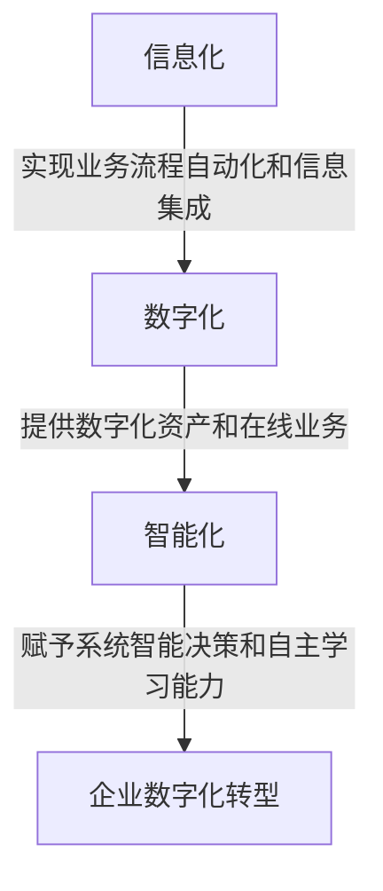

# 公司中长期信息化数字化智能化规划方案

## 1. 背景介绍

在当今数字化时代,信息技术的快速发展正在重塑商业运营模式和竞争格局。企业面临着前所未有的机遇和挑战,需要制定全面的信息化、数字化和智能化战略,以保持竞争优势、提高运营效率、优化客户体验并推动创新。本文将探讨公司中长期信息化、数字化和智能化规划的重要性,并提供一个全面的方案框架。

### 1.1 数字化转型的驱动力

- **技术进步**:云计算、大数据、人工智能、物联网等新兴技术为企业数字化转型提供了强大的技术支持。
- **客户需求变化**:客户期望更加个性化、便捷和智能化的产品和服务体验。
- **商业模式创新**:数字化有助于企业探索新的商业模式,实现产品和服务创新。
- **提高运营效率**:数字化有助于优化内部流程,提高决策效率和响应速度。

### 1.2 信息化、数字化和智能化的区别

- **信息化**:利用信息技术实现业务流程自动化和信息集成,提高信息传递和共享效率。
- **数字化**:将传统的物理资产和业务流程转换为数字形式,实现数据化和在线化。
- **智能化**:利用人工智能、大数据分析等技术,赋予系统智能决策和自主学习能力。

### 1.3 规划目标

- 制定全面的信息化、数字化和智能化战略,实现企业数字化转型。
- 优化业务流程,提高运营效率和决策质量。
- 改善客户体验,增强客户粘性和忠诚度。
- 推动产品和服务创新,开拓新的商业模式。
- 培养数字化人才,建立数字化文化。

## 2. 核心概念与联系

### 2.1 信息化

信息化是利用信息技术实现业务流程自动化和信息集成的过程。它包括以下核心概念:

1. **业务流程自动化(BPA)**:通过信息系统自动执行业务流程,提高效率和一致性。
2. **企业资源计划(ERP)**:集成管理企业内部各个职能部门的信息系统。
3. **客户关系管理(CRM)**:管理公司与客户之间的互动,优化销售和服务流程。
4. **供应链管理(SCM)**:优化供应链中的物流、信息流和资金流。
5. **数据仓库和商业智能(BI)**:集中存储和分析企业数据,支持决策制定。

### 2.2 数字化

数字化是将传统的物理资产和业务流程转换为数字形式的过程,包括以下核心概念:

1. **数字化资产**:将实体资产(如产品、文档等)转换为数字形式。
2. **在线业务流程**:通过网络和移动应用程序实现业务流程的在线化。
3. **电子商务**:利用互联网进行产品销售、营销和客户服务。
4. **数字营销**:利用数字媒体和技术进行营销活动。
5. **物联网(IoT)**:将物理设备连接到互联网,实现远程监控和控制。

### 2.3 智能化

智能化是利用人工智能、大数据分析等技术,赋予系统智能决策和自主学习能力的过程,包括以下核心概念:

1. **机器学习**:使计算机系统能够从数据中自动学习和改进。
2. **深度学习**:基于人工神经网络的一种机器学习技术。
3. **自然语言处理(NLP)**:让计算机系统理解和生成人类语言。
4. **计算机视觉**:让计算机系统识别和理解数字图像和视频。
5. **预测分析**:利用历史数据和统计模型预测未来趋势和结果。
6. **决策支持系统**:利用人工智能和大数据分析技术辅助决策。

这三个概念相互关联且层层递进。信息化为数字化奠定基础,数字化为智能化提供数据支持,而智能化则赋予系统更高级的智能功能。它们共同构成了企业数字化转型的全景图。



## 3. 核心算法原理具体操作步骤

在规划公司的信息化、数字化和智能化转型时,需要遵循一定的原理和步骤。以下是核心算法原理和具体操作步骤:

### 3.1 数字化成熟度评估

评估公司当前的数字化成熟度,包括以下步骤:

1. 确定评估维度,如战略规划、组织结构、技术基础设施、数据管理等。
2. 设计成熟度模型,将每个维度划分为多个级别。
3. 收集相关数据,如文档、访谈、现场观察等。
4. 对每个维度进行评分,得出当前的数字化成熟度水平。
5. 分析差距,确定需要改进的领域。

### 3.2 战略制定

基于数字化成熟度评估结果,制定公司的数字化转型战略,包括以下步骤:

1. 确定数字化转型的目标和愿景。
2. 分析内外部环境,识别机遇和挑战。
3. 制定战略重点领域,如客户体验、运营优化、产品创新等。
4. 规划实施路线图,包括阶段目标、关键里程碑和资源需求。
5. 建立绩效评估体系,持续监控和调整战略执行情况。

### 3.3 技术架构设计

设计支持数字化转型的技术架构,包括以下步骤:

1. 确定技术需求,如云计算、大数据、人工智能等。
2. 评估现有技术基础设施,识别差距和瓶颈。
3. 设计目标技术架构,包括基础设施、数据平台、应用系统等。
4. 制定技术路线图,分阶段实施。
5. 建立技术治理机制,确保架构一致性和标准化。

### 3.4 数据战略规划

制定数据战略,充分利用数据资产推动数字化转型,包括以下步骤:

1. 确定数据需求,如客户数据、运营数据、产品数据等。
2. 建立数据治理机制,包括数据标准、质量控制、安全合规等。
3. 设计数据架构,包括数据湖、数据仓库、数据集市等。
4. 规划数据集成和共享机制,实现数据流通。
5. 制定数据分析和应用策略,挖掘数据价值。

### 3.5 组织变革管理

管理组织变革,培养数字化文化和人才,包括以下步骤:

1. 评估组织现状,识别变革障碍和挑战。
2. 制定变革管理计划,包括沟通策略、培训计划等。
3. 建立数字化治理架构,明确角色和责任。
4. 优化组织结构和流程,支持数字化运营。
5. 培养数字化人才,加强技能培训和人才引进。

通过遵循这些核心算法原理和具体操作步骤,公司可以系统地规划和实施信息化、数字化和智能化转型,提高竞争力和可持续发展能力。

## 4. 数学模型和公式详细讲解举例说明

在规划和实施公司的信息化、数字化和智能化转型过程中,需要应用多种数学模型和公式,以量化和优化决策。以下是一些常见的数学模型和公式,并附有详细讲解和举例说明。

### 4.1 数字化成熟度评估模型

数字化成熟度评估模型用于评估公司当前的数字化水平,通常采用多维度、多级别的评分体系。一种常见的模型是CMMI(Capability Maturity Model Integration,能力成熟度模型集成)模型,它将成熟度划分为5个级别:

1. 初始级(Initial)
2. 可管理级(Managed)
3. 已定义级(Defined)
4. 量化管理级(Quantitatively Managed)
5. 优化级(Optimizing)

每个级别对应一定的能力要求,公司需要根据实际情况进行评分。评分结果可以用雷达图进行可视化展示,如下所示:

$$
\text{成熟度得分} = \sum_{i=1}^{n} w_i \times s_i
$$

其中,$n$表示评估维度的数量,$w_i$表示第$i$个维度的权重,$s_i$表示第$i$个维度的得分。

### 4.2 技术架构优化模型

在设计目标技术架构时,需要考虑多种因素,如成本、性能、可扩展性等。可以使用多目标优化模型来寻找最优解,例如加权求和法:

$$
\begin{aligned}
\min\quad& f(x) = \sum_{i=1}^{m} w_i f_i(x) \\
\text{s.t.}\quad& g_j(x) \leq 0, \quad j = 1, 2, \ldots, p \\
& h_k(x) = 0, \quad k = 1, 2, \ldots, q
\end{aligned}
$$

其中,$m$表示目标函数的数量,$w_i$表示第$i$个目标函数的权重,$f_i(x)$表示第$i$个目标函数,$p$表示不等式约束的数量,$g_j(x)$表示第$j$个不等式约束,$q$表示等式约束的数量,$h_k(x)$表示第$k$个等式约束。

通过调整权重系数,可以根据公司的实际需求得到满意的技术架构方案。

### 4.3 数据质量评估模型

数据质量对于数字化转型至关重要。可以使用多维度的数据质量评估模型,如完整性、准确性、一致性、及时性等。一种常见的模型是DQAF(Data Quality Assessment Framework,数据质量评估框架),它将数据质量划分为以下几个维度:

- 完整性(Completeness)
- 唯一性(Uniqueness)
- 及时性(Timeliness)
- 有效性(Validity)
- 一致性(Consistency)
- 准确性(Accuracy)

对于每个维度,可以设计具体的评估指标和评分标准。例如,完整性可以用缺失值比例来衡量:

$$
\text{完整性得分} = 1 - \frac{\text{缺失值数量}}{\text{总记录数}}
$$

通过综合各个维度的得分,可以得到数据集的整体数据质量评分。

### 4.4 预测模型

在智能化阶段,预测模型可以帮助公司预测未来趋势和结果,从而做出更好的决策。常见的预测模型包括回归模型、时间序列模型、神经网络模型等。

以线性回归模型为例,它试图找到一个最佳拟合直线,使观测值与预测值之间的残差平方和最小:

$$
\begin{aligned}
\min\quad& \sum_{i=1}^{n} (y_i - (b_0 + b_1x_i))^2 \\
\end{aligned}
$$

其中,$n$表示观测值的数量,$y_i$表示第$i$个观测值,$x_i$表示第$i$个自变量值,$b_0$和$b_1$分别表示回归直线的截距和斜率。

通过训练数据拟合模型参数,就可以对新的输入数据进行预测。预测模型的准确性通常用均方根误差(RMSE)或决定系数($R^2$)等指标来衡量。

这些数学模型和公式为公司的信息化、数字化和智能化规划提供了量化和优化的支持,有助于做出更加科学和精准的决策。

## 5. 项目实践:代码实例和详细解释说明

为了更好地理解和实践公司的信息化、数字化和智能化规划,本节将提供一些代码实例和详细解释说明。

### 5.1 数字化成熟度评估

以Python为例,我们可以使用Pandas和Matplotlib库来实现数字化成熟度评估模型。

```python
import pandas as pd
import matplotlib.pyplot as plt

# 定义评估维度和权重
dimensions = ['战略规划', '组织结构', '技术基础设施', '数据管