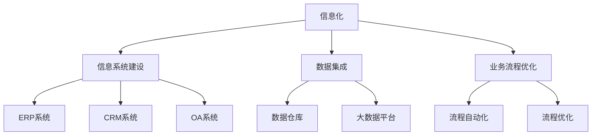
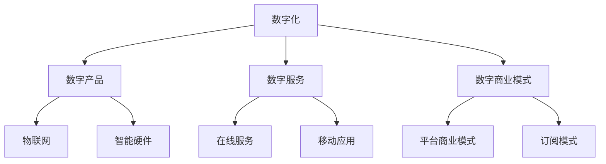
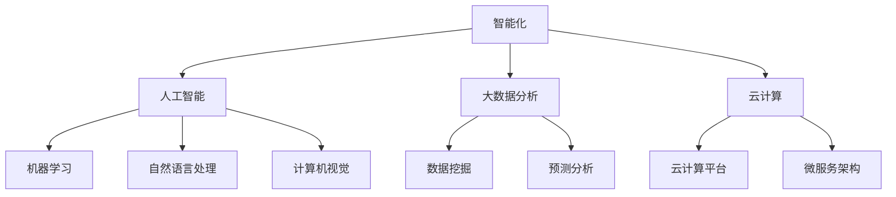
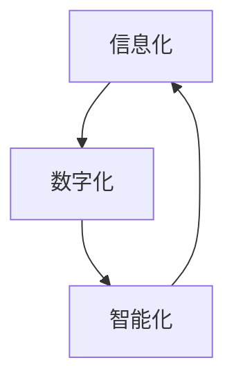
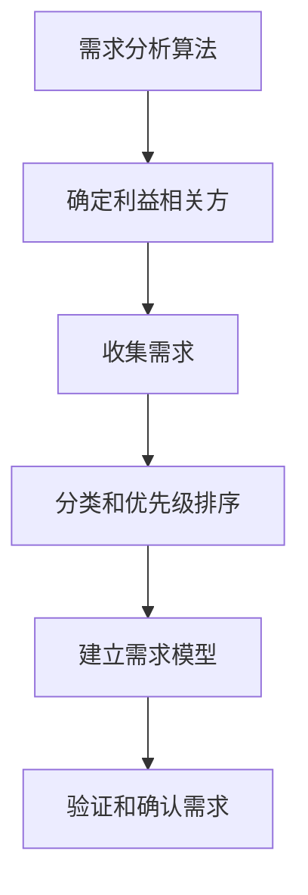
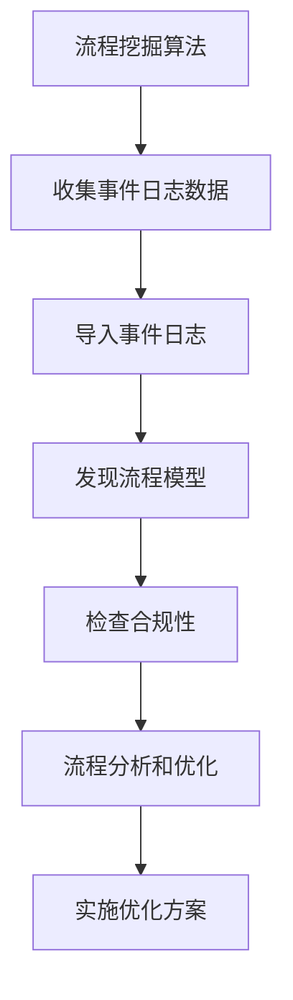
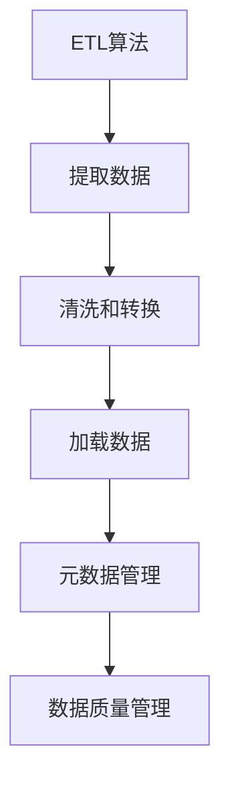
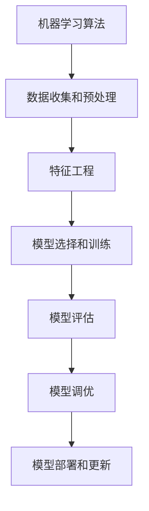
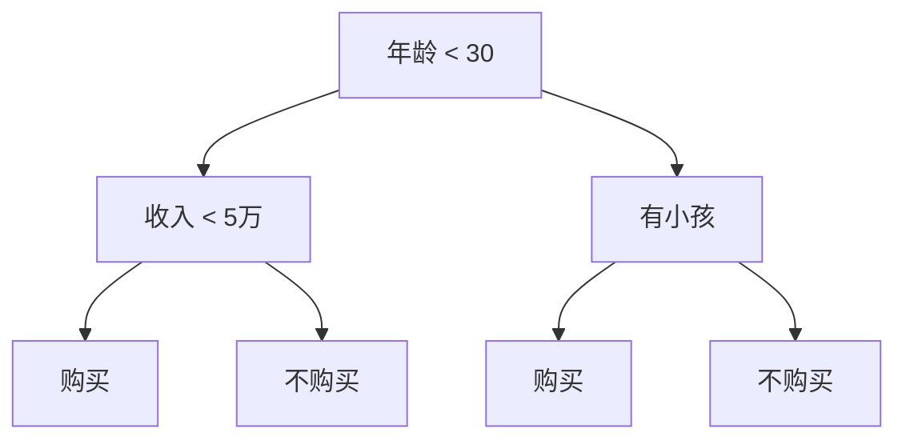

# 公司中长期信息化数字化智能化规划方案

## 1. 背景介绍

在当今快速发展的数字时代，信息技术已经成为推动企业创新和发展的关键驱动力。企业必须紧跟技术发展趋势，制定明智的信息化、数字化和智能化战略，以保持竞争优势。本文旨在为企业提供一个全面的中长期规划方案，帮助企业顺利实现数字化转型。

### 1.1 数字化转型的重要性

数字化转型不仅涉及技术层面的变革，更需要企业在商业模式、组织结构和文化等方面进行深层次的变革。成功的数字化转型有助于企业提高运营效率、优化客户体验、开发新的收入来源，并增强企业的灵活性和创新能力。

### 1.2 当前挑战

虽然数字化转型带来了巨大的机遇，但企业在实施过程中也面临着诸多挑战:

- 技术复杂性和快速迭代
- 数据管理和安全性
- 组织变革和人才培养
- 预算和资源限制

### 1.3 规划方案的重要性

为了应对这些挑战并充分利用数字化带来的机遇，企业需要制定一个全面的中长期规划方案。该方案应该明确数字化转型的目标、优先领域、实施路线图和资源分配计划。同时，还需要考虑企业的具体情况和行业特点,制定量身定制的解决方案。

## 2. 核心概念与联系

### 2.1 信息化

信息化是指利用现代信息技术来改造和优化企业的各项业务流程和管理活动,提高企业的运营效率和决策能力。信息化涵盖了企业内部的信息系统建设、数据集成和业务流程优化等方面。

### 2.2 数字化

数字化是指将传统的物理产品、服务和业务模式转变为数字形式,利用数字技术来创造新的价值。数字化不仅涉及技术层面,更需要企业在商业模式、运营模式和组织文化等方面进行变革。

### 2.3 智能化

智能化是指利用人工智能、大数据、云计算等新兴技术,赋予企业系统智能化功能,实现自动化决策和优化。智能化可以提高企业的运营效率、降低成本,并为企业带来新的竞争优势。

### 2.4 核心概念的联系

信息化、数字化和智能化是相互关联、相互促进的概念。信息化为数字化和智能化奠定了基础,提供了必要的数据和系统支持。数字化则为智能化提供了新的应用场景和商业模式。而智能化又可以反过来优化和升级信息系统,形成一个正向循环。

只有将这三个概念有机结合,企业才能真正实现全面的数字化转型,获得持续的竞争优势。

## 3. 核心算法原理具体操作步骤

在实施信息化、数字化和智能化规划时,需要遵循一定的原理和步骤,以确保规划的有效性和可执行性。下面将介绍一些核心算法原理和具体操作步骤。

### 3.1 需求分析算法

需求分析是规划的基础,它可以帮助企业明确转型目标和优先领域。需求分析算法通常包括以下步骤:

1. 确定利益相关方
2. 收集需求
3. 对需求进行分类和优先级排序
4. 建立需求模型
5. 验证和确认需求

### 3.2 业务流程优化算法

优化业务流程是信息化和数字化的关键环节。常用的业务流程优化算法包括:

1. 价值流程映射 (Value Stream Mapping, VSM)
2. 精益六西格玛 (Lean Six Sigma)
3. 业务流程建模 (Business Process Modeling)
4. 流程挖掘 (Process Mining)

以流程挖掘为例,其具体步骤如下:

1. 收集事件日志数据
2. 导入事件日志
3. 发现流程模型
4. 检查模型的合规性
5. 进行流程分析和优化
6. 实施优化方案

### 3.3 数据集成算法

数据集成是实现信息共享和决策支持的基础。常用的数据集成算法包括:

1. ETL (Extract, Transform, Load)
2. ELT (Extract, Load, Transform)
3. 数据虚拟化
4. 数据湖

以 ETL 为例,其具体步骤如下:

1. 从各种数据源提取数据
2. 清洗和转换数据
3. 加载数据到数据仓库或数据集市
4. 建立元数据管理
5. 执行数据质量管理

### 3.4 智能算法

智能算法是实现智能化的核心,常用的算法包括:

1. 机器学习算法 (如决策树、支持向量机、神经网络等)
2. 自然语言处理算法 (如词向量、序列模型、知识图谱等)
3. 计算机视觉算法 (如目标检测、图像分割、视频分析等)

以机器学习为例,其典型步骤如下:

1. 数据收集和预处理
2. 特征工程
3. 模型选择和训练
4. 模型评估
5. 模型调优
6. 模型部署和更新

上述算法原理和步骤只是一个概览,在实际应用中还需要根据具体情况进行调整和优化。

## 4. 数学模型和公式详细讲解举例说明

在信息化、数字化和智能化的过程中,数学模型和公式扮演着重要的角色。下面将详细介绍一些常用的数学模型和公式。

### 4.1 线性回归模型

线性回归是一种常用的机器学习算法,它可以用于预测连续型变量。线性回归模型的数学表达式如下:

$$y = \theta_0 + \theta_1x_1 + \theta_2x_2 + ... + \theta_nx_n$$

其中:
- $y$ 是目标变量
- $x_1, x_2, ..., x_n$ 是特征变量
- $\theta_0, \theta_1, ..., \theta_n$ 是模型参数

通常使用最小二乘法来估计模型参数,目标是最小化残差平方和:

$$\min_\theta \sum_{i=1}^m (y^{(i)} - \hat{y}^{(i)})^2$$

其中 $m$ 是训练样本的数量, $\hat{y}^{(i)}$ 是对第 $i$ 个样本的预测值。

例如,在预测房价时,可以使用以下线性回归模型:

$$\text{房价} = \theta_0 + \theta_1 \times \text{面积} + \theta_2 \times \text{卧室数量} + \theta_3 \times \text{距市中心距离}$$

通过训练数据来估计参数 $\theta_0, \theta_1, \theta_2, \theta_3$,就可以对新的房屋进行价格预测。

### 4.2 逻辑回归模型

逻辑回归是一种常用的分类算法,它可以用于预测二元或多元类别变量。二元逻辑回归模型的数学表达式如下:

$$\begin{aligned}
z &= \theta_0 + \theta_1x_1 + \theta_2x_2 + ... + \theta_nx_n \\
h_\theta(x) &= \frac{1}{1 + e^{-z}}
\end{aligned}$$

其中:
- $z$ 是线性组合
- $h_\theta(x)$ 是sigmoid函数,它将线性组合的值映射到 $(0, 1)$ 区间
- 如果 $h_\theta(x) \geq 0.5$,则预测为正例,否则预测为负例

通常使用最大似然估计来求解模型参数,目标是最大化似然函数:

$$\max_\theta \prod_{i=1}^m (h_\theta(x^{(i)}))^{y^{(i)}} (1 - h_\theta(x^{(i)}))^{1 - y^{(i)}}$$

其中 $y^{(i)}$ 是第 $i$ 个样本的真实标签 (0 或 1)。

例如,在预测客户是否会购买某个产品时,可以使用以下逻辑回归模型:

$$\log\left(\frac{p}{1-p}\right) = \theta_0 + \theta_1 \times \text{年龄} + \theta_2 \times \text{收入} + \theta_3 \times \text{是否有小孩}$$

其中 $p$ 是购买产品的概率。通过训练数据来估计参数 $\theta_0, \theta_1, \theta_2, \theta_3$,就可以对新的客户进行购买预测。

### 4.3 决策树模型

决策树是一种常用的分类和回归算法,它可以构建一棵树状结构来表示决策过程。决策树的构建过程可以用递归的方式来描述:

1. 从根节点开始,对于每个节点:
    a. 计算所有可能的特征分裂点,选择最优分裂点
    b. 根据最优分裂点将数据分为两个子集
    c. 对每个子集递归构建子树
2. 直到满足停止条件 (如最大深度、最小样本数等)

对于分类树,常用的分裂标准是信息增益或基尼系数。对于回归树,常用的分裂标准是方差减少。

例如,在预测客户是否会购买某个产品时,可以构建如下决策树:

在这个例子中,根节点是年龄,如果年龄小于 30,则进入左子树,否则进入右子树。左子树根据收入进行进一步分裂,右子树根据是否有小孩进行分裂。最终的叶子节点代表了购买或不购买的预测结果。

### 4.4 聚类算法

聚类是一种无监督学习算法,它可以将相似的数据点划分为同一个簇。常