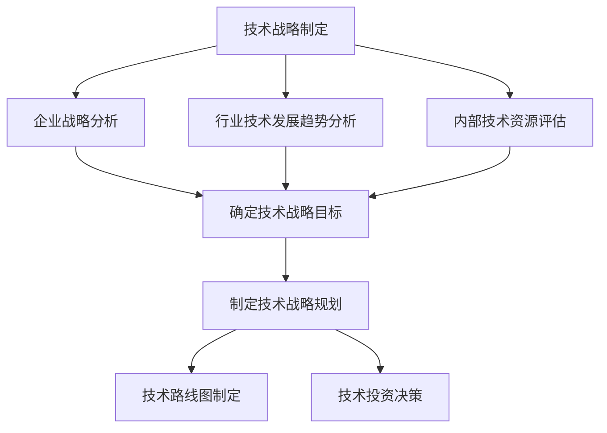
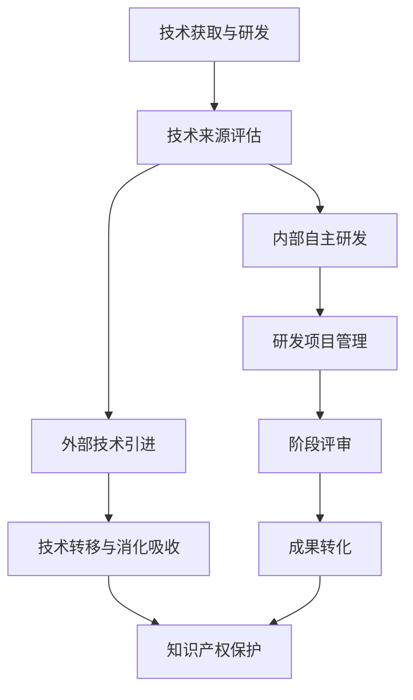
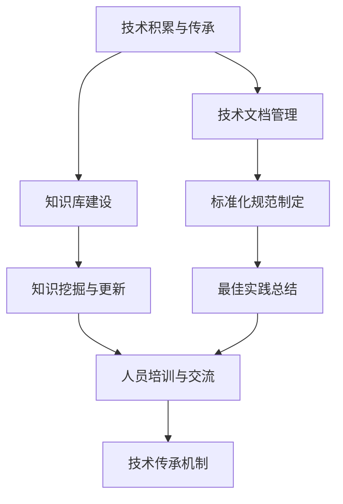
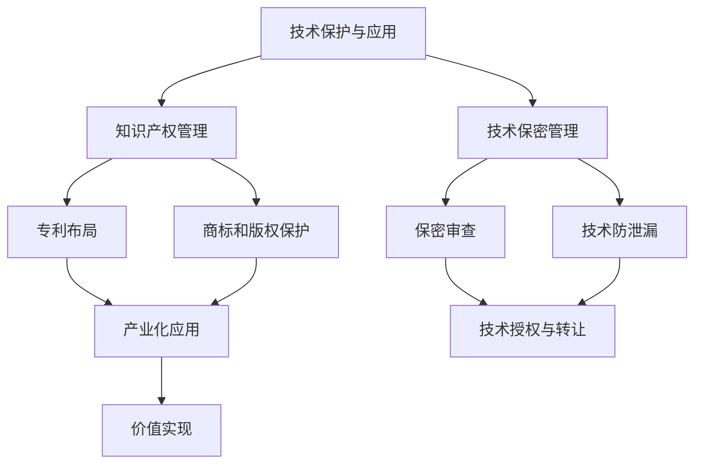

# 公司整体核心技术管理方案

## 1. 背景介绍

在当今快节奏的商业环境中,技术是推动企业创新和发展的核心动力。有效地管理和利用核心技术资源对于企业保持竞争优势至关重要。然而,随着技术的快速演进和复杂程度的不断提高,很多公司在技术管理方面面临着诸多挑战。

一个完善的核心技术管理方案不仅可以确保公司拥有清晰的技术路线图,而且能够最大限度地发挥技术资源的作用,提高研发效率,加速创新步伐。本文将探讨构建公司整体核心技术管理方案的关键要素,旨在为企业制定切实可行的技术管理策略提供指导。

### 1.1 核心技术的重要性

核心技术是指对企业的生存和发展起关键作用的技术,通常包括:

- 支撑企业主营业务的核心产品和服务的技术
- 保障企业长期竞争力的关键共性技术
- 引领行业发展方向的前沿创新技术

掌握核心技术不仅可以提升企业的核心竞争力,还能促进企业的可持续发展。因此,对核心技术的系统管理和持续投入是企业保持领先地位的重中之重。

### 1.2 技术管理的挑战

尽管核心技术管理的重要性不言而喻,但在实施过程中,企业仍然面临着诸多挑战:

- 技术复杂性日益增加,跨领域融合趋势明显
- 技术更新迭代周期不断缩短,创新步伐加快
- 技术人才稀缺,留住和吸引优秀人才较为困难
- 技术投入成本高昂,资源有限需合理分配

因此,制定一个科学合理、系统完善的核心技术管理方案,对于企业的长远发展至关重要。

## 2. 核心概念与联系

### 2.1 核心技术管理的定义

核心技术管理是指对企业的核心技术资源进行系统的规划、组织、控制和评估,以实现技术资源的高效利用和持续创新,从而支撑企业的战略目标。它贯穿了技术的全生命周期,包括技术战略制定、技术获取、技术研发、技术积累、技术保护、技术转移等多个环节。

### 2.2 核心技术管理的目标

一个完善的核心技术管理方案应该致力于实现以下几个关键目标:

1. **技术领先**:保持企业在核心领域的技术领先地位,掌握行业发展的主动权。
2. **持续创新**:建立有利于技术创新的机制,促进新技术、新产品的不断涌现。
3. **资源优化**:合理配置技术资源,提高研发投入产出比,避免资源浪费。
4. **风险控制**:识别和管控技术发展过程中的各种风险,确保技术发展的可控性。
5. **人才培养**:重视技术人才队伍建设,为企业发展提供智力支持和人才保障。

### 2.3 核心技术管理的原则

为了实现上述目标,核心技术管理应当遵循以下几个基本原则:

1. **战略导向**:技术管理必须服务于企业的总体发展战略,与企业战略保持高度一致。
2. **系统性**:将技术管理过程视为一个有机的系统,注重各环节之间的协调统一。
3. **前瞻性**:密切关注行业技术发展趋势,提前布局,抢占技术制高点。
4. **开放性**:建立开放的技术创新体系,积极吸纳外部技术资源,促进内外资源融合。
5. **持续改进**:不断总结经验教训,优化管理流程,推动技术管理工作持续改进和完善。

## 3. 核心算法原理具体操作步骤

构建公司整体核心技术管理方案是一个系统工程,需要遵循科学的流程和方法。下面将详细阐述其中的核心算法原理和具体操作步骤。

### 3.1 技术战略制定

技术战略制定是核心技术管理的基石,需要从企业战略、行业发展趋势和内部技术实力三个维度出发,明确技术发展的总体目标和重点方向,并制定相应的技术路线图和投资计划。具体步骤包括:

1. **企业战略分析**:全面梳理企业的发展战略、业务模式、市场定位等,明确技术在企业战略中的地位和作用。
2. **行业技术发展趋势分析**:密切关注行业内技术发展的最新动态,研判未来的技术发展趋势和热点方向。
3. **内部技术资源评估**:客观评估企业现有的技术实力、人才储备、研发能力等,找出技术短板和差距。
4. **确定技术战略目标**:根据上述分析,明确技术战略的总体目标,如引领行业发展、实现技术突破等。
5. **制定技术战略规划**:围绕技术战略目标,制定技术发展的总体规划,包括技术路线图和投资计划等。
6. **技术路线图制定**:对核心技术进行梳理,绘制技术路线图,明确技术发展的重点方向和时间节点。
7. **技术投资决策**:根据技术路线图,合理分配技术投资,保证重点技术领域的持续投入。

### 3.2 技术获取与研发

技术获取与研发是实现技术战略目标的关键环节,需要根据技术特点和企业实际情况,选择合适的技术来源,并建立高效的研发管理机制。主要步骤包括:

1. **技术来源评估**:对拟获取的技术进行全面评估,考虑技术水平、成熟度、可获得性、成本等因素,确定最佳获取途径。
2. **外部技术引进**:通过技术转让、许可、并购等方式引进外部成熟技术,缩短自主研发周期。
3. **技术转移与消化吸收**:建立技术转移机制,促进外部技术与内部资源的融合,实现技术的消化吸收和再创新。
4. **内部自主研发**:对于核心关键技术,通过自主研发的方式实现突破,保障技术的自主可控性。
5. **研发项目管理**:建立完善的研发项目管理体系,对研发过程实施全流程管控,确保研发质量和进度。
6. **阶段评审**:在研发关键节点设置阶段评审,及时发现并解决问题,控制研发风险。
7. **成果转化**:建立成果转化机制,推动研发成果的产业化应用,实现技术价值的最大化。
8. **知识产权保护**:加强知识产权管理,对核心技术进行专利布局,防止技术外泄和被侵权。

### 3.3 技术积累与传承

技术积累与传承是确保企业核心技术资源可持续发展的关键,需要建立系统的知识管理体系,促进技术经验的总结提炼和有效传承。主要步骤包括:

1. **技术文档管理**:建立完善的技术文档管理系统,规范化管理各类技术文档,确保文档的准确性和可追溯性。
2. **知识库建设**:构建统一的技术知识库,系统收集和存储企业的技术知识资产,实现知识的共享和复用。
3. **知识挖掘与更新**:定期对技术知识进行挖掘和更新,及时吸收行业内最新技术进展,保持知识库的时效性。
4. **标准化规范制定**:总结技术实践经验,制定统一的技术标准和规范,规范技术开发流程,提高开发质量和效率。
5. **最佳实践总结**:持续总结技术实践中的优秀做法和成功案例,形成最佳实践,指导未来的技术工作。
6. **人员培训与交流**:建立多层次的技术培训体系,加强技术人员的知识传递和经验交流,促进技术知识的内化和应用。
7. **技术传承机制**:制定技术传承计划,通过导师制、代际传承等方式,实现技术知识和经验的有效传承。

### 3.4 技术保护与应用

技术保护与应用是实现核心技术价值的关键环节,需要建立完善的知识产权管理和技术保密体系,防止核心技术外泄,并推动技术的产业化应用,实现技术价值的最大化。主要步骤包括:

1. **知识产权管理**:制定知识产权战略,建立知识产权管理制度,加强对技术创新成果的知识产权保护。
2. **专利布局**:对核心技术进行专利布局,通过制定专利战略,构建专利矩阵,形成专利壁垒,保护核心技术。
3. **商标和版权保护**:对企业商标、软件著作权等无形资产进行有效保护,防止被侵权和盗用。
4. **技术保密管理**:建立健全的技术保密管理体系,制定保密制度和操作规程,防止核心技术泄密。
5. **保密审查**:对技术交底、技术输出等环节进行保密审查,识别并消除保密风险隐患。
6. **技术防泄漏**:采取技术手段如加密、隔离等,防止核心技术在使用和传输过程中被窃取或泄露。
7. **产业化应用**:推动核心技术在产品、服务等领域的产业化应用,实现技术的市场价值转化。
8. **技术授权与转让**:建立技术授权和转让机制,通过技术许可、技术入股等方式,扩大技术应用范围,实现增值收益。
9. **价值实现**:持续跟踪和评估技术应用效果,确保核心技术创造最大的经济价值和社会价值。

## 4. 数学模型和公式详细讲解举例说明

在核心技术管理过程中,需要借助一些数学模型和公式来量化评估技术价值、预测技术发展趋势、优化资源配置等。下面将详细介绍几种常用的数学模型和公式。

### 4.1 技术价值评估模型

技术价值评估是核心技术管理的重要环节,它可以为技术投资决策、技术选择等提供依据。常用的技术价值评估模型包括:

1. **收益现值法**

收益现值法是根据技术预期可以创造的未来净现金流量,计算出技术的现值,作为技术价值的量化指标。计算公式如下:

$$
V = \sum_{t=1}^{n}\frac{R_t}{(1+r)^t}
$$

其中,$V$表示技术价值现值,$R_t$表示第$t$年的净现金流量,$r$表示折现率,$