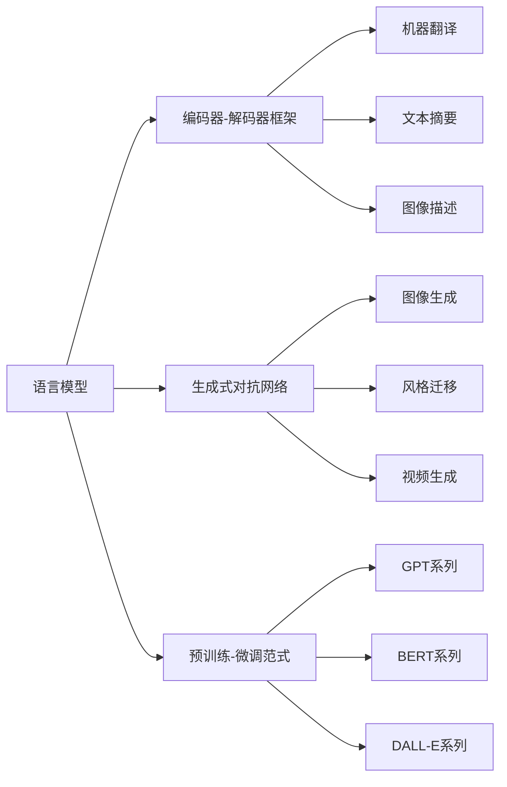

# 内容生成(Content Generation) - 原理与代码实例讲解

## 1. 背景介绍
### 1.1 内容生成的定义与意义
内容生成(Content Generation)是指利用人工智能技术,特别是自然语言处理(NLP)和机器学习(ML)方法,自动或半自动地创作文本、图像、音频、视频等数字内容的过程。它旨在减少人工创作的工作量,提高内容生产效率和质量,为企业和个人提供海量优质内容。

### 1.2 内容生成的发展历程
内容生成技术的发展可以追溯到上世纪中后期。早期的内容生成系统主要基于规则和模板,通过设定句型结构和词汇,随机组合生成简单的文本。21世纪以来,随着深度学习的兴起,内容生成进入了数据驱动的时代。研究者开始利用循环神经网络(RNN)、长短期记忆网络(LSTM)等模型,从大规模语料中学习语言知识,生成连贯自然的文本。近年来,Transformer 等注意力机制模型和生成式预训练模型如 GPT 系列的出现,再次推动了内容生成技术的发展,使其能够创作出接近甚至超越人类水平的各类内容。

### 1.3 内容生成的应用领域
内容生成技术在许多领域有广泛应用,主要包括:

- 文本生成:自动写作助手、智能问答、对话生成、机器翻译等
- 图像生成:艺术图像创作、逼真人像生成、图像修复与编辑等  
- 音频生成:语音合成、音乐生成、音效合成等
- 视频生成:影视动画制作、虚拟主播、游戏场景生成等

此外,内容生成还被应用于教育、医疗、金融、电商等行业,为个性化教学、医疗报告撰写、金融资讯分析、商品描述优化等任务提供支持。

## 2. 核心概念与联系
### 2.1 语言模型
语言模型是内容生成的核心,它用于建模自然语言中词语或字符的概率分布。给定前面的词语序列,语言模型可以预测下一个最可能出现的词。常见的语言模型有 N-gram、RNN、Transformer 等。语言模型通过从大规模语料库学习词语之间的关联,掌握语言的语法、语义和逻辑,从而具备生成连贯自然文本的能力。

### 2.2 编码器-解码器框架
编码器-解码器(Encoder-Decoder)是一种广泛用于内容生成任务的模型框架。编码器负责将输入的内容(如文本、图像)映射为隐空间表示,解码器则根据隐表示生成目标内容。这一框架被应用于机器翻译、文本摘要、图像描述等任务中。通过引入注意力机制,编码器-解码器模型可以更好地对齐输入内容和生成内容之间的对应关系。

### 2.3 生成式对抗网络 
生成式对抗网络(GAN)由生成器和判别器两部分组成,通过两者的博弈学习来进行内容生成。生成器负责生成假样本以欺骗判别器,判别器则需要区分真实样本和生成样本。经过多轮对抗训练,生成器可以生成越来越逼真的内容。GAN 在图像生成、风格迁移、视频生成等任务上取得了显著成果。

### 2.4 预训练-微调范式
预训练-微调(Pre-training and Fine-tuning)是当前内容生成的主流范式。首先在大规模无标注数据上对模型进行自监督预训练,习得通用的内容生成能力。然后针对特定任务,在小规模标注数据上对模型进行微调,使其适应任务需求。这一范式充分利用了无标注数据,显著提升了模型的性能和泛化能力。代表性的预训练生成模型有 GPT、BERT、DALL-E 等。

以下是这些核心概念之间关系的 Mermaid 流程图:



## 3. 核心算法原理与具体操作步骤
### 3.1 基于 RNN 的文本生成
基于循环神经网络(RNN)的文本生成通过建模文本序列的概率分布来实现。具体步骤如下:

1. 将文本语料进行预处理,转换为数值化的词语或字符序列。
2. 搭建 RNN 模型,常用的变体有 LSTM 和 GRU。设置词嵌入层将离散tokens映射为稠密向量。 
3. 根据当前时间步的输入和前一步的隐藏状态,更新当前隐藏状态。
4. 将当前隐藏状态通过全连接层和 softmax 函数映射为各个词语的概率分布。
5. 根据生成策略(如贪心法、束搜索)从概率分布中采样生成下一个词,直至遇到终止符。
6. 微调超参数,进行多轮训练直至模型收敛。 

生成示例如下:

```python
model = Sequential([
    Embedding(vocab_size, embedding_dim, input_length=max_length),
    LSTM(128),
    Dense(vocab_size, activation='softmax')
])
model.compile(loss='categorical_crossentropy', optimizer='adam')

generated_text = []
seed_text = "今天天气"
for _ in range(20):
    token_list = tokenizer.texts_to_sequences([seed_text])[0]
    token_list = pad_sequences([token_list], maxlen=max_length-1, padding='pre')
    predicted = np.argmax(model.predict(token_list), axis=-1)
    output_word = ""
    for word, index in tokenizer.word_index.items():
        if index == predicted:
            output_word = word
            break
    seed_text += " " + output_word
    generated_text.append(output_word)
```

### 3.2 基于 Transformer 的图像生成
基于 Transformer 的图像生成通过将图像看作一个序列,利用自注意力机制建模图像块之间的关系,从而生成高质量图像。以 DALL-E 为例,其步骤如下:

1. 将图像切分为固定大小的图像块,并将其线性投影为图像嵌入向量。
2. 添加位置编码以引入图像块的空间位置信息。
3. 利用多头自注意力机制建模图像块之间的全局依赖关系。
4. 堆叠多个 Transformer 编码器层,捕获图像块的高层语义信息。 
5. 通过解码器网络将图像特征还原为像素值,重建原始图像。
6. 引入对抗训练和感知损失,提升生成图像的真实性和清晰度。

生成示例如下:

```python
def generate_images(model, num_images):
    z = torch.randn(num_images, model.latent_dim).to(device) 
    with torch.no_grad():
        generated_images = model.decoder(z)
    generated_images = (generated_images + 1) / 2
    return generated_images

model.eval() 
generated_images = generate_images(model, num_images=16)

fig, axs = plt.subplots(4, 4, figsize=(10, 10))
for i in range(16):
    img = generated_images[i].permute(1, 2, 0).cpu().numpy()
    axs[i//4, i%4].imshow(img)
    axs[i//4, i%4].axis('off')
plt.show()
```

## 4. 数学模型和公式详细讲解举例说明
### 4.1 文本生成中的损失函数
文本生成任务通常基于极大似然估计,优化目标是最小化负对数似然损失。对于一个长度为 $T$ 的文本序列 $x_{1:T} = [x_1, x_2, ..., x_T]$,其损失函数定义为:

$$
\mathcal{L}(\theta) = -\sum_{t=1}^{T} \log p_{\theta}(x_t | x_{1:t-1})
$$

其中 $\theta$ 为模型参数,$p_{\theta}(x_t | x_{1:t-1})$ 表示在给定前 $t-1$ 个词的条件下,当前词 $x_t$ 的条件概率。模型通过最小化该损失函数来学习文本序列的生成概率分布。

在实践中,我们通常使用交叉熵损失函数的变体。以 PyTorch 为例:

```python
criterion = nn.CrossEntropyLoss()
loss = criterion(logits.view(-1, vocab_size), targets.view(-1))
```

其中 `logits` 是模型输出的未归一化的对数概率,$\text{shape}=[batch\_size, seq\_len, vocab\_size]$。`targets` 是真实词的索引,$\text{shape}=[batch\_size, seq\_len]$。通过 `view(-1)` 将其展平为一维,方便计算交叉熵损失。

### 4.2 图像生成中的损失函数
图像生成任务的损失函数设计更加多样化,通常包括重建损失和对抗损失两部分。以 DCGAN 为例,其判别器损失为:

$$
\mathcal{L}_D = -\mathbb{E}_{x \sim p_{data}(x)}[\log D(x)] - \mathbb{E}_{z \sim p_z(z)}[\log(1 - D(G(z)))]
$$

其中 $D(x)$ 表示判别器将真实图像 $x$ 判断为真的概率,$G(z)$ 表示生成器将随机噪声 $z$ 生成的图像。判别器的目标是最大化真实图像的对数概率和生成图像的负对数概率之和。

生成器损失为:

$$
\mathcal{L}_G = -\mathbb{E}_{z \sim p_z(z)}[\log D(G(z))]
$$

生成器的目标是最小化生成图像被判别器判断为假的对数概率,即欺骗判别器。

在 PyTorch 中,判别器损失的实现示例如下:

```python
criterion = nn.BCELoss()
real_loss = criterion(D(real_images), torch.ones_like(D(real_images)))
fake_loss = criterion(D(generated_images.detach()), torch.zeros_like(D(generated_images)))
d_loss = (real_loss + fake_loss) / 2
```

生成器损失的实现示例如下:

```python
g_loss = criterion(D(generated_images), torch.ones_like(D(generated_images)))
```

其中 `real_images` 为真实图像,`generated_images` 为生成图像。通过最小化生成器损失和判别器损失,模型可以学习生成逼真的图像。

## 5. 项目实践:代码实例和详细解释说明
下面以基于 LSTM 的中文文本生成为例,给出详细的代码实现和解释说明。

```python
import numpy as np
import torch
import torch.nn as nn
import torch.optim as optim
from torch.utils.data import Dataset, DataLoader
from sklearn.preprocessing import LabelEncoder

# 数据预处理
class TextDataset(Dataset):
    def __init__(self, text, seq_len):
        self.text = text
        self.seq_len = seq_len
        self.chars = sorted(list(set(text)))
        self.char2id = {ch: i for i, ch in enumerate(self.chars)}
        self.id2char = {i: ch for i, ch in enumerate(self.chars)}
        self.num_chars = len(self.chars)
        
    def __len__(self):
        return len(self.text) - self.seq_len
    
    def __getitem__(self, idx):
        input_seq = self.text[idx:idx+self.seq_len]
        target_seq = self.text[idx+1:idx+self.seq_len+1]
        
        input_ids = [self.char2id[ch] for ch in input_seq]
        target_ids = [self.char2id[ch] for ch in target_seq]
        
        return torch.tensor(input_ids), torch.tensor(target_ids)

# LSTM模型定义  
class LSTMModel(nn.Module):
    def __init__(self, num_chars, embedding_dim, hidden_dim, num_layers):
        super().__init__()
        self.hidden_dim = hidden_dim
        self.num_layers = num_layers
        
        self.embedding = nn.Embedding(num_chars, embedding_dim)
        self.lstm = nn.LSTM(embedding_dim, hidden_dim, num_layers, batch_first=True)
        self.fc = nn.Linear(hidden_dim, num_chars)
    
    def forward(self, x, hidden):
        embedded = self.embedding(x)
        output, hidden = self.lstm(embedded, hidden)
        output = self.fc(output)
        return output, hidden

    def init_hidden(self, batch_size):
        return (