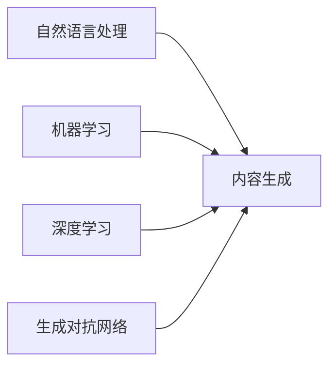

## 1. 背景介绍

随着人工智能技术的飞速发展，内容生成已经成为了计算机科学领域的一个热点。无论是自动撰写新闻稿、生成逼真的图像，还是创作音乐和诗歌，内容生成技术都在不断地拓展其应用范围。这一技术的核心在于模拟人类的创造力，通过算法自动产生有价值的、新颖的内容。

## 2. 核心概念与联系

内容生成涉及到多个核心概念，包括自然语言处理（NLP）、机器学习（ML）、深度学习（DL）、生成对抗网络（GAN）等。这些技术相互联系，共同构成了内容生成的理论基础和实践框架。



## 3. 核心算法原理具体操作步骤

内容生成的核心算法原理可以分为以下几个步骤：

1. 数据预处理：收集和清洗用于训练的数据。
2. 模型选择：根据任务需求选择合适的算法模型。
3. 特征提取：从数据中提取有用的特征。
4. 模型训练：使用提取的特征训练算法模型。
5. 内容生成：利用训练好的模型生成内容。
6. 结果评估：评估生成内容的质量和相关性。

## 4. 数学模型和公式详细讲解举例说明

内容生成中常用的数学模型包括但不限于循环神经网络（RNN），特别是长短期记忆网络（LSTM）和门控循环单元（GRU）。以LSTM为例，其数学公式可以表示为：

$$
\begin{align}
f_t &= \sigma(W_f \cdot [h_{t-1}, x_t] + b_f) \\
i_t &= \sigma(W_i \cdot [h_{t-1}, x_t] + b_i) \\
\tilde{C}_t &= \tanh(W_C \cdot [h_{t-1}, x_t] + b_C) \\
C_t &= f_t * C_{t-1} + i_t * \tilde{C}_t \\
o_t &= \sigma(W_o \cdot [h_{t-1}, x_t] + b_o) \\
h_t &= o_t * \tanh(C_t)
\end{align}
$$

其中，$f_t, i_t, o_t$ 分别是遗忘门、输入门和输出门的激活向量，$C_t$ 是细胞状态，$h_t$ 是当前时刻的输出，$W$ 和 $b$ 是模型参数，$\sigma$ 是sigmoid函数，$\tanh$ 是双曲正切函数。

## 5. 项目实践：代码实例和详细解释说明

以Python语言和TensorFlow框架为例，以下是一个简单的LSTM内容生成的代码实例：

```python
import tensorflow as tf

# 构建模型
model = tf.keras.Sequential([
    tf.keras.layers.LSTM(128, input_shape=(None, input_size)),
    tf.keras.layers.Dense(output_size, activation='softmax')
])

# 编译模型
model.compile(loss='categorical_crossentropy', optimizer='adam')

# 训练模型
model.fit(x_train, y_train, epochs=20)

# 生成内容
def generate_text(model, start_string):
    # 将起始字符串转换为数字（向量化）
    input_eval = [char2idx[s] for s in start_string]
    input_eval = tf.expand_dims(input_eval, 0)

    # 空字符串用于存储结果
    text_generated = []

    # 低温度会生成更可预测的文本，高温度会生成更惊奇的文本
    temperature = 1.0

    # 这里批大小为1
    model.reset_states()
    for i in range(num_generate):
        predictions = model(input_eval)
        # 移除批次的维度
        predictions = tf.squeeze(predictions, 0)

        # 使用分类分布预测模型返回的字符
        predictions = predictions / temperature
        predicted_id = tf.random.categorical(predictions, num_samples=1)[-1,0].numpy()

        # 把预测的字符传递回模型
        input_eval = tf.expand_dims([predicted_id], 0)
        text_generated.append(idx2char[predicted_id])

    return (start_string + ''.join(text_generated))

# 调用上面的函数
print(generate_text(model, start_string="AI is "))
```

在这个例子中，我们首先构建了一个包含LSTM层的模型，然后编译并训练了它。在生成文本的函数中，我们将起始字符串转换为模型能够理解的格式，并通过模型预测下一个字符，不断循环这个过程来生成文本。

## 6. 实际应用场景

内容生成技术在多个领域都有广泛的应用，例如：

- 新闻自动撰写
- 聊天机器人
- 个性化推荐系统
- 虚拟助手
- 游戏开发中的故事情节生成

## 7. 工具和资源推荐

对于内容生成，以下是一些有用的工具和资源：

- TensorFlow和PyTorch：两个流行的深度学习框架。
- GPT-3和BERT：先进的预训练语言模型。
- OpenAI和Hugging Face：提供多种AI模型的平台。

## 8. 总结：未来发展趋势与挑战

内容生成技术的未来发展趋势包括更加智能化、个性化和自然化的生成内容。同时，这一领域也面临着诸如提高生成内容的质量、确保内容的真实性和安全性等挑战。

## 9. 附录：常见问题与解答

Q1: 内容生成技术是否会取代人类创作者？
A1: 目前来看，内容生成技术更多地是作为人类创作者的辅助工具，而不是替代者。

Q2: 内容生成技术的准确性如何？
A2: 准确性取决于所使用的模型和数据质量，目前已有的技术在特定领域已经能够达到很高的准确性。

Q3: 如何评估生成内容的质量？
A3: 可以通过人工评估或者设置自动评估标准，如一致性、相关性、新颖性等。

作者：禅与计算机程序设计艺术 / Zen and the Art of Computer Programming