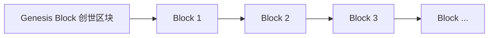
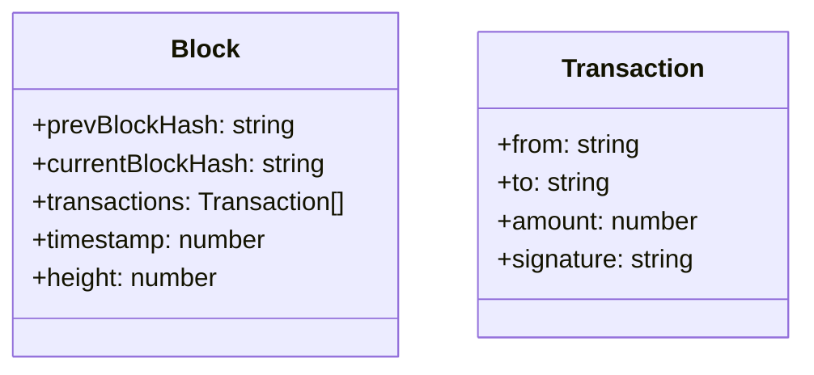

# 区块链与数据可信原理与代码实战案例讲解

## 1.背景介绍

在当今数字化时代,数据的真实性、可靠性和可追溯性已成为各行业面临的重大挑战。随着信息技术的不断发展,传统的数据存储和管理方式已难以满足数据安全性和透明度的需求。区块链技术凭借其去中心化、不可篡改和加密安全等特性,为解决数据可信问题提供了一种全新的解决方案。

### 1.1 数据可信问题

在现有的中心化数据管理系统中,数据的真实性和可靠性存在诸多挑战:

- 数据容易被篡改或删除,缺乏有效的追溯机制
- 数据存储和管理过程缺乏透明度,难以监督和审计
- 中心化的数据存储系统存在单点故障和黑客攻击风险
- 数据所有权和隐私保护难以得到有效保障

这些问题不仅影响着数据的可信度,也制约了数字化转型的进程。因此,构建一种安全可靠、透明可追溯的数据管理系统迫在眉睫。

### 1.2 区块链技术的优势

区块链技术作为一种分布式账本技术,具有以下独特优势:

- **去中心化**: 区块链系统中没有中心节点,所有节点均等地参与记录和验证数据
- **不可篡改**: 利用密码学原理,确保已写入区块链的数据无法被修改或删除
- **可追溯性**: 区块链上的每一笔交易都会留下永久的审计线索
- **数据共享**: 区块链上的数据对所有节点公开透明,有利于信息共享和协作

这些特性使区块链成为解决数据可信问题的理想选择。通过将数据写入区块链,可以确保数据的真实性、完整性和可追溯性,从而赢得各方的信任。

## 2.核心概念与联系

### 2.1 区块链基本概念

区块链是一种分布式数据库,由有序且不可篡改的数据块(区块)按时间顺序组成。每个区块包含上一个区块的哈希值、当前区块的数据和时间戳等信息。这种链式结构使得区块链具有了不可篡改的特性。



### 2.2 共识机制

区块链系统中,所有节点需要就新区块的有效性达成共识。常见的共识算法包括:

- **工作量证明(PoW)**: 通过计算密集型工作来验证新区块,如比特币的挖矿过程
- **权益证明(PoS)**: 根据节点持有的加密货币数量分配记账权
- **实用拜占庭容错(PBFT)**: 通过多数节点投票达成共识

共识机制确保了区块链系统的可靠性和一致性,防止了恶意节点的攻击。

### 2.3 密码学原理

区块链安全性的核心依赖于密码学技术,主要包括:

- **哈希函数**: 将任意长度的数据映射为固定长度的哈希值,确保数据的完整性
- **非对称加密**: 利用公钥和私钥对数据进行加密和解密,保证数据的机密性
- **数字签名**: 使用私钥对数据进行签名,接收方可通过公钥验证签名的真实性

密码学技术为区块链系统提供了安全保障,确保了数据在传输和存储过程中的机密性、完整性和不可否认性。

## 3.核心算法原理具体操作步骤

### 3.1 区块链数据结构

区块链的核心数据结构是由区块组成的链表。每个区块包含以下关键字段:

- **前一区块哈希值(prevBlockHash)**: 指向前一个区块,确保区块链的不可篡改性
- **当前区块哈希值(currentBlockHash)**: 当前区块的哈希值,由区块头和交易数据计算得出
- **交易数据(transactions)**: 记录本区块中所有交易信息
- **时间戳(timestamp)**: 记录区块生成的时间
- **区块高度(height)**: 区块在链上的位置序号



### 3.2 区块链核心算法

区块链的核心算法包括以下几个部分:

1. **新区块生成算法**
   - 收集待处理的交易数据
   - 构造新区块,填充区块头信息(前一区块哈希、时间戳等)
   - 对区块头和交易数据进行哈希运算,得到当前区块哈希值
   - 将新区块添加到区块链末尾

2. **共识算法(以PoW为例)**
   - 找到满足目标难度值的随机数(nonce),使得区块哈希值符合特定条件
   - 广播新区块给全网其他节点进行验证
   - 其他节点验证区块有效性,达成共识后将新区块永久添加到本地区块链

3. **交易验证算法**
   - 验证交易输入的合法性(足够的余额、有效的签名等)
   - 执行交易逻辑,更新相关账户状态
   - 将有效交易打包进新区块

通过这些核心算法,区块链系统可以自动化地生成新区块、达成全网共识,并验证和记录交易数据,从而保证了系统的分布式一致性。

## 4.数学模型和公式详细讲解举例说明

### 4.1 哈希函数

哈希函数在区块链中扮演着至关重要的角色,它将任意长度的输入数据映射为固定长度的哈希值,并满足以下几个基本特性:

- **确定性**: 相同的输入必定得到相同的输出
- **雪崩效应**: 输入数据的微小变化会引起输出哈希值的巨大改变
- **单向性**: 给定输出很难计算出对应的输入
- **抗碰撞性**: 很难找到两个不同的输入映射到同一个输出

常见的哈希函数有SHA-256、Keccak-256等,其数学模型如下:

$$
H(x) = h(pad(x) \oplus iv)
$$

其中:
- $H(x)$是哈希函数的输出
- $x$是输入数据
- $h$是压缩函数
- $pad$是填充函数,用于将输入数据填充到固定长度的块
- $\oplus$是异或运算
- $iv$是初始化向量,是一个固定的常量

以SHA-256为例,其压缩函数$h$包含64轮迭代运算,每轮涉及大量的位移、非线性函数和模加法运算,从而实现了良好的雪崩效应和抗碰撞性能。

### 4.2 非对称加密

非对称加密算法是区块链安全性的另一个基石,它使用一对密钥(公钥和私钥)进行加密和解密操作。公钥可以公开,私钥必须保密。

常见的非对称加密算法有RSA、ECC等,它们的数学原理基于一些数论难题,如大数分解、离散对数等。以RSA为例,其加密过程如下:

1. 选取两个大质数$p$和$q$,计算$n = pq$
2. 选取一个与$(p-1)(q-1)$互质的公钥指数$e$
3. 计算私钥指数$d$,使得$ed \equiv 1 \pmod{\phi(n)}$,其中$\phi(n)$是欧拉函数
4. 公钥为$(e, n)$,私钥为$(d, n)$
5. 明文$m$加密为$c = m^e \bmod n$
6. 密文$c$解密为$m = c^d \bmod n$

RSA的安全性依赖于大数分解的困难性。给定一个足够大的合数$n$,要求分解出$p$和$q$是一个极其困难的问题。

### 4.3 数字签名

数字签名是验证数据完整性和发送者身份的关键技术,它通常基于非对称加密算法实现。发送方使用自己的私钥对数据进行签名,接收方则使用发送方的公钥验证签名的有效性。

数字签名的基本流程如下:

1. 发送方对待签名数据$m$计算哈希值$h = H(m)$
2. 使用私钥$d$对哈希值$h$进行签名,得到签名$s = h^d \bmod n$
3. 将数据$m$和签名$s$一并发送给接收方
4. 接收方使用发送方的公钥$e$验证签名$s^e \bmod n \overset{?}{=} h$

只有拥有正确的私钥,才能生成有效的数字签名。这样就确保了数据的完整性和发送者的身份。

数字签名广泛应用于区块链系统中,用于验证交易的合法性、防止重放攻击等。它是保证区块链安全性和可信度的重要手段。

## 5.项目实践:代码实例和详细解释说明

为了更好地理解区块链的原理和实现,我们将通过一个简单的Python示例项目来演示区块链的核心功能。

### 5.1 项目结构

```
blockchain-demo/
├── blockchain.py    # 区块链核心实现
├── transaction.py   # 交易类定义
├── wallet.py        # 钱包管理模块
└── main.py          # 主程序入口
```

### 5.2 区块链核心实现

`blockchain.py`文件包含了区块链系统的核心逻辑,主要包括以下几个类:

- `Block`: 定义区块的数据结构
- `Blockchain`: 管理整个区块链,实现区块生成、共识验证等功能
- `ProofOfWork`: 工作量证明(PoW)共识算法的实现

我们先来看`Block`类的定义:

```python
import hashlib
import time

class Block:
    def __init__(self, index, transactions, previous_hash, nonce=0):
        self.index = index
        self.transactions = transactions
        self.previous_hash = previous_hash
        self.nonce = nonce
        self.timestamp = int(time.time())

    def compute_hash(self):
        """
        计算区块的哈希值
        """
        block_string = json.dumps(self.__dict__, sort_keys=True)
        return hashlib.sha256(block_string.encode()).hexdigest()
```

`Block`类包含了区块的基本字段,如索引号、交易数据、前一区块哈希值、时间戳等。`compute_hash`方法用于计算当前区块的哈希值,它将区块的所有字段序列化为JSON字符串,然后使用SHA-256哈希算法计算哈希值。

接下来是`Blockchain`类,它管理整个区块链的状态:

```python
from block import Block

class Blockchain:
    def __init__(self):
        self.chain = [self.create_genesis_block()]
        self.difficulty = 4  # 初始难度值
        self.pending_transactions = []

    def create_genesis_block(self):
        """
        创建创世区块
        """
        genesis_block = Block(0, [], "0")
        genesis_block.hash = genesis_block.compute_hash()
        return genesis_block

    def get_latest_block(self):
        """
        获取链上最新的区块
        """
        return self.chain[-1]

    def mine_pending_transactions(self, miner_address):
        """
        挖矿,生成新区块
        """
        latest_block = self.get_latest_block()
        new_block = Block(latest_block.index + 1, self.pending_transactions, latest_block.hash)

        # 工作量证明算法
        proof = self.proof_of_work(new_block)
        new_block.nonce = proof.nonce
        new_block.hash = proof.hash

        # 将新区块添加到链上,并清空待处理交易池
        self.chain.append(new_block)
        self.pending_transactions = []

        return new_block

    def proof_of_work(self, block):
        """
        工作量证明算法
        """
        proof = ProofOfWork(block, self.difficulty)
        return proof.run()

    def add_transaction(self, transaction):
        """
        添加新的交易到待处理交易池
        """
        self.pending_transactions.append(transaction)
        return len(self.chain) + 1

    def validate_chain(self):
        """
        验证整个区块链的有效性
        """
        for i in range(1, len(self.chain)):
            current_block = self.chain[i]
            previous_block = self.chain[i - 1]