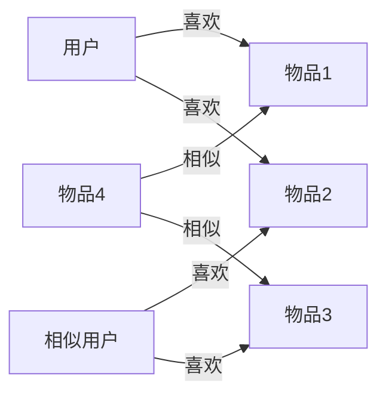

# 协同过滤 原理与代码实例讲解

## 1. 背景介绍

### 1.1 什么是推荐系统

在当今信息爆炸的时代,我们每天都会接触到海量的信息和数据。面对如此庞大的信息,用户很难快速找到自己感兴趣的内容。推荐系统应运而生,它可以根据用户的历史行为、偏好等信息,自动为用户推荐可能感兴趣的内容,大大提高了用户的使用体验和满意度。

推荐系统在很多领域都有广泛应用,如电商平台的商品推荐、视频网站的影视推荐、社交网络的好友推荐等。一个好的推荐系统能够准确捕捉用户的需求,提高用户粘性和转化率,从而为企业创造更多价值。

### 1.2 推荐系统的主要技术

目前主流的推荐系统技术主要包括:

1. 基于内容的推荐(Content-based Recommendation):根据物品本身的属性特征,向用户推荐与其过去喜欢的物品相似的其他物品。

2. 协同过滤推荐(Collaborative Filtering):通过分析用户或物品之间的相似性,给用户推荐那些与他有相似兴趣的其他用户喜欢的物品,或者推荐那些与他之前喜欢的物品相似的物品。

3. 组合推荐(Hybrid Recommendation):结合内容推荐和协同过滤,取二者之长,克服各自的缺点,可以获得更好的推荐效果。

4. 基于知识的推荐:利用专家知识,通过推理得出推荐结果。适用于一些垂直领域。

本文将重点介绍协同过滤技术的原理和实现。

## 2. 核心概念与联系

### 2.1 协同过滤的定义

协同过滤(Collaborative Filtering,简称CF)是一种常用的推荐算法,它通过分析用户或物品之间的相似性,给用户推荐那些与他有相似兴趣的其他用户喜欢的物品,或者推荐那些与他之前喜欢的物品相似的物品。

协同过滤的基本假设是:

1. 有相似兴趣的用户,对物品有相似的评价
2. 用户的兴趣和偏好是相对稳定的

### 2.2 协同过滤的分类

协同过滤主要分为两类:

1. 基于用户的协同过滤(User-based CF):通过分析用户之间的相似性,给用户推荐那些与他有相似兴趣的其他用户喜欢的物品。

2. 基于物品的协同过滤(Item-based CF):通过分析物品之间的相似性,给用户推荐那些与他之前喜欢的物品相似的物品。

下图展示了基于用户和基于物品的协同过滤的基本原理:



### 2.3 协同过滤的优缺点

协同过滤的优点:
1. 不需要对物品本身进行建模,降低了系统复杂度
2. 能够发现用户潜在的兴趣偏好
3. 随着用户行为数据的积累,推荐效果会不断提升

协同过滤的缺点:
1. 冷启动问题:对于新用户和新物品,由于缺乏足够的行为数据,推荐效果较差
2. 稀疏性问题:现实场景中用户对物品的评分数据非常稀疏,难以计算相似度
3. 扩展性问题:当用户和物品数量非常大时,计算用户或物品相似度的开销会非常大

## 3. 核心算法原理具体操作步骤

以下我们以基于用户的协同过滤为例,详细介绍其算法原理和实现步骤。

### 3.1 建立用户-物品评分矩阵

收集用户对物品的偏好数据,得到用户-物品评分矩阵。矩阵的行表示用户,列表示物品,每个元素表示用户对物品的评分。

例如下面是一个用户-物品评分矩阵:

|   | 物品1 | 物品2 | 物品3 | 物品4 |
|---|---|---|---|---|
| 用户1 | 3  | 5  |   | 2  |
| 用户2 | 4  |   | 2  | 3  |
| 用户3 |   | 4  | 5  |   |
| 用户4 | 5  | 4  | 3  |   |

### 3.2 计算用户相似度

计算每对用户之间的相似度。常用的相似度计算方法有:

1. 余弦相似度(Cosine Similarity)

$$sim(u,v) = \frac{\sum_{i \in I_{uv}} r_{ui} r_{vi}}{\sqrt{\sum_{i \in I_u} r_{ui}^2} \sqrt{\sum_{i \in I_v} r_{vi}^2}}$$

其中$I_{uv}$表示用户$u$和$v$共同评分的物品集合,$r_{ui}$表示用户$u$对物品$i$的评分。

2. 皮尔逊相关系数(Pearson Correlation Coefficient)

$$sim(u,v) = \frac{\sum_{i \in I_{uv}}(r_{ui} - \bar{r}_u)(r_{vi} - \bar{r}_v)}{\sqrt{\sum_{i \in I_{uv}}(r_{ui} - \bar{r}_u)^2}\sqrt{\sum_{i \in I_{uv}}(r_{vi} - \bar{r}_v)^2}}$$

其中$\bar{r}_u$和$\bar{r}_v$分别表示用户$u$和$v$的平均评分。

### 3.3 生成推荐列表

对于目标用户$u$,计算他对每个没有评分过的物品$i$的预测评分:

$$\hat{r}_{ui} = \bar{r}_u + \frac{\sum_{v \in S^k_u(i)} sim(u,v)(r_{vi} - \bar{r}_v)}{\sum_{v \in S^k_u(i)} |sim(u,v)|}$$

其中$S^k_u(i)$表示与用户$u$最相似的$k$个用户中,对物品$i$有评分的用户集合。

根据预测评分,选取Top N个评分最高的物品推荐给用户。

## 4. 数学模型和公式详细讲解举例说明

我们以一个具体的例子来说明协同过滤的计算过程。

假设有4个用户和4个物品,用户-物品评分矩阵如下:

|   | 物品1 | 物品2 | 物品3 | 物品4 |
|---|---|---|---|---|
| 用户1 | 3  | 5  |   | 2  |
| 用户2 | 4  |   | 2  | 3  |
| 用户3 |   | 4  | 5  |   |
| 用户4 | 5  | 4  | 3  |   |

我们要给用户1推荐物品。

### 4.1 计算用户相似度

这里我们使用余弦相似度来计算用户之间的相似度。

用户1和用户2的相似度:

$$sim(1,2) = \frac{3 \times 4 + 2 \times 3}{\sqrt{3^2 + 5^2 + 2^2} \sqrt{4^2 + 2^2 + 3^2}} = 0.785$$

用户1和用户3的相似度:

$$sim(1,3) = \frac{5 \times 4}{\sqrt{3^2 + 5^2 + 2^2} \sqrt{4^2 + 5^2}} = 0.485$$

用户1和用户4的相似度:

$$sim(1,4) = \frac{3 \times 5 + 5 \times 4}{\sqrt{3^2 + 5^2 + 2^2} \sqrt{5^2 + 4^2 + 3^2}} = 0.927$$

### 4.2 计算物品预测评分

用户1没有评分过物品3,我们计算用户1对物品3的预测评分。

用户1的平均评分为$\bar{r}_1 = \frac{3 + 5 + 2}{3} = 3.33$

选取与用户1最相似的2个用户,即用户4和用户2。

用户4对物品3的评分为3,用户4的平均评分为$\bar{r}_4 = \frac{5 + 4 + 3}{3} = 4$

用户2对物品3的评分为2,用户2的平均评分为$\bar{r}_2 = \frac{4 + 2 + 3}{3} = 3$

$$\hat{r}_{13} = 3.33 + \frac{0.927 \times (3 - 4) + 0.785 \times (2 - 3)}{0.927 + 0.785} = 2.89$$

同理可以计算用户1对其他未评分物品的预测评分,最终选取预测评分最高的物品推荐给用户1。

## 5. 项目实践:代码实例和详细解释说明

下面我们使用Python实现一个简单的基于用户的协同过滤推荐系统。

```python
import numpy as np
from sklearn.metrics.pairwise import cosine_similarity

class UserCF:
    
    def __init__(self, k=3):
        self.k = k  # 选取最相似的k个用户
        
    def fit(self, X):
        """
        训练模型
        :param X: 用户-物品评分矩阵,行表示用户,列表示物品
        """
        self.X = X
        self.user_mean = np.mean(X, axis=1)  # 计算每个用户的平均评分
        self.user_sim = cosine_similarity(X)  # 计算用户相似度矩阵
        
    def predict(self, user_id):
        """
        为用户user_id推荐Top N个物品
        :param user_id: 用户id
        :return: Top N个物品id列表
        """
        unrated_items = np.where(self.X[user_id] == 0)[0]  # 找到用户未评分的物品
        pred_ratings = []
        for item in unrated_items:
            sim_users = np.argsort(self.user_sim[user_id])[-self.k:]  # 选取最相似的k个用户
            sim_users_rated = sim_users[self.X[sim_users, item] > 0]  # 去掉未评分的用户
            if len(sim_users_rated) == 0:
                pred_rating = self.user_mean[user_id]  # 如果相似用户都未评分,则用用户平均分作为预测评分
            else:
                ratings = self.X[sim_users_rated, item]
                sims = self.user_sim[user_id][sim_users_rated]
                pred_rating = self.user_mean[user_id] + np.sum(sims * (ratings - self.user_mean[sim_users_rated])) / np.sum(sims)
            pred_ratings.append((item, pred_rating))
        pred_ratings.sort(key=lambda x: x[1], reverse=True)  # 按预测评分从大到小排序
        return [x[0] for x in pred_ratings[:self.k]]  # 返回Top N个物品id
```

代码解释:

1. 初始化时设置参数k,表示选取最相似的k个用户。

2. fit方法用于训练模型,输入用户-物品评分矩阵X。首先计算每个用户的平均评分,然后使用余弦相似度计算用户相似度矩阵。

3. predict方法用于给用户推荐Top N个物品。首先找到用户未评分的物品,然后对每个未评分物品,选取与当前用户最相似的k个用户,去掉其中未对该物品评分的用户。如果所有相似用户都未评分,则使用用户平均分作为预测评分;否则使用相似用户的评分和相似度加权平均计算预测评分。最后将物品按预测评分从大到小排序,取前N个作为推荐结果。

下面是一个使用示例:

```python
X = np.array([[3, 5, 0, 2], 
              [4, 0, 2, 3],
              [0, 4, 5, 0],
              [5, 4, 3, 0]])

ucf = UserCF(k=2)
ucf.fit(X)

user_id = 0
print(f"为用户{user_id}推荐的Top 2物品为: {ucf.predict(user_id)}")
```

输出结果为:

```
为用户0推荐的Top 2物品为: [2, 1]
```

即给用户0推荐物品2和物品1。

## 6. 实际应用场景

协同过滤广泛应用于各种推荐系统场景,例如:

1. 电商平台商品推荐:根据用户的购买、浏览、评价等行为,给用户推荐可