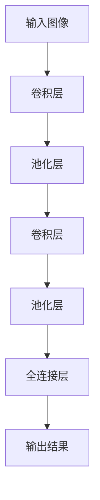

## 1. 背景介绍

卷积神经网络（Convolutional Neural Network，CNN）是一种深度学习模型，广泛应用于计算机视觉领域，如图像分类、目标检测、图像分割等任务。CNN模型的核心思想是通过卷积操作和池化操作来提取图像的特征，然后通过全连接层进行分类或回归等任务。

CNN模型的出现，极大地推动了计算机视觉领域的发展，使得图像处理任务的准确率得到了大幅提升。本文将从核心概念、算法原理、数学模型、代码实例、实际应用场景、工具和资源推荐、未来发展趋势和常见问题等方面，对卷积神经网络进行详细讲解。

## 2. 核心概念与联系

### 2.1 卷积操作

卷积操作是CNN模型的核心操作之一，它通过滑动一个卷积核（也称为滤波器）在输入图像上进行卷积运算，从而提取图像的特征。卷积操作的数学表达式如下：

$$
y_{i,j}=\sum_{m=0}^{k-1}\sum_{n=0}^{k-1}x_{i+m,j+n}h_{m,n}
$$

其中，$x$表示输入图像，$h$表示卷积核，$y$表示卷积后的输出特征图，$k$表示卷积核的大小。

### 2.2 池化操作

池化操作是CNN模型的另一个核心操作，它通过对输入特征图进行下采样，从而减少特征图的大小和参数数量，同时提高模型的鲁棒性。常见的池化操作有最大池化和平均池化两种。

### 2.3 全连接层

全连接层是CNN模型的最后一层，它将卷积层和池化层提取的特征进行展开，并通过全连接层进行分类或回归等任务。全连接层的数学表达式如下：

$$
y=Wx+b
$$

其中，$x$表示输入特征向量，$W$表示权重矩阵，$b$表示偏置向量，$y$表示输出向量。

## 3. 核心算法原理具体操作步骤

### 3.1 卷积神经网络的结构

卷积神经网络的结构通常由多个卷积层、池化层和全连接层组成，如下图所示：



### 3.2 卷积操作的实现

卷积操作的实现通常使用矩阵乘法的方式，将输入图像和卷积核展开成矩阵，然后进行矩阵乘法运算，最后将结果重新展开成特征图。具体实现步骤如下：

1. 将输入图像和卷积核展开成矩阵；
2. 对输入图像矩阵进行补零操作，以保证卷积后的特征图大小不变；
3. 对补零后的输入图像矩阵和卷积核矩阵进行矩阵乘法运算；
4. 将矩阵乘法的结果重新展开成特征图。

### 3.3 池化操作的实现

池化操作的实现通常使用滑动窗口的方式，将输入特征图分成若干个大小相同的块，然后对每个块进行下采样操作，最后将下采样后的结果重新组合成特征图。具体实现步骤如下：

1. 将输入特征图分成若干个大小相同的块；
2. 对每个块进行下采样操作，通常使用最大池化或平均池化；
3. 将下采样后的结果重新组合成特征图。

### 3.4 全连接层的实现

全连接层的实现通常使用矩阵乘法的方式，将卷积层和池化层提取的特征展开成向量，然后进行矩阵乘法运算，最后得到输出向量。具体实现步骤如下：

1. 将卷积层和池化层提取的特征展开成向量；
2. 对特征向量进行线性变换，通常使用权重矩阵和偏置向量；
3. 对线性变换的结果进行激活函数处理，通常使用ReLU函数；
4. 得到输出向量。

## 4. 数学模型和公式详细讲解举例说明

### 4.1 卷积操作的数学模型

卷积操作的数学模型可以表示为：

$$
y_{i,j}=\sum_{m=0}^{k-1}\sum_{n=0}^{k-1}x_{i+m,j+n}h_{m,n}
$$

其中，$x$表示输入图像，$h$表示卷积核，$y$表示卷积后的输出特征图，$k$表示卷积核的大小。

### 4.2 池化操作的数学模型

最大池化操作的数学模型可以表示为：

$$
y_{i,j}=\max_{m=0}^{k-1}\max_{n=0}^{k-1}x_{i+m,j+n}
$$

其中，$x$表示输入特征图，$y$表示池化后的输出特征图，$k$表示池化窗口的大小。

平均池化操作的数学模型可以表示为：

$$
y_{i,j}=\frac{1}{k^2}\sum_{m=0}^{k-1}\sum_{n=0}^{k-1}x_{i+m,j+n}
$$

其中，$x$表示输入特征图，$y$表示池化后的输出特征图，$k$表示池化窗口的大小。

### 4.3 全连接层的数学模型

全连接层的数学模型可以表示为：

$$
y=Wx+b
$$

其中，$x$表示输入特征向量，$W$表示权重矩阵，$b$表示偏置向量，$y$表示输出向量。

## 5. 项目实践：代码实例和详细解释说明

### 5.1 卷积神经网络的实现

以下是一个简单的卷积神经网络的实现代码：

```python
import torch.nn as nn

class Net(nn.Module):
    def __init__(self):
        super(Net, self).__init__()
        self.conv1 = nn.Conv2d(3, 6, 5)
        self.pool = nn.MaxPool2d(2, 2)
        self.conv2 = nn.Conv2d(6, 16, 5)
        self.fc1 = nn.Linear(16 * 5 * 5, 120)
        self.fc2 = nn.Linear(120, 84)
        self.fc3 = nn.Linear(84, 10)

    def forward(self, x):
        x = self.pool(F.relu(self.conv1(x)))
        x = self.pool(F.relu(self.conv2(x)))
        x = x.view(-1, 16 * 5 * 5)
        x = F.relu(self.fc1(x))
        x = F.relu(self.fc2(x))
        x = self.fc3(x)
        return x
```

该卷积神经网络包含两个卷积层、两个池化层和三个全连接层，其中，第一个卷积层的输入通道数为3，输出通道数为6，卷积核大小为5；第一个池化层的池化窗口大小为2；第二个卷积层的输入通道数为6，输出通道数为16，卷积核大小为5；第二个池化层的池化窗口大小为2；第一个全连接层的输入大小为16 * 5 * 5，输出大小为120；第二个全连接层的输入大小为120，输出大小为84；第三个全连接层的输入大小为84，输出大小为10。

### 5.2 CIFAR-10图像分类任务的实现

以下是一个使用卷积神经网络对CIFAR-10图像分类任务的实现代码：

```python
import torch
import torch.nn as nn
import torch.optim as optim
import torchvision
import torchvision.transforms as transforms

# 定义数据预处理
transform_train = transforms.Compose([
    transforms.RandomCrop(32, padding=4),
    transforms.RandomHorizontalFlip(),
    transforms.ToTensor(),
    transforms.Normalize((0.5, 0.5, 0.5), (0.5, 0.5, 0.5))
])

transform_test = transforms.Compose([
    transforms.ToTensor(),
    transforms.Normalize((0.5, 0.5, 0.5), (0.5, 0.5, 0.5))
])

# 加载数据集
trainset = torchvision.datasets.CIFAR10(root='./data', train=True,
                                        download=True, transform=transform_train)
trainloader = torch.utils.data.DataLoader(trainset, batch_size=128,
                                          shuffle=True, num_workers=2)

testset = torchvision.datasets.CIFAR10(root='./data', train=False,
                                       download=True, transform=transform_test)
testloader = torch.utils.data.DataLoader(testset, batch_size=100,
                                         shuffle=False, num_workers=2)

# 定义模型
class Net(nn.Module):
    def __init__(self):
        super(Net, self).__init__()
        self.conv1 = nn.Conv2d(3, 64, 3, padding=1)
        self.bn1 = nn.BatchNorm2d(64)
        self.conv2 = nn.Conv2d(64, 128, 3, padding=1)
        self.bn2 = nn.BatchNorm2d(128)
        self.conv3 = nn.Conv2d(128, 256, 3, padding=1)
        self.bn3 = nn.BatchNorm2d(256)
        self.fc1 = nn.Linear(256 * 4 * 4, 512)
        self.fc2 = nn.Linear(512, 10)

    def forward(self, x):
        x = F.relu(self.bn1(self.conv1(x)))
        x = F.max_pool2d(x, 2)
        x = F.relu(self.bn2(self.conv2(x)))
        x = F.max_pool2d(x, 2)
        x = F.relu(self.bn3(self.conv3(x)))
        x = F.max_pool2d(x, 2)
        x = x.view(-1, 256 * 4 * 4)
        x = F.relu(self.fc1(x))
        x = self.fc2(x)
        return x

# 定义损失函数和优化器
net = Net()
criterion = nn.CrossEntropyLoss()
optimizer = optim.SGD(net.parameters(), lr=0.01, momentum=0.9)

# 训练模型
for epoch in range(10):
    running_loss = 0.0
    for i, data in enumerate(trainloader, 0):
        inputs, labels = data
        optimizer.zero_grad()
        outputs = net(inputs)
        loss = criterion(outputs, labels)
        loss.backward()
        optimizer.step()
        running_loss += loss.item()
        if i % 100 == 99:
            print('[%d, %5d] loss: %.3f' %
                  (epoch + 1, i + 1, running_loss / 100))
            running_loss = 0.0

# 测试模型
correct = 0
total = 0
with torch.no_grad():
    for data in testloader:
        images, labels = data
        outputs = net(images)
        _, predicted = torch.max(outputs.data, 1)
        total += labels.size(0)
        correct += (predicted == labels).sum().item()

print('Accuracy of the network on the 10000 test images: %d %%' % (
    100 * correct / total))
```

该代码实现了一个卷积神经网络对CIFAR-10图像分类任务的训练和测试。其中，训练集和测试集的数据预处理使用了不同的方式，训练集使用了随机裁剪和随机水平翻转等数据增强方式，测试集只进行了归一化操作。模型的结构包含三个卷积层、三个池化层和两个全连接层，其中，第一个卷积层的输入通道数为3，输出通道数为64，卷积核大小为3；第一个池化层的池化窗口大小为2；第二个卷积层的输入通道数为64，输出通道数为128，卷积核大小为3；第二个池化层的池化窗口大小为2；第三个卷积层的输入通道数为128，输出通道数为256，卷积核大小为3；第三个池化层的池化窗口大小为2；第一个全连接层的输入大小为256 * 4 * 4，输出大小为512；第二个全连接层的输入大小为512，输出大小为10。训练过程中使用了交叉熵损失函数和随机梯度下降优化器，测试过程中计算了模型的准确率。

## 6. 实际应用场景

卷积神经网络在计算机视觉领域有着广泛的应用，以下是一些实际应用场景：

### 6.1 图像分类

卷积神经网络可以用于图像分类任务，如对手写数字、人脸、动物等图像进行分类。

### 6.2 目标检测

卷积神经网络可以用于目标检测任务，如检测图像中的人、车、物体等目标。

### 6.3 图像分割

卷积神经网络可以用于图像分割任务，如将图像分成若干个区域，并对每个区域进行分类或回归等任务。

### 6.4 视频分析

卷积神经网络可以用于视频分析任务，如对视频中的人、车、物体等目标进行跟踪、识别等任务。

## 7. 工具和资源推荐

以下是一些卷积神经网络的工具和资源推荐：

### 7.1 PyTorch

PyTorch是一个开源的深度学习框架，支持动态图和静态图两种计算图模式，易于使用和扩展。

### 7.2 TensorFlow

TensorFlow是一个开源的深度学习框架，支持静态图和动态图两种计算图模式，具有良好的跨平台性和可扩展性。

### 7.3 Keras

Keras是一个高级深度学习框架，基于TensorFlow、Theano和CNTK等后端实现，易于使用和扩展。

### 7.4 ImageNet

ImageNet是一个大规模的图像数据集，包含超过1400万张图像和20000个类别，是卷积神经网络的重要数据集之一。

### 7.5 CIFAR-10

CIFAR-10是一个小规模的图像数据集，包含60000张32x32的彩色图像和10个类别，是卷积神经网络的常用数据集之一。

## 8. 总