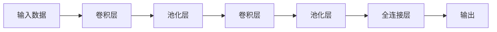
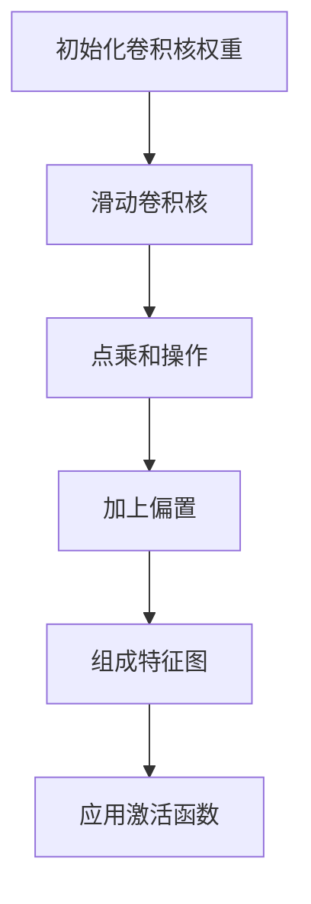
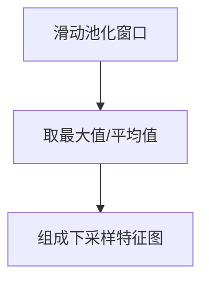
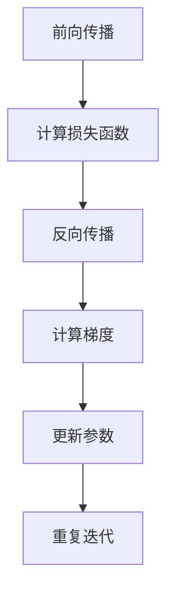

# 卷积神经网络(CNN)原理与代码实战案例讲解

## 1.背景介绍

### 1.1 神经网络的发展历程

人工神经网络(Artificial Neural Network, ANN)是一种受生物神经系统启发而设计的计算模型。早期的神经网络可以追溯到20世纪40年代,当时沃伦·麦卡洛克(Warren McCulloch)和沃尔特·皮茨(Walter Pitts)提出了第一个神经网络计算模型。然而,由于当时计算能力的限制,神经网络的发展一度陷入停滞。

直到20世纪80年代,受到统计学习理论的推动,神经网络研究重新兴起。这一时期,反向传播算法(Backpropagation)的提出,为训练多层神经网络提供了有效的方法。同时,计算机硬件的飞速发展,也为神经网络的训练提供了必要的计算能力。

### 1.2 卷积神经网络(CNN)的兴起

在众多神经网络模型中,卷积神经网络(Convolutional Neural Network, CNN)因其在图像识别和计算机视觉领域的卓越表现而备受关注。CNN最早由昆虫视觉系统的生物学家David Hubel和Torsten Wiesel的研究工作所启发,他们发现了视觉皮层中存在用于检测特定模式的神经元。

1998年,LeCun等人在手写数字识别领域取得了突破性的成果,使用CNN在手写数字识别任务上获得了最好的性能。此后,CNN在图像分类、目标检测、语义分割等计算机视觉任务中表现出色,成为该领域的主导模型之一。

### 1.3 CNN在实际应用中的重要性

CNN已经广泛应用于各个领域,包括但不限于:

- **计算机视觉**: 图像分类、目标检测、语义分割、实例分割等
- **自然语言处理**: 文本分类、机器翻译、文本生成等
- **语音识别**: 语音识别、语音合成等
- **医疗影像分析**: 肺部CT扫描分析、皮肤病变检测等
- **无人驾驶**: 交通标志识别、行人检测等

CNN的强大性能和广泛应用,使其成为当前人工智能领域最重要的技术之一。

## 2.核心概念与联系

### 2.1 CNN的基本结构

CNN由多个特殊的神经网络层组成,这些层共同构建了一个端到端的系统,用于从原始输入数据(如图像)中自动学习特征并进行预测。CNN的典型结构包括以下几个主要层:

1. **卷积层(Convolutional Layer)**: 通过滑动卷积核(Kernel)在输入数据上进行卷积操作,提取局部特征。
2. **池化层(Pooling Layer)**: 对卷积层的输出进行下采样,减小特征图的维度,提高计算效率。
3. **全连接层(Fully Connected Layer)**: 将前面层的特征映射到最终的输出空间,用于分类或回归任务。



### 2.2 卷积层

卷积层是CNN的核心部分,它通过卷积操作在输入数据上提取局部特征。卷积操作可以用数学公式表示为:

$$
(I * K)(i, j) = \sum_{m} \sum_{n} I(i+m, j+n) K(m, n)
$$

其中,`I`表示输入数据,`K`表示卷积核,`*`表示卷积操作。卷积核在输入数据上滑动,对每个位置进行点乘和操作,生成一个新的特征图。

卷积层的参数包括卷积核的权重和偏置。在训练过程中,这些参数会不断更新,使得卷积层能够学习到有效的特征表示。

### 2.3 池化层

池化层通过下采样操作减小特征图的维度,从而降低计算量和内存占用。常见的池化操作有最大池化(Max Pooling)和平均池化(Average Pooling)。

最大池化操作保留每个池化窗口中的最大值,而平均池化则计算每个窗口中元素的平均值。池化层不包含可训练的参数,但它可以提高模型的鲁棒性,并捕获输入数据的不变性。

### 2.4 全连接层

全连接层是CNN的最后一部分,它将前面层的特征映射到最终的输出空间。全连接层的每个神经元与前一层的所有神经元相连,因此它可以捕获全局特征。

全连接层的参数包括权重矩阵和偏置向量。在训练过程中,这些参数会不断更新,使得模型能够学习到有效的映射函数,从而实现分类或回归任务。

### 2.5 激活函数

激活函数在CNN的各个层中扮演着重要的角色,它引入非线性,使得模型能够学习复杂的映射关系。常见的激活函数包括ReLU(Rectified Linear Unit)、Sigmoid和Tanh等。

ReLU函数是目前最流行的激活函数之一,它的公式为:

$$
f(x) = \max(0, x)
$$

ReLU函数具有计算简单、收敛快等优点,在很大程度上推动了深度神经网络的发展。

## 3.核心算法原理具体操作步骤

### 3.1 卷积操作

卷积操作是CNN的核心算法,它通过在输入数据上滑动卷积核,提取局部特征。具体步骤如下:

1. 初始化卷积核的权重,通常使用小的随机值。
2. 将卷积核在输入数据上滑动,对每个位置进行点乘和操作。
3. 对每个位置的点乘和结果加上偏置,得到该位置的输出值。
4. 将所有位置的输出值组成一个新的特征图。
5. 对特征图应用激活函数,引入非线性。



### 3.2 池化操作

池化操作用于下采样特征图,减小维度。最大池化和平均池化是两种常见的池化方法,具体步骤如下:

**最大池化**:

1. 在特征图上滑动池化窗口。
2. 对每个窗口中的元素取最大值,作为该窗口的输出值。
3. 将所有窗口的输出值组成一个新的下采样特征图。

**平均池化**:

1. 在特征图上滑动池化窗口。
2. 对每个窗口中的元素取平均值,作为该窗口的输出值。
3. 将所有窗口的输出值组成一个新的下采样特征图。



### 3.3 反向传播

CNN的训练过程采用反向传播算法,通过梯度下降法不断更新网络参数,使得模型在训练数据上的损失函数值最小化。具体步骤如下:

1. 前向传播,计算模型在训练数据上的输出和损失函数值。
2. 反向传播,计算损失函数相对于每个参数的梯度。
3. 根据梯度值,使用优化算法(如SGD、Adam等)更新网络参数。
4. 重复步骤1-3,直到模型收敛或达到指定的迭代次数。



## 4.数学模型和公式详细讲解举例说明

### 4.1 卷积操作的数学表示

卷积操作可以用数学公式表示为:

$$
(I * K)(i, j) = \sum_{m} \sum_{n} I(i+m, j+n) K(m, n)
$$

其中,`I`表示输入数据,`K`表示卷积核,`*`表示卷积操作。`i`和`j`表示输出特征图中的位置,`m`和`n`表示卷积核的大小。

例如,对于一个3x3的输入数据`I`和一个2x2的卷积核`K`,卷积操作的过程如下:

```
I = [[1, 2, 3],
     [4, 5, 6],
     [7, 8, 9]]

K = [[1, 2],
     [3, 4]]

(I * K)(1, 1) = 1*1 + 2*3 + 4*2 + 5*4
              = 1 + 6 + 8 + 20
              = 35
```

在实际应用中,卷积操作通常会设置步长(stride)和填充(padding)参数,以控制输出特征图的大小和边界处理方式。

### 4.2 池化操作的数学表示

池化操作用于下采样特征图,减小维度。最大池化和平均池化是两种常见的池化方法,它们的数学表示如下:

**最大池化**:

$$
\text{max\_pool}(X)_{i,j} = \max_{m,n} X_{i+m, j+n}
$$

其中,`X`表示输入特征图,`i`和`j`表示输出特征图中的位置,`m`和`n`表示池化窗口的大小。

**平均池化**:

$$
\text{avg\_pool}(X)_{i,j} = \frac{1}{mn} \sum_{m,n} X_{i+m, j+n}
$$

其中,`X`表示输入特征图,`i`和`j`表示输出特征图中的位置,`m`和`n`表示池化窗口的大小,`mn`表示池化窗口的面积。

例如,对于一个4x4的输入特征图`X`,应用2x2的最大池化和平均池化,结果如下:

```
X = [[1, 2, 3, 4],
     [5, 6, 7, 8],
     [9, 10, 11, 12],
     [13, 14, 15, 16]]

最大池化结果:
[[6, 8],
 [14, 16]]

平均池化结果:
[[4.5, 6.5],
 [11.5, 13.5]]
```

### 4.3 反向传播算法

反向传播算法是CNN训练过程中的关键步骤,它通过计算损失函数相对于每个参数的梯度,并使用优化算法(如SGD、Adam等)更新网络参数,使得模型在训练数据上的损失函数值最小化。

假设我们有一个损失函数`L`,输入数据为`X`,模型的输出为`Y`,模型的参数为`W`和`b`。反向传播算法的目标是计算`∂L/∂W`和`∂L/∂b`,以便更新参数。

根据链式法则,我们可以将梯度分解为:

$$
\frac{\partial L}{\partial W} = \frac{\partial L}{\partial Y} \cdot \frac{\partial Y}{\partial W}
$$

$$
\frac{\partial L}{\partial b} = \frac{\partial L}{\partial Y} \cdot \frac{\partial Y}{\partial b}
$$

其中,`∂L/∂Y`可以通过损失函数的定义计算得到,而`∂Y/∂W`和`∂Y/∂b`则需要通过反向传播算法计算。

反向传播算法的具体步骤如下:

1. 前向传播,计算模型在输入数据`X`上的输出`Y`。
2. 计算`∂L/∂Y`。
3. 从输出层开始,逐层反向计算`∂Y/∂W`和`∂Y/∂b`。
4. 根据链式法则,计算`∂L/∂W`和`∂L/∂b`。
5. 使用优化算法(如SGD、Adam等)更新参数`W`和`b`。

反向传播算法的关键在于利用链式法则,逐层计算梯度,从而实现了端到端的参数更新。这种方法可以有效地训练深度神经网络,使其在复杂任务上取得出色的性能。

## 5.项目实践: 代码实例和详细解释说明

在本节中,我们将使用Python和PyTorch框架,实现一个简单的CNN模型,并在MNIST手写数字识别任务上进行训练和测试。

### 5.1 导