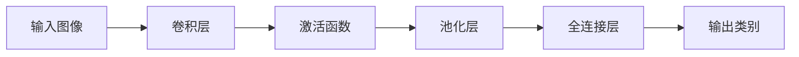

# 卷积神经网络(Convolutional Neural Networks) - 原理与代码实例讲解

## 1. 背景介绍
在深度学习的众多分支中，卷积神经网络(Convolutional Neural Networks, CNNs)无疑是最耀眼的明星之一。自从LeCun等人在20世纪90年代初提出CNN以来，它已经在图像识别、视频分析、自然语言处理等领域取得了革命性的进展。CNN的设计灵感来源于生物的视觉皮层机制，通过模拟生物视觉的层次结构，CNN能够有效地识别和处理视觉信息。

## 2. 核心概念与联系
卷积神经网络的核心概念包括局部感受野、权重共享、池化等。局部感受野指的是网络中的每个神经元只与输入数据的一个局部区域相连接，这模拟了生物视觉系统中的感受野机制。权重共享则是指在卷积层中，同一个卷积核的权重在整个输入特征图上共享，这大大减少了模型的参数数量。池化层通常跟在卷积层后面，用于降低特征维度和增强特征的鲁棒性。



## 3. 核心算法原理具体操作步骤
卷积神经网络的操作步骤通常包括以下几个阶段：
1. 输入图像预处理，包括归一化、大小调整等。
2. 卷积层的前向传播，通过卷积核提取特征。
3. 激活函数的应用，如ReLU，增加非线性。
4. 池化层的应用，进行下采样。
5. 全连接层的使用，进行分类或回归。
6. 输出层的设计，如Softmax分类器。
7. 反向传播和梯度下降，用于网络的训练。

## 4. 数学模型和公式详细讲解举例说明
以卷积层为例，其数学模型可以表示为：
$$
f_{ij}^k = \sigma\left(\sum_{u=0}^{m-1}\sum_{v=0}^{n-1}w_{uv}^k \cdot x_{i+u,j+v} + b^k\right)
$$
其中，$f_{ij}^k$ 是第$k$个卷积核在位置$(i, j)$的输出特征图上的值，$\sigma$ 是激活函数，$w_{uv}^k$ 是卷积核的权重，$x_{i+u,j+v}$ 是输入特征图上的值，$b^k$ 是偏置项，$m$ 和 $n$ 是卷积核的大小。

## 5. 项目实践：代码实例和详细解释说明
以TensorFlow和Keras为例，构建一个简单的CNN模型进行手写数字识别：
```python
import tensorflow as tf
from tensorflow.keras import layers, models

# 构建模型
model = models.Sequential()
model.add(layers.Conv2D(32, (3, 3), activation='relu', input_shape=(28, 28, 1)))
model.add(layers.MaxPooling2D((2, 2)))
model.add(layers.Conv2D(64, (3, 3), activation='relu'))
model.add(layers.MaxPooling2D((2, 2)))
model.add(layers.Conv2D(64, (3, 3), activation='relu'))
model.add(layers.Flatten())
model.add(layers.Dense(64, activation='relu'))
model.add(layers.Dense(10, activation='softmax'))

# 编译模型
model.compile(optimizer='adam',
              loss='sparse_categorical_crossentropy',
              metrics=['accuracy'])

# 训练模型
model.fit(train_images, train_labels, epochs=5)

# 评估模型
test_loss, test_acc = model.evaluate(test_images, test_labels)
```
这段代码首先构建了一个包含三个卷积层和两个全连接层的CNN模型，然后编译、训练并评估了模型。

## 6. 实际应用场景
卷积神经网络在多个领域都有广泛的应用，包括但不限于图像分类、目标检测、语音识别、自然语言处理等。

## 7. 工具和资源推荐
- TensorFlow和Keras：用于构建和训练CNN模型的开源框架。
- PyTorch：另一个流行的深度学习框架。
- OpenCV：用于图像预处理的库。
- NVIDIA CUDA和cuDNN：用于加速深度学习计算的库。

## 8. 总结：未来发展趋势与挑战
卷积神经网络的研究仍在快速发展中，未来的趋势可能包括网络架构的进一步优化、更高效的训练方法、以及对抗样本和模型解释性等方面的挑战。

## 9. 附录：常见问题与解答
Q1: 卷积神经网络和传统神经网络有什么区别？
A1: 卷积神经网络通过局部感受野和权重共享减少了模型参数，更适合处理图像等高维数据。

Q2: 如何选择合适的卷积核大小？
A2: 卷积核大小的选择通常基于实验和经验，常用的大小有3x3或5x5。

Q3: 为什么要使用池化层？
A3: 池化层可以减少特征维度，提高计算效率，同时增强特征的鲁棒性。

作者：禅与计算机程序设计艺术 / Zen and the Art of Computer Programming