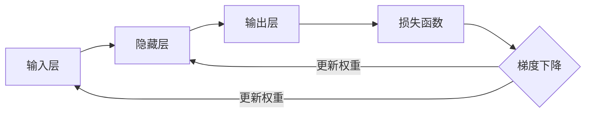

# 反向传播(Backpropagation) - 原理与代码实例讲解

## 1. 背景介绍

### 1.1 人工神经网络的发展历程
#### 1.1.1 感知机模型
#### 1.1.2 多层感知机模型 
#### 1.1.3 反向传播算法的提出

### 1.2 反向传播算法的重要性
#### 1.2.1 解决了多层神经网络的训练问题
#### 1.2.2 成为深度学习的基础算法
#### 1.2.3 在工业界得到广泛应用

## 2. 核心概念与联系

### 2.1 前向传播
#### 2.1.1 输入层、隐藏层、输出层
#### 2.1.2 激活函数
#### 2.1.3 权重和偏置

### 2.2 损失函数
#### 2.2.1 均方误差损失
#### 2.2.2 交叉熵损失
#### 2.2.3 其他常见损失函数

### 2.3 梯度下降
#### 2.3.1 梯度的概念
#### 2.3.2 学习率
#### 2.3.3 批量梯度下降、随机梯度下降、小批量梯度下降

### 2.4 反向传播
#### 2.4.1 链式法则
#### 2.4.2 计算图
#### 2.4.3 梯度的反向传播



## 3. 核心算法原理具体操作步骤

### 3.1 前向传播过程
#### 3.1.1 输入数据的准备
#### 3.1.2 隐藏层计算
#### 3.1.3 输出层计算

### 3.2 损失函数计算
#### 3.2.1 均方误差损失计算
#### 3.2.2 交叉熵损失计算

### 3.3 反向传播过程
#### 3.3.1 输出层梯度计算
#### 3.3.2 隐藏层梯度计算
#### 3.3.3 权重和偏置更新

## 4. 数学模型和公式详细讲解举例说明

### 4.1 前向传播数学模型
#### 4.1.1 隐藏层计算公式
$$ h = \sigma(Wx + b) $$
其中，$\sigma$ 为激活函数，$W$ 为权重矩阵，$x$ 为输入向量，$b$ 为偏置向量。

#### 4.1.2 输出层计算公式
$$ \hat{y} = \sigma(W'h + b') $$
其中，$\hat{y}$ 为预测输出，$W'$ 为输出层权重矩阵，$h$ 为隐藏层输出，$b'$ 为输出层偏置向量。

### 4.2 损失函数数学模型
#### 4.2.1 均方误差损失
$$ L = \frac{1}{2n} \sum_{i=1}^{n} (y_i - \hat{y}_i)^2 $$
其中，$L$ 为损失函数，$y_i$ 为真实标签，$\hat{y}_i$ 为预测输出，$n$ 为样本数量。

#### 4.2.2 交叉熵损失
$$ L = -\frac{1}{n} \sum_{i=1}^{n} [y_i \log \hat{y}_i + (1-y_i) \log (1-\hat{y}_i)] $$

### 4.3 反向传播数学模型
#### 4.3.1 输出层梯度计算
$$ \frac{\partial L}{\partial W'} = \frac{\partial L}{\partial \hat{y}} \cdot \frac{\partial \hat{y}}{\partial W'} $$
$$ \frac{\partial L}{\partial b'} = \frac{\partial L}{\partial \hat{y}} \cdot \frac{\partial \hat{y}}{\partial b'} $$

#### 4.3.2 隐藏层梯度计算
$$ \frac{\partial L}{\partial W} = \frac{\partial L}{\partial h} \cdot \frac{\partial h}{\partial W} $$
$$ \frac{\partial L}{\partial b} = \frac{\partial L}{\partial h} \cdot \frac{\partial h}{\partial b} $$

#### 4.3.3 权重和偏置更新
$$ W' = W' - \alpha \frac{\partial L}{\partial W'} $$
$$ b' = b' - \alpha \frac{\partial L}{\partial b'} $$
$$ W = W - \alpha \frac{\partial L}{\partial W} $$
$$ b = b - \alpha \frac{\partial L}{\partial b} $$
其中，$\alpha$ 为学习率。

## 5. 项目实践：代码实例和详细解释说明

下面是一个简单的反向传播神经网络的Python实现示例：

```python
import numpy as np

# 激活函数及其导数
def sigmoid(x):
    return 1 / (1 + np.exp(-x))

def sigmoid_derivative(x):
    return x * (1 - x)

# 神经网络类
class NeuralNetwork:
    def __init__(self, input_size, hidden_size, output_size):
        self.input_size = input_size
        self.hidden_size = hidden_size
        self.output_size = output_size
        
        # 初始化权重和偏置
        self.W1 = np.random.randn(self.input_size, self.hidden_size)
        self.b1 = np.zeros((1, self.hidden_size))
        self.W2 = np.random.randn(self.hidden_size, self.output_size)
        self.b2 = np.zeros((1, self.output_size))
        
    def forward(self, X):
        # 前向传播
        self.z1 = np.dot(X, self.W1) + self.b1
        self.a1 = sigmoid(self.z1)
        self.z2 = np.dot(self.a1, self.W2) + self.b2
        self.a2 = sigmoid(self.z2)
        return self.a2
    
    def backward(self, X, y, learning_rate):
        # 反向传播
        m = y.shape[0]
        
        # 输出层梯度
        dz2 = self.a2 - y
        dW2 = np.dot(self.a1.T, dz2) / m
        db2 = np.sum(dz2, axis=0, keepdims=True) / m
        
        # 隐藏层梯度
        da1 = np.dot(dz2, self.W2.T)
        dz1 = da1 * sigmoid_derivative(self.a1)
        dW1 = np.dot(X.T, dz1) / m
        db1 = np.sum(dz1, axis=0, keepdims=True) / m
        
        # 更新权重和偏置
        self.W2 -= learning_rate * dW2
        self.b2 -= learning_rate * db2
        self.W1 -= learning_rate * dW1
        self.b1 -= learning_rate * db1
        
    def train(self, X, y, epochs, learning_rate):
        for i in range(epochs):
            a2 = self.forward(X)
            self.backward(X, y, learning_rate)
            
            if i % 100 == 0:
                loss = np.mean(np.square(a2 - y))
                print(f"Epoch {i}, Loss: {loss}")

# 示例用法
X = np.array([[0, 0], [0, 1], [1, 0], [1, 1]])
y = np.array([[0], [1], [1], [0]])

nn = NeuralNetwork(2, 4, 1)
nn.train(X, y, epochs=5000, learning_rate=0.1)

print("Predictions:")
print(nn.forward(X))
```

这个示例实现了一个简单的两层神经网络，包含一个隐藏层和一个输出层。网络使用sigmoid激活函数，并采用均方误差作为损失函数。在训练过程中，通过前向传播计算输出，然后使用反向传播算法计算梯度并更新权重和偏置。最后，可以使用训练好的网络进行预测。

运行该示例代码，可以看到网络在训练过程中损失的变化情况，以及最终对输入数据的预测结果。

## 6. 实际应用场景

### 6.1 图像分类
#### 6.1.1 手写数字识别
#### 6.1.2 物体检测与识别

### 6.2 自然语言处理
#### 6.2.1 情感分析
#### 6.2.2 机器翻译
#### 6.2.3 命名实体识别

### 6.3 推荐系统
#### 6.3.1 协同过滤
#### 6.3.2 基于内容的推荐

### 6.4 异常检测
#### 6.4.1 欺诈检测
#### 6.4.2 设备故障检测

## 7. 工具和资源推荐

### 7.1 深度学习框架
#### 7.1.1 TensorFlow
#### 7.1.2 PyTorch
#### 7.1.3 Keras

### 7.2 在线课程
#### 7.2.1 吴恩达的深度学习课程
#### 7.2.2 Fast.ai课程

### 7.3 书籍推荐
#### 7.3.1 《Deep Learning》by Ian Goodfellow, Yoshua Bengio, Aaron Courville
#### 7.3.2 《Neural Networks and Deep Learning》by Michael Nielsen

## 8. 总结：未来发展趋势与挑战

### 8.1 更深更宽的网络结构
#### 8.1.1 残差网络(ResNet)
#### 8.1.2 密集连接网络(DenseNet)

### 8.2 注意力机制与Transformer
#### 8.2.1 自注意力机制
#### 8.2.2 Transformer在NLP中的应用

### 8.3 图神经网络
#### 8.3.1 图卷积网络(GCN)
#### 8.3.2 图注意力网络(GAT)

### 8.4 可解释性与安全性
#### 8.4.1 神经网络的可解释性研究
#### 8.4.2 对抗样本与鲁棒性

## 9. 附录：常见问题与解答

### 9.1 反向传播算法为什么有效？
反向传播算法通过链式法则，将损失函数对网络参数的梯度逐层传递，使得网络能够有效地学习和优化，从而找到合适的参数来拟合训练数据。

### 9.2 梯度消失和梯度爆炸问题如何解决？
可以采用以下方法缓解梯度消失和梯度爆炸问题：
- 使用ReLU等梯度友好的激活函数
- 采用残差连接(ResNet)
- 梯度裁剪
- 合适的参数初始化方法

### 9.3 如何选择合适的学习率？
选择合适的学习率可以通过以下方法：
- 学习率衰减策略，如指数衰减、阶梯衰减等
- 自适应学习率优化算法，如Adam、RMSprop等
- 通过实验和经验调整学习率

### 9.4 反向传播算法的计算复杂度如何？
对于一个具有 $n$ 个样本、$m$ 个特征、$h$ 个隐藏单元、$o$ 个输出单元的网络，反向传播算法的时间复杂度为 $O(nmho)$，空间复杂度为 $O(mh + ho)$。

作者：禅与计算机程序设计艺术 / Zen and the Art of Computer Programming