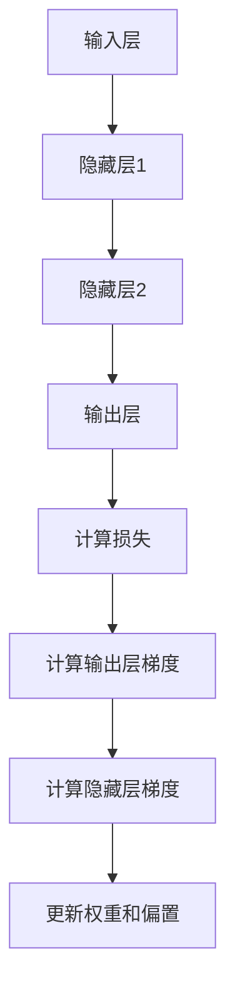

# 反向传播(Backpropagation) - 原理与代码实例讲解

## 1.背景介绍

反向传播（Backpropagation）是神经网络训练中的核心算法之一。自从1986年由Rumelhart, Hinton和Williams提出以来，反向传播已经成为深度学习领域的基石。它通过计算损失函数的梯度来更新神经网络的权重，从而使模型逐步逼近最优解。本文将深入探讨反向传播的原理、数学模型、实际应用以及代码实现。

## 2.核心概念与联系

### 2.1 神经网络基础

神经网络由多个层组成，每一层包含若干个神经元。每个神经元接收前一层的输入，通过激活函数处理后输出到下一层。神经网络的目标是通过调整权重和偏置，使输出尽可能接近目标值。

### 2.2 损失函数

损失函数（Loss Function）用于衡量模型预测值与真实值之间的差距。常见的损失函数包括均方误差（MSE）和交叉熵损失（Cross-Entropy Loss）。

### 2.3 梯度下降

梯度下降（Gradient Descent）是一种优化算法，通过计算损失函数相对于权重的梯度，逐步调整权重以最小化损失函数。反向传播正是利用梯度下降来更新神经网络的权重。

### 2.4 反向传播的核心思想

反向传播的核心思想是通过链式法则（Chain Rule）计算损失函数对每个权重的偏导数，从输出层逐层向前传播，最终更新所有权重。

## 3.核心算法原理具体操作步骤

### 3.1 前向传播

前向传播（Forward Propagation）是指从输入层到输出层的计算过程。每一层的输出作为下一层的输入，最终得到模型的预测值。

### 3.2 计算损失

通过损失函数计算模型预测值与真实值之间的差距。

### 3.3 反向传播

反向传播分为以下几个步骤：

1. **计算输出层的梯度**：计算损失函数对输出层激活值的偏导数。
2. **计算隐藏层的梯度**：利用链式法则，逐层向前计算每一层的梯度。
3. **更新权重和偏置**：利用梯度下降算法，更新每一层的权重和偏置。

以下是反向传播的Mermaid流程图：



## 4.数学模型和公式详细讲解举例说明

### 4.1 前向传播公式

假设我们有一个简单的三层神经网络，输入层、隐藏层和输出层。前向传播的公式如下：

$$
z^{(1)} = W^{(1)} x + b^{(1)}
$$

$$
a^{(1)} = \sigma(z^{(1)})
$$

$$
z^{(2)} = W^{(2)} a^{(1)} + b^{(2)}
$$

$$
a^{(2)} = \sigma(z^{(2)})
$$

其中，$W$ 是权重矩阵，$b$ 是偏置向量，$\sigma$ 是激活函数。

### 4.2 反向传播公式

反向传播的核心是计算损失函数对每个权重的偏导数。以下是反向传播的公式：

1. **输出层梯度**：

$$
\delta^{(2)} = \frac{\partial L}{\partial a^{(2)}} \odot \sigma'(z^{(2)})
$$

2. **隐藏层梯度**：

$$
\delta^{(1)} = (W^{(2)})^T \delta^{(2)} \odot \sigma'(z^{(1)})
$$

3. **权重和偏置更新**：

$$
W^{(l)} = W^{(l)} - \eta \delta^{(l)} (a^{(l-1)})^T
$$

$$
b^{(l)} = b^{(l)} - \eta \delta^{(l)}
$$

其中，$\eta$ 是学习率，$\odot$ 表示元素逐个相乘。

## 5.项目实践：代码实例和详细解释说明

### 5.1 数据准备

我们将使用Python和NumPy库来实现一个简单的神经网络。首先，准备数据集：

```python
import numpy as np

# 生成示例数据
np.random.seed(42)
X = np.random.rand(100, 2)
y = np.array([1 if x[0] + x[1] > 1 else 0 for x in X]).reshape(-1, 1)
```

### 5.2 初始化参数

初始化权重和偏置：

```python
def initialize_parameters(input_dim, hidden_dim, output_dim):
    W1 = np.random.randn(hidden_dim, input_dim) * 0.01
    b1 = np.zeros((hidden_dim, 1))
    W2 = np.random.randn(output_dim, hidden_dim) * 0.01
    b2 = np.zeros((output_dim, 1))
    return W1, b1, W2, b2
```

### 5.3 前向传播

实现前向传播：

```python
def sigmoid(z):
    return 1 / (1 + np.exp(-z))

def forward_propagation(X, W1, b1, W2, b2):
    Z1 = np.dot(W1, X.T) + b1
    A1 = sigmoid(Z1)
    Z2 = np.dot(W2, A1) + b2
    A2 = sigmoid(Z2)
    return Z1, A1, Z2, A2
```

### 5.4 计算损失

计算损失函数：

```python
def compute_loss(A2, Y):
    m = Y.shape[0]
    logprobs = np.multiply(np.log(A2), Y.T) + np.multiply(np.log(1 - A2), 1 - Y.T)
    loss = -np.sum(logprobs) / m
    return loss
```

### 5.5 反向传播

实现反向传播：

```python
def backward_propagation(X, Y, Z1, A1, Z2, A2, W2):
    m = X.shape[0]
    dZ2 = A2 - Y.T
    dW2 = np.dot(dZ2, A1.T) / m
    db2 = np.sum(dZ2, axis=1, keepdims=True) / m
    dA1 = np.dot(W2.T, dZ2)
    dZ1 = dA1 * A1 * (1 - A1)
    dW1 = np.dot(dZ1, X) / m
    db1 = np.sum(dZ1, axis=1, keepdims=True) / m
    return dW1, db1, dW2, db2
```

### 5.6 参数更新

更新权重和偏置：

```python
def update_parameters(W1, b1, W2, b2, dW1, db1, dW2, db2, learning_rate):
    W1 -= learning_rate * dW1
    b1 -= learning_rate * db1
    W2 -= learning_rate * dW2
    b2 -= learning_rate * db2
    return W1, b1, W2, b2
```

### 5.7 训练模型

训练神经网络：

```python
def train_model(X, Y, input_dim, hidden_dim, output_dim, num_iterations, learning_rate):
    W1, b1, W2, b2 = initialize_parameters(input_dim, hidden_dim, output_dim)
    for i in range(num_iterations):
        Z1, A1, Z2, A2 = forward_propagation(X, W1, b1, W2, b2)
        loss = compute_loss(A2, Y)
        dW1, db1, dW2, db2 = backward_propagation(X, Y, Z1, A1, Z2, A2, W2)
        W1, b1, W2, b2 = update_parameters(W1, b1, W2, b2, dW1, db1, dW2, db2, learning_rate)
        if i % 100 == 0:
            print(f"Iteration {i}, Loss: {loss}")
    return W1, b1, W2, b2

# 训练模型
input_dim = 2
hidden_dim = 4
output_dim = 1
num_iterations = 1000
learning_rate = 0.01

W1, b1, W2, b2 = train_model(X, y, input_dim, hidden_dim, output_dim, num_iterations, learning_rate)
```

## 6.实际应用场景

反向传播算法在多个实际应用场景中发挥了重要作用：

### 6.1 图像识别

反向传播在卷积神经网络（CNN）中的应用，使得图像识别技术取得了显著进展。通过反向传播，CNN能够自动学习图像中的特征，从而实现高精度的图像分类和目标检测。

### 6.2 自然语言处理

在自然语言处理（NLP）领域，反向传播被广泛应用于训练循环神经网络（RNN）和长短期记忆网络（LSTM）。这些模型能够处理序列数据，如文本和语音，从而实现机器翻译、情感分析等任务。

### 6.3 自动驾驶

反向传播在自动驾驶技术中也有重要应用。通过训练深度神经网络，自动驾驶系统能够识别道路、行人和交通标志，从而实现自动驾驶功能。

## 7.工具和资源推荐

### 7.1 开发工具

- **Python**：Python是实现反向传播算法的首选编程语言，拥有丰富的库和工具支持。
- **NumPy**：NumPy是Python的一个科学计算库，提供了高效的数组操作和数学函数。
- **TensorFlow**：TensorFlow是一个开源的深度学习框架，提供了高效的反向传播实现。
- **PyTorch**：PyTorch是另一个流行的深度学习框架，具有动态计算图和易用的API。

### 7.2 学习资源

- **《深度学习》**：由Ian Goodfellow等人编写的经典教材，详细介绍了反向传播算法及其应用。
- **Coursera深度学习课程**：由Andrew Ng教授讲授的深度学习课程，涵盖了反向传播的理论和实践。
- **GitHub**：在GitHub上可以找到许多开源的反向传播实现和深度学习项目，供学习和参考。

## 8.总结：未来发展趋势与挑战

反向传播作为深度学习的核心算法，已经在多个领域取得了显著成果。然而，随着数据规模和模型复杂度的增加，反向传播也面临一些挑战：

### 8.1 计算复杂度

反向传播的计算复杂度较高，尤其是在处理大规模数据和深层神经网络时，计算资源需求巨大。未来的发展趋势是通过硬件加速（如GPU和TPU）和分布式计算来提高计算效率。

### 8.2 梯度消失和爆炸

在深层神经网络中，梯度消失和爆炸问题会导致训练困难。为了解决这些问题，研究人员提出了多种改进方法，如批归一化（Batch Normalization）和残差网络（ResNet）。

### 8.3 可解释性

深度神经网络的可解释性问题一直是一个挑战。未来的研究方向是开发更具可解释性的模型和算法，使得模型的决策过程更加透明和可理解。

## 9.附录：常见问题与解答

### 9.1 反向传播的计算复杂度如何？

反向传播的计算复杂度主要取决于神经网络的层数和每层的神经元数量。一般来说，计算复杂度为 $O(n^2)$，其中 $n$ 是神经元的数量。

### 9.2 如何选择合适的学习率？

学习率的选择对模型训练效果有重要影响。学习率过大可能导致模型不收敛，学习率过小则训练速度过慢。常见的做法是通过交叉验证选择合适的学习率，或者使用自适应学习率算法（如Adam）。

### 9.3 反向传播是否适用于所有类型的神经网络？

反向传播适用于大多数类型的神经网络，包括前馈神经网络、卷积神经网络和循环神经网络。然而，对于某些特殊类型的网络（如生成对抗网络），可能需要结合其他优化算法。

### 9.4 如何处理梯度消失和爆炸问题？

梯度消失和爆炸问题可以通过以下方法缓解：
- 使用合适的激活函数（如ReLU）
- 进行权重初始化（如Xavier初始化）
- 使用批归一化（Batch Normalization）
- 采用残差网络（ResNet）

### 9.5 反向传播的实现是否依赖于特定的编程语言？

反向传播的实现不依赖于特定的编程语言。虽然Python是最常用的语言，但反向传播也可以用其他语言（如C++、Java）实现。

---

作者：禅与计算机程序设计艺术 / Zen and the Art of Computer Programming