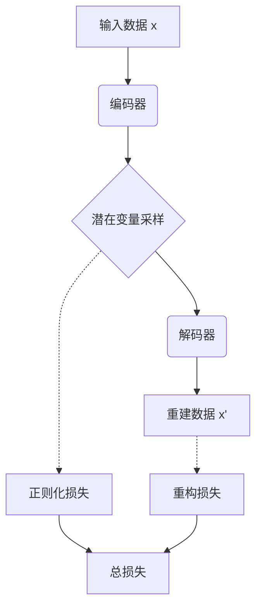

# 变分自编码器 (Variational Autoencoders, VAE) 原理与代码实例讲解

## 1. 背景介绍

### 1.1 自编码器的引入

自编码器(Autoencoder)是一种无监督学习的人工神经网络,旨在学习高维数据的低维表示。它由两部分组成:编码器(Encoder)和解码器(Decoder)。编码器将高维输入数据压缩为低维的隐藏表示,而解码器则尝试从这个隐藏表示重建原始输入数据。

传统的自编码器存在一些局限性,例如:

- 隐藏表示缺乏连续性,难以捕捉数据的潜在结构。
- 生成能力有限,无法生成新的样本。

为了解决这些问题,变分自编码器(Variational Autoencoder, VAE)应运而生。

### 1.2 变分自编码器的概念

变分自编码器是一种基于深度学习的生成模型,它结合了自编码器的思想和变分推理(Variational Inference)的概念。VAE旨在学习数据的潜在分布,从而能够生成新的类似样本。

VAE的核心思想是将隐藏表示视为潜在变量的分布,而非单一的向量。通过对这个分布进行采样,VAE可以生成新的样本。同时,VAE也能够重建原始输入数据。

## 2. 核心概念与联系

### 2.1 生成模型与变分推理

生成模型(Generative Model)是一种通过学习数据的概率分布,从而能够生成新数据的模型。常见的生成模型包括高斯混合模型(Gaussian Mixture Model, GMM)、隐马尔可夫模型(Hidden Markov Model, HMM)等。

变分推理(Variational Inference)是一种近似计算复杂概率分布的方法。由于精确计算后验分布(Posterior Distribution)通常是不可行的,变分推理通过优化一个较为简单的分布(称为变分分布),使其尽可能地近似后验分布。

VAE将生成模型和变分推理相结合,使用编码器网络来学习变分分布,解码器网络则用于生成新样本。

### 2.2 VAE的基本框架

VAE的基本框架包括以下几个核心组件:

1. **编码器(Encoder)**: 将输入数据 $\mathbf{x}$ 映射到潜在变量 $\mathbf{z}$ 的分布参数,通常是均值 $\boldsymbol{\mu}$ 和标准差 $\boldsymbol{\sigma}$。
2. **潜在变量采样(Latent Sampling)**: 从编码器输出的分布中采样潜在变量 $\mathbf{z}$。
3. **解码器(Decoder)**: 将潜在变量 $\mathbf{z}$ 映射回原始数据空间,重建输入数据 $\mathbf{x}$。
4. **重构损失(Reconstruction Loss)**: 衡量重建数据与原始数据之间的差异。
5. **正则化损失(Regularization Loss)**: 确保潜在变量分布接近预定义的先验分布(通常为标准高斯分布)。

通过优化重构损失和正则化损失的加权和,VAE可以同时学习数据的低维表示和生成新样本的能力。

## 3. 核心算法原理具体操作步骤

### 3.1 VAE的生成过程

VAE的生成过程可以表示为以下概率模型:

$$
p(\mathbf{x}, \mathbf{z}) = p(\mathbf{x} | \mathbf{z}) p(\mathbf{z})
$$

其中:

- $p(\mathbf{z})$ 是潜在变量 $\mathbf{z}$ 的先验分布,通常设置为标准高斯分布 $\mathcal{N}(\mathbf{0}, \mathbf{I})$。
- $p(\mathbf{x} | \mathbf{z})$ 是条件概率分布,表示给定潜在变量 $\mathbf{z}$ 时,生成数据 $\mathbf{x}$ 的概率。

生成新样本的过程如下:

1. 从先验分布 $p(\mathbf{z})$ 中采样一个潜在变量 $\mathbf{z}$。
2. 将采样的潜在变量 $\mathbf{z}$ 输入到解码器网络中,得到新样本 $\mathbf{x}$ 的概率分布 $p(\mathbf{x} | \mathbf{z})$。
3. 从概率分布 $p(\mathbf{x} | \mathbf{z})$ 中采样一个新样本 $\mathbf{x}$。

### 3.2 变分推理与重参数技巧

由于后验分布 $p(\mathbf{z} | \mathbf{x})$ 通常难以计算,VAE采用变分推理的思想,引入一个变分分布 $q(\mathbf{z} | \mathbf{x})$ 来近似后验分布。编码器网络的作用就是学习这个变分分布的参数。

为了能够对变分分布进行优化,VAE引入了重参数技巧(Reparameterization Trick)。具体来说,我们可以将潜在变量 $\mathbf{z}$ 表示为:

$$
\mathbf{z} = \boldsymbol{\mu}(\mathbf{x}) + \boldsymbol{\sigma}(\mathbf{x}) \odot \boldsymbol{\epsilon}, \quad \boldsymbol{\epsilon} \sim \mathcal{N}(\mathbf{0}, \mathbf{I})
$$

其中 $\boldsymbol{\mu}(\mathbf{x})$ 和 $\boldsymbol{\sigma}(\mathbf{x})$ 分别是编码器网络输出的均值和标准差,而 $\boldsymbol{\epsilon}$ 是一个标准高斯噪声向量。通过这种重参数化,我们可以将采样过程视为一个确定性操作,从而使得梯度可以通过采样过程反向传播。

### 3.3 VAE的优化目标

VAE的优化目标是最小化证据下界(Evidence Lower Bound, ELBO),它是对数似然函数的一个下界:

$$
\begin{aligned}
\log p(\mathbf{x}) &\geq \mathbb{E}_{q(\mathbf{z} | \mathbf{x})}\left[\log \frac{p(\mathbf{x}, \mathbf{z})}{q(\mathbf{z} | \mathbf{x})}\right] \\
&=\mathbb{E}_{q(\mathbf{z} | \mathbf{x})}\left[\log \frac{p(\mathbf{x} | \mathbf{z}) p(\mathbf{z})}{q(\mathbf{z} | \mathbf{x})}\right] \\
&=\mathbb{E}_{q(\mathbf{z} | \mathbf{x})}\left[\log p(\mathbf{x} | \mathbf{z})\right]-D_{\mathrm{KL}}(q(\mathbf{z} | \mathbf{x}) \| p(\mathbf{z}))
\end{aligned}
$$

其中:

- $\mathbb{E}_{q(\mathbf{z} | \mathbf{x})}\left[\log p(\mathbf{x} | \mathbf{z})\right]$ 是重构项,衡量重建数据与原始数据之间的差异。
- $D_{\mathrm{KL}}(q(\mathbf{z} | \mathbf{x}) \| p(\mathbf{z}))$ 是KL散度项,用于约束变分分布 $q(\mathbf{z} | \mathbf{x})$ 接近先验分布 $p(\mathbf{z})$。

通过最小化 ELBO,VAE可以同时优化重构项和正则化项,实现高质量的数据重建和有意义的潜在表示。

## 4. 数学模型和公式详细讲解举例说明

### 4.1 重构损失

重构损失(Reconstruction Loss)衡量重建数据 $\mathbf{x}'$ 与原始输入数据 $\mathbf{x}$ 之间的差异。常用的重构损失函数包括:

1. **均方误差(Mean Squared Error, MSE)**: 对于连续值数据,MSE是一种常用的重构损失函数:

$$
\mathcal{L}_{\text{recon}}(\mathbf{x}, \mathbf{x}') = \frac{1}{N} \sum_{i=1}^{N}\left(\mathbf{x}_i - \mathbf{x}_i'\right)^2
$$

2. **交叉熵损失(Cross Entropy Loss)**: 对于离散值数据(如图像),交叉熵损失更为合适:

$$
\mathcal{L}_{\text{recon}}(\mathbf{x}, \mathbf{x}') = -\frac{1}{N} \sum_{i=1}^{N} \sum_{j=1}^{D} \mathbf{x}_{ij} \log \mathbf{x}_{ij}'
$$

其中 $N$ 是批次大小, $D$ 是数据维度。

### 4.2 正则化损失

正则化损失(Regularization Loss)用于约束变分分布 $q(\mathbf{z} | \mathbf{x})$ 接近预定义的先验分布 $p(\mathbf{z})$,通常是标准高斯分布 $\mathcal{N}(\mathbf{0}, \mathbf{I})$。

VAE使用KL散度(Kullback-Leibler Divergence)作为正则化损失:

$$
\mathcal{L}_{\text{reg}}(\mathbf{x}) = D_{\mathrm{KL}}(q(\mathbf{z} | \mathbf{x}) \| p(\mathbf{z}))
$$

对于高斯分布,KL散度有解析解:

$$
D_{\mathrm{KL}}(q(\mathbf{z} | \mathbf{x}) \| p(\mathbf{z})) = \frac{1}{2} \sum_{j=1}^{J}\left(1 + \log\left(\sigma_j^2(\mathbf{x})\right) - \mu_j^2(\mathbf{x}) - \sigma_j^2(\mathbf{x})\right)
$$

其中 $J$ 是潜在空间的维度, $\boldsymbol{\mu}(\mathbf{x})$ 和 $\boldsymbol{\sigma}(\mathbf{x})$ 分别是编码器网络输出的均值和标准差。

### 4.3 VAE的总损失

VAE的总损失是重构损失和正则化损失的加权和:

$$
\mathcal{L}_{\text{VAE}}(\mathbf{x}, \mathbf{x}') = \mathcal{L}_{\text{recon}}(\mathbf{x}, \mathbf{x}') + \beta \mathcal{L}_{\text{reg}}(\mathbf{x})
$$

其中 $\beta$ 是一个超参数,用于平衡两项损失之间的权重。通过最小化总损失,VAE可以同时优化数据重建和潜在表示的质量。

### 4.4 示例:VAE在图像生成中的应用

假设我们希望使用VAE生成手写数字图像。输入数据 $\mathbf{x}$ 是一个 $28 \times 28$ 的灰度图像,每个像素值在 $[0, 1]$ 范围内。

1. **编码器网络**:

编码器网络将输入图像 $\mathbf{x}$ 映射到潜在变量 $\mathbf{z}$ 的均值 $\boldsymbol{\mu}(\mathbf{x})$ 和标准差 $\boldsymbol{\sigma}(\mathbf{x})$,例如:

$$
\begin{aligned}
\boldsymbol{\mu}(\mathbf{x}) &= \text{NN}_{\mu}(\mathbf{x}) \\
\log \boldsymbol{\sigma}^2(\mathbf{x}) &= \text{NN}_{\sigma}(\mathbf{x})
\end{aligned}
$$

其中 $\text{NN}_{\mu}$ 和 $\text{NN}_{\sigma}$ 是两个独立的神经网络。

2. **潜在变量采样**:

从编码器输出的分布中采样潜在变量 $\mathbf{z}$:

$$
\mathbf{z} = \boldsymbol{\mu}(\mathbf{x}) + \boldsymbol{\sigma}(\mathbf{x}) \odot \boldsymbol{\epsilon}, \quad \boldsymbol{\epsilon} \sim \mathcal{N}(\mathbf{0}, \mathbf{I})
$$

3. **解码器网络**:

解码器网络将潜在变量 $\mathbf{z}$ 映射回原始数据空间,生成重建图像 $\mathbf{x}'$:

$$
\mathbf{x}' = \text{NN}_{\text{dec}}(\mathbf{z})
$$

其中 $\text{NN}_{\text{dec}}$ 是一个神经网络。

4. **重构损失**:

由于输入数据是图像