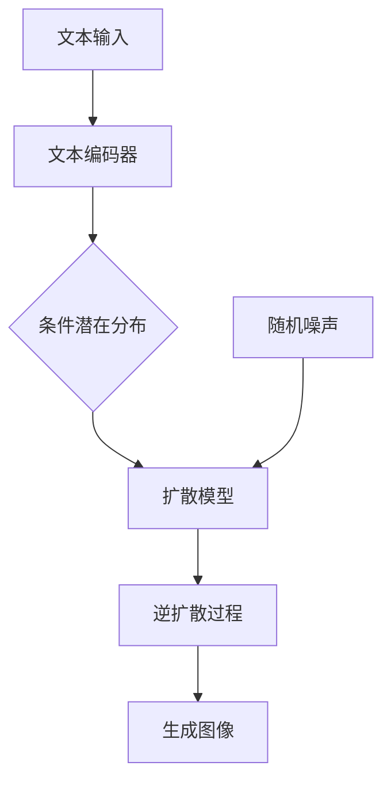

# 图像生成(Image Generation) - 原理与代码实例讲解

## 1.背景介绍

在过去的几年里,生成式人工智能(Generative AI)技术取得了长足的进步,尤其是在图像生成领域。图像生成是指使用计算机算法从随机噪声或文本描述中生成逼真的图像。这项技术在多个领域都有广泛的应用前景,如视觉艺术创作、游戏开发、虚拟现实等。

图像生成技术的发展可以追溯到20世纪90年代的像素CNN(Convolutional Neural Network)模型。但是真正的突破是在2014年,Ian Goodfellow等人提出了GAN(Generative Adversarial Network)框架,将图像生成任务建模为生成器与判别器之间的对抗博弈,极大地提高了生成图像的质量和多样性。

近年来,受到transformer模型和大规模预训练在自然语言处理领域的成功启发,一系列基于transformer的文本到图像生成模型相继问世,如DALL-E、Stable Diffusion等,它们能够根据自然语言描述生成逼真的图像,在很大程度上实现了"看图像生文字,读文字生图像"的目标。

## 2.核心概念与联系

图像生成任务的核心概念包括:

1. **生成模型(Generative Model)**: 能够从低维潜在空间中采样并生成高维数据(如图像)的模型。常见的生成模型有VAE(Variational Autoencoder)、GAN、 Diffusion Model等。

2. **潜在空间(Latent Space)**: 低维的连续向量空间,编码了生成数据(如图像)的语义信息。通过对潜在向量的操作,可控制生成图像的内容和属性。

3. **上采样(Upsampling)**: 将低分辨率的特征图放大到目标分辨率的过程。许多生成模型先生成低分辨率图像,再通过上采样获得高分辨率输出。

4. **注意力机制(Attention Mechanism)**: 赋予模型对输入的不同部分不同程度的关注能力。在文本到图像生成中,注意力机制能够有效地融合文本和图像信息。

5. **对比学习(Contrastive Learning)**: 通过最大化相似样本之间的相似度,最小化不相似样本之间的相似度,来学习数据的有效表示。在自监督预训练中被广泛使用。

这些概念相互关联、环环相扣,共同构建了现代图像生成模型的理论基础和技术路线。

## 3.核心算法原理具体操作步骤

现代图像生成模型通常采用编码器-解码器的框架结构,将输入(如噪声或文本)编码为潜在表示,再由解码器从潜在空间解码生成图像。我们以Stable Diffusion为例,介绍其核心算法的工作原理和操作步骤:



1. **文本编码**: 使用预训练的CLIP(Contrastive Language-Image Pre-training)文本编码器,将输入的自然语言描述编码为文本嵌入向量,作为条件信息。

2. **条件潜在分布**: 根据文本嵌入向量,计算条件先验分布,确定图像生成过程的起始潜在分布。

3. **扩散过程**: 将高斯噪声逐步添加到真实图像中,得到具有不同噪声水平的扩散图像序列。这个过程对应于一个从数据分布到噪声分布的马尔可夫链。

4. **逆扩散过程**: 给定纯噪声图像和条件文本嵌入,逆向推理出无噪声的图像。这是一个从噪声分布到数据分布的过程,由扩散模型(如U-Net)参数化。

5. **生成图像**: 通过迭代地从噪声中移除扰动,最终获得与输入文本描述相符的逼真图像。

整个过程中,扩散模型在文本条件的指导下,从纯噪声图像出发,逐步"去噪"生成目标图像。这种隐式建模方式避免了直接从像素级别生成图像,从而获得了更高的图像质量和多样性。

## 4.数学模型和公式详细讲解举例说明

为了更深入地理解图像生成过程,我们需要介绍一些关键的数学模型和公式。

### 4.1 扩散过程(Forward Diffusion Process)

扩散过程的目标是从真实数据分布 $q(x_0)$ 生成具有不同噪声水平的图像序列 $\{x_t\}_{t=0}^T$。其中 $x_0 \sim q(x_0)$ 表示真实图像, $x_T \sim \mathcal{N}(0, I)$ 表示纯噪声图像。

扩散过程由一个马尔可夫链参数化,其状态转移方程为:

$$
q(x_{t} | x_{t-1}) = \mathcal{N}(x_t; \sqrt{1-\beta_t}x_{t-1}, \beta_t I)
$$

其中 $\beta_t$ 是预定义的方差系数,控制了每一步添加的噪声量。通过迭代采样该马尔可夫链,可以得到从数据分布到噪声分布的扩散图像序列。

例如,假设我们有一张真实的狗图像 $x_0$,经过若干步扩散后,会得到如下噪声图像序列:


可以看到,随着扩散步数 $t$ 的增加,图像中的噪声越来越多,最终完全变为纯噪声图像 $x_T$。

### 4.2 逆扩散过程(Reverse Diffusion Process)

逆扩散过程的目的是从噪声图像 $x_T$ 生成目标图像 $x_0$,即从噪声分布到数据分布的过程。由于扩散过程是一个马尔可夫链,理论上我们可以直接通过贝叶斯公式计算逆条件概率 $p_\theta(x_{t-1} | x_t)$:

$$
p_\theta(x_{t-1} | x_t) = \frac{q(x_t | x_{t-1})q(x_{t-1})}{q(x_t)}
$$

其中 $q(x_t | x_{t-1})$ 和 $q(x_{t-1})$ 已知,但是 $q(x_t)$ 的计算是个高维积分问题,非常困难。

为了简化计算,Stable Diffusion 采用了一种基于神经网络的参数化方法。具体来说,使用一个 U-Net 作为扩散模型 $p_\theta(x_{t-1} | x_t, c)$,输入为当前噪声图像 $x_t$ 和条件文本嵌入 $c$,输出为预测的无噪声图像 $x_{t-1}$。通过迭代地执行这个"去噪"过程,最终可以从纯噪声图像生成目标图像。

### 4.3 损失函数

在训练过程中,扩散模型的损失函数定义为:

$$
\mathcal{L}_t = \mathbb{E}_{x_0, \epsilon, c} \Big[\left\| \epsilon - \epsilon_\theta(x_t, c) \right\|_2^2 \Big]
$$

其中:
- $x_0$ 为真实图像
- $\epsilon \sim \mathcal{N}(0, I)$ 为高斯噪声
- $c$ 为条件文本嵌入
- $x_t = \sqrt{\bar{\alpha}_t}x_0 + \sqrt{1 - \bar{\alpha}_t}\epsilon$ 为扩散图像
- $\epsilon_\theta(x_t, c)$ 为扩散模型的输出,即预测的噪声

通过最小化这个加性高斯噪声的负对数似然损失,模型可以学会从噪声图像中恢复出原始图像。

## 5.项目实践: 代码实例和详细解释说明

为了帮助读者更好地理解图像生成的实现细节,我们将使用 Stable Diffusion 模型生成一张狗图像,并解释关键代码。

我们使用 Hugging Face 的 🧨 Diffusers 库,它提供了 Stable Diffusion 的官方实现。首先安装必要的依赖:

```bash
pip install diffusers accelerate transformers
```

### 5.1 加载模型和管道

```python
from diffusers import StableDiffusionPipeline
import torch

model_id = "runwayml/stable-diffusion-v1-5"
pipe = StableDiffusionPipeline.from_pretrained(model_id, torch_dtype=torch.float16)
pipe = pipe.to("cuda")
```

我们从 Hugging Face Hub 加载预训练的 Stable Diffusion 模型和管道。`StableDiffusionPipeline` 封装了文本到图像生成的完整过程。

### 5.2 文本到图像生成

```python
prompt = "A cute Corgi puppy sitting on the grass"
image = pipe(prompt, num_inference_steps=50)["sample"][0]
```

我们输入一个文本提示 `"A cute Corgi puppy sitting on the grass"`。`num_inference_steps` 参数控制了逆扩散过程的迭代次数,越大意味着生成质量越高,但也需要更长的推理时间。

`pipe` 函数的输出是一个 PIL 图像对象,我们可以使用 `image.save("corgi.png")` 将其保存到本地文件。


这张可爱的柯基犬图像就是我们的生成结果!

### 5.3 控制图像属性

Stable Diffusion 还允许我们通过修改文本提示,来控制生成图像的各种属性,例如:

```python
prompt = "A cute Corgi puppy sitting on the grass, photorealistic, 4k resolution"
image = pipe(prompt, num_inference_steps=100)["sample"][0]
```


通过添加 `photorealistic, 4k resolution` 等描述词,我们得到了一张更加细节丰富、分辨率更高的柯基图像。

总的来说,Stable Diffusion 提供了一种强大而直观的方式,让我们只需输入自然语言描述,就能生成所需的图像。

## 6.实际应用场景

图像生成技术在多个领域都有广泛的应用前景:

1. **视觉艺术创作**: 艺术家可以使用文本到图像生成模型,快速创作出符合想象的艺术画作,从而提高创作效率。

2. **游戏开发**: 游戏开发者可以利用图像生成技术,自动生成大量的游戏场景、角色和物品,极大地节省了人工制作的时间和成本。

3. **虚拟现实/增强现实**: 通过文本描述即时生成逼真的 3D 环境和物体,可以为 VR/AR 应用带来身临其境的沉浸式体验。

4. **多媒体创作**: 图像生成技术可以辅助视频制作、图形设计等多媒体创作工作,提高创作效率。

5. **电商产品视觉化**: 电商平台可以根据商品描述自动生成逼真的产品图像,为消费者提供更直观的购物体验。

6. **科研可视化**: 科学家可以使用文本到图像生成技术,将抽象的理论概念或数据可视化,以便更好地交流和分享研究成果。

总的来说,图像生成技术为人类的创作活动提供了新的工具和可能性,必将在未来发挥越来越重要的作用。

## 7.工具和资源推荐

如果你对图像生成技术感兴趣并希望进一步学习和实践,这里是一些推荐的工具和资源:

1. **Stable Diffusion Web UI**: 一个方便易用的 Web 界面,可以在本地运行 Stable Diffusion 模型,并提供了丰富的参数调节选项。(https://github.com/AUTOMATIC1111/stable-diffusion-webui)

2. **Diffusers 库**: Hugging Face 官方提供的 Diffusion 模型库,包含了 Stable Diffusion 等多个预训练模型。(https://huggingface.co/docs/diffusers/index)

3. **DALL-E 2**: OpenAI 推出的文本到图像生成模型,可以通过 OpenAI API 进行在线体验。(https://openai.com/product/dall-e-2)

4. **"Generative AI" 课程**: 由 