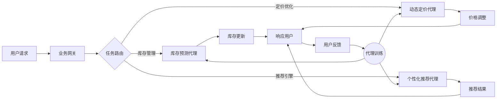

# 在电子商务中部署AI代理工作流的实战指南

## 1. 背景介绍
### 1.1 电子商务的发展现状
### 1.2 AI技术在电子商务中的应用
### 1.3 AI代理工作流的概念与优势

随着互联网技术的飞速发展,电子商务已经成为现代商业活动中不可或缺的一部分。据统计,2022年全球电子商务销售额达到了5.7万亿美元,预计到2025年这一数字将突破7万亿美元大关。面对如此庞大的市场规模和激烈的竞争环境,电商企业亟需借助前沿科技手段来提升运营效率、优化用户体验。

人工智能(Artificial Intelligence,AI)作为引领新一轮科技革命浪潮的关键技术,正在电子商务领域掀起一场深刻变革。通过机器学习、自然语言处理、计算机视觉等AI技术,电商平台可以更加智能化地管理商品目录、个性化推荐商品、优化搜索排序、自动生成营销内容等,极大提升了运营效率和用户转化率。

而AI代理工作流则是AI技术在电商领域应用的集大成者。所谓AI代理工作流,是指利用AI算法模型构建的智能代理来自动执行电商业务流程中的各项任务,实现业务全流程的自动化和智能化。与传统的规则引擎不同,AI代理具有自主学习、持续优化的能力,可以根据实时反馈动态调整策略,不断提升任务执行的效率和效果。

部署AI代理工作流可以为电商企业带来诸多好处:

1. 降低人力成本:用AI代理取代重复性高的人工操作,节省大量人力资源;
2. 提高效率:7x24小时不间断工作,任务执行效率大幅提升;
3. 优化决策:基于海量数据做出实时、精准的业务决策;
4. 提升体验:个性化、智能化的服务极大改善用户体验,提高留存率和复购率。

因此,对于电商企业而言,尽快将AI代理工作流落地到实际业务中,已经成为必然选择。本文将从技术和实践的角度,对电商AI代理工作流的部署实施提供全面指导。

## 2. 核心概念与联系
### 2.1 AI代理的定义与特点
### 2.2 工作流的定义与分类  
### 2.3 AI代理工作流的技术架构

在深入探讨AI代理工作流的技术实现之前,我们有必要对其核心概念做一番梳理。

AI代理(AI Agent)是一种基于人工智能算法模型构建的、能够自主执行特定任务的软件程序。与传统的硬编码程序不同,AI代理具有感知、推理、决策、学习的能力,可以根据环境的变化自主调整行为策略,以更好地完成既定任务。常见的AI代理有聊天机器人、推荐引擎、自动驾驶系统等。

工作流(Workflow)是一个由一系列任务活动构成的业务过程,明确规定了各活动的执行者、执行顺序、执行条件等。根据任务特点和业务需求,工作流可分为:

- 顺序流:各任务按照预设顺序依次执行
- 条件流:根据条件判断决定下一步执行的任务
- 并行流:多个任务同时执行,相互之间没有依赖关系

将AI代理引入到工作流的执行过程,就形成了AI代理工作流。如下图所示,是一个典型的电商AI代理工作流技术架构:

其中的关键组件包括:

- 业务网关:接收用户请求,解析请求参数,调用内部服务接口
- 任务路由:根据请求类型将任务分发给对应的AI代理处理
- AI代理:执行特定业务任务,如库存预测、动态定价、个性化推荐等
- 代理训练:利用用户反馈数据对AI代理进行持续训练,优化模型性能

可以看到,AI代理作为任务的执行者,是工作流中的核心组件。工作流则为AI代理的协同执行提供了一个灵活、可扩展的框架。二者高度融合,最终形成一个自动化、智能化、可持续优化的业务闭环。

## 3. 核心算法原理具体操作步骤
### 3.1 库存预测代理
#### 3.1.1 时间序列预测模型
#### 3.1.2 特征工程
#### 3.1.3 超参数优化

库存管理是电商运营的基础,准确预测未来一段时间的销量,可以帮助企业合理安排采购和仓储,避免因库存短缺导致的机会损失,也避免因库存积压导致的资金占用。库存预测代理的核心是时间序列预测模型,通过对历史销售数据进行建模,预测未来一段时间的销量走势。其主要步骤如下:

1. 数据准备:收集一定时间范围内(如近1~2年)的SKU级别历史销售数据,并进行清洗和聚合。
2. 特征工程:提取与销量相关的特征,如商品价格、促销活动、节假日、天气等,并将其转化为模型可以处理的数值型、类别型特征。  
3. 模型选择:根据数据特点和业务需求,选择合适的时间序列预测模型,如ARIMA、Prophet、LightGBM等。
4. 训练验证:将数据划分为训练集和验证集,用训练集数据训练模型,用验证集数据评估模型性能,并进行超参数调优。
5. 模型预测:用训练好的模型对未来一段时间(如未来30天)的销量进行预测。
6. 结果评估:将预测结果与实际销量进行对比,计算MAPE(平均绝对百分比误差)等评估指标,持续跟踪和优化模型性能。

以LightGBM模型为例,其核心是基于GBDT的集成学习算法。通过添加基学习器(决策树)的方式,不断减小损失函数,生成最终的强学习器。LightGBM在此基础上进行了速度和内存使用的优化,因此训练速度更快,内存占用更少。

在超参数优化时,可以重点关注以下参数:

- num_leaves:决策树的最大叶子节点数。太大会出现过拟合,太小会欠拟合,需要平衡。
- max_depth:决策树的最大深度。与num_leaves类似,需要权衡模型复杂度。
- learning_rate:每个弱学习器的权重缩减系数。较小的学习率可以得到更稳健的模型,但需要更多的迭代次数。
- feature_fraction:每次迭代时随机选择的特征比例。适当设置可以减少过拟合。

通过网格搜索或贝叶斯优化等自动调参方法,可以高效地找到最优参数组合,充分发挥模型的预测潜力。

### 3.2 动态定价代理
#### 3.2.1 强化学习模型
#### 3.2.2 状态空间与动作空间
#### 3.2.3 奖励函数设计

在电商领域,定价是影响销量和利润的关键因素。动态调整价格,可以在保证一定利润率的同时,最大化销售额。传统的定价策略多基于人工经验,难以适应瞬息万变的市场环境。动态定价代理利用强化学习技术,通过不断试错和学习,找到最优的定价策略。其核心步骤如下:

1. 问题建模:将定价问题抽象为马尔可夫决策过程(MDP),明确状态空间、动作空间和奖励函数。
  - 状态空间:影响定价的内外部因素,如商品属性、库存量、竞品价格、促销活动等。
  - 动作空间:可供选择的价格范围,可以是连续的,也可以是离散的。
  - 奖励函数:衡量定价决策的好坏,需要平衡销售额和利润率。一种常见的设计是:奖励=销售额*利润率
2. 算法选择:常用的强化学习算法有Q-learning、SARSA、DQN等,需要根据状态动作空间的大小、是否支持离散/连续动作等进行选择。
3. 探索利用:在学习初期,代理会随机尝试各种定价,积累经验(探索);随着学习的深入,逐渐选择能带来更高奖励的价格(利用)。探索利用的平衡对算法的收敛速度和效果有很大影响。
4. 效果评估:定期评估动态定价的效果,如平均销售额、利润率、客单价等指标,并与基准定价策略进行对比。

以DQN(Deep Q-Network)算法为例,其核心思想是用深度神经网络拟合Q值函数。Q值函数输入一个状态s和动作a,输出在状态s下采取动作a的期望累积奖励。DQN的主要步骤如下:

1. 初始化Q网络的参数,随机生成或载入预训练模型。
2. 与环境交互,在每个状态下根据ε-greedy策略选择动作(ε概率随机选择,1-ε概率选择Q值最大的动作)。
3. 将(s, a, r, s')的四元组存入经验回放池,其中s为当前状态,a为采取的动作,r为获得的即时奖励,s'为下一状态。
4. 从经验回放池中随机抽取一批四元组,计算Q值目标:
  - 若s'为终止状态,Q_target = r
  - 否则,Q_target = r + γ * max(Q(s', a'; θ'))
5. 用Q_target和Q(s, a; θ)的均方差作为损失函数,对Q网络进行梯度下降优化。
6. 每隔一定步数,将当前Q网络的参数θ复制给目标Q网络的参数θ'。
7. 重复步骤2~6,直到Q网络收敛或满足一定条件。

DQN相比原始的Q-learning,引入了经验回放和目标网络,一定程度上解决了数据相关性和非静态目标的问题,学习更加稳定高效。在实践中,还可以考虑引入Double DQN、Dueling DQN等改进版本,进一步提升性能。

### 3.3 个性化推荐代理
#### 3.3.1 协同过滤算法
#### 3.3.2 矩阵分解模型
#### 3.3.3 排序模型

个性化推荐是提高用户转化率和粘性的利器。通过分析用户的历史行为,挖掘用户的兴趣偏好,将最有可能吸引用户的商品推荐给用户,可以显著提升点击率和成交率。个性化推荐代理一般分为召回和排序两个阶段,常用的算法包括协同过滤、矩阵分解、FM(Factorization Machine)、Wide&Deep等。

以矩阵分解模型为例,其核心思想是将用户-物品评分矩阵分解为用户隐向量矩阵和物品隐向量矩阵的乘积,通过优化目标函数求解隐向量,再根据用户和物品的隐向量计算匹配度,生成推荐列表。主要步骤如下:

1. 构建用户-物品评分矩阵R,矩阵元素r_ui表示用户u对物品i的评分,未评分的位置用0填充。
2. 随机初始化用户隐向量矩阵P和物品隐向量矩阵Q,维度为k。
3. 定义损失函数,常用的是平方差损失:
$$L = \sum_{u,i}I_{ui}(r_{ui} - \sum_{k}p_{uk}q_{ki})^2 + \lambda(||P||^2 + ||Q||^2)$$
其中I_ui为指示函数,r_ui为0时取0,r_ui不为0时取1。λ为正则化系数,防止过拟合。
4. 用随机