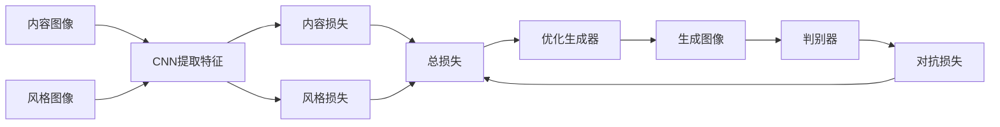

# 基于生成对抗网络的图像风格迁移竞赛平台建设

## 1. 背景介绍

### 1.1 图像风格迁移的概念与应用
图像风格迁移(Image Style Transfer)是一种利用深度学习技术,将一张图像的风格特征迁移到另一张图像内容中,生成具有艺术风格的新图像的技术。它在计算机视觉、计算机图形学、人工智能艺术创作等领域有广泛的应用前景。

### 1.2 生成对抗网络在图像风格迁移中的优势
生成对抗网络(Generative Adversarial Networks, GANs)作为一种强大的生成模型,在图像风格迁移任务中展现出巨大优势。与传统方法相比,基于GAN的风格迁移能够生成更加逼真、艺术性更强的图像。

### 1.3 图像风格迁移竞赛平台的意义
构建一个基于GAN的图像风格迁移竞赛平台,不仅能够推动该领域的技术进步,还能吸引更多研究者参与其中,激发创新灵感。同时,竞赛平台也为相关企业提供了发掘人才、寻找商业应用场景的机会。

## 2. 核心概念与联系

### 2.1 卷积神经网络(CNN)
- CNN能够自动提取图像特征,是图像风格迁移的基础
- 在风格迁移中,使用预训练的CNN提取内容图像和风格图像的特征

### 2.2 生成对抗网络(GAN) 
- 由生成器(Generator)和判别器(Discriminator)组成
- 生成器负责生成逼真的图像,判别器负责判断图像的真实性
- 通过两者的对抗学习,最终使生成器能够生成接近真实的图像

### 2.3 损失函数
- 内容损失(Content Loss):衡量生成图像与内容图像在内容特征上的相似性
- 风格损失(Style Loss):衡量生成图像与风格图像在风格特征上的相似性
- 对抗损失(Adversarial Loss):引导生成器生成更逼真的图像
- 总损失是上述三种损失的加权和



## 3. 核心算法原理与具体步骤

### 3.1 预训练VGG网络提取特征
1. 在ImageNet数据集上预训练VGG-19网络
2. 使用VGG-19的中间层提取内容图像和风格图像的特征
3. 内容特征选择较高层,风格特征选择较低层

### 3.2 定义内容损失与风格损失
1. 内容损失:生成图像与内容图像在VGG特定层输出的均方误差(MSE) 
2. 风格损失:生成图像与风格图像在VGG特定层的Gram矩阵的均方误差
3. Gram矩阵:特征图在通道维度上的内积,反映纹理信息

### 3.3 生成器与判别器的设计
1. 生成器:通常采用U-Net结构,由编码器和解码器组成
2. 判别器:采用PatchGAN结构,判断图像局部的真实性
3. 生成器与判别器交替训练,形成对抗

### 3.4 模型训练流程
1. 初始化生成器和判别器
2. 固定判别器,训练生成器,最小化内容损失、风格损失和对抗损失
3. 固定生成器,训练判别器,最大化判别器的分类准确率
4. 交替进行步骤2和3,直到模型收敛

## 4. 数学模型与公式详解

### 4.1 内容损失
内容损失用于衡量生成图像 $\hat{y}$ 与内容图像 $y_c$ 在内容特征上的相似性。设 $F_l(\cdot)$ 表示VGG网络第 $l$ 层的输出,则内容损失定义为:

$$L_{content}(\hat{y},y_c)=\frac{1}{C_lH_lW_l}\sum_{i,j}(F_l(\hat{y})-F_l(y_c))^2$$

其中,$C_l$,$H_l$,$W_l$ 分别表示特征图的通道数、高度和宽度。

### 4.2 风格损失
风格损失用于衡量生成图像 $\hat{y}$ 与风格图像 $y_s$ 在风格特征上的相似性。首先定义Gram矩阵 $G_l\in\mathbb{R}^{C_l\times C_l}$:

$$G_l(y)_{c,c'}=\frac{1}{C_lH_lW_l}\sum_{h,w}F_l(y)_{h,w,c}\cdot F_l(y)_{h,w,c'}$$

然后,风格损失定义为Gram矩阵的均方误差:

$$L_{style}(\hat{y},y_s)=\sum_{l}\frac{1}{C_l^2}\sum_{c,c'}(G_l(\hat{y})-G_l(y_s))^2$$

### 4.3 对抗损失
对抗损失源自GAN的思想,使生成图像更加逼真。令 $D(\cdot)$ 表示判别器输出,对抗损失定义为:

$$L_{adv}=\mathbb{E}_{y}[\log D(y)]+\mathbb{E}_{\hat{y}}[\log(1-D(\hat{y}))]$$

生成器 $G$ 试图最小化 $L_{adv}$,而判别器 $D$ 试图最大化 $L_{adv}$。

### 4.4 总损失
总损失是内容损失、风格损失和对抗损失的加权和:

$$L_{total}=\lambda_cL_{content}+\lambda_sL_{style}+\lambda_aL_{adv}$$

其中,$\lambda_c$,$\lambda_s$,$\lambda_a$ 为权重系数,控制各损失项的重要程度。

## 5. 项目实践:代码实例与详解

下面给出基于PyTorch实现图像风格迁移的核心代码:

```python
# 内容损失
def content_loss(gen_feat, content_feat):
    return F.mse_loss(gen_feat, content_feat)

# 风格损失  
def style_loss(gen_feat, style_feat):
    gen_gram = gram_matrix(gen_feat)
    style_gram = gram_matrix(style_feat)
    return F.mse_loss(gen_gram, style_gram)

# 对抗损失
def adversarial_loss(gen_img, discriminator):
    pred = discriminator(gen_img)
    loss = F.binary_cross_entropy(pred, torch.ones_like(pred))
    return loss

# 生成器损失
def generator_loss(gen_img, content_img, style_img, content_layers, style_layers, discriminator):
    gen_features = vgg(gen_img)
    content_features = vgg(content_img)
    style_features = vgg(style_img)
    
    content_loss_value = 0
    for layer in content_layers:
        content_loss_value += content_loss(gen_features[layer], content_features[layer])
        
    style_loss_value = 0  
    for layer in style_layers:
        style_loss_value += style_loss(gen_features[layer], style_features[layer])
        
    adv_loss = adversarial_loss(gen_img, discriminator)
    
    total_loss = content_weight * content_loss_value + style_weight * style_loss_value + adv_weight * adv_loss
    return total_loss

# 判别器损失
def discriminator_loss(real_img, gen_img, discriminator):
    real_pred = discriminator(real_img)
    fake_pred = discriminator(gen_img.detach())
    
    real_loss = F.binary_cross_entropy(real_pred, torch.ones_like(real_pred))
    fake_loss = F.binary_cross_entropy(fake_pred, torch.zeros_like(fake_pred))
    return (real_loss + fake_loss) / 2
```

以上代码分别定义了内容损失、风格损失、对抗损失以及生成器和判别器的总损失函数。在训练过程中,交替优化生成器和判别器,最小化相应的损失函数,直至模型收敛。

## 6. 实际应用场景

### 6.1 艺术创作
- 将名画风格迁移到照片上,生成独特的艺术作品
- 为游戏、动画等创建具有艺术风格的场景和角色

### 6.2 图像增强
- 提升图像的视觉质量和艺术感
- 为图像添加特定风格,如卡通化、油画化等

### 6.3 虚拟试妆与服装搭配
- 将化妆风格迁移到人像,实现虚拟试妆
- 将服装纹理迁移到模特照片,展示不同服装搭配效果

### 6.4 创意设计
- 为产品设计生成多种风格选择,如家具、手机壳等
- 为品牌设计生成统一的视觉风格,提升品牌形象

## 7. 工具与资源推荐

### 7.1 开源代码库
- PyTorch官方风格迁移教程:https://pytorch.org/tutorials/advanced/neural_style_tutorial.html
- fast-neural-style:https://github.com/pytorch/examples/tree/master/fast_neural_style
- CycleGAN:https://github.com/junyanz/CycleGAN

### 7.2 数据集
- COCO数据集:https://cocodataset.org/
- WikiArt数据集:https://www.kaggle.com/c/painter-by-numbers
- Danbooru2019动漫图像数据集:https://www.gwern.net/Danbooru2019

### 7.3 竞赛平台
- Kaggle:https://www.kaggle.com/
- 天池AI:https://tianchi.aliyun.com/
- Codalab:https://competitions.codalab.org/

## 8. 总结:未来发展趋势与挑战

### 8.1 研究趋势
- 探索更高效、更稳定的风格迁移模型架构
- 研究少样本、无监督的风格迁移方法
- 将风格迁移拓展到视频、3D模型等多种数据形式

### 8.2 应用前景
- 个性化定制服务:为用户提供个性化的艺术创作工具
- 创意设计辅助:协助设计师进行创意构思,提升工作效率
- 虚拟与增强现实:打造沉浸式的虚拟场景和艺术体验

### 8.3 面临的挑战
- 评估生成图像质量的标准尚不统一
- 迁移效果受限于训练数据,泛化能力有待提高
- 生成图像的版权归属问题有待探讨

## 9. 附录:常见问题解答

### Q1:图像风格迁移与图像翻译有何区别?
A1:图像风格迁移强调在保留内容的同时,将风格特征迁移到目标图像;而图像翻译侧重于将图像从一个域映射到另一个域,如将照片转换为草图。

### Q2:风格迁移的效果评估标准有哪些?
A2:定性评估主要通过人眼观察生成图像的视觉质量和艺术感;定量评估可使用内容损失和风格损失来衡量与原图的相似性,也可借助用户调查打分。

### Q3:如何选择合适的内容图像和风格图像?
A3:内容图像通常选择结构清晰、主体明确的图像;风格图像选择具有鲜明艺术风格、纹理丰富的作品。两幅图像的语义相似性越高,迁移效果可能越好。

### Q4:GAN在风格迁移中还有哪些改进空间?
A4:可以探索更先进的GAN变体,如WGAN、StyleGAN等;引入注意力机制、多尺度特征融合等技术;在损失函数设计上,可尝试感知损失、区块损失等。

作者:禅与计算机程序设计艺术 / Zen and the Art of Computer Programming