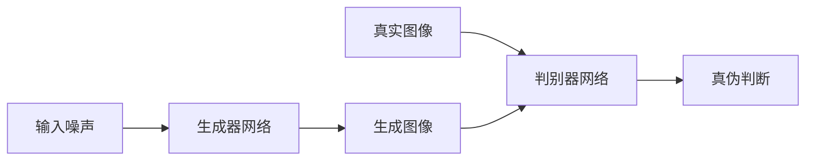
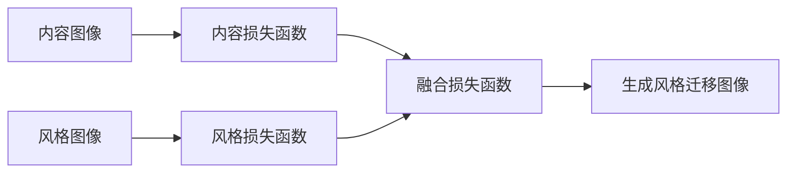

# 基于生成对抗网络的复古风格图像迁移技术开发

## 1.背景介绍

### 1.1 图像风格迁移的概念

图像风格迁移是一种将一种艺术风格应用到另一种图像上的技术。它可以将一幅图像的内容与另一种艺术风格相融合,创造出具有独特视觉效果的新图像。例如,将一张风景照片与梵高的油画风格相结合,产生出一幅具有梵高笔触特征的风景画作品。

### 1.2 复古风格图像的重要性

复古风格图像具有独特的视觉吸引力和文化价值。它们能够唤起人们对过去时代的怀念情绪,同时也体现了当时的艺术风格和审美观。在数字时代,复古风格图像为人们提供了一种与现代主流审美不同的视觉体验,因此备受追捧。

### 1.3 生成对抗网络在图像风格迁移中的应用

生成对抗网络(Generative Adversarial Networks, GANs)是一种基于深度学习的人工智能技术,它可以生成逼真的图像数据。近年来,GANs在图像风格迁移领域取得了卓越的成就,能够实现高质量的风格迁移效果。

## 2.核心概念与联系

### 2.1 生成对抗网络(GANs)

生成对抗网络由两个神经网络组成:生成器(Generator)和判别器(Discriminator)。生成器的目标是生成逼真的图像数据,而判别器则需要区分生成的图像和真实图像。两个网络相互对抗,不断优化,最终达到生成器生成的图像无法被判别器识别的状态。



### 2.2 风格迁移算法

风格迁移算法的核心思想是将内容图像和风格图像的特征进行融合,生成具有目标风格的新图像。常见的风格迁移算法包括基于神经网络的算法和基于GANs的算法。



### 2.3 复古风格表示

复古风格表示是指对复古艺术风格的数学建模和编码。常见的方法包括基于纹理特征、颜色特征和笔触特征等低级视觉特征的表示,以及基于深度学习特征提取的高级语义特征表示。

## 3.核心算法原理具体操作步骤

基于生成对抗网络的复古风格图像迁移技术通常包括以下几个关键步骤:

### 3.1 数据准备

1. 收集内容图像数据集,即需要进行风格迁移的图像数据。
2. 收集复古风格图像数据集,作为目标风格的参考。
3. 对图像数据进行预处理,如裁剪、调整大小和归一化等。

### 3.2 复古风格编码

1. 从复古风格图像数据集中提取风格特征,可以使用传统的手工特征提取方法或基于深度学习的特征提取网络。
2. 对提取的风格特征进行编码,生成风格编码向量。

### 3.3 生成对抗网络训练

1. 构建生成器网络和判别器网络,生成器用于生成风格迁移图像,判别器用于评估生成图像的真实性。
2. 定义生成器和判别器的损失函数,包括对抗损失、内容损失和风格损失等。
3. 使用内容图像数据集和风格编码向量训练生成对抗网络,通过优化损失函数,使生成器能够生成具有目标复古风格的图像。

### 3.4 风格迁移图像生成

1. 使用训练好的生成器网络,输入内容图像和风格编码向量,生成风格迁移图像。
2. 可选步骤:对生成的风格迁移图像进行后处理,如去噪、锐化等,以提高图像质量。

## 4.数学模型和公式详细讲解举例说明

### 4.1 内容损失函数

内容损失函数用于保留生成图像的内容信息,与原始内容图像相似。常用的内容损失函数是基于预训练的深度卷积神经网络提取的特征表示,计算生成图像和内容图像特征之间的均方差:

$$L_{content}(G,C) = \frac{1}{N}\sum_{i,j}(F_{ij}^G - F_{ij}^C)^2$$

其中,$F^G$和$F^C$分别是生成图像和内容图像在某一层的特征映射,$N$是特征映射的维度。

### 4.2 风格损失函数

风格损失函数用于将目标风格迁移到生成图像中,通常基于格拉姆矩阵(Gram Matrix)来计算。格拉姆矩阵捕获了特征映射之间的相关性,可以很好地表示图像的风格信息。风格损失函数定义如下:

$$L_{style}(G,S) = \sum_l w_l E_l$$

$$E_l = \frac{1}{N_l^2M_l^2}\sum_{i,j}(G_{ij}^l - S_{ij}^l)^2$$

其中,$G^l$和$S^l$分别是生成图像和风格图像在第$l$层的格拉姆矩阵,$w_l$是对应层的权重系数,$N_l$和$M_l$分别是特征映射的高度和宽度。

### 4.3 对抗损失函数

对抗损失函数用于训练生成对抗网络,使生成器能够生成逼真的图像,而判别器能够正确区分真实图像和生成图像。常用的对抗损失函数是最小化生成器和判别器之间的交叉熵:

$$L_{adv}(G,D) = \mathbb{E}_{x\sim p_{data}(x)}[\log D(x)] + \mathbb{E}_{z\sim p_z(z)}[\log(1-D(G(z)))]$$

其中,$D$是判别器,$G$是生成器,$x$是真实图像数据,$z$是输入噪声。

### 4.4 总体损失函数

综合上述三个损失函数,生成对抗网络的总体损失函数可以表示为:

$$L_{total}(G,D,C,S) = L_{content}(G,C) + \lambda_sL_{style}(G,S) + \lambda_{adv}L_{adv}(G,D)$$

其中,$\lambda_s$和$\lambda_{adv}$分别是风格损失和对抗损失的权重系数,用于平衡不同损失项的贡献。

在训练过程中,生成器$G$和判别器$D$通过优化总体损失函数,实现生成具有目标复古风格且保留内容信息的图像。

## 5.项目实践:代码实例和详细解释说明

以下是使用PyTorch实现基于生成对抗网络的复古风格图像迁移的代码示例,包括数据加载、模型定义、训练过程和风格迁移图像生成等关键步骤。

### 5.1 数据加载

```python
import torchvision.transforms as transforms

# 定义图像预处理转换
transform = transforms.Compose([
    transforms.Resize(256),
    transforms.CenterCrop(256),
    transforms.ToTensor(),
    transforms.Normalize(mean=[0.485, 0.456, 0.406], std=[0.229, 0.224, 0.225])
])

# 加载内容图像数据集
content_dataset = datasets.ImageFolder('path/to/content/images', transform=transform)
content_loader = torch.utils.data.DataLoader(content_dataset, batch_size=batch_size, shuffle=True)

# 加载风格图像数据集
style_dataset = datasets.ImageFolder('path/to/style/images', transform=transform)
style_loader = torch.utils.data.DataLoader(style_dataset, batch_size=batch_size, shuffle=True)
```

### 5.2 模型定义

```python
import torch.nn as nn

# 定义生成器网络
class Generator(nn.Module):
    def __init__(self):
        super(Generator, self).__init__()
        # 定义生成器网络结构
        ...

    def forward(self, x):
        # 实现生成器的前向传播
        ...
        return output

# 定义判别器网络
class Discriminator(nn.Module):
    def __init__(self):
        super(Discriminator, self).__init__()
        # 定义判别器网络结构
        ...

    def forward(self, x):
        # 实现判别器的前向传播
        ...
        return output
```

### 5.3 损失函数定义

```python
import torch.nn.functional as F

# 定义内容损失函数
def content_loss(gen_feat, target_feat):
    loss = F.mse_loss(gen_feat, target_feat)
    return loss

# 定义风格损失函数
def style_loss(gen_feat, style_feat):
    batch_size, channel, height, width = gen_feat.size()
    view = gen_feat.view(batch_size, channel, height * width)
    G = torch.bmm(view, view.transpose(1, 2)) / (channel * height * width)

    batch_size, channel, height, width = style_feat.size()
    view = style_feat.view(batch_size, channel, height * width)
    A = torch.bmm(view, view.transpose(1, 2)) / (channel * height * width)

    loss = F.mse_loss(G, A.detach())
    return loss

# 定义对抗损失函数
def adversarial_loss(discriminator, real, fake):
    real_loss = F.binary_cross_entropy_with_logits(discriminator(real), torch.ones_like(discriminator(real)))
    fake_loss = F.binary_cross_entropy_with_logits(discriminator(fake.detach()), torch.zeros_like(discriminator(fake.detach())))
    loss = (real_loss + fake_loss) / 2
    return loss
```

### 5.4 训练过程

```python
import torch.optim as optim

# 初始化模型和优化器
generator = Generator().to(device)
discriminator = Discriminator().to(device)
gen_optimizer = optim.Adam(generator.parameters(), lr=lr)
dis_optimizer = optim.Adam(discriminator.parameters(), lr=lr)

# 训练循环
for epoch in range(num_epochs):
    for content, style in zip(content_loader, style_loader):
        content = content.to(device)
        style = style.to(device)

        # 生成风格迁移图像
        gen_img = generator(content)

        # 计算损失函数
        content_feat = vgg(content)
        gen_feat = vgg(gen_img)
        style_feat = vgg(style)
        content_loss = content_loss(gen_feat, content_feat)
        style_loss = style_loss(gen_feat, style_feat)
        adversarial_loss = adversarial_loss(discriminator, content, gen_img)
        total_loss = content_loss + style_weight * style_loss + adv_weight * adversarial_loss

        # 优化生成器和判别器
        gen_optimizer.zero_grad()
        total_loss.backward(retain_graph=True)
        gen_optimizer.step()

        dis_optimizer.zero_grad()
        adversarial_loss.backward()
        dis_optimizer.step()

        # 记录和输出训练过程
        ...
```

### 5.5 风格迁移图像生成

```python
# 加载内容图像
content_img = load_image('path/to/content/image.jpg')

# 生成风格迁移图像
with torch.no_grad():
    stylized_img = generator(content_img.to(device))

# 保存风格迁移图像
save_image(stylized_img, 'stylized_image.jpg')
```

上述代码示例展示了如何使用PyTorch实现基于生成对抗网络的复古风格图像迁移。首先定义了数据加载、模型结构、损失函数等关键组件,然后进行模型训练,最后生成风格迁移图像。在实际项目中,您可以根据具体需求进行调整和优化,如探索不同的网络结构、损失函数权重、超参数设置等。

## 6.实际应用场景

基于生成对抗网络的复古风格图像迁移技术具有广泛的应用前景,包括但不限于以下几个领域:

### 6.1 数字艺术创作

艺术家可以利用这项技术,将现代图像与经典艺术风格相融合,创作出具有独特魅力的数字艺术作品。这不仅可以满足艺术家的创作需求,也为观众带来全新的视觉体验。

### 6.2 影视特效制作

在电影和电视剧制作中,复古风格图像迁移技术可以用于场景重建、角色造型设计等特效制作环节。通过将现代场景或人物与经典电影风格相结合,可以营造出怀旧的视觉效果,增强作品