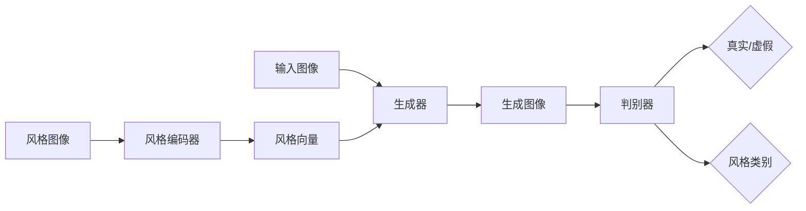
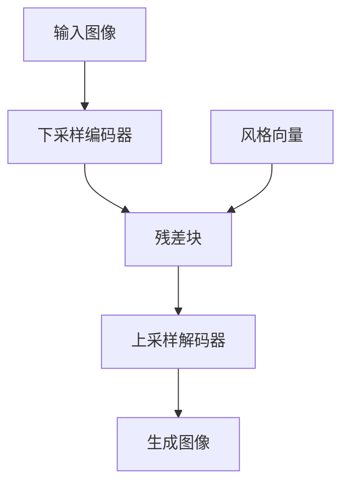
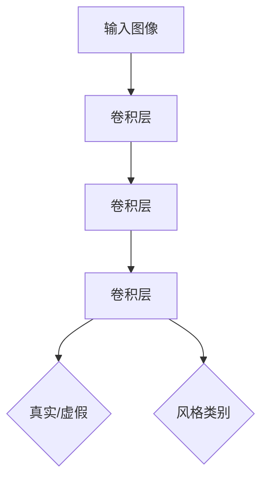
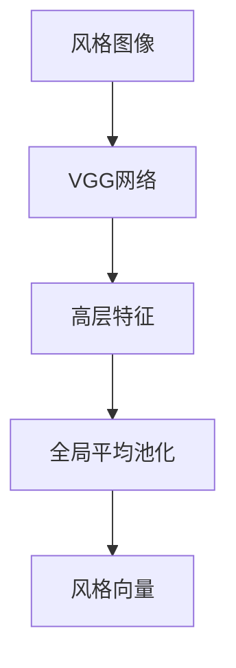

# 基于生成对抗网络的多风格图像转换模型研究

## 1. 背景介绍

### 1.1 图像风格转换的研究意义

图像风格转换是指将一幅图像的风格转换为另一幅图像的风格,同时保留原图像的内容。这项技术在计算机视觉、计算机图形学、人工智能等领域有着广泛的应用前景,如照片艺术化、视频特效制作、虚拟现实等。近年来,随着深度学习的快速发展,特别是生成对抗网络(Generative Adversarial Networks, GANs)的出现,图像风格转换取得了突破性进展。

### 1.2 生成对抗网络的优势

生成对抗网络由Goodfellow等人于2014年提出,其核心思想是通过构建一个生成器(Generator)和一个判别器(Discriminator),两者互相博弈对抗,最终使生成器能够生成以假乱真的样本。与传统的生成模型相比,GANs 具有以下优势:

1. 生成效果更加逼真,能够生成高质量、高分辨率的图像。
2. 无需先验知识,通过无监督学习自动捕捉数据分布的特征。 
3. 网络结构灵活,适用于多种不同的任务和场景。

### 1.3 多风格图像转换的挑战

尽管 GANs 在图像风格转换中取得了可喜的成果,但仍然面临着一些挑战:

1. 现有方法大多只能在两个风格之间进行转换,缺乏对多风格的支持。
2. 不同风格之间的差异较大,很难用一个统一的模型来表示。
3. 风格转换的过程难以控制,容易出现伪影、扭曲等问题。

因此,如何设计一种高效、鲁棒的多风格图像转换模型,成为了一个亟待解决的问题。本文将针对这一问题,提出一种基于生成对抗网络的多风格图像转换模型,并进行理论分析和实验验证。

## 2. 核心概念与联系

### 2.1 风格迁移

风格迁移(Style Transfer)指的是将一幅图像的风格特征迁移到另一幅图像上,使其呈现出相同的风格。早期的风格迁移方法主要基于纹理合成,通过匹配图像的统计特征(如颜色、纹理等)来实现风格迁移。但这类方法往往难以捕捉高层次的语义信息,生成的结果缺乏艺术感。

### 2.2 神经风格迁移

随着深度学习的发展,Gatys等人于2016年提出了一种基于卷积神经网络(CNN)的神经风格迁移方法。该方法利用预训练的 CNN 提取图像的内容特征和风格特征,然后通过最小化内容损失和风格损失来生成风格迁移图像。这种方法能够很好地保留图像的语义内容,同时呈现出艺术家风格的纹理和色彩。

### 2.3 生成对抗网络

生成对抗网络由生成器和判别器组成,通过两者的对抗学习,使生成器能够生成接近真实数据分布的样本。其中,生成器接收随机噪声作为输入,输出生成的图像;判别器接收真实图像和生成图像,输出它们是真实样本的概率。训练过程中,生成器努力生成以假乱真的图像来欺骗判别器,而判别器则不断提升自己的判别能力。最终,两者达到了一个动态平衡,生成器生成的图像与真实图像难以区分。

### 2.4 图像到图像转换

图像到图像转换(Image-to-Image Translation)指的是将一幅输入图像映射为另一幅输出图像,常见的任务包括:图像着色、图像超分辨率、语义分割等。近年来,研究者们发现 GANs 非常适合解决这类问题。例如,Isola等人提出的 Pix2Pix 模型,使用条件 GAN 实现了成对图像之间的转换。Zhu等人提出的 CycleGAN,进一步实现了无需成对数据的图像到图像转换。

### 2.5 多风格迁移与本文工作

在实际应用中,我们往往需要在多个风格之间进行选择和转换,单一风格的迁移方法难以满足需求。为此,研究者们提出了多风格迁移的思路,即在一个统一的框架下同时建模多种风格。Chang等人提出的多风格迁移网络,在编码器-解码器结构中加入了风格编码,实现了对任意数量风格的迁移。但该方法没有利用 GANs 的思想,生成效果有待提升。

本文受到多风格迁移和 GANs 的启发,提出了一种基于生成对抗网络的多风格图像转换模型。该模型引入风格编码来表示不同风格,通过 GANs 的对抗训练来提升生成质量,同时加入循环一致性损失来增强风格转换的稳定性。与现有方法相比,该模型能够灵活地在多种风格间进行转换,生成效果更加逼真自然。

## 3. 核心算法原理具体操作步骤

### 3.1 模型整体架构

本文提出的多风格图像转换模型主要由三部分组成:生成器、判别器和风格编码器。其中,生成器负责将输入图像转换为目标风格的图像;判别器负责判断生成图像是否真实并属于目标风格;风格编码器负责将风格图像编码为风格向量。模型的整体架构如下图所示:

### 3.2 生成器

生成器采用编码器-解码器结构,由下采样编码器、残差块和上采样解码器组成。编码器将输入图像编码为特征图,残差块对特征图进行非线性变换,解码器将变换后的特征图解码为输出图像。为了引入风格信息,我们将风格向量与编码器的输出特征图相连接,作为残差块的输入。生成器的结构如下:

### 3.3 判别器

判别器采用 PatchGAN 的结构,将输入图像划分为多个局部块,对每个块进行真实/虚假的二分类判断。同时,我们在判别器的最后一层添加了一个辅助分类器,用于判断输入图像属于哪一种风格。判别器的结构如下:

### 3.4 风格编码器

风格编码器将风格图像编码为固定长度的风格向量,用于指导生成器的风格转换。我们采用预训练的 VGG 网络作为风格编码器,提取风格图像的高层特征作为风格向量。风格编码器的结构如下:

### 3.5 损失函数设计

模型的训练目标是最小化以下损失函数:

1. 对抗损失:使生成图像尽可能逼真,并属于目标风格。
2. 循环一致性损失:确保将生成图像再次输入模型时,能够重构出原始图像。
3. 身份损失:确保将图像转换为同一风格时,图像内容不会发生改变。

对抗损失采用 LSGAN 的形式,循环一致性损失和身份损失采用 L1 范数。总的损失函数定义为:

$$\mathcal{L} = \mathcal{L}_{GAN} + \lambda_1 \mathcal{L}_{cyc} + \lambda_2 \mathcal{L}_{idt}$$

其中 $\lambda_1$ 和 $\lambda_2$ 为平衡因子,控制不同损失的权重。

### 3.6 训练过程

模型的训练过程分为两个阶段:

1. 预训练阶段:分别训练风格编码器和判别器,使其能够准确地编码风格和判别真假。
2. 对抗训练阶段:交替训练生成器和判别器,使生成器尽可能生成逼真的目标风格图像,同时使判别器尽可能判别生成图像的真假和风格。

每个训练批次的具体步骤如下:

1. 从数据集中采样一批次的内容图像、风格图像和噪声向量。
2. 将风格图像输入风格编码器,得到风格向量。
3. 将内容图像和风格向量输入生成器,得到生成图像。
4. 将生成图像和真实图像输入判别器,计算对抗损失。
5. 将生成图像再次输入生成器,计算循环一致性损失。
6. 将内容图像输入生成器,计算身份损失。
7. 反向传播,更新生成器和判别器的参数。

重复以上步骤,直到模型收敛或达到预设的迭代次数。

## 4. 数学模型和公式详细讲解举例说明

### 4.1 对抗损失

对抗损失的目的是使生成图像尽可能逼真,并属于目标风格。我们采用 LSGAN 的形式定义对抗损失,其中判别器损失为:

$$\mathcal{L}_{D} = \mathbb{E}_{x,y}[(D(x,y)-1)^2] + \mathbb{E}_{x,z,c}[D(G(x,z,c),c)^2]$$

生成器损失为:

$$\mathcal{L}_{G} = \mathbb{E}_{x,z,c}[(D(G(x,z,c),c)-1)^2]$$

其中 $x$ 为内容图像,$y$ 为真实图像,$z$ 为噪声向量,$c$ 为风格向量,$G$ 为生成器,$D$ 为判别器。

举例说明:假设我们要将一幅风景照转换为梵高风格的油画。判别器的目标是将真实的梵高油画判别为真(标签为1),将生成的油画判别为假(标签为0)。生成器的目标是生成逼真的梵高风格油画,使判别器将其判别为真。通过两者的博弈,生成器最终可以生成以假乱真的梵高风格油画。

### 4.2 循环一致性损失

循环一致性损失的目的是确保将生成图像再次输入模型时,能够重构出原始图像。我们定义两个方向的循环一致性损失:

$$\mathcal{L}_{cyc1} = \mathbb{E}_{x,z,c}[||G(G(x,z,c),z,c')-x||_1]$$

$$\mathcal{L}_{cyc2} = \mathbb{E}_{y,z,c}[||G(G(y,z,c'),z,c)-y||_1]$$

其中 $c'$ 为原始图像的风格向量。

举例说明:还是以风景照到梵高油画的转换为例。如果我们将生成的梵高风格油画再次输入模型,并指定风格为原始风景照的风格,那么模型应该能够重构出原始的风景照。这样可以确保模型真正学习到了风格转换的本质,而不是简单地改变图像的外观。

### 4.3 身份损失

身份损失的目的是确保将图像转换为同一风格时,图像内容不会发生改变。我们定义身份损失为:

$$\mathcal{L}_{idt} = \mathbb{E}_{x,c}[||G(x,z,c)-x||_1]$$

举例说明:假设我们将一幅梵高风格的油画输入模型,并指定风格仍为梵高风格,那么模型应该输出与原图一致的油画,不应该改变油画的内容。这样可以确保模型在转换风格的同时,尽可能保留原始图像的语义信息。

## 5. 项目实践：代码实例和详细解释说明

下面我们给出基于 PyTorch 实现多风格图像转换模型的