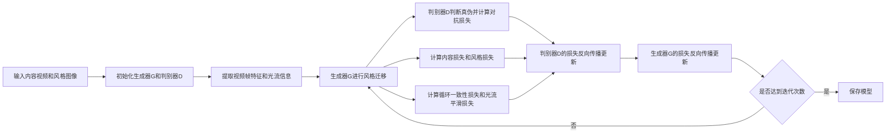

# 基于生成对抗网络的实时视频风格迁移系统设计

## 1. 背景介绍
### 1.1 视频风格迁移的概念与意义
视频风格迁移是指将一个视频中的内容迁移到另一种艺术风格中,同时保留原始视频的内容和动态特征。这种技术可以让普通视频呈现出如油画、水彩画、卡通等多种艺术风格,为视频创作提供了更多的创意可能,在短视频、影视特效、游戏等领域有广泛的应用前景。

### 1.2 生成对抗网络在视频风格迁移中的应用
生成对抗网络(Generative Adversarial Networks, GANs)由生成器和判别器组成,通过两者的对抗学习,可以生成逼真的图像。将GAN应用到视频风格迁移任务中,可以学习到视频内容和艺术风格的特征表示,从而生成高质量的风格化视频。但视频中存在时间连续性,直接将图像风格迁移方法应用到视频会产生闪烁等问题,需要进行针对性的改进。

### 1.3 实时视频风格迁移面临的挑战
视频风格迁移需要在保证视觉质量的同时,做到实时处理,这对算法提出了很高的要求:

1. 视频帧之间存在连续性,风格迁移结果要平滑一致,避免闪烁抖动。
2. 要在有限的计算资源下达到实时性能,网络结构和推理过程需要优化。  
3. 不同风格的学习和迁移过程要快速灵活,最好能做到任意风格迁移。

本文将针对这些挑战,设计一个基于生成对抗网络的实时视频风格迁移系统。

## 2. 核心概念与联系
### 2.1 卷积神经网络
卷积神经网络(Convolutional Neural Networks, CNNs)通过卷积、池化等操作提取图像特征,并通过反向传播算法优化网络参数,是图像识别等任务的主流模型。在风格迁移中,CNN可以用于提取内容图像和风格图像的特征。

### 2.2 生成对抗网络 
生成对抗网络由生成器(Generator)和判别器(Discriminator)组成。生成器尝试生成接近真实样本的数据,判别器尝试区分生成样本和真实样本。两个网络互相博弈,最终生成器可以生成以假乱真的数据。GAN常用于图像生成、风格迁移等任务。

### 2.3 循环一致性损失
循环一致性损失(Cycle Consistency Loss)常见于 CycleGAN 等图像转换模型中。它要求一个图像经过两个相反的转换后,能够尽可能还原到原始图像。引入循环一致性损失,可以缓解模式崩塌问题,使转换结果更加稳定。在视频风格迁移中,循环一致性损失可以提高帧间一致性。

### 2.4 光流估计
光流(Optical Flow)反映了视频序列中物体的运动情况,可以用于运动补偿、目标跟踪等任务。在视频风格迁移中,光流信息可以引导风格迁移过程,使相邻帧的转换结果更加平滑连贯。常见的光流估计方法有 Lucas-Kanade, Gunnar Farneback 等。

### 2.5 知识蒸馏
知识蒸馏(Knowledge Distillation)指的是使用一个大型复杂的教师网络(Teacher Network)去指导一个小型简单的学生网络(Student Network),使学生网络能够接近甚至超越教师网络的性能。在实时视频风格迁移中,可以先用复杂的模型离线训练,再通过知识蒸馏得到一个轻量高效的实时模型。

## 3. 核心算法原理具体操作步骤
本节介绍基于生成对抗网络的视频风格迁移算法的核心原理和具体步骤。总体流程如下:

### 3.1 模型结构设计
#### 3.1.1 生成器
生成器采用 U-Net 结构,由编码器和解码器组成。编码器逐步降低特征图尺寸并提取高级语义信息,解码器逐步恢复空间分辨率并融合不同尺度的特征。在编码器和解码器之间添加跳跃连接,以传递位置信息。生成器的输入是内容视频帧和光流信息,输出是风格化后的视频帧。

#### 3.1.2 判别器
判别器采用 PatchGAN 结构,将输入图像划分为多个补丁,并对每个补丁进行真假判断。相比全图判别器,PatchGAN 更关注局部纹理细节,并且计算效率更高。判别器的输入是风格化后的视频帧或真实风格图像,输出是每个补丁的真假概率。

### 3.2 目标函数设计
模型训练的目标是最小化以下损失函数:

$$ \mathcal{L}_{total} = \mathcal{L}_{adv} + \lambda_c \mathcal{L}_{content} + \lambda_s \mathcal{L}_{style} + \lambda_{cyc} \mathcal{L}_{cycle} + \lambda_f \mathcal{L}_{flow} $$

其中 $\mathcal{L}_{adv}$ 是对抗损失,用于度量生成视频帧的真实程度:

$$ \mathcal{L}_{adv} = \mathbb{E}_{x \sim p_{data}(x)}[\log D(x)] + \mathbb{E}_{z \sim p_z(z)}[\log (1 - D(G(z)))] $$

$\mathcal{L}_{content}$ 是内容损失,用于度量生成视频帧与原始视频帧的内容相似性,通过特征图的均方误差计算:

$$ \mathcal{L}_{content} = \mathbb{E}_{x,y} [\| \phi(G(x)) - \phi(y) \|_2^2] $$

$\mathcal{L}_{style}$ 是风格损失,用于度量生成视频帧与风格图像的风格相似性,通过特征图的 Gram 矩阵差异计算:

$$ \mathcal{L}_{style} = \mathbb{E}_{x,s} [\| G(\phi(G(x))) - G(\phi(s)) \|_2^2] $$

$\mathcal{L}_{cycle}$ 是循环一致性损失,用于度量经过两次相反风格迁移后,视频帧是否能够还原:

$$ \mathcal{L}_{cycle} = \mathbb{E}_{x} [\| G_{S \rightarrow C}(G_{C \rightarrow S}(x)) - x \|_1] $$

$\mathcal{L}_{flow}$ 是光流平滑损失,用于度量相邻帧风格迁移结果的一致性:

$$ \mathcal{L}_{flow} = \mathbb{E}_{x_t, x_{t+1}} [\| G(x_t) - \mathcal{W}(G(x_{t+1}), f_{t \rightarrow t+1}) \|_1] $$

其中 $\mathcal{W}$ 表示根据光流进行运动补偿的函数。$\lambda_c, \lambda_s, \lambda_{cyc}, \lambda_f$ 是平衡各损失项的超参数。

### 3.3 训练过程优化
#### 3.3.1 两阶段训练
先在图像数据集上预训练生成器和判别器,学习图像级别的风格迁移。然后在视频数据集上进行微调,引入光流信息和循环一致性损失,提高视频的时间连续性。

#### 3.3.2 渐进式训练
在训练初期,生成器难以生成高质量的风格化视频,导致判别器很容易区分真假,训练难以进行。可以采用渐进式训练策略,先从低分辨率开始训练,再逐步提高分辨率,使生成器和判别器同步提升。

#### 3.3.3 多尺度判别器
引入多个不同感受野的判别器,分别关注不同尺度的纹理细节。这样可以更全面地评估生成视频的真实性,同时加速训练过程。

### 3.4 推理加速优化
#### 3.4.1 知识蒸馏
使用预训练的大型生成器作为教师网络,蒸馏到一个轻量级的学生网络中。学生网络在保持风格迁移效果的同时,推理速度更快,更适合实时应用。

#### 3.4.2 剪枝量化
通过剪枝和量化等模型压缩技术,进一步减小生成器的计算开销。剪枝可以去除冗余的连接和通道,量化可以减少模型的数值精度,从而加快推理速度。

## 4. 数学模型和公式详细讲解举例说明
本节对算法中涉及的关键数学模型和公式进行详细讲解和举例说明。

### 4.1 生成对抗网络的博弈过程
生成对抗网络的训练过程可以看作是生成器 $G$ 和判别器 $D$ 之间的最小最大博弈:

$$\min_G \max_D \mathcal{L}_{GAN}(G, D) = \mathbb{E}_{x \sim p_{data}(x)}[\log D(x)] + \mathbb{E}_{z \sim p_z(z)}[\log (1 - D(G(z)))]$$

其中 $x$ 是真实样本,$z$ 是随机噪声。生成器 $G$ 尝试生成接近真实样本的数据 $G(z)$ 以欺骗判别器,判别器 $D$ 尝试最大化真实样本的概率 $D(x)$ 和最小化生成样本的概率 $D(G(z))$。

例如,在图像生成任务中,$x$ 可以是人脸图像,$z$ 可以是服从高斯分布的 100 维向量。生成器将 $z$ 映射为一张人脸图像 $G(z)$,判别器将真实人脸图像 $x$ 和生成的人脸图像 $G(z)$ 进行二分类。通过不断的训练,生成器可以生成越来越逼真的人脸图像。

### 4.2 内容损失和风格损失的计算
内容损失和风格损失通过预训练的 VGG 网络提取特征来计算。设 $\phi_j(x)$ 表示 VGG 网络第 $j$ 层特征图在输入 $x$ 时的输出,则内容损失 $\mathcal{L}_{content}$ 定义为:

$$\mathcal{L}_{content} = \frac{1}{C_jH_jW_j} \| \phi_j(G(x)) - \phi_j(y) \|_2^2$$

其中 $C_j,H_j,W_j$ 分别是第 $j$ 层特征图的通道数、高度和宽度,$y$ 是原始视频帧。该损失函数度量了生成视频帧和原始视频帧在 VGG 特征空间的欧氏距离。

风格损失 $\mathcal{L}_{style}$ 通过 Gram 矩阵来度量特征图的风格相似性。设 $\psi_j(x)$ 表示将第 $j$ 层特征图 reshape 为 $C_j \times (H_jW_j)$ 的矩阵,Gram 矩阵 $G(\psi_j(x))$ 定义为:

$$G(\psi_j(x)) = \frac{\psi_j(x) \psi_j(x)^T}{C_jH_jW_j}$$

则风格损失为不同层 Gram 矩阵差异的加权和:

$$\mathcal{L}_{style} = \sum_{j=1}^J w_j \| G(\psi_j(G(x))) - G(\psi_j(s)) \|_2^2$$

其中 $w_j$ 是第 $j$ 层的权重,$J$ 是总层数,$s$ 是风格图像。Gram 矩阵度量了特征图不同通道之间的相关性,反映了图像的纹理特征。

例如,在视频风格迁移中,可以选择 