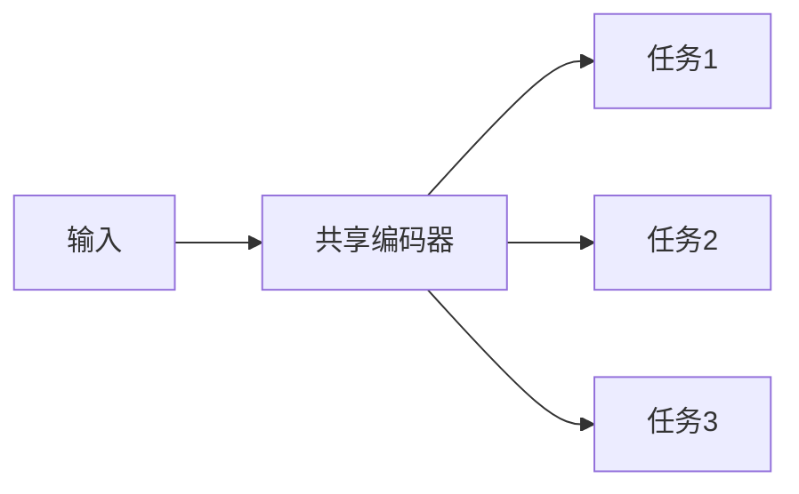
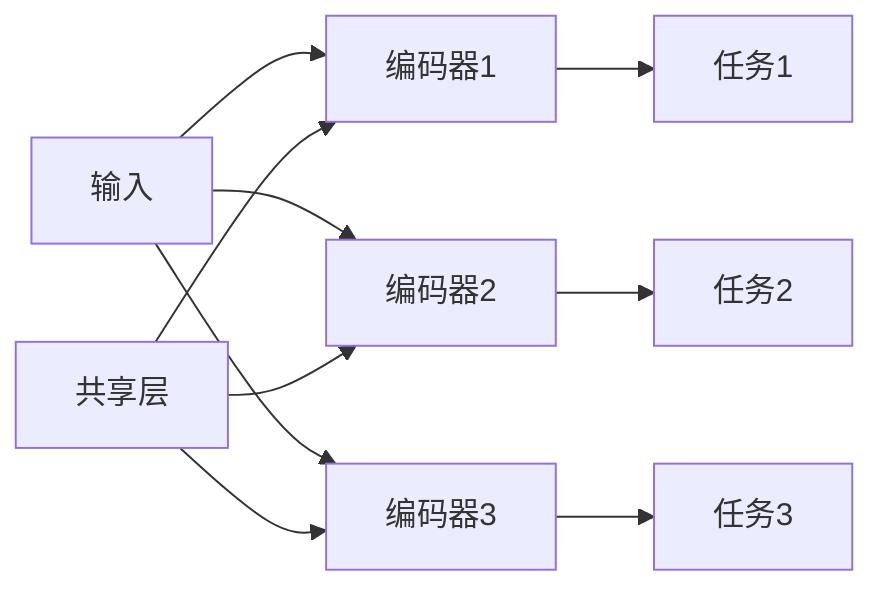
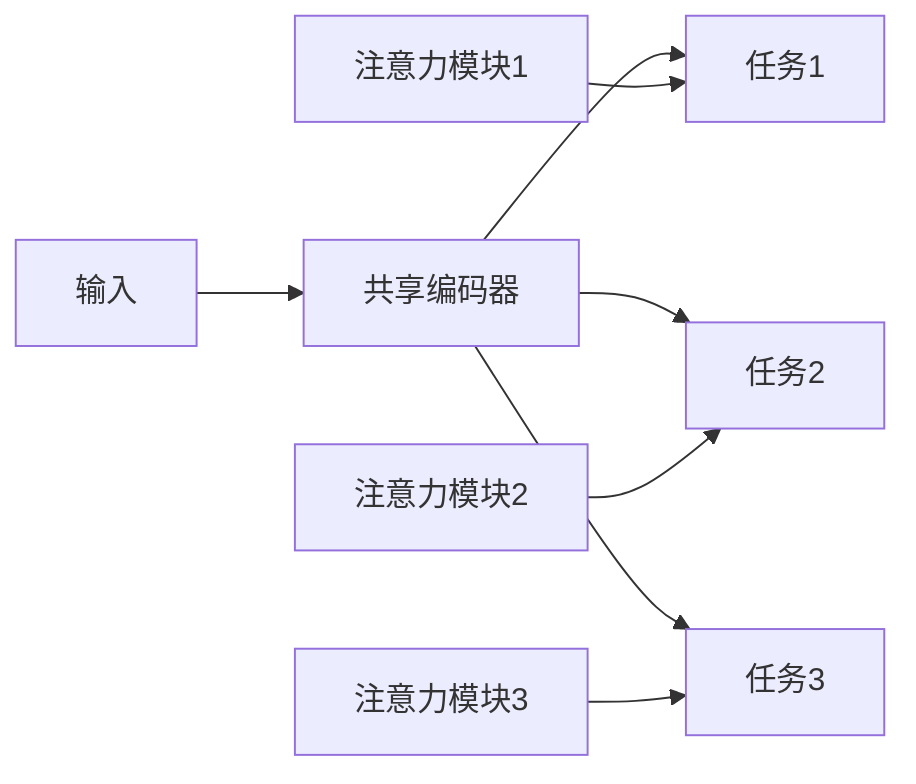

# 多任务学习(Multi-task Learning)原理与代码实战案例讲解

## 1. 背景介绍

### 1.1 机器学习的发展历程

机器学习作为人工智能的一个重要分支,在过去几十年里取得了长足的进步。从最初的基于统计学的简单算法,发展到现在的深度学习模型,机器学习已经渗透到我们生活的方方面面。然而,传统的机器学习方法通常专注于解决单一任务,这在一定程度上限制了模型的泛化能力和效率。

### 1.2 多任务学习的兴起

为了提高模型的泛化性能并更有效地利用数据,多任务学习(Multi-task Learning, MTL)应运而生。多任务学习的核心思想是同时学习多个相关任务,利用不同任务之间的相关性来提高每个单一任务的性能。这种方法不仅能够提高模型的泛化能力,还能够减少数据标注的工作量,提高计算效率。

### 1.3 多任务学习的应用场景

多任务学习已经在多个领域取得了巨大成功,例如计算机视觉、自然语言处理、语音识别等。在计算机视觉领域,多任务学习可以同时进行目标检测、图像分类和语义分割等任务;在自然语言处理领域,多任务学习可以同时进行文本分类、命名实体识别和关系抽取等任务。

## 2. 核心概念与联系

### 2.1 多任务学习的形式化定义

多任务学习可以形式化定义为:给定 $K$ 个相关的监督学习任务 $\{T_k\}_{k=1}^K$,其中每个任务 $T_k$ 都有自己的训练数据 $D_k$ 和损失函数 $\mathcal{L}_k$,目标是通过共享表示或模型参数,同时优化所有任务的损失函数,从而提高每个单一任务的性能。

### 2.2 多任务学习的优势

相比于独立地训练每个单一任务的模型,多任务学习具有以下优势:

1. **数据效率**: 通过共享表示或模型参数,多任务学习可以更有效地利用不同任务的数据,从而提高数据的利用率。
2. **泛化能力**: 由于不同任务之间存在一定的相关性,多任务学习可以捕获这些相关性,从而提高模型的泛化能力。
3. **转移学习**: 多任务学习可以看作是一种转移学习的形式,可以将已经学习到的知识迁移到新的相关任务中。
4. **计算效率**: 多任务学习可以共享计算资源,从而提高计算效率。

### 2.3 多任务学习的挑战

尽管多任务学习具有诸多优势,但它也面临一些挑战:

1. **任务相关性**: 如何度量和利用不同任务之间的相关性是一个关键问题。
2. **任务权衡**: 在优化多个任务的过程中,如何权衡不同任务的重要性也是一个挑战。
3. **负迁移**: 如果任务之间的相关性较弱,共享表示或模型参数可能会导致负迁移,降低单一任务的性能。
4. **计算复杂度**: 随着任务数量的增加,多任务学习的计算复杂度也会显著增加。

## 3. 核心算法原理具体操作步骤

### 3.1 多任务学习的基本框架

多任务学习的基本框架如下:

1. 定义多个相关的监督学习任务 $\{T_k\}_{k=1}^K$,每个任务 $T_k$ 都有自己的训练数据 $D_k$ 和损失函数 $\mathcal{L}_k$。
2. 构建一个共享的模型结构,例如共享底层表示或部分模型参数。
3. 在训练过程中,同时优化所有任务的损失函数,通过反向传播算法更新共享的模型参数。
4. 在测试阶段,可以单独评估每个任务的性能,或者将多个任务的输出进行组合。

### 3.2 多任务学习的主要方法

根据共享的方式不同,多任务学习可以分为以下几种主要方法:

#### 3.2.1 硬参数共享

硬参数共享是最直接的多任务学习方法,它将所有任务共享整个模型的参数。这种方法的优点是简单高效,但缺点是任务之间的相关性必须非常强,否则会导致负迁移。



#### 3.2.2 软参数共享

软参数共享是一种更加灵活的方法,它允许不同任务有自己的特定参数,同时也共享一部分参数。这种方法可以捕获任务之间的相关性,同时也保留了每个任务的独特性。



#### 3.2.3 基于注意力的参数共享

基于注意力的参数共享是一种更加高级的方法,它通过注意力机制动态地调整不同任务之间的参数共享程度。这种方法可以更好地捕获任务之间的相关性,并且可以根据具体情况进行适当的参数共享。



### 3.3 多任务学习的损失函数

在多任务学习中,我们需要同时优化多个任务的损失函数。常见的做法是将所有任务的损失函数加权求和,形成一个总的损失函数:

$$\mathcal{L}_{total} = \sum_{k=1}^K \lambda_k \mathcal{L}_k$$

其中 $\lambda_k$ 是第 $k$ 个任务的权重系数,用于调节不同任务的重要性。确定这些权重系数是一个重要的问题,通常可以通过验证集进行调整。

另一种方法是使用不确定性权重,即根据每个任务的不确定性动态调整权重系数:

$$\lambda_k = \frac{1}{2\log{\sigma_k^2}}$$

其中 $\sigma_k^2$ 是第 $k$ 个任务的方差,可以通过额外的网络层进行估计。这种方法可以自适应地调整任务权重,避免了手动调参的麻烦。

## 4. 数学模型和公式详细讲解举例说明

### 4.1 多任务学习的数学模型

我们可以将多任务学习的数学模型形式化为:

给定 $K$ 个相关的监督学习任务 $\{T_k\}_{k=1}^K$,每个任务 $T_k$ 都有自己的训练数据 $D_k = \{(x_i^k, y_i^k)\}_{i=1}^{N_k}$ 和损失函数 $\mathcal{L}_k$,我们的目标是学习一个共享的模型 $f_\theta$,使得在所有任务上的总损失函数最小化:

$$\min_\theta \sum_{k=1}^K \lambda_k \sum_{(x_i^k, y_i^k) \in D_k} \mathcal{L}_k(f_\theta(x_i^k), y_i^k)$$

其中 $\theta$ 表示模型的参数,可以是全部或部分共享的参数。$\lambda_k$ 是第 $k$ 个任务的权重系数,用于调节不同任务的重要性。

### 4.2 硬参数共享的数学模型

在硬参数共享的情况下,所有任务共享整个模型的参数 $\theta$。因此,我们可以将上述优化问题简化为:

$$\min_\theta \sum_{k=1}^K \lambda_k \sum_{(x_i^k, y_i^k) \in D_k} \mathcal{L}_k(f_\theta(x_i^k), y_i^k)$$

这种方法的优点是简单高效,但缺点是任务之间的相关性必须非常强,否则会导致负迁移。

### 4.3 软参数共享的数学模型

在软参数共享的情况下,每个任务都有自己的特定参数 $\theta_k$,同时也共享一部分参数 $\theta_s$。因此,我们可以将优化问题表示为:

$$\min_{\theta_s, \{\theta_k\}} \sum_{k=1}^K \lambda_k \sum_{(x_i^k, y_i^k) \in D_k} \mathcal{L}_k(f_{\theta_s, \theta_k}(x_i^k), y_i^k)$$

其中 $f_{\theta_s, \theta_k}$ 表示由共享参数 $\theta_s$ 和特定参数 $\theta_k$ 组成的模型。这种方法可以捕获任务之间的相关性,同时也保留了每个任务的独特性。

### 4.4 基于注意力的参数共享的数学模型

在基于注意力的参数共享中,我们可以通过注意力机制动态地调整不同任务之间的参数共享程度。具体来说,我们可以为每个任务 $T_k$ 引入一个注意力向量 $\alpha_k$,用于调节共享参数 $\theta_s$ 和特定参数 $\theta_k$ 的重要性:

$$f_{\theta_s, \theta_k}(x_i^k) = \alpha_k \cdot g_{\theta_s}(x_i^k) + (1 - \alpha_k) \cdot h_{\theta_k}(x_i^k)$$

其中 $g_{\theta_s}$ 和 $h_{\theta_k}$ 分别表示共享部分和特定部分的模型。注意力向量 $\alpha_k$ 可以通过额外的注意力模块进行学习。

在这种情况下,我们的优化目标变为:

$$\min_{\theta_s, \{\theta_k\}, \{\alpha_k\}} \sum_{k=1}^K \lambda_k \sum_{(x_i^k, y_i^k) \in D_k} \mathcal{L}_k(f_{\theta_s, \theta_k}(x_i^k), y_i^k)$$

这种方法可以更好地捕获任务之间的相关性,并且可以根据具体情况进行适当的参数共享。

## 5. 项目实践: 代码实例和详细解释说明

在这一部分,我们将通过一个具体的代码实例来展示如何实现多任务学习。我们将使用 PyTorch 框架,并基于一个简单的图像分类任务进行演示。

### 5.1 数据准备

首先,我们需要准备数据集。在这个示例中,我们将使用 MNIST 手写数字数据集和 FashionMNIST 服装图像数据集。我们将把这两个数据集作为两个相关的任务,同时进行图像分类。

```python
import torch
from torchvision import datasets, transforms

# 定义数据转换
transform = transforms.Compose([
    transforms.ToTensor(),
    transforms.Normalize((0.1307,), (0.3081,))
])

# 加载 MNIST 数据集
mnist_train = datasets.MNIST('data', train=True, download=True, transform=transform)
mnist_test = datasets.MNIST('data', train=False, download=True, transform=transform)

# 加载 FashionMNIST 数据集
fmnist_train = datasets.FashionMNIST('data', train=True, download=True, transform=transform)
fmnist_test = datasets.FashionMNIST('data', train=False, download=True, transform=transform)
```

### 5.2 模型定义

接下来,我们定义一个共享的卷积神经网络模型,用于同时进行 MNIST 和 FashionMNIST 的图像分类任务。我们将使用硬参数共享的方法,即所有任务共享整个模型的参数。

```python
import torch.nn as nn
import torch.nn.functional as F

class SharedConvNet(nn.Module):
    def __init__(self):
        super(SharedConvNet, self).__init__()
        self.conv1 = nn.Conv2d(1, 10, kernel_size=5)
        self.conv2 = nn.Conv2d(10, 20, kernel_size=5)
        self.conv2_drop = nn.Dropout2d()