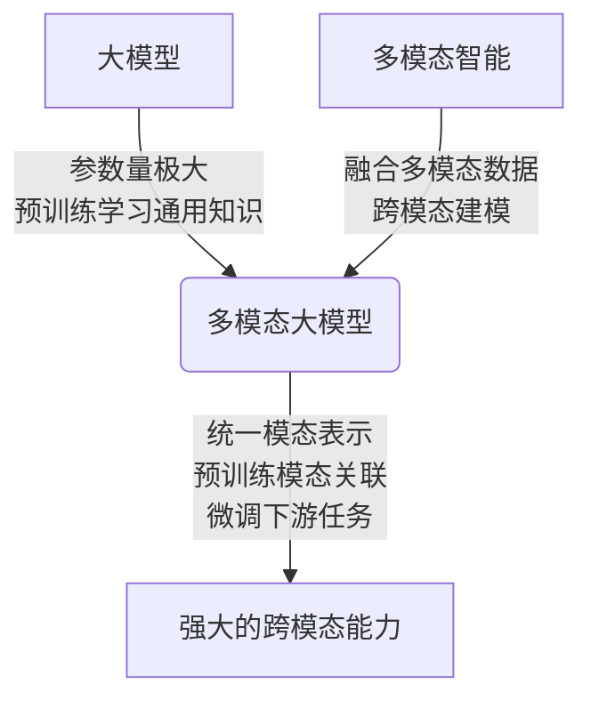
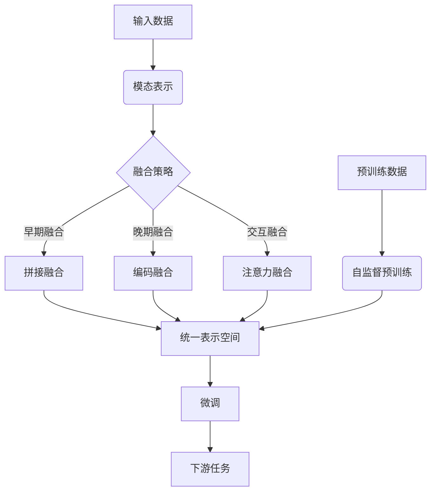

# 多模态大模型：技术原理与实战 大模型+多模态产生的化学反应

## 1.背景介绍

### 1.1 人工智能的发展历程

人工智能(Artificial Intelligence, AI)是当代科技发展的重要领域,其目标是使机器能够模拟人类的认知功能,如学习、推理、感知、行为等。人工智能的发展经历了几个重要阶段:

- 早期阶段(1950s-1960s):人工智能的概念被正式提出,专家系统、博弈理论等初步理论奠基。
- 知识驱动阶段(1970s-1990s):发展知识库系统、机器学习算法等。
- 统计学习阶段(1990s-2010s):深度学习、神经网络等数据驱动模型取得突破。
- 大模型时代(2010s-至今):借助算力和数据的飞速发展,大规模预训练模型成为主流。

### 1.2 大模型的兴起

随着算力和数据的指数级增长,训练大规模神经网络模型成为可能。2018年,谷歌的Transformer模型在机器翻译任务上取得突破,为后来的大模型奠定了基础。2020年,OpenAI发布GPT-3大语言模型,展示了大模型在自然语言处理任务中的强大能力,掀起了大模型的热潮。

大模型具有规模巨大(参数量达数十亿甚至上万亿)、泛化能力强等优势,在自然语言处理、计算机视觉等领域表现出色。然而,大模型也面临着训练成本高昂、碳足迹大、安全隐患等挑战。

### 1.3 多模态智能的兴起

传统的人工智能系统通常专注于单一模态,如自然语言处理或计算机视觉。但人类的认知是多模态的,我们通过视觉、听觉、语言等多种途径感知和理解世界。因此,发展多模态智能系统以更好地模拟人类认知,成为人工智能的重要方向。

多模态智能系统能够融合多种信息源(如文本、图像、视频等),在跨模态理解、推理、生成等任务上表现出色。多模态大模型通过预训练的方式,在海量多模态数据上学习知识和模式,为下游任务提供强大的迁移能力。

## 2.核心概念与联系

### 2.1 大模型

大模型(Large Model)是指参数量极大(通常超过10亿)的深度神经网络模型。大模型的核心思想是通过扩大模型规模和在大规模数据上预训练,来学习通用的知识表示,为下游任务提供强大的迁移能力。

常见的大模型架构包括:

- Transformer模型:基于自注意力机制,擅长处理序列数据,如GPT、BERT等。
- 卷积神经网络(CNN):擅长处理网格数据,如图像、视频等。
- 混合模型:结合Transformer和CNN,处理多模态数据,如ViT、CLIP等。

大模型的优势在于泛化能力强、性能出色,但也面临训练成本高昂、碳足迹大、安全隐患等挑战。

### 2.2 多模态智能

多模态智能(Multimodal Intelligence)是指人工智能系统能够融合多种模态(如文本、图像、视频、音频等)的信息,进行跨模态理解、推理和生成。

多模态智能涉及以下核心概念:

1. **模态表示**:将不同模态的数据映射到共享的表示空间,以捕获模态间的相关性。
2. **模态融合**:将不同模态的表示进行融合,以获取更丰富的语义信息。
3. **跨模态建模**:在融合后的表示空间中,对不同模态之间的关系进行建模。
4. **多模态生成**:基于融合表示,生成新的模态数据,如图像描述、视频字幕等。

多模态智能的挑战包括异构数据的表示、模态之间的关联建模、高效的多模态融合等。

### 2.3 多模态大模型

多模态大模型(Multimodal Large Model)是将大模型思想与多模态智能相结合的新兴范式。通过在大规模多模态数据上预训练,多模态大模型能够学习模态间的关联知识,为下游的跨模态任务提供强大的迁移能力。

多模态大模型的核心思路是:

1. 构建统一的模态无关表示空间。
2. 在海量多模态数据上预训练,学习模态间的关联知识。
3. 针对下游任务进行微调,实现模态融合和跨模态建模。

多模态大模型的优势在于泛化能力强、性能出众,但也面临训练数据需求大、计算资源消耗高等挑战。

### 2.4 Mermaid流程图

## 3.核心算法原理具体操作步骤

### 3.1 Transformer模型

Transformer是多模态大模型的核心架构之一,其自注意力机制能够有效捕获长距离依赖关系,适用于处理序列数据。Transformer的基本结构包括编码器(Encoder)和解码器(Decoder)两部分。

1. **Encoder**:将输入序列(如文本)映射到连续的表示向量。
2. **Decoder**:将Encoder的输出与前一步的输出结合,生成新的输出序列。

Transformer的关键步骤如下:

1. **输入嵌入**:将输入序列(如单词)映射到连续的向量空间。
2. **位置编码**:为每个位置添加位置信息,使模型能够捕获序列顺序。
3. **多头注意力**:计算查询(Query)与键(Key)的相关性,获取与查询相关的值(Value)。
4. **前馈网络**:对注意力输出进行非线性变换,提取更高层次的特征。
5. **规范化**:对每层的输出进行归一化,以加速收敛。
6. **掩码**:在解码器中,掩码未来位置的信息,以保证自回归生成。

通过堆叠多个Transformer块,模型可以学习到更复杂的模式和表示。

### 3.2 Vision Transformer

Vision Transformer(ViT)是将Transformer应用于计算机视觉任务的一种方法。ViT将图像分割为多个patches(图像块),并将每个patch投影到一个向量,作为Transformer的输入序列。

ViT的核心步骤包括:

1. **线性投影**:将每个图像块投影到一个固定维度的向量。
2. **位置嵌入**:为每个向量添加相应的位置信息。
3. **Transformer编码器**:使用标准的Transformer编码器对向量序列进行编码。
4. **前馈头**:将Transformer的输出映射到特定的视觉任务,如分类、检测等。

ViT能够直接从图像数据中学习视觉表示,避免了手工设计卷积核的需求,在图像分类、目标检测等任务上表现出色。

### 3.3 多模态融合

多模态大模型需要将不同模态的输入融合到统一的表示空间中。常见的融合策略包括:

1. **早期融合**:在输入层将不同模态的特征拼接,然后输入到后续的模型中。
2. **晚期融合**:分别对每种模态进行编码,然后将编码后的特征进行融合。
3. **交互融合**:在模型的中间层引入模态间的交互,实现动态融合。

不同的融合策略各有优缺点,需要根据具体任务和模态特征进行选择。此外,注意力机制也被广泛用于多模态融合,通过计算不同模态之间的相关性,实现自适应的融合。

### 3.4 多模态预训练

多模态大模型通常采用预训练与微调的范式。在预训练阶段,模型在大规模多模态数据上进行自监督学习,以捕获模态间的关联知识。常见的预训练任务包括:

1. **遮蔽语言建模**:在文本序列中随机遮蔽部分单词,模型需要预测被遮蔽的单词。
2. **图像文本对比**:给定一个图像-文本对,模型需要判断它们是否匹配。
3. **视频字幕**:根据视频内容,生成对应的文本描述。

在微调阶段,预训练模型将被转移到特定的下游任务上,通过进一步训练实现知识迁移。

### 3.5 Mermaid流程图

## 4.数学模型和公式详细讲解举例说明

### 4.1 Transformer的注意力机制

Transformer的核心是注意力(Attention)机制,它能够捕获输入序列中任意两个位置之间的依赖关系。

给定一个查询向量$\boldsymbol{q}$、键向量$\boldsymbol{K}$和值向量$\boldsymbol{V}$,注意力计算公式如下:

$$\mathrm{Attention}(\boldsymbol{Q}, \boldsymbol{K}, \boldsymbol{V}) = \mathrm{softmax}\left(\frac{\boldsymbol{Q}\boldsymbol{K}^\top}{\sqrt{d_k}}\right)\boldsymbol{V}$$

其中,$d_k$是缩放因子,用于防止内积过大导致梯度饱和。

注意力机制可以看作是一个retrieving过程,通过计算查询与键的相似性,从值向量中检索出与查询相关的信息。

在Transformer中,通常采用多头注意力(Multi-Head Attention),将注意力分成多个子空间,分别计算注意力,然后将结果拼接:

$$\begin{aligned}
\mathrm{MultiHead}(\boldsymbol{Q}, \boldsymbol{K}, \boldsymbol{V}) &= \mathrm{Concat}(\mathrm{head}_1, \dots, \mathrm{head}_h)\boldsymbol{W}^O\\
\mathrm{where}\  \mathrm{head}_i &= \mathrm{Attention}(\boldsymbol{Q}\boldsymbol{W}_i^Q, \boldsymbol{K}\boldsymbol{W}_i^K, \boldsymbol{V}\boldsymbol{W}_i^V)
\end{aligned}$$

其中,$\boldsymbol{W}_i^Q$、$\boldsymbol{W}_i^K$、$\boldsymbol{W}_i^V$和$\boldsymbol{W}^O$是可学习的线性变换。

多头注意力能够从不同的子空间捕获不同的依赖关系,提高了模型的表达能力。

### 4.2 Vision Transformer中的自注意力

在Vision Transformer(ViT)中,自注意力被用于捕获图像块之间的长距离依赖关系。

给定一个图像$\boldsymbol{X} \in \mathbb{R}^{H \times W \times C}$,我们将其分割成$N$个patches(图像块),每个patch的形状为$P \times P \times C$。然后,将每个patch映射到一个$D$维向量,构成序列$\boldsymbol{x}_p \in \mathbb{R}^{N \times D}$。

对于每个patch $\boldsymbol{x}_p^i$,计算其与所有其他patch的注意力权重:

$$\alpha_{ij} = \frac{\exp\left(\boldsymbol{x}_p^i \cdot \boldsymbol{W}_q^{\top} (\boldsymbol{x}_p^j \cdot \boldsymbol{W}_k^{\top})^\top / \sqrt{D}\right)}{\sum_{k=1}^N \exp\left(\boldsymbol{x}_p^i \cdot \boldsymbol{W}_q^{\top} (\boldsymbol{x}_p^k \cdot \boldsymbol{W}_k^{\top})^\top / \sqrt{D}\right)}$$

其中,$\boldsymbol{W}_q$和$\boldsymbol{W}_k$是可学习的线性变换,用于计算查询和键向量。

然后,通过加权求和获得