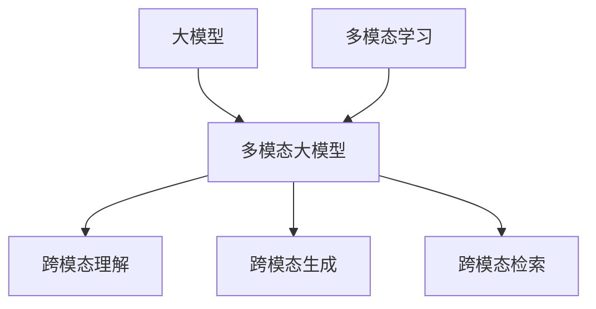

# 多模态大模型：技术原理与实战 大模型+多模态产生的化学反应

## 1. 背景介绍

### 1.1 人工智能的发展历程
#### 1.1.1 早期人工智能
#### 1.1.2 机器学习时代  
#### 1.1.3 深度学习的崛起

### 1.2 大模型的出现
#### 1.2.1 大模型的定义
#### 1.2.2 大模型的发展历程
#### 1.2.3 大模型的优势

### 1.3 多模态学习的兴起
#### 1.3.1 多模态学习的概念
#### 1.3.2 多模态学习的发展历程
#### 1.3.3 多模态学习的意义

## 2. 核心概念与联系

### 2.1 大模型
#### 2.1.1 大模型的架构
#### 2.1.2 大模型的训练方法
#### 2.1.3 大模型的应用场景

### 2.2 多模态学习
#### 2.2.1 多模态数据的表示
#### 2.2.2 多模态数据的融合
#### 2.2.3 多模态学习的任务

### 2.3 多模态大模型
#### 2.3.1 多模态大模型的定义
#### 2.3.2 多模态大模型的优势
#### 2.3.3 多模态大模型的挑战



## 3. 核心算法原理具体操作步骤

### 3.1 多模态数据预处理
#### 3.1.1 文本数据预处理
#### 3.1.2 图像数据预处理 
#### 3.1.3 音频数据预处理

### 3.2 多模态特征提取
#### 3.2.1 文本特征提取
#### 3.2.2 图像特征提取
#### 3.2.3 音频特征提取

### 3.3 多模态特征融合
#### 3.3.1 特征拼接
#### 3.3.2 注意力机制
#### 3.3.3 张量融合

### 3.4 多模态大模型训练
#### 3.4.1 预训练
#### 3.4.2 微调
#### 3.4.3 零样本学习

## 4. 数学模型和公式详细讲解举例说明

### 4.1 注意力机制
注意力机制可以用数学公式表示为：

$$Attention(Q,K,V) = softmax(\frac{QK^T}{\sqrt{d_k}})V$$

其中，$Q$表示查询向量，$K$表示键向量，$V$表示值向量，$d_k$表示键向量的维度。

例如，在多模态大模型中，可以使用注意力机制来融合不同模态的特征。假设有文本特征$T$和图像特征$I$，可以计算它们之间的注意力权重：

$$\alpha = softmax(\frac{TI^T}{\sqrt{d}})$$

然后使用注意力权重对图像特征进行加权求和，得到融合后的特征表示：

$$F = \alpha I$$

### 4.2 对比学习
对比学习的目标是最小化正样本对之间的距离，同时最大化负样本对之间的距离。数学上可以表示为：

$$L = -\log \frac{e^{sim(a,b)/\tau}}{\sum_{i=1}^N e^{sim(a,n_i)/\tau}}$$

其中，$a$和$b$是一对正样本，$n_i$是负样本，$sim$表示相似度函数，$\tau$是温度超参数。

例如，在多模态大模型中，可以使用对比学习来预训练模型。给定一个图像-文本对$(I,T)$，可以构造正样本对$(I,T)$和负样本对$(I,T')$，其中$T'$是随机采样的另一个文本。然后使用对比学习的损失函数来训练模型，使得图像和对应的文本之间的相似度最大化，同时与其他文本的相似度最小化。

## 5. 项目实践：代码实例和详细解释说明

下面是一个使用PyTorch实现多模态大模型的简单示例：

```python
import torch
import torch.nn as nn

class MultimodalModel(nn.Module):
    def __init__(self, text_dim, image_dim, hidden_dim):
        super().__init__()
        self.text_encoder = nn.Linear(text_dim, hidden_dim)
        self.image_encoder = nn.Linear(image_dim, hidden_dim)
        self.attention = nn.MultiheadAttention(hidden_dim, num_heads=8)
        self.classifier = nn.Linear(hidden_dim, num_classes)
        
    def forward(self, text, image):
        # 编码文本和图像特征
        text_feat = self.text_encoder(text)
        image_feat = self.image_encoder(image)
        
        # 使用注意力机制融合特征
        attn_output, _ = self.attention(text_feat, image_feat, image_feat)
        
        # 特征拼接
        fused_feat = torch.cat([text_feat, attn_output], dim=1)
        
        # 分类器输出
        output = self.classifier(fused_feat)
        return output
```

这个示例中，我们定义了一个简单的多模态模型`MultimodalModel`，它接受文本特征和图像特征作为输入，然后使用注意力机制来融合这两种特征。具体来说：

1. 首先，我们使用两个线性层`text_encoder`和`image_encoder`来编码文本特征和图像特征，将它们映射到相同的隐藏空间。

2. 然后，我们使用多头注意力机制`attention`来计算文本特征和图像特征之间的注意力权重，得到融合后的特征表示。

3. 接着，我们将原始的文本特征和融合后的特征拼接起来，得到最终的特征表示。

4. 最后，我们使用一个线性分类器`classifier`来根据特征表示进行分类预测。

这个示例展示了如何使用PyTorch来实现一个基本的多模态大模型，通过注意力机制来融合不同模态的特征，并用于下游的分类任务。在实际应用中，我们还可以使用更加复杂的模型架构和训练技术，如Transformer、对比学习等，来进一步提高模型的性能。

## 6. 实际应用场景

多模态大模型可以应用于各种实际场景，包括：

### 6.1 智能客服
多模态大模型可以同时处理文本、图像、语音等多种形式的客户咨询，提供更加智能、个性化的客服服务。

### 6.2 医疗诊断
多模态大模型可以融合患者的病历、影像、基因等多模态医疗数据，辅助医生进行疾病诊断和治疗方案制定。

### 6.3 智能教育
多模态大模型可以根据学生的学习行为、习题作答、视频观看等多模态数据，实现个性化的教学和学习辅导。

### 6.4 自动驾驶
多模态大模型可以融合车载摄像头、雷达、激光雷达等传感器数据，实现更加安全、可靠的自动驾驶功能。

## 7. 工具和资源推荐

### 7.1 开源工具包
- PyTorch: https://pytorch.org/
- TensorFlow: https://www.tensorflow.org/
- Hugging Face Transformers: https://huggingface.co/transformers/

### 7.2 预训练模型
- CLIP: https://github.com/openai/CLIP
- DALL·E: https://openai.com/blog/dall-e/  
- BERT: https://github.com/google-research/bert

### 7.3 数据集
- MS COCO: https://cocodataset.org/
- Flickr30K: http://shannon.cs.illinois.edu/DenotationGraph/
- VQA: https://visualqa.org/

## 8. 总结：未来发展趋势与挑战

### 8.1 未来发展趋势
- 更大规模的多模态预训练模型
- 更加通用和高效的跨模态学习范式  
- 多模态大模型在更多领域的应用落地

### 8.2 面临的挑战
- 多模态数据的标注和对齐
- 模态间差异和噪声的鲁棒建模
- 可解释性和可控性
- 计算和存储资源的瓶颈

多模态大模型是人工智能领域的重要发展方向，它融合了大模型和多模态学习的优势，具有强大的跨模态理解和生成能力。未来，多模态大模型有望在更多领域得到应用，为人类智能化生活提供更加丰富、高效的服务。同时，多模态大模型的发展也面临着诸多挑战，需要研究者和工程师们的共同努力来不断突破和创新。

## 9. 附录：常见问题与解答

### 9.1 多模态大模型和单模态大模型有什么区别？
单模态大模型只处理单一模态的数据，如文本或图像，而多模态大模型可以同时处理多种模态的数据，实现跨模态的理解和生成。

### 9.2 多模态大模型需要多少训练数据？
训练多模态大模型通常需要大量的标注数据，包括文本、图像、视频等。数据量的大小取决于模型的规模和任务的复杂度，一般需要数百万甚至上亿的样本。

### 9.3 多模态大模型的训练需要什么硬件条件？
训练多模态大模型对计算资源要求较高，通常需要多个高性能GPU，并行计算能力强。此外，还需要大容量的存储设备来存储训练数据和模型参数。

### 9.4 如何评估多模态大模型的性能？
评估多模态大模型的性能需要在特定的任务上进行测试，如图像描述、视频问答等。可以使用准确率、召回率、F1值等指标来衡量模型的性能。此外，还可以进行人工评估，由人类判断模型生成的结果是否合理、流畅、有创意。

### 9.5 多模态大模型存在哪些潜在的风险？ 
多模态大模型可能存在偏见和隐私泄露的风险。模型从海量数据中学习，可能会继承数据中的社会偏见，产生不公平的结果。此外，模型生成的内容可能泄露敏感的个人信息。因此，在开发和应用多模态大模型时，需要重视公平性、隐私保护等伦理问题。

作者：禅与计算机程序设计艺术 / Zen and the Art of Computer Programming