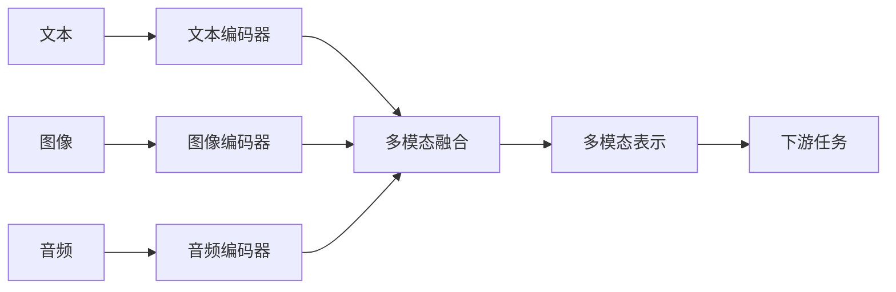

# 多模态大模型：技术原理与实战 感知能力评测

## 1. 背景介绍
### 1.1 多模态大模型的兴起
近年来,随着深度学习技术的飞速发展,多模态大模型逐渐成为人工智能领域的研究热点。多模态大模型能够同时处理文本、图像、音频等多种模态的数据,具有强大的感知和理解能力,在自然语言处理、计算机视觉等领域取得了显著成果。

### 1.2 多模态大模型的应用前景
多模态大模型在智能客服、医疗诊断、自动驾驶等诸多领域都有广阔的应用前景。它能够更全面地理解用户需求,提供更智能化的服务。同时,多模态大模型的出现也为人机交互带来了革命性的变化,使人与机器的沟通更加自然、高效。

### 1.3 感知能力评测的重要性  
感知能力是多模态大模型的核心能力之一。良好的感知能力是大模型应用于实际场景的基础。因此,全面评测多模态大模型的感知能力至关重要。通过系统化的评测,我们可以客观地了解模型的优缺点,为后续的优化完善提供方向。

## 2. 核心概念与联系
### 2.1 多模态学习
多模态学习指同时处理和融合多种不同模态的数据,如文本、图像、音频等,从而获得更全面、更准确的信息表示。不同模态数据蕴含的信息往往是互补的,多模态学习能够充分挖掘它们的内在联系,实现信息的有效融合。

### 2.2 大模型
大模型是指参数量极其庞大(数亿到数千亿)的深度学习模型。得益于大规模参数和海量训练数据,大模型具有强大的学习能力,能够从数据中自动提取高层语义特征。当前,GPT-3、BERT、CLIP等大模型在各个领域取得了瞩目成绩。

### 2.3 感知能力
感知能力是指机器对外界信息的识别、理解能力,是人工智能的重要基石。图像识别、语音识别、自然语言理解等都需要感知能力的支撑。多模态大模型通过融合不同感官通道的信息,大大提升了感知的广度和深度。

### 2.4 多模态大模型架构
下图展示了一个典型的多模态大模型架构。不同模态的数据首先经过各自的特征提取器,提取模态特异性的特征表示。然后,通过注意力机制等手段,实现不同模态特征的融合,生成统一的多模态表示,用于下游任务。



## 3. 核心算法原理具体操作步骤
### 3.1 多模态对齐表示学习
多模态对齐表示学习的目标是学习不同模态数据的统一表示,使得语义相似的数据在表示空间中距离较近。以文本-图像对齐为例,具体步骤如下:
1. 利用预训练的文本编码器和图像编码器,分别提取文本和图像特征。
2. 通过最小化对比损失,拉近匹配文本-图像对的特征距离,推开不匹配对的距离。
3. 重复步骤2,直至模型收敛,学习到对齐的文本-图像表示。

### 3.2 多模态本地对齐
除了全局的表示对齐,多模态大模型还需要实现局部语义的对齐。以视觉问答任务为例,具体步骤如下:
1. 问题经过文本编码器,生成问题表示Q。
2. 图像经过图像编码器,生成网格化的图像特征V。
3. 计算Q与V的注意力分数,对齐问题与图像的关键区域。
4. 融合问题表示和关键图像区域表示,预测答案。

### 3.3 多模态知识蒸馏
知识蒸馏可以将大模型的知识迁移到小模型中,在保持性能的同时大幅减小模型尺寸。多模态知识蒸馏的步骤如下:
1. 训练一个多模态大模型作为教师模型。
2. 固定教师模型参数,利用其输出作为软目标。
3. 训练一个小模型作为学生模型,学习教师模型的预测行为。
4. KL散度损失函数度量并最小化学生模型和教师模型的预测分布差异。

## 4. 数学模型和公式详细讲解举例说明
### 4.1 多模态对比损失
多模态对比损失用于学习不同模态数据的对齐表示。以文本-图像对齐为例,对比损失定义为:

$$
L = -\log \frac{\exp(\mathrm{sim}(t_i, v_i)/\tau)}{\sum_{j=1}^N \exp(\mathrm{sim}(t_i, v_j)/\tau)}
$$

其中,$t_i$和$v_i$分别表示第$i$个文本和图像的特征,$\mathrm{sim}$表示余弦相似度,$\tau$是温度超参数。这个损失函数最大化正样本对的相似度,最小化负样本对的相似度。

### 4.2 多头注意力机制
多头注意力机制被广泛用于多模态融合中。以自注意力为例,假设输入特征为$X \in \mathbb{R}^{n \times d}$,多头注意力的计算过程为:

$$
\begin{aligned}
Q &= XW_Q, K = XW_K, V = XW_V \\
\mathrm{head}_i &= \mathrm{softmax}(\frac{QK^T}{\sqrt{d}})V \\
\mathrm{MultiHead}(X) &= \mathrm{Concat}(\mathrm{head}_1, ..., \mathrm{head}_h)W_O
\end{aligned}
$$

其中,$W_Q, W_K, W_V, W_O$是可学习的投影矩阵,$h$是注意力头数。多头注意力可以建模不同模态特征间以及模态内部的长程依赖关系。

### 4.3 知识蒸馏的KL散度损失
设教师模型和学生模型在第$i$个样本上的预测概率分别为$p_i$和$q_i$,则KL散度损失为:

$$
L_{\mathrm{KD}} = \sum_{i=1}^N \mathrm{KL}(p_i || q_i) = \sum_{i=1}^N \sum_{j=1}^C p_{ij} \log \frac{p_{ij}}{q_{ij}}
$$

其中,$N$为样本数,$C$为类别数。最小化KL散度损失可以使学生模型的预测分布逼近教师模型。

## 5. 项目实践：代码实例和详细解释说明
下面以PyTorch为例,展示多模态对比学习的简要实现:

```python
import torch
import torch.nn as nn

class CLIPModel(nn.Module):
    def __init__(self, text_encoder, image_encoder):
        super().__init__()
        self.text_encoder = text_encoder
        self.image_encoder = image_encoder
        self.logit_scale = nn.Parameter(torch.ones([]) * 10.0)
    
    def forward(self, text, image):
        text_features = self.text_encoder(text)
        image_features = self.image_encoder(image)
        
        # 计算文本-图像特征的余弦相似度
        text_features = text_features / text_features.norm(dim=-1, keepdim=True)
        image_features = image_features / image_features.norm(dim=-1, keepdim=True)
        logit_scale = self.logit_scale.exp()
        logits = logit_scale * text_features @ image_features.t()
        
        # 计算对比损失
        labels = torch.arange(len(logits), dtype=torch.long, device=logits.device)
        loss = nn.functional.cross_entropy(logits, labels)
        
        return loss
```

以上代码展示了CLIP模型的简化版实现。模型由文本编码器`text_encoder`和图像编码器`image_encoder`组成。首先,文本和图像分别通过对应的编码器生成特征。然后,通过特征归一化和矩阵乘法计算文本-图像特征对的余弦相似度。最后,使用交叉熵损失函数计算对比损失。

在实际应用中,我们还需要构建数据加载器、设置优化器和学习率调度器等。此外,上述代码仅展示了单GPU的实现,在实践中通常需要利用多GPU并行加速训练。

## 6. 实际应用场景
多模态大模型可应用于以下场景:

### 6.1 智能搜索与推荐
多模态大模型可以理解用户的搜索意图和偏好,提供个性化的搜索结果和推荐内容。例如,当用户搜索"夏日沙滩"时,模型不仅返回相关的文本,还可以推荐相应的图片和视频。

### 6.2 智能问答与对话
多模态大模型可以回答涉及文本、图像等多模态信息的问题。用户可以上传一张图片,询问图中的物体、场景等信息,模型能够给出准确的回答。此外,模型还可以根据对话上下文,生成恰当的多模态回复,提供智能对话服务。

### 6.3 内容生成与创作
多模态大模型可以根据文本描述生成逼真的图像,或者根据图像生成生动的文字描述。这为内容创作提供了新的思路。例如,用户输入"一只可爱的小猫咪",模型可以自动生成与描述匹配的图像,辅助设计和创作。

### 6.4 医疗诊断与辅助
多模态大模型可以同时分析患者的影像数据、病历、体征等多模态信息,辅助医生进行全面、准确的诊断。模型还可以自动生成医学报告,提高医疗服务效率。

## 7. 工具和资源推荐
以下是一些多模态大模型相关的工具和资源:

1. HuggingFace Transformers: 包含多种预训练大模型的开源库,支持文本、图像、音频等模态。
2. OpenAI CLIP: 用于学习文本-图像对齐表示的开源模型和代码。
3. OpenAI DALL·E: 根据文本描述生成图像的强大模型,开源了部分代码。
4. LXMERT: 面向视觉-语言任务的多模态预训练模型,支持视觉问答、图像字幕等任务。
5. MMF: Facebook开源的多模态框架,集成了多种多模态模型和数据集。

## 8. 总结：未来发展趋势与挑战
多模态大模型是人工智能的重要发展方向,未来有望在更多领域发挥重要作用,如虚拟助手、智能教育、无人驾驶等。同时,多模态大模型也面临以下挑战:

1. 标注数据稀缺:多模态任务通常需要大量人工标注数据,成本高昂。如何在少量标注数据上进行有效学习是一大挑战。
2. 模态差异:不同模态数据具有不同的特点和分布,如何设计高效的编码器和融合机制以充分挖掘它们的内在联系,仍需进一步探索。  
3. 知识融合:如何将先验知识和常识引入多模态大模型,赋予其更强的理解和推理能力,是亟待解决的问题。
4. 可解释性:多模态大模型通常是黑盒模型,其决策过程难以解释。提高模型的可解释性和可信度是未来的重要方向。

尽管存在诸多挑战,但多模态大模型凭借其强大的感知和理解能力,必将在智能化时代扮演越来越重要的角色。让我们携手探索多模态大模型的奥秘,共同推动人工智能的发展!

## 9. 附录：常见问题与解答
### Q1: 多模态大模型需要哪些类型的数据?
A1: 多模态大模型通常需要文本、图像、音频、视频等多种模态的数据。此外,还需要人工标注这些数据之间的语义对应关系,如文本-图像对齐、视频字幕等。

### Q2: 多模态大模型的训练需要哪些硬件资源?
A2: 由于多模态大模型参数量巨大,训练通常需要多个高性能GPU,并行计算能力是