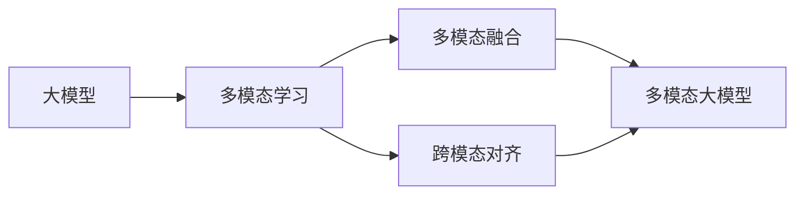

# 多模态大模型：技术原理与实战 用多模态大模型打造AI助理实战

## 1. 背景介绍

近年来,人工智能技术的飞速发展正在深刻改变着我们的生活和工作方式。其中,大模型(Large Language Models)的出现更是引领了人工智能的新浪潮。大模型能够在海量数据的基础上进行自监督学习,具备强大的语言理解和生成能力,在自然语言处理、对话系统、知识问答等领域取得了瞩目的成就。

而随着视觉、语音等多模态数据的大规模积累,以及计算机视觉、语音识别等技术的不断进步,多模态大模型(Multimodal Large Models)开始崭露头角。多模态大模型能够融合文本、图像、语音等不同模态的信息,实现跨模态的理解和生成,极大拓展了人工智能的应用场景和边界。

本文将深入探讨多模态大模型的技术原理,并通过实战案例演示如何利用多模态大模型构建一个功能强大的AI助理。我们将从多模态数据的表示学习出发,解析多模态融合的核心算法,并基于当前最先进的多模态大模型架构,一步步搭建起我们的AI助理系统。

通过本文的学习,你不仅能够掌握多模态大模型的理论基础,更能把握其背后的技术细节,学会将前沿的研究成果应用到实际的系统开发中。让我们一起走进多模态大模型的世界,感受人工智能技术的魅力!

## 2. 核心概念与联系

要理解多模态大模型,首先需要明确几个核心概念:

### 2.1 大模型(Large Language Models)

大模型是指参数量巨大(一般在数亿到上千亿)的深度学习语言模型。它们通过在海量文本数据上进行自监督学习,习得了强大的语言理解和生成能力。代表模型包括GPT系列、BERT、T5等。

### 2.2 多模态学习(Multimodal Learning)  

多模态学习研究如何让机器同时处理和理解不同模态(如文本、图像、语音等)的信息,并捕捉它们之间的联系和互补性。多模态学习的目标是实现跨模态的信息融合、对齐和生成。

### 2.3 多模态融合(Multimodal Fusion)

多模态融合是指将不同模态提取的特征进行有效整合,形成一个统一的多模态表示。常见的融合方式包括简单的特征拼接、注意力机制、张量积等。融合质量的高低决定了多模态模型的性能上限。

### 2.4 跨模态对齐(Cross-modal Alignment)

跨模态对齐旨在学习不同模态之间的语义对应关系,比如将图像中的视觉概念与文本中的语义概念相关联。对齐质量影响着多模态模型执行跨模态推理和检索的能力。

下图展示了这些概念之间的关系:

可以看到,多模态大模型是大模型与多模态学习技术结合的产物,融合和对齐是其中的关键环节。接下来,我们将详细解析多模态大模型的核心原理。

## 3. 核心算法原理具体操作步骤

多模态大模型的核心是实现不同模态信息的有效融合与对齐。这里我们以当前最具代表性的CLIP(Contrastive Language-Image Pre-training)模型为例,讲解其算法原理和操作步骤。

### 3.1 多模态数据表示

首先需要将不同模态的数据映射为统一的特征表示。对于图像,CLIP采用视觉Transformer从像素中提取特征;对于文本,则使用文本Transformer对token序列建模。两个Transformer的结构参数并不共享。

### 3.2 对比学习目标

CLIP的训练目标是最大化匹配的图文对的相似度,同时最小化不匹配图文对的相似度。形式化地,给定一批N个图文对$(x_i,y_i)$,其中$x_i$是图像,$y_i$是对应的文本描述,对比学习的损失函数定义为:

$$
L = -\frac{1}{N}\sum_{i=1}^N \log \frac{\exp(s(x_i,y_i)/\tau)}{\sum_{j=1}^N \exp(s(x_i,y_j)/\tau)}
$$

其中$s(x,y)$表示图像$x$和文本$y$的特征向量之间的点积相似度,$\tau$是温度超参数。直观地看,这个损失函数就是把匹配图文对的相似度分数不断"拉高",同时把不匹配的分数"压低"。