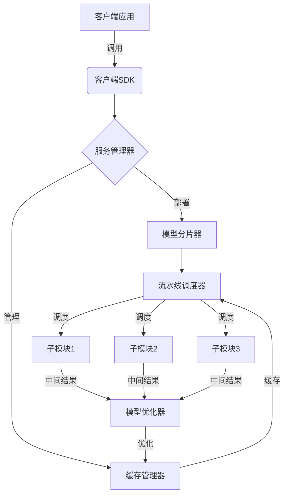

# 大规模语言模型从理论到实践 FastServe框架

## 1.背景介绍

### 1.1 大规模语言模型的兴起

近年来,随着计算能力的飞速发展和海量数据的积累,大规模语言模型(Large Language Model, LLM)在自然语言处理领域取得了突破性进展。这些模型通过在大型语料库上进行预训练,学习到了丰富的语言知识和上下文信息,展现出令人惊叹的生成能力和理解能力。

GPT-3、PanGu-Alpha、BLOOMZ等大型语言模型凭借其强大的表现,引发了学术界和工业界的广泛关注。它们不仅能够生成流畅、连贯的自然语言文本,还能够在各种自然语言处理任务上取得出色的表现,如机器翻译、问答系统、文本摘要等。

### 1.2 大规模语言模型的挑战

尽管大规模语言模型取得了令人瞩目的成就,但其实践应用仍面临着诸多挑战:

1. **计算资源需求巨大**: 训练这些庞大的模型需要大量的计算资源,包括GPU、TPU等加速硬件,以及海量的训练数据,这对于大多数组织来说是一个沉重的负担。

2. **推理效率低下**: 虽然训练一次即可部署多个任务,但在推理阶段,这些大型模型的计算复杂度仍然很高,推理速度往往无法满足实时应用的需求。

3. **内存占用过高**: 大规模语言模型通常包含数十亿甚至上百亿个参数,导致模型体积庞大,加载到内存中的开销非常高。

4. **缺乏可解释性**: 这些模型的内部机理往往是一个黑箱,难以解释其决策过程,这在一定程度上影响了它们在关键领域的应用。

5. **安全性和可靠性问题**: 大规模语言模型存在潜在的安全隐患,如生成有害内容、泄露隐私信息等,需要采取有效措施来确保其安全可靠。

为了解决这些挑战,实现大规模语言模型的高效部署和实际应用,我们需要一种新的框架和方法。FastServe就是这样一个创新的解决方案。

## 2.核心概念与联系

### 2.1 FastServe框架概述

FastServe是一个专门为大规模语言模型设计的高效推理框架。它采用了一种全新的架构和技术,旨在实现大规模语言模型的高效推理、低延迟响应和低资源占用,从而促进这些模型在实际应用中的广泛部署。

FastServe的核心思想是将大规模语言模型进行分片(sharding)和并行化,利用多个计算节点协同工作来加速推理过程。它采用了一种基于流水线(pipeline)的并行策略,将模型分割成多个子模块,并在不同的节点上并行执行这些子模块。这种方式不仅可以充分利用多个节点的计算资源,还能够有效降低单个节点的内存占用和计算压力。

此外,FastServe还引入了多种优化技术,如模型压缩、量化、缓存等,进一步提高了推理效率和资源利用率。它提供了一套完整的工具链和API,支持模型的部署、管理和调用,方便开发者将大规模语言模型集成到各种应用中。

### 2.2 核心组件

FastServe框架由以下几个核心组件组成:

1. **模型分片器(Model Sharding)**: 负责将大规模语言模型分割成多个子模块,并将这些子模块分配到不同的计算节点上。

2. **流水线调度器(Pipeline Scheduler)**: 协调不同节点上的子模块执行,实现基于流水线的并行推理。

3. **模型优化器(Model Optimizer)**: 对模型进行压缩、量化等优化,降低模型大小和计算复杂度。

4. **缓存管理器(Cache Manager)**: 管理模型参数和中间计算结果的缓存,提高重复推理的效率。

5. **服务管理器(Service Manager)**: 负责模型的部署、更新和监控,确保服务的高可用性和可扩展性。

6. **客户端SDK(Client SDK)**: 提供统一的API接口,方便开发者集成和调用FastServe服务。

这些组件通过紧密协作,共同实现了大规模语言模型的高效推理和部署。

## 3.核心算法原理具体操作步骤

### 3.1 模型分片算法

FastServe采用了一种基于计算图的分片算法,将大规模语言模型划分为多个子模块。这个过程包括以下几个步骤:

1. **构建计算图**: 首先将模型表示为一个有向计算图,其中节点代表计算操作(如矩阵乘法、激活函数等),边代表数据依赖关系。

2. **图分割**: 根据节点的计算复杂度和内存占用,将计算图划分为多个子图(子模块)。这是一个NP-hard的组合优化问题,FastServe采用了启发式算法和图分割技术来近似求解。

3. **负载均衡**: 在分割过程中,需要考虑各个子模块的计算负载和内存占用,以实现良好的负载均衡。

4. **通信优化**: 分析子模块之间的数据依赖关系,优化通信策略,减少数据传输开销。

5. **子模块分配**: 将划分好的子模块分配到不同的计算节点上,同时考虑节点的硬件资源和网络拓扑结构。

通过这种分片算法,FastServe能够将庞大的语言模型分解为多个小模块,有效降低了单个节点的计算和内存压力。同时,它还能够充分利用多个节点的并行计算能力,加速推理过程。

### 3.2 流水线并行算法

在完成模型分片之后,FastServe采用了一种基于流水线的并行推理算法,以进一步提高推理效率。这个算法的核心思想是将推理过程划分为多个阶段,并在不同的节点上并行执行这些阶段,就像工业生产线上的流水作业一样。

具体步骤如下:

1. **阶段划分**: 根据子模块之间的依赖关系,将推理过程划分为多个阶段。每个阶段包含一个或多个子模块。

2. **调度策略**: 采用一种动态调度策略,根据各个节点的负载情况,将不同阶段的计算任务分配到不同的节点上执行。

3. **数据流控制**: 在各个阶段之间引入数据缓冲区,控制数据的传输和接收,确保各个阶段能够高效协作。

4. **负载均衡**: 通过动态调整任务分配和数据流控制,实现不同节点之间的负载均衡。

5. **容错机制**: 引入容错机制,在节点故障时能够自动切换到备用节点,确保服务的高可用性。

这种流水线并行算法能够充分利用多个节点的并行计算能力,大幅提高了推理效率。同时,它还具有良好的可扩展性,可以根据需求动态调整节点数量,满足不同的性能需求。

## 4.数学模型和公式详细讲解举例说明

在FastServe的设计和实现中,涉及到了多种数学模型和算法,包括图论、优化理论、并行计算等领域的知识。下面我们将详细介绍其中的一些核心数学模型和公式。

### 4.1 计算图模型

大规模语言模型可以被表示为一个有向计算图 $G = (V, E)$,其中 $V$ 表示节点集合(计算操作),而 $E$ 表示边集合(数据依赖关系)。每个节点 $v \in V$ 代表一个计算操作,如矩阵乘法、激活函数等,它接收一组输入张量,并产生一个输出张量。边 $e = (u, v) \in E$ 表示节点 $v$ 依赖于节点 $u$ 的输出。

我们可以使用以下公式来表示节点 $v$ 的计算过程:

$$
\operatorname{output}(v) = \operatorname{op}_v(\operatorname{inputs}(v))
$$

其中 $\operatorname{op}_v$ 表示节点 $v$ 对应的计算操作, $\operatorname{inputs}(v) = \{\operatorname{output}(u) | (u, v) \in E\}$ 表示节点 $v$ 的所有输入。

通过分析这个计算图,我们可以确定各个节点之间的依赖关系,从而进行模型分片和流水线调度。

### 4.2 图分割算法

将大规模语言模型划分为多个子模块,是一个NP-hard的组合优化问题。FastServe采用了一种基于 k-way 图分割(graph partitioning)的启发式算法来近似求解。

给定一个计算图 $G = (V, E)$,我们需要将节点集合 $V$ 划分为 $k$ 个不相交的子集 $V_1, V_2, \ldots, V_k$,使得每个子集对应一个子模块,同时满足以下约束条件:

1. 子模块的计算负载和内存占用在一定范围内,以确保负载均衡。
2. 子模块之间的通信开销最小化,即 $\sum_{i=1}^k \sum_{j=1}^k c(V_i, V_j)$ 最小,其中 $c(V_i, V_j)$ 表示子模块 $V_i$ 和 $V_j$ 之间的通信开销。

这可以被形式化为以下优化问题:

$$
\begin{aligned}
\min_{V_1, \ldots, V_k} & \quad \sum_{i=1}^k \sum_{j=1}^k c(V_i, V_j) \\
\text{s.t.} & \quad \bigcup_{i=1}^k V_i = V \\
& \quad V_i \cap V_j = \emptyset, \quad \forall i \neq j \\
& \quad \operatorname{load}(V_i) \leq L_\max, \quad \forall i \\
& \quad \operatorname{mem}(V_i) \leq M_\max, \quad \forall i
\end{aligned}
$$

其中 $\operatorname{load}(V_i)$ 和 $\operatorname{mem}(V_i)$ 分别表示子模块 $V_i$ 的计算负载和内存占用, $L_\max$ 和 $M_\max$ 是预设的上限阈值。

FastServe采用了一种基于多级划分的启发式算法来求解这个优化问题。首先将计算图划分为较大的子图,然后递归地对这些子图进行进一步划分,直到满足负载和内存约束。在每一级划分中,算法会尝试不同的划分方案,并选择通信开销最小的方案。

### 4.3 流水线调度模型

在完成模型分片之后,FastServe需要协调不同节点上的子模块执行,实现高效的并行推理。这可以被建模为一个流水线调度问题。

假设我们有 $n$ 个节点,每个节点 $i$ 被分配了一个子模块集合 $S_i$。推理过程被划分为 $m$ 个阶段,每个阶段包含一个或多个子模块。我们的目标是找到一种调度方案,使得总的推理时间最小化。

令 $x_{ij}$ 表示第 $j$ 个阶段是否被分配到节点 $i$ 上执行,即:

$$
x_{ij} = \begin{cases}
1, & \text{if stage $j$ is assigned to node $i$} \\
0, & \text{otherwise}
\end{cases}
$$

我们可以将调度问题建模为以下整数线性规划问题:

$$
\begin{aligned}
\min_{x_{ij}} & \quad T \\
\text{s.t.} & \quad \sum_{i=1}^n x_{ij} = 1, \quad \forall j \\
& \quad \