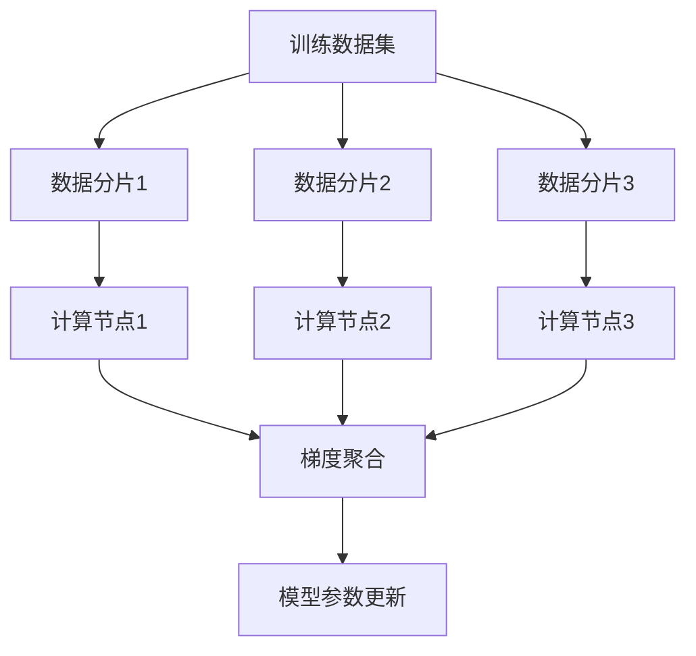
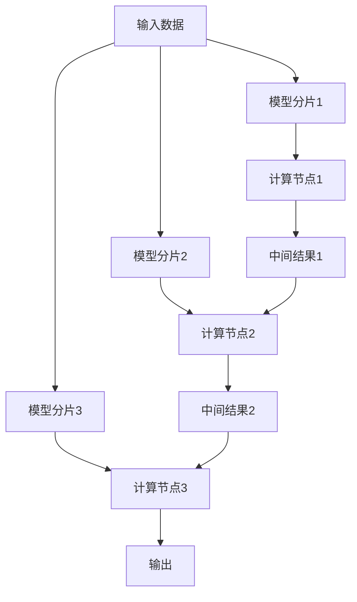
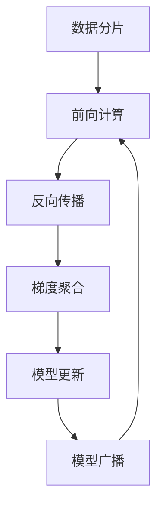
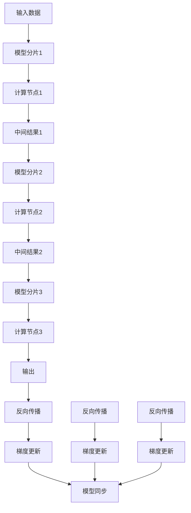

# 大规模语言模型从理论到实践 分布式训练

## 1.背景介绍

随着人工智能技术的快速发展,大规模语言模型已经成为自然语言处理领域的关键技术之一。这些模型通过在海量文本数据上进行预训练,学习到丰富的语言知识和语义表示能力,从而可以应用于诸如机器翻译、问答系统、文本生成等多种自然语言处理任务。

然而,训练大规模语言模型面临着巨大的计算和存储开销挑战。随着模型规模和训练数据集的不断扩大,单机训练已经无法满足实际需求。因此,高效的分布式训练技术变得至关重要,它可以充分利用多台机器的计算资源,显著提高训练效率,缩短训练时间。

### 1.1 大规模语言模型概述

大规模语言模型通常采用Transformer等注意力机制模型结构,能够有效捕捉长距离上下文依赖关系。这些模型通过自监督学习方式(如掩码语言模型)在大量无标注文本数据上进行预训练,获得通用的语言表示能力。预训练后的模型可以通过微调等方式,将学习到的知识迁移到下游任务中,显著提升任务性能。

目前,GPT-3、PanGu-Alpha、PALM等大规模语言模型已经展现出了强大的文本生成、理解和推理能力,在多个领域取得了令人瞩目的成绩。但与此同时,训练这些模型需要消耗大量的计算资源,对硬件设施和能源消耗提出了极高的要求。

### 1.2 分布式训练的必要性

由于单机计算能力的限制,大规模语言模型的训练通常需要利用多台机器的计算资源进行并行计算。分布式训练技术可以将训练任务划分到多个计算节点上同时执行,从而显著缩短训练时间,提高训练效率。

此外,由于语料数据量的不断增长,单机存储空间往往无法满足需求。分布式训练可以将海量数据分散存储在多个节点上,有效解决存储瓶颈问题。

因此,高效的分布式训练策略对于训练大规模语言模型至关重要,它不仅可以加速训练过程,还能够支持更大规模的模型和数据集。本文将重点介绍大规模语言模型分布式训练的核心理论、关键技术和实践案例。

## 2.核心概念与联系

### 2.1 数据并行和模型并行

在分布式训练中,常见的并行策略包括数据并行和模型并行。

#### 数据并行

数据并行是指将训练数据划分到多个计算节点上,每个节点在本地数据子集上计算梯度,然后通过通信机制(如环形All-reduce)进行梯度聚合,最后更新模型参数。这种并行方式可以有效利用多台机器的计算资源,加速训练过程。



#### 模型并行

模型并行是指将模型的不同部分划分到不同的计算节点上,每个节点只需要计算和存储模型的一部分参数。这种策略可以有效解决单机内存和计算能力的限制,支持训练更大规模的模型。



数据并行和模型并行可以组合使用,以充分利用分布式系统的计算和存储资源。通常情况下,数据并行用于加速训练过程,而模型并行则用于支持更大规模的模型。

### 2.2 通信架构

在分布式训练中,计算节点之间需要通过高效的通信机制进行数据交换和梯度同步,以确保训练的正确性和收敛性。常见的通信架构包括:

1. **环形All-reduce**: 计算节点按环形拓扑结构组织,每个节点将本地梯度传递给下一个节点,并与接收到的梯度进行累加操作,最终实现梯度的全局聚合。这种架构具有良好的可扩展性和负载均衡性。

2. **树形Reduce-Scatter**: 计算节点按树形拓扑结构组织,梯度聚合过程分为两个阶段:Reduce阶段沿着树的边缘向上传递并累加梯度;Scatter阶段则将聚合后的梯度沿着树的边缘向下传播。这种架构可以减少通信开销,但需要精心设计树形拓扑结构。

3. **Parameter Server**: 采用中心化的服务器-工作节点架构,工作节点负责计算梯度,参数服务器负责存储模型参数和聚合梯度。这种架构易于实现和维护,但参数服务器可能会成为性能瓶颈。

不同的通信架构在可扩展性、通信效率和实现复杂度等方面有所权衡,需要根据具体的硬件环境和模型特征进行选择和优化。

## 3.核心算法原理具体操作步骤

### 3.1 数据并行训练流程

数据并行训练的核心步骤如下:

1. **数据分片**: 将训练数据集划分为多个数据分片,每个计算节点负责处理一个数据分片。

2. **前向计算**: 每个节点在本地数据分片上进行前向计算,得到模型输出和损失值。

3. **反向传播**: 每个节点根据本地损失值计算模型参数的梯度。

4. **梯度聚合**: 使用选定的通信架构(如环形All-reduce),将各节点计算的梯度进行全局聚合。

5. **模型更新**: 根据聚合后的梯度,使用优化算法(如SGD、Adam等)更新模型参数。

6. **模型广播**: 将更新后的模型参数广播到所有计算节点,准备进行下一轮迭代。



为了提高训练效率,上述步骤中的通信操作(如梯度聚合和模型广播)需要进行优化,以减少通信开销。此外,还需要考虑数据加载、预处理等辅助操作的并行化,以充分利用计算资源。

### 3.2 模型并行训练流程

模型并行训练的核心步骤如下:

1. **模型分片**: 将模型划分为多个模型分片,每个计算节点负责处理和存储一个模型分片。

2. **分片计算**: 输入数据被传递给第一个模型分片进行计算,产生的中间结果被传递给下一个模型分片,如此重复,直到最后一个模型分片完成计算。

3. **反向传播**: 从最后一个模型分片开始,沿着反方向进行反向传播,计算每个模型分片的梯度。

4. **梯度更新**: 每个节点使用优化算法更新本地模型分片的参数。

5. **同步模型**: 在每个训练迭代结束时,需要将所有模型分片的参数进行同步,以确保模型的一致性。



在模型并行训练中,模型分片的划分策略、计算和通信的调度等都是关键问题,需要根据模型结构和硬件环境进行优化,以实现高效的并行计算和通信。

## 4.数学模型和公式详细讲解举例说明

### 4.1 数据并行中的梯度聚合

在数据并行训练中,每个计算节点根据本地数据分片计算出局部梯度,然后需要将这些局部梯度进行聚合,得到全局梯度,用于更新模型参数。梯度聚合操作可以表示为:

$$
\nabla J = \frac{1}{N}\sum_{i=1}^{N}\nabla J_i
$$

其中,$ \nabla J $表示全局梯度,$ N $是计算节点的数量,$ \nabla J_i $表示第 i 个节点计算的局部梯度。

在实际实现中,梯度聚合通常采用高效的通信原语,如环形All-reduce或树形Reduce-Scatter等。以环形All-reduce为例,其算法步骤如下:

1. 每个节点将本地梯度 $ \nabla J_i $ 存储在缓冲区中。
2. 节点之间按环形拓扑结构传递梯度缓冲区,每个节点在接收到其他节点的梯度后,将其与本地梯度累加。
3. 经过 N-1 次传递后,每个节点的缓冲区中存储的就是全局梯度 $ \nabla J $。

环形All-reduce的通信复杂度为 $ O(N) $,其中 N 是节点数量。相比于简单的集中式梯度聚合(通信复杂度为 $ O(N^2) $),环形All-reduce具有更好的可扩展性和负载均衡性。

### 4.2 模型并行中的前向和反向传播

在模型并行训练中,模型被划分为多个模型分片,分布在不同的计算节点上。前向计算和反向传播需要在这些模型分片之间进行协作。

假设模型被划分为 M 个模型分片 $ f_1, f_2, \ldots, f_M $,输入为 $ x $,输出为 $ y $,则前向计算过程可以表示为:

$$
y = f_M(f_{M-1}(\ldots f_2(f_1(x))))
$$

每个模型分片 $ f_i $ 在对应的计算节点上执行计算,产生的中间结果被传递给下一个模型分片。

在反向传播过程中,我们需要计算每个模型分片参数的梯度。根据链式法则,对于第 i 个模型分片 $ f_i $,其参数梯度可以表示为:

$$
\frac{\partial L}{\partial \theta_i} = \frac{\partial L}{\partial y}\frac{\partial y}{\partial h_i}\frac{\partial h_i}{\partial \theta_i}
$$

其中,$ L $是损失函数,$ y $是模型输出,$ h_i $是第 i 个模型分片的输出(即下一个模型分片的输入),$ \theta_i $是第 i 个模型分片的参数。

反向传播从最后一个模型分片开始,沿着反方向依次计算每个模型分片的梯度,并将必要的中间结果传递给前一个模型分片,以计算其梯度。

在实现模型并行时,需要精心设计模型分片的划分策略、计算和通信的调度,以充分利用硬件资源,提高并行效率。

## 5.项目实践:代码实例和详细解释说明

为了更好地理解分布式训练的实现细节,我们将以 PyTorch 为例,展示一个基于数据并行的分布式训练代码示例。

### 5.1 环境配置

首先,我们需要配置分布式训练环境,包括初始化进程组、设置分布式后端等。

```python
import torch.distributed as dist