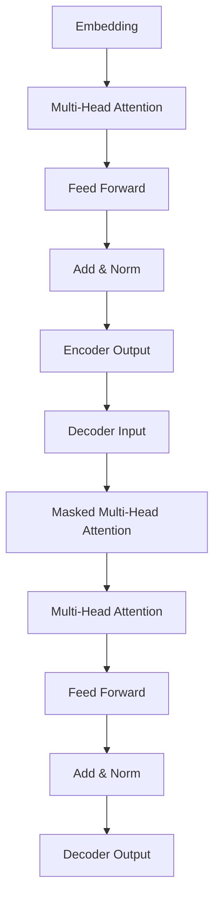

# 大规模语言模型从理论到实践 垂直领域评估

## 1.背景介绍

### 1.1 大规模语言模型的兴起

近年来,随着计算能力的飞速提升和海量数据的积累,大规模语言模型(Large Language Models, LLMs)在自然语言处理领域取得了突破性进展。这些模型通过在大量无标注文本数据上进行预训练,学习语言的内在规律和知识,从而获得了强大的语言理解和生成能力。

大规模语言模型的代表有 GPT (Generative Pre-trained Transformer)、BERT (Bidirectional Encoder Representations from Transformers)、XLNet、RoBERTa、ALBERT 等。其中,GPT 系列模型由 OpenAI 提出,具有出色的文本生成能力;BERT 系列模型由谷歌提出,擅长于语义理解和表示学习任务。

### 1.2 垂直领域的重要性

尽管大规模语言模型展现出了强大的通用语言能力,但在特定垂直领域的应用中,它们的表现往往不尽如人意。这是因为通用语料库无法完全覆盖垂直领域的专业知识和语言特征。因此,评估和优化大规模语言模型在垂直领域的表现,对于提高模型的实用性和可靠性至关重要。

常见的垂直领域包括但不限于医疗健康、法律、金融、科技等。这些领域不仅拥有丰富的专业知识,而且具有独特的语言习惯和术语。如何有效地将大规模语言模型应用于这些垂直领域,是当前研究的一个重点方向。

## 2.核心概念与联系  

### 2.1 语言模型基础

语言模型是自然语言处理的基础,旨在学习语言的概率分布,即给定一个文本序列,计算该序列出现的概率。形式化地,语言模型需要估计条件概率:

$$P(x_t|x_1, x_2, ..., x_{t-1})$$

其中 $x_t$ 表示当前词, $x_1, x_2, ..., x_{t-1}$ 表示历史上下文。

传统的语言模型通常基于 N-gram 统计或神经网络等方法。而大规模语言模型则是在 Transformer 等注意力机制的基础上,通过自监督学习的方式从海量无标注语料中学习语言知识。

### 2.2 自监督学习范式

大规模语言模型采用自监督学习范式,即在无需人工标注的情况下,利用原始文本数据本身作为监督信号进行训练。常见的自监督学习目标包括:

- **掩码语言模型 (Masked Language Modeling, MLM)**: 随机掩蔽部分词,模型需要预测被掩蔽的词。
- **下一句预测 (Next Sentence Prediction, NSP)**: 判断两个句子是否为连续句子。
- **因果语言模型 (Causal Language Modeling, CLM)**: 给定前文,预测下一个词或句子。

通过这些自监督学习目标,模型可以捕捉到语言的语义和语法规律,形成通用的语言表示能力。

### 2.3 Transformer 和自注意力机制

Transformer 是大规模语言模型的核心架构,它完全基于自注意力机制,摒弃了传统的循环神经网络和卷积神经网络结构。自注意力机制允许模型捕捉输入序列中任意位置之间的依赖关系,从而更好地建模长距离依赖。

Transformer 的编码器-解码器结构使其可以应用于不同的任务,如机器翻译、文本生成等。对于掩码语言模型和因果语言模型,通常只使用 Transformer 的解码器部分。

## 3.核心算法原理具体操作步骤

### 3.1 Transformer 架构

Transformer 架构主要由编码器(Encoder)和解码器(Decoder)两个部分组成,如下图所示:



1. **Embedding层**: 将输入的词元(token)转换为向量表示。
2. **多头自注意力层(Multi-Head Attention)**: 捕捉输入序列中不同位置之间的依赖关系。
3. **前馈全连接层(Feed Forward)**: 对每个位置的向量表示进行非线性变换。
4. **规范化层(Add & Norm)**: 对上一层的输出进行残差连接和层归一化,以提高训练稳定性。

编码器和解码器的主要区别在于:

- 编码器只包含自注意力层,用于捕捉输入序列的依赖关系。
- 解码器除了自注意力层外,还包含掩码多头注意力层,用于防止关注未来位置的信息。
- 解码器还包含一个额外的多头注意力层,用于关注编码器的输出,实现编码器-解码器的交互。

### 3.2 自注意力机制

自注意力机制是 Transformer 的核心,它允许模型捕捉输入序列中任意两个位置之间的依赖关系。具体来说,给定一个查询向量 $q$、键向量 $k$ 和值向量 $v$,自注意力计算如下:

$$\text{Attention}(Q, K, V) = \text{softmax}\left(\frac{QK^T}{\sqrt{d_k}}\right)V$$

其中 $d_k$ 是缩放因子,用于防止点积过大导致的梯度饱和问题。

多头注意力机制是将多个注意力头的结果拼接在一起,从而允许模型关注不同的子空间表示:

$$\text{MultiHead}(Q, K, V) = \text{Concat}(head_1, ..., head_h)W^O$$
$$\text{where } head_i = \text{Attention}(QW_i^Q, KW_i^K, VW_i^V)$$

### 3.3 掩码语言模型

掩码语言模型(MLM)是预训练大规模语言模型的一种常用方法。它的基本思想是随机掩蔽输入序列中的一部分词元,然后让模型基于上下文预测被掩蔽的词元。

具体操作步骤如下:

1. 随机选择输入序列中的一部分词元进行掩蔽,通常使用特殊的 [MASK] 标记替换被掩蔽的词元。
2. 将带有掩码的序列输入到 Transformer 解码器中。
3. 对于每个被掩蔽的位置,模型需要预测该位置最可能的词元。
4. 将预测的词元与实际的词元进行比较,计算交叉熵损失,并使用该损失对模型进行优化。

通过这种方式,模型可以学习到语言的双向上下文信息,从而提高语言理解能力。

### 3.4 因果语言模型

因果语言模型(CLM)是另一种预训练大规模语言模型的方法,它的目标是给定历史上下文,预测下一个词元或句子。

具体操作步骤如下:

1. 将输入序列按照时间顺序切分为多个片段。
2. 对于每个片段,将其输入到 Transformer 解码器中,并掩码最后一个词元。
3. 模型需要基于前文预测被掩码的最后一个词元。
4. 将预测的词元与实际的词元进行比较,计算交叉熵损失,并使用该损失对模型进行优化。

因果语言模型可以学习到语言的单向上下文信息,适用于文本生成、机器翻译等任务。

## 4.数学模型和公式详细讲解举例说明

在大规模语言模型中,自注意力机制是核心的数学模型。我们将通过一个具体的例子来详细解释其工作原理。

假设我们有一个输入序列 "The quick brown fox jumps over the lazy dog",我们希望计算单词 "fox" 与其他单词之间的注意力分数。

### 4.1 查询、键和值的计算

首先,我们需要将每个单词转换为查询向量 $q$、键向量 $k$ 和值向量 $v$。这通常是通过将单词嵌入乘以三个不同的投影矩阵 $W^Q$、$W^K$ 和 $W^V$ 来实现的:

$$q = x W^Q, k = x W^K, v = x W^V$$

其中 $x$ 是单词的嵌入向量。

假设单词 "fox" 的查询向量为 $q_\text{fox}$,其他单词的键向量为 $k_1, k_2, ..., k_n$,值向量为 $v_1, v_2, ..., v_n$。

### 4.2 计算注意力分数

接下来,我们计算 "fox" 与其他单词之间的注意力分数。注意力分数是通过查询向量和键向量的点积得到的,并除以一个缩放因子 $\sqrt{d_k}$ (其中 $d_k$ 是键向量的维度)来防止点积过大导致的梯度饱和问题:

$$e_i = \frac{q_\text{fox} \cdot k_i}{\sqrt{d_k}}$$

然后,我们对所有注意力分数应用 softmax 函数,得到归一化的注意力权重:

$$\alpha_i = \text{softmax}(e_i) = \frac{\exp(e_i)}{\sum_j \exp(e_j)}$$

### 4.3 计算加权和

最后,我们使用归一化的注意力权重对值向量进行加权求和,得到 "fox" 的注意力输出:

$$\text{attn}_\text{fox} = \sum_i \alpha_i v_i$$

这个注意力输出向量捕捉了 "fox" 与其他单词之间的依赖关系,可以用于下游任务,如文本生成、分类等。

通过上述步骤,自注意力机制可以动态地捕捉输入序列中任意两个位置之间的依赖关系,从而更好地建模长距离依赖。

## 5.项目实践:代码实例和详细解释说明

为了更好地理解大规模语言模型的实现细节,我们将提供一个基于 PyTorch 的代码示例,实现一个简化版的 Transformer 模型,并在一个小型数据集上进行训练和评估。

### 5.1 导入所需的库

```python
import torch
import torch.nn as nn
import torch.optim as optim
from torch.utils.data import Dataset, DataLoader
import math
```

### 5.2 定义数据集和数据加载器

为了简化示例,我们将使用一个小型的文本数据集。在实际应用中,您需要使用更大的数据集来训练大规模语言模型。

```python
# 示例数据集
text = """
This is a sample text for demonstration purposes.
It contains multiple sentences to train a language model.
The quick brown fox jumps over the lazy dog.
"""

# 将文本分割为单词列表
words = text.split()

# 构建词汇表
vocab = sorted(set(words))
vocab_size = len(vocab)

# 单词到索引的映射
word2idx = {word: idx for idx, word in enumerate(vocab)}
idx2word = {idx: word for idx, word in enumerate(vocab)}

# 定义数据集
class TextDataset(Dataset):
    def __init__(self, text, word2idx):
        self.text = text
        self.word2idx = word2idx
        self.indices = [word2idx[word] for word in text.split()]

    def __len__(self):
        return len(self.indices) - 1  # 最后一个词元没有对应的目标

    def __getitem__(self, idx):
        return self.indices[idx], self.indices[idx + 1]  # 返回(输入词元, 目标词元)

# 创建数据集和数据加载器
dataset = TextDataset(text, word2idx)
dataloader = DataLoader(dataset, batch_size=4, shuffle=True)
```

### 5.3 定义 Transformer 模型

我们将实现一个简化版的 Transformer 模型,只包含解码器部分,用于语言模型任务。

```python
class TransformerModel(nn.Module):
    def __init__(self, vocab_size, d_model, nhead, num_layers, dropout=0.1):
        super(TransformerModel, self).__init__()
        self.embedding = nn.Embedding(vocab_size, d_model)
        self.pos_encoder = PositionalEncoding(d_model, dropout)
        decoder_layers = nn.TransformerDecoderLayer(d_model, nhead, dim_feedforward=512, dropout=dropout)
        self.transformer_decoder = nn.TransformerDecoder(decoder_layers, num_layers)
        self.output_layer = nn.Linear(d_model, vocab_size)

    def