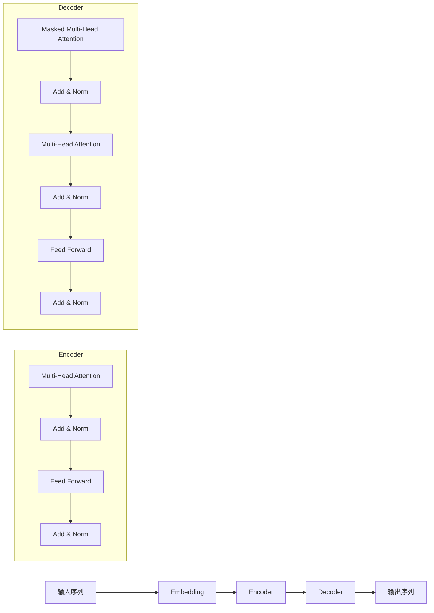

# 大规模语言模型从理论到实践 实践思考

## 1. 背景介绍
### 1.1 大规模语言模型的发展历程
#### 1.1.1 早期语言模型的局限性
#### 1.1.2 深度学习时代的语言模型突破
#### 1.1.3 Transformer架构的革命性影响
### 1.2 大规模语言模型的应用前景
#### 1.2.1 自然语言理解与生成
#### 1.2.2 知识图谱与问答系统  
#### 1.2.3 机器翻译与跨语言应用

## 2. 核心概念与联系
### 2.1 语言模型的定义与分类
#### 2.1.1 统计语言模型
#### 2.1.2 神经网络语言模型 
#### 2.1.3 预训练语言模型
### 2.2 大规模语言模型的特点
#### 2.2.1 参数量与模型容量
#### 2.2.2 预训练与微调范式
#### 2.2.3 零样本与少样本学习能力
### 2.3 大规模语言模型的关键技术
#### 2.3.1 注意力机制与自注意力
#### 2.3.2 位置编码与相对位置编码
#### 2.3.3 层归一化与残差连接

## 3. 核心算法原理具体操作步骤
### 3.1 Transformer的编码器-解码器结构
#### 3.1.1 编码器的自注意力层与前馈神经网络
#### 3.1.2 解码器的掩码自注意力与编码-解码注意力
#### 3.1.3 Transformer的并行计算优势
### 3.2 BERT的双向编码器结构
#### 3.2.1 Masked Language Model预训练任务
#### 3.2.2 Next Sentence Prediction预训练任务
#### 3.2.3 BERT的微调与应用
### 3.3 GPT的自回归解码器结构  
#### 3.3.1 语言模型预训练任务
#### 3.3.2 GPT的微调与应用
#### 3.3.3 GPT-2与GPT-3的扩展

## 4. 数学模型和公式详细讲解举例说明
### 4.1 Transformer的数学表示
#### 4.1.1 自注意力机制的数学推导
$$Attention(Q,K,V) = softmax(\frac{QK^T}{\sqrt{d_k}})V$$
其中，$Q$, $K$, $V$ 分别表示查询、键、值矩阵，$d_k$为键向量的维度。
#### 4.1.2 多头注意力的数学表示  
$$MultiHead(Q,K,V) = Concat(head_1,...,head_h)W^O$$
$$head_i = Attention(QW_i^Q, KW_i^K, VW_i^V)$$
其中，$W_i^Q \in \mathbb{R}^{d_{model} \times d_k}$, $W_i^K \in \mathbb{R}^{d_{model} \times d_k}$, $W_i^V \in \mathbb{R}^{d_{model} \times d_v}$, $W^O \in \mathbb{R}^{hd_v \times d_{model}}$ 
#### 4.1.3 前馈神经网络的数学表示
$$FFN(x) = max(0, xW_1 + b_1)W_2 + b_2$$
其中，$W_1 \in \mathbb{R}^{d_{model} \times d_{ff}}$, $W_2 \in \mathbb{R}^{d_{ff} \times d_{model}}$, $b_1 \in \mathbb{R}^{d_{ff}}$, $b_2 \in \mathbb{R}^{d_{model}}$
### 4.2 BERT的数学表示
#### 4.2.1 Masked Language Model的数学表示
$$\mathcal{L}_{MLM} = -\sum_{i \in m}\log P(w_i | w_{\backslash m})$$
其中，$m$表示被掩码的词的集合，$w_{\backslash m}$表示除掩码词外的其他词。
#### 4.2.2 Next Sentence Prediction的数学表示
$$\mathcal{L}_{NSP} = -\log P(y | w_1,...,w_n)$$  
其中，$y \in \{0,1\}$表示两个句子是否相邻，$w_1,...,w_n$表示输入序列的词。
### 4.3 GPT的数学表示
#### 4.3.1 语言模型的数学表示
$$\mathcal{L}_{LM} = -\sum_{i=1}^n \log P(w_i|w_{<i})$$
其中，$w_1,...,w_n$表示输入序列的词，$w_{<i}$表示$w_i$之前的所有词。

## 5. 项目实践：代码实例和详细解释说明
### 5.1 使用PyTorch实现Transformer
#### 5.1.1 定义Transformer模型类
```python
class Transformer(nn.Module):
    def __init__(self, ...):
        super().__init__()
        self.encoder = TransformerEncoder(...)
        self.decoder = TransformerDecoder(...)
        ...
```
#### 5.1.2 实现自注意力机制
```python  
def attention(query, key, value, mask=None):
    d_k = query.size(-1)
    scores = torch.matmul(query, key.transpose(-2, -1)) / math.sqrt(d_k)
    if mask is not None:
        scores = scores.masked_fill(mask == 0, -1e9)
    p_attn = F.softmax(scores, dim = -1)
    return torch.matmul(p_attn, value), p_attn
```
#### 5.1.3 实现Transformer的编码器和解码器
```python
class TransformerEncoder(nn.Module):
    def __init__(self, ...):  
        super().__init__()
        self.layers = nn.ModuleList([EncoderLayer(...) for _ in range(num_layers)])
        ...
        
class TransformerDecoder(nn.Module):
    def __init__(self, ...):
        super().__init__()  
        self.layers = nn.ModuleList([DecoderLayer(...) for _ in range(num_layers)])
        ...
```
### 5.2 使用TensorFlow实现BERT
#### 5.2.1 定义BERT模型类
```python
class BertModel(tf.keras.Model):
    def __init__(self, ...):
        super(BertModel, self).__init__()
        self.embedding = BertEmbedding(...)
        self.encoder = Transformer(...)
        self.mlm = MaskedLanguageModel(...)
        self.nsp = NextSentencePrediction(...)  
```
#### 5.2.2 实现BERT的输入嵌入
```python
class BertEmbedding(tf.keras.layers.Layer):
    def __init__(self, ...):  
        super(BertEmbedding, self).__init__()
        self.token_embedding = tf.keras.layers.Embedding(...)
        self.segment_embedding = tf.keras.layers.Embedding(...)
        self.position_embedding = tf.keras.layers.Embedding(...)
        self.layer_norm = tf.keras.layers.LayerNormalization(...)
        self.dropout = tf.keras.layers.Dropout(...)

    def call(self, input_ids, segment_ids):
        token_embedding = self.token_embedding(input_ids)
        segment_embedding = self.segment_embedding(segment_ids)  
        position_ids = tf.range(tf.shape(input_ids)[-1])
        position_embedding = self.position_embedding(position_ids)

        embedding = token_embedding + segment_embedding + position_embedding
        embedding = self.layer_norm(embedding)
        embedding = self.dropout(embedding)
        return embedding  
```
#### 5.2.3 实现BERT的预训练任务
```python
class MaskedLanguageModel(tf.keras.layers.Layer):
    def __init__(self, ...):
        super(MaskedLanguageModel, self).__init__()
        self.dense = tf.keras.layers.Dense(...)
        
    def call(self, sequence_output, positions):
        sequence_output = gather_indexes(sequence_output, positions)
        logits = self.dense(sequence_output)
        return logits
        
class NextSentencePrediction(tf.keras.layers.Layer):
    def __init__(self, ...):
        super(NextSentencePrediction, self).__init__()
        self.dense = tf.keras.layers.Dense(...)
        
    def call(self, pooled_output):
        logits = self.dense(pooled_output)
        return logits
```

## 6. 实际应用场景
### 6.1 基于BERT的情感分析
#### 6.1.1 数据准备与预处理
#### 6.1.2 微调BERT模型
#### 6.1.3 模型评估与分析
### 6.2 基于GPT的文本生成
#### 6.2.1 数据准备与预处理
#### 6.2.2 微调GPT模型
#### 6.2.3 生成效果评估与分析
### 6.3 基于Transformer的机器翻译
#### 6.3.1 数据准备与预处理
#### 6.3.2 训练Transformer模型
#### 6.3.3 翻译质量评估与分析

## 7. 工具和资源推荐
### 7.1 开源实现与预训练模型
#### 7.1.1 Google的BERT实现
#### 7.1.2 Facebook的RoBERTa实现
#### 7.1.3 OpenAI的GPT实现
### 7.2 数据集与评测基准
#### 7.2.1 GLUE基准测试
#### 7.2.2 SQuAD问答数据集
#### 7.2.3 WMT机器翻译数据集
### 7.3 学习资源与社区
#### 7.3.1 相关论文与综述
#### 7.3.2 在线课程与教程
#### 7.3.3 开发者社区与论坛

## 8. 总结：未来发展趋势与挑战
### 8.1 大规模语言模型的发展趋势
#### 8.1.1 模型规模与效率的提升
#### 8.1.2 多模态语言模型的探索
#### 8.1.3 领域适应与知识融合
### 8.2 面临的挑战与问题
#### 8.2.1 计算资源与训练成本
#### 8.2.2 数据隐私与模型安全
#### 8.2.3 可解释性与公平性问题
### 8.3 未来研究方向与展望
#### 8.3.1 更高效的预训练方法
#### 8.3.2 更强大的跨模态理解能力
#### 8.3.3 更广泛的实际应用场景

## 9. 附录：常见问题与解答
### 9.1 如何选择合适的预训练模型？
### 9.2 如何处理不同语言和领域的数据？
### 9.3 如何平衡模型规模和计算效率？
### 9.4 如何解释大规模语言模型的预测结果？
### 9.5 如何确保大规模语言模型的公平性和无偏性？



大规模语言模型的发展为自然语言处理领域带来了革命性的变化。从早期的统计语言模型到深度学习时代的神经网络语言模型，再到当前的预训练语言模型，每一次突破都极大地提升了语言理解和生成的能力。Transformer架构的提出更是奠定了大规模语言模型的基础，使得模型能够并行计算并捕捉长距离依赖关系。

BERT和GPT等预训练模型通过在海量无标注数据上进行自监督学习，学习到了丰富的语言知识和上下文表示能力。这种预训练-微调范式大大降低了下游任务的数据需求，实现了零样本和少样本学习。同时，随着模型规模的不断扩大，大规模语言模型表现出了惊人的泛化能力和知识迁移能力。

然而，大规模语言模型的训练和应用也面临着诸多挑战。庞大的模型参数量和计算开销对硬件资源提出了极高的要求。数据隐私和模型安全也是不容忽视的问题。此外，如何解释模型的预测结果，确保模型的公平性和无偏性，也是亟待解决的难题。

未来，大规模语言模型的发展方向可能包括更高效的预训练方法、更强大的跨模态理解能力以及更广泛的实际应用场景。研究者和工程师需要在算法创新、硬件优化、数据安全等方面持续探索，推动大规模语言模型技术的进一步发展和成熟。

相信通过学界和业界的共同努力，大规模语言模型必将在自然语言处理、知识图谱、信息检索等领域发挥更大的价值，为人工智能的发展做出更多贡献。让我们拭目以待，见证这场