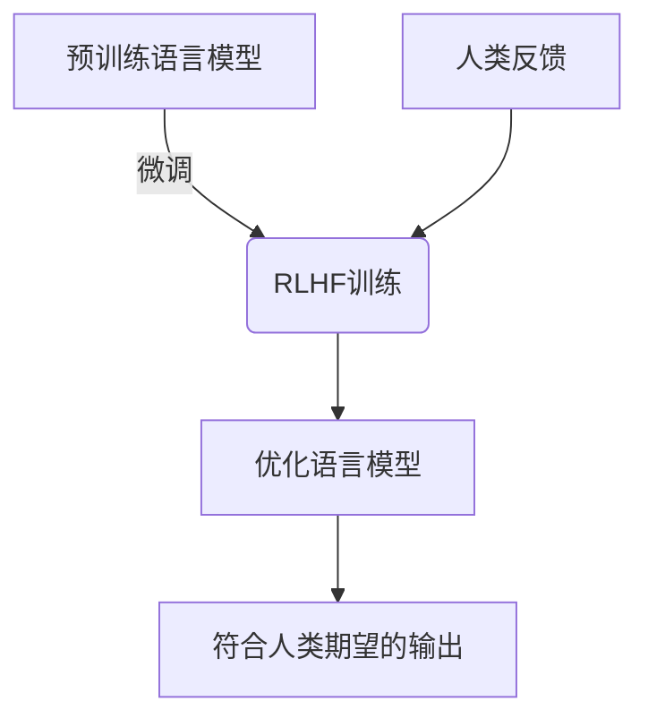
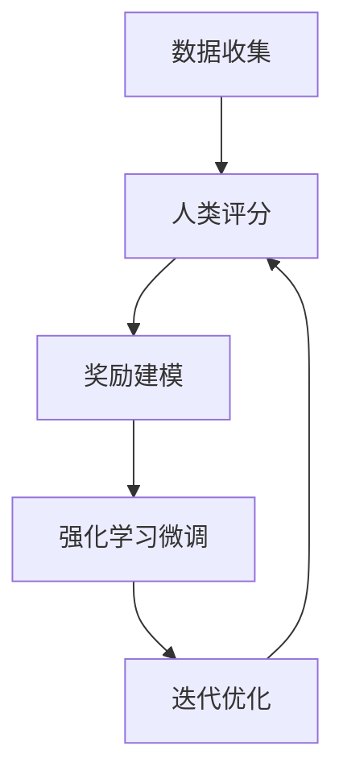

# 大语言模型原理与工程实践：RLHF 实战框架

## 1. 背景介绍

### 1.1 人工智能的崛起

人工智能(AI)技术在过去几年中取得了令人瞩目的进展,尤其是在自然语言处理(NLP)和计算机视觉(CV)等领域。大型语言模型(LLM)的出现,使得人工智能系统能够生成逼真的自然语言输出,从而在多个应用场景中发挥重要作用。

### 1.2 大语言模型的挑战

然而,训练出高质量的大语言模型并非易事。传统的监督学习方法需要大量高质量的标注数据,而这在某些领域是昂贵且困难的。此外,大语言模型可能会产生有害、不当或不准确的输出,这可能会对用户产生负面影响。

### 1.3 RLHF 的兴起

为了解决上述挑战,研究人员提出了一种新的训练范式,称为基于人类反馈的强化学习(Reinforcement Learning from Human Feedback,RLHF)。RLHF 允许利用人类的评分和反馈来微调预先训练的大型语言模型,从而使其输出更加符合人类的期望和价值观。

## 2. 核心概念与联系

### 2.1 强化学习

强化学习(Reinforcement Learning,RL)是机器学习的一个重要分支,它关注如何让智能体(agent)通过与环境的交互来学习采取最优策略,从而最大化预期的累积奖励。

在 RLHF 中,语言模型就是这个智能体,而人类的评分和反馈则构成了奖励信号。模型的目标是学习生成能够获得高人类评分的输出。

### 2.2 人类反馈

人类反馈是 RLHF 的核心组成部分。它可以采取多种形式,例如对模型输出的打分、对比不同输出的排序,或者直接编辑模型输出。通过收集和利用这些人类反馈,模型可以更好地理解人类的期望和价值观。

### 2.3 微调和奖励建模

在 RLHF 过程中,预先训练的大型语言模型会通过强化学习算法进行微调,以最大化来自人类反馈的奖励信号。这通常涉及构建一个奖励模型(Reward Model),该模型能够基于人类反馈预测输出的奖励分数。

微调过程中,语言模型会尝试生成能够获得高奖励分数的输出,从而逐步调整其参数,使输出更加符合人类的期望。



## 3. 核心算法原理具体操作步骤

RLHF 算法的核心步骤如下:

1. **数据收集**:收集一组涵盖各种场景的示例输入,以及对应的人类参考输出。

2. **人类评分**:让多个人类评分员对模型在示例输入上生成的输出进行评分,获取人类反馈数据。

3. **奖励建模**:使用监督学习,基于人类评分数据训练一个奖励模型(Reward Model),该模型能够预测给定输出的人类评分。

4. **强化学习微调**:使用强化学习算法(如 PPO 或 REINFORCE),将预训练的语言模型在示例输入上微调,目标是最大化奖励模型预测的奖励分数。

5. **迭代优化**:重复步骤 2-4,使用新的人类评分数据不断优化奖励模型和语言模型,直到达到所需的性能水平。



## 4. 数学模型和公式详细讲解举例说明

### 4.1 强化学习形式化描述

在强化学习中,智能体(agent)与环境(environment)进行交互,在每个时间步 $t$,智能体根据当前状态 $s_t$ 选择一个动作 $a_t$,然后环境转移到新状态 $s_{t+1}$,并返回一个奖励 $r_t$。智能体的目标是学习一个策略 $\pi(a|s)$,使得在环境中执行该策略时能够最大化预期的累积奖励:

$$J(\pi) = \mathbb{E}_{\pi}\left[\sum_{t=0}^\infty \gamma^t r_t\right]$$

其中 $\gamma \in (0, 1]$ 是折现因子,用于权衡当前奖励和未来奖励的重要性。

在 RLHF 中,智能体是语言模型,状态 $s_t$ 是当前的输入,动作 $a_t$ 是生成的文本输出,而奖励 $r_t$ 则由奖励模型基于人类反馈预测得到。

### 4.2 策略梯度算法

为了优化策略 $\pi$,我们可以使用策略梯度算法,其目标是最大化目标函数 $J(\pi)$ 关于策略参数 $\theta$ 的梯度:

$$\nabla_\theta J(\pi_\theta) = \mathbb{E}_{\pi_\theta}\left[\sum_{t=0}^\infty \nabla_\theta \log \pi_\theta(a_t|s_t)Q^{\pi_\theta}(s_t, a_t)\right]$$

其中 $Q^{\pi_\theta}(s_t, a_t)$ 是在策略 $\pi_\theta$ 下执行动作 $a_t$ 时的预期累积奖励,也称为状态-动作值函数。

在实践中,我们通常使用蒙特卡罗估计来近似计算梯度,并采用各种方法(如优势函数估计)来减小方差。

### 4.3 PPO 算法

一种常用的策略梯度算法是近端策略优化(Proximal Policy Optimization,PPO)。PPO 在每次迭代中,通过最小化以下目标函数来更新策略:

$$L_t^{CLIP}(\theta) = \mathbb{E}_t\left[\min\left(r_t(\theta)\hat{A}_t, \clip(r_t(\theta), 1-\epsilon, 1+\epsilon)\hat{A}_t\right)\right]$$

其中 $r_t(\theta) = \frac{\pi_\theta(a_t|s_t)}{\pi_{\theta_{old}}(a_t|s_t)}$ 是重要性采样比率, $\hat{A}_t$ 是优势函数估计, $\epsilon$ 是一个超参数,用于限制策略更新的幅度。

通过 PPO 算法,语言模型可以在保持相对稳定的同时,逐步朝着提高人类反馈奖励的方向优化。

## 5. 项目实践:代码实例和详细解释说明

以下是一个使用 PyTorch 和 Hugging Face Transformers 库实现 RLHF 的简化示例:

```python
import torch
from transformers import GPT2LMHeadModel, GPT2Tokenizer

# 加载预训练的语言模型
tokenizer = GPT2Tokenizer.from_pretrained('gpt2')
model = GPT2LMHeadModel.from_pretrained('gpt2')

# 定义奖励模型
reward_model = ...  # 基于人类反馈训练的奖励模型

# 定义 PPO 算法
optimizer = torch.optim.AdamW(model.parameters(), lr=1e-5)
ppo_epochs = 4

for epoch in range(ppo_epochs):
    # 收集数据
    inputs = ...  # 示例输入
    human_ratings = ...  # 对应的人类评分

    # 计算奖励
    outputs = model.generate(inputs, max_length=100, do_sample=True)
    rewards = reward_model(outputs, human_ratings)

    # PPO 训练
    epoch_loss = 0
    for _ in range(10):  # 10 个 PPO 迭代
        outputs, log_probs, entropy = model(inputs, output_attentions=True)
        ratios = torch.exp(log_probs - old_log_probs)
        advantages = rewards - value_estimates
        surr1 = ratios * advantages
        surr2 = torch.clamp(ratios, 1-0.2, 1+0.2) * advantages
        loss = -torch.min(surr1, surr2) + 0.01 * entropy
        epoch_loss += loss.mean()
        loss.backward()
        optimizer.step()
        optimizer.zero_grad()

    print(f'Epoch {epoch+1}, loss: {epoch_loss / 10}')
```

这个示例代码展示了如何使用 PyTorch 和 Hugging Face Transformers 库加载预训练的语言模型,以及如何实现 PPO 算法进行 RLHF 微调。

在每个 epoch 中,我们首先使用示例输入生成模型输出,并基于人类评分计算奖励。然后,我们使用 PPO 算法更新语言模型的参数,目标是最大化预期的累积奖励。

需要注意的是,这只是一个简化的示例,实际应用中可能需要进行更多的优化和调整,例如使用更复杂的奖励模型、采用不同的强化学习算法等。

## 6. 实际应用场景

RLHF 技术在多个领域都有广泛的应用前景:

1. **对话系统**:使用 RLHF 训练的语言模型可以生成更加自然、符合人类期望的对话响应,从而提高对话系统的用户体验。

2. **内容生成**:RLHF 可以用于训练内容生成模型,例如新闻摘要、故事创作等,使生成的内容更加符合人类的审美和价值观。

3. **问答系统**:通过 RLHF,问答系统可以学习生成更加准确、相关和有用的答复,提高问答质量。

4. **文本摘要**:RLHF 可以帮助文本摘要模型生成更加准确、连贯和信息丰富的摘要。

5. **机器翻译**:使用 RLHF 微调的机器翻译模型可以生成更加自然、符合目标语言习惯的翻译结果。

6. **写作辅助**:RLHF 技术可以用于训练智能写作助手,提供更加符合人类写作风格和偏好的建议和修改。

总的来说,RLHF 为我们提供了一种有效的方式,将人类的价值观和期望融入到大型语言模型中,从而使 AI 系统的输出更加人性化和可控。

## 7. 工具和资源推荐

以下是一些有用的工具和资源,可以帮助您更好地学习和实践 RLHF:

1. **Hugging Face Transformers**:一个流行的自然语言处理库,提供了预训练模型和各种实用工具。
2. **OpenAI Baselines**:OpenAI 提供的一个强化学习库,包含了多种强化学习算法的实现。
3. **Ray RLlib**:一个具有分布式支持的强化学习库,可以轻松扩展到大规模环境。
4. **Anthropic**:一家专注于 RLHF 研究和应用的公司,提供了相关的开源工具和资源。
5. **RLHF 论文和教程**:阅读相关的论文和教程,了解 RLHF 的最新进展和实践经验。
6. **在线社区**:加入相关的在线社区,如 Discord 频道或 Reddit 子版块,与其他研究人员和从业者交流探讨。

通过利用这些工具和资源,您可以更好地掌握 RLHF 的理论基础和实践技能,从而在相关领域取得进展。

## 8. 总结:未来发展趋势与挑战

RLHF 作为一种新兴的训练范式,在提高语言模型的可控性和人性化方面展现出巨大的潜力。然而,它也面临着一些挑战和未来的发展趋势:

1. **提高效率**:当前的 RLHF 流程需要大量的人力成本来收集和标注人类反馈数据,未来需要探索如何提高这一过程的效率。
2. **多模态支持**:除了文本输入输出,RLHF 也可以扩展到其他模态,如图像、视频和音频,以支持更广泛的应用场景。
3. **联合优化**:探索如何将 RLHF 与其他训练范式(如监督学习、自监督学习等)相结合,以获得更好的性能。
4. **可解释性**:提高 RLHF 模型的可解释性,使其决策过程更加透明,从而提高可信度和