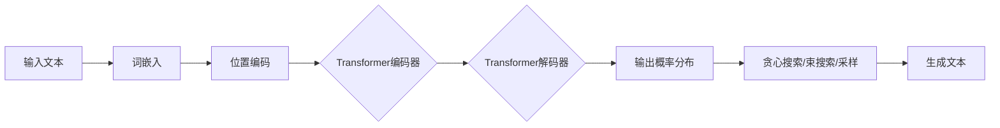

# 大语言模型原理与工程实践：工具设计

## 1. 背景介绍
### 1.1 大语言模型的发展历程
#### 1.1.1 早期的语言模型
#### 1.1.2 神经网络语言模型的兴起
#### 1.1.3 Transformer 架构的革命性突破

### 1.2 大语言模型的应用领域
#### 1.2.1 自然语言处理
#### 1.2.2 信息检索与问答系统
#### 1.2.3 文本生成与创作

### 1.3 大语言模型面临的挑战
#### 1.3.1 计算资源需求
#### 1.3.2 数据质量与偏见
#### 1.3.3 可解释性与可控性

## 2. 核心概念与联系
### 2.1 语言模型
#### 2.1.1 定义与原理
#### 2.1.2 统计语言模型
#### 2.1.3 神经网络语言模型

### 2.2 注意力机制与 Transformer 架构
#### 2.2.1 注意力机制的核心思想
#### 2.2.2 自注意力机制
#### 2.2.3 Transformer 的编码器-解码器结构

### 2.3 预训练与微调
#### 2.3.1 无监督预训练
#### 2.3.2 有监督微调
#### 2.3.3 预训练-微调范式的优势

### 2.4 知识蒸馏与模型压缩
#### 2.4.1 知识蒸馏的原理
#### 2.4.2 模型压缩技术
#### 2.4.3 轻量化模型的应用

## 3. 核心算法原理具体操作步骤
### 3.1 Transformer 的核心组件
#### 3.1.1 多头注意力机制
#### 3.1.2 前馈神经网络
#### 3.1.3 残差连接与层归一化

### 3.2 预训练目标与损失函数
#### 3.2.1 语言模型预训练目标
#### 3.2.2 掩码语言模型
#### 3.2.3 对比学习目标

### 3.3 微调与任务适应
#### 3.3.1 分类任务微调
#### 3.3.2 序列标注任务微调
#### 3.3.3 文本生成任务微调

### 3.4 推理与生成策略
#### 3.4.1 贪心搜索
#### 3.4.2 束搜索
#### 3.4.3 采样策略

## 4. 数学模型和公式详细讲解举例说明
### 4.1 语言模型的概率公式
#### 4.1.1 联合概率分解
#### 4.1.2 条件概率计算
#### 4.1.3 交叉熵损失函数

### 4.2 注意力机制的数学表示
#### 4.2.1 查询、键、值的计算
#### 4.2.2 注意力权重的计算
#### 4.2.3 注意力输出的计算

### 4.3 Transformer 的前向传播过程
#### 4.3.1 输入嵌入与位置编码
#### 4.3.2 编码器的计算过程
#### 4.3.3 解码器的计算过程

### 4.4 知识蒸馏的目标函数
#### 4.4.1 软目标与硬目标
#### 4.4.2 温度参数的作用
#### 4.4.3 蒸馏损失与任务损失的平衡

## 5. 项目实践：代码实例和详细解释说明
### 5.1 数据准备与预处理
#### 5.1.1 文本数据的清洗与标准化
#### 5.1.2 词表构建与编码
#### 5.1.3 数据集的划分与批处理

### 5.2 模型构建与训练
#### 5.2.1 Transformer 模型的实现
#### 5.2.2 预训练阶段的训练流程
#### 5.2.3 微调阶段的训练流程

### 5.3 模型评估与优化
#### 5.3.1 评估指标的选择
#### 5.3.2 超参数调优
#### 5.3.3 模型集成与融合

### 5.4 模型部署与服务化
#### 5.4.1 模型的导出与加载
#### 5.4.2 推理服务的搭建
#### 5.4.3 API 接口的设计与实现

## 6. 实际应用场景
### 6.1 智能对话系统
#### 6.1.1 客服聊天机器人
#### 6.1.2 个人助理
#### 6.1.3 知识问答

### 6.2 文本生成与创作
#### 6.2.1 新闻写作
#### 6.2.2 小说创作
#### 6.2.3 诗歌生成

### 6.3 信息检索与推荐
#### 6.3.1 搜索引擎
#### 6.3.2 个性化推荐
#### 6.3.3 相似度计算

## 7. 工具和资源推荐
### 7.1 开源框架与库
#### 7.1.1 TensorFlow
#### 7.1.2 PyTorch
#### 7.1.3 Hugging Face Transformers

### 7.2 预训练模型
#### 7.2.1 BERT
#### 7.2.2 GPT 系列
#### 7.2.3 T5

### 7.3 数据集与评测基准
#### 7.3.1 WikiText
#### 7.3.2 SQuAD
#### 7.3.3 GLUE

### 7.4 工具与平台
#### 7.4.1 Google Colab
#### 7.4.2 Weights & Biases
#### 7.4.3 Streamlit

## 8. 总结：未来发展趋势与挑战
### 8.1 大语言模型的发展方向
#### 8.1.1 模型规模的扩大
#### 8.1.2 多模态融合
#### 8.1.3 领域适应与个性化

### 8.2 面临的挑战与机遇
#### 8.2.1 计算效率与成本
#### 8.2.2 数据隐私与安全
#### 8.2.3 伦理与社会影响

### 8.3 未来展望
#### 8.3.1 人机协作
#### 8.3.2 知识增强
#### 8.3.3 自主学习与进化

## 9. 附录：常见问题与解答
### 9.1 如何选择合适的预训练模型？
### 9.2 如何处理训练过程中的梯度爆炸问题？
### 9.3 如何平衡模型的泛化能力与任务性能？
### 9.4 如何应对数据隐私与安全挑战？
### 9.5 如何评估生成文本的质量与多样性？

大语言模型（Large Language Model，LLM）是自然语言处理领域的重要里程碑，其强大的语言理解与生成能力为众多应用场景带来了革命性的变化。本文将深入探讨大语言模型的原理、算法、工程实践以及相关的工具设计，为读者提供全面而深入的认识。

大语言模型的发展可以追溯到早期的统计语言模型，如 N-gram 模型。随着深度学习的兴起，神经网络语言模型逐渐取代了传统的统计模型。然而，真正的突破来自于 Transformer 架构的提出，其自注意力机制和并行计算能力极大地提升了模型的性能。预训练-微调范式的广泛应用，使得大语言模型能够在海量无标注数据上学习通用的语言表示，并在特定任务上进行高效的适应。

大语言模型的核心概念包括语言模型、注意力机制、Transformer 架构、预训练与微调等。语言模型旨在学习语言的概率分布，即在给定上文的情况下，预测下一个词的概率。注意力机制允许模型在处理当前词时，关注输入序列中的相关信息，克服了传统循环神经网络的长距离依赖问题。Transformer 架构则将自注意力机制与前馈神经网络相结合，实现了高效的并行计算。预训练阶段利用无监督的语言建模任务，如掩码语言模型和对比学习，在大规模文本数据上学习通用的语言表示。微调阶段则在特定任务的标注数据上，调整预训练模型的参数，以适应任务的需求。

大语言模型的训练与应用涉及多个关键步骤。首先是数据准备与预处理，包括文本清洗、标准化、词表构建等。其次是模型构建与训练，需要实现 Transformer 的编码器-解码器结构，并设计合适的预训练目标和损失函数。模型训练完成后，需要进行评估与优化，选择合适的评估指标，并通过超参数调优和模型集成等技术进一步提升性能。最后是模型部署与服务化，将训练好的模型导出并加载到推理服务中，设计友好的 API 接口供用户调用。

大语言模型在实际应用中展现出了巨大的潜力。在智能对话系统领域，大语言模型可以用于构建客服聊天机器人、个人助理和知识问答系统，提供自然流畅的交互体验。在文本生成与创作方面，大语言模型可以辅助新闻写作、小说创作和诗歌生成，激发人类的创造力。在信息检索与推荐领域，大语言模型可以用于改进搜索引擎、个性化推荐和相似度计算，提升用户的检索效率和满意度。

为了帮助读者快速上手大语言模型的开发与应用，本文推荐了一系列实用的工具和资源。主流的深度学习框架如 TensorFlow 和 PyTorch 提供了强大的建模与训练能力。Hugging Face Transformers 库集成了众多预训练模型，如 BERT、GPT 系列和 T5，可以方便地进行微调和推理。此外，Google Colab、Weights & Biases 和 Streamlit 等工具与平台，可以帮助用户快速搭建开发环境、管理实验和部署模型。

展望未来，大语言模型的发展趋势包括模型规模的持续扩大、多模态信息的融合、领域适应与个性化等。然而，大语言模型也面临着计算效率与成本、数据隐私与安全、伦理与社会影响等挑战。未来，大语言模型有望实现更加智能的人机协作、知识增强和自主学习能力，推动人工智能领域的持续进步。

总之，大语言模型是自然语言处理领域的重要里程碑，其强大的语言理解与生成能力正在重塑众多应用场景。本文对大语言模型的原理、算法、工程实践以及工具设计进行了全面而深入的探讨，旨在为读者提供一个系统的认识和实践指南。希望本文能够激发读者对大语言模型的兴趣，并为相关研究与应用提供有益的参考。

作者：禅与计算机程序设计艺术 / Zen and the Art of Computer Programming