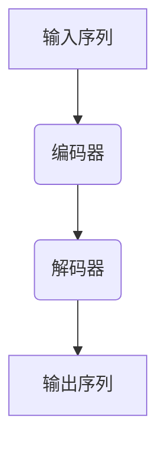

# 大语言模型原理与工程实践：手把手教你训练 7B 大语言模型 自动化训练框架

## 1. 背景介绍

### 1.1 大语言模型的兴起

近年来,大型语言模型(Large Language Models, LLMs)在自然语言处理(NLP)领域掀起了一股革命浪潮。这些模型通过在大规模语料库上进行预训练,学习了丰富的语言知识和上下文信息,从而在下游任务中展现出了令人惊叹的性能表现。

领先的大语言模型包括 GPT-3、PaLM、Chinchilla、Bloom 等,其中 GPT-3 可谓是开启了这一浪潮的先驱。这些模型不仅在文本生成、问答系统、机器翻译等传统 NLP 任务上表现出色,更是在代码生成、数学推理、多模态等前沿领域展现出了广阔的应用前景。

### 1.2 大语言模型的挑战

尽管大语言模型取得了巨大的成功,但训练这些庞大的模型也面临着诸多挑战:

1. **计算资源需求巨大**:大语言模型通常包含数十亿甚至上百亿个参数,训练这些参数需要大量的计算资源,包括 GPU 集群、大容量内存等。
2. **数据需求庞大**:为了获得良好的泛化能力,大语言模型需要在海量的语料库上进行预训练,这对数据的规模和质量提出了很高的要求。
3. **训练过程复杂**:大语言模型的训练过程涉及诸多技术细节,如数据预处理、模型并行、混合精度训练等,需要专业的工程能力来实现。
4. **环境配置繁琐**:构建一个完整的大语言模型训练环境需要配置多个深度学习框架、库和工具,对新手来说往往是一个巨大的挑战。
5. **成本高昂**:训练大语言模型需要大量的计算资源和存储空间,导致成本高昂,这对于个人研究者和中小型企业来说可能是一个障碍。

为了降低这些挑战带来的门槛,简化大语言模型的训练过程,迫切需要一个自动化、高效的训练框架来支持研究者和开发者快速构建和训练自己的大语言模型。

## 2. 核心概念与联系

### 2.1 大语言模型的架构

大语言模型通常采用基于 Transformer 的编码器-解码器架构或仅编码器架构。其中,编码器用于捕获输入序列的上下文信息,解码器则根据编码器的输出生成目标序列。

在预训练阶段,大语言模型通过掩码语言模型(Masked Language Modeling, MLM)和下一句预测(Next Sentence Prediction, NSP)等任务,学习到丰富的语言知识和上下文信息。而在微调阶段,则根据具体的下游任务对模型进行进一步的优化和调整。

### 2.2 自注意力机制

自注意力机制是 Transformer 架构的核心,它允许模型捕捉输入序列中任意两个位置之间的依赖关系,从而更好地建模长距离依赖。

在自注意力计算中,每个位置的表示是通过对其他所有位置的表示进行加权求和而得到的,权重则由位置之间的相似性决定。这种机制使得模型能够灵活地关注输入序列中的不同部分,从而提高了模型的表示能力。

### 2.3 模型并行与数据并行

为了支持大规模模型的高效训练,通常需要采用模型并行和数据并行等策略。

- **模型并行**:将模型的参数分布在多个设备(如 GPU)上,每个设备只负责计算一部分参数,从而减轻单个设备的计算压力。
- **数据并行**:将训练数据分布在多个设备上,每个设备处理一部分数据,最终将各设备的梯度汇总更新模型参数。

通过合理地组合模型并行和数据并行,可以充分利用多个计算设备的算力,加速大语言模型的训练过程。

### 2.4 混合精度训练

混合精度训练(Mixed Precision Training)是一种在训练过程中同时使用单精度(FP32)和半精度(FP16)浮点数的技术,它可以有效减少内存占用和计算量,从而提高训练速度。

在混合精度训练中,大部分计算使用内存占用较小的 FP16 格式进行,而某些对数值精度要求较高的计算(如梯度计算)则使用 FP32 格式,从而在保证收敛性的同时提高计算效率。

### 2.5 自动化训练框架

自动化训练框架旨在简化大语言模型的训练过程,屏蔽掉许多复杂的技术细节,使得研究者和开发者能够更加专注于模型的设计和应用。

一个优秀的自动化训练框架应当具备以下特性:

1. **易用性**:提供简单、统一的接口,降低使用门槛。
2. **高效性**:支持多种加速策略,如模型并行、数据并行、混合精度训练等,提高训练效率。
3. **灵活性**:支持多种模型架构、任务和数据格式,满足不同场景的需求。
4. **可扩展性**:具有良好的模块化设计,方便扩展和定制化开发。
5. **可复现性**:提供详细的日志和检查点机制,确保实验可复现。

通过自动化训练框架,研究者和开发者可以更加专注于模型的设计和应用,而不必过多地关注底层的实现细节,从而大大提高了开发效率。

## 3. 核心算法原理具体操作步骤

### 3.1 数据预处理

在训练大语言模型之前,需要对原始语料库进行预处理,以确保数据的质量和一致性。常见的预处理步骤包括:

1. **文本清理**:去除无用的字符、HTML 标签、URL 等。
2. **标记化**:将文本按照一定规则(如空格、标点符号等)分割成一个个标记(token)。
3. **词元化**:将相似的词元(如大小写变体、复数形式等)归并为同一个标记。
4. **子词化**:将较长的词拆分成多个子词标记,以处理未登录词(Out-of-Vocabulary, OOV)问题。
5. **填充和截断**:将所有序列填充或截断至固定长度,以满足模型的输入要求。

经过预处理后,语料库将转换为一系列标记序列,作为模型的输入。

### 3.2 模型初始化

在训练开始之前,需要初始化模型的参数。常见的初始化方式包括:

1. **随机初始化**:从一个特定的分布(如高斯分布、均匀分布等)中随机采样初始参数值。
2. **预训练模型初始化**:使用在大规模语料库上预训练的模型参数作为初始值,进行进一步的微调。

合理的初始化策略可以加快模型的收敛速度,提高训练效率。

### 3.3 数据加载

为了充分利用硬件资源,需要高效地加载训练数据。常见的数据加载方式包括:

1. **数据集对象**:将数据封装为可迭代的数据集对象,方便批量读取和并行处理。
2. **数据加载器**:使用多线程或多进程的方式异步加载数据,避免数据加载成为训练过程的瓶颈。
3. **数据缓存**:将数据缓存在内存或高速存储设备中,加快数据访问速度。
4. **数据分布**:在多个设备之间均匀分布数据,实现数据并行。

高效的数据加载策略可以确保模型在训练过程中始终有足够的数据供给,从而充分利用计算资源。

### 3.4 前向传播

前向传播是模型计算过程的核心部分,它将输入数据经过一系列的线性变换和非线性激活函数,最终得到模型的输出。

在大语言模型中,前向传播过程主要包括以下几个步骤:

1. **词嵌入**:将输入的标记序列映射为对应的词嵌入向量。
2. **位置编码**:为每个位置添加位置信息,以捕捉序列的位置依赖关系。
3. **自注意力计算**:通过自注意力机制捕捉输入序列中任意两个位置之间的依赖关系。
4. **前馈神经网络**:对自注意力的输出进行线性变换和非线性激活,提取更高层次的特征表示。
5. **层归一化**:对每一层的输出进行归一化处理,加速收敛并提高模型的稳定性。
6. **残差连接**:将每一层的输入和输出相加,缓解了深层网络的梯度消失问题。

通过多层的自注意力和前馈神经网络的堆叠,模型可以学习到丰富的语言知识和上下文信息。

### 3.5 损失计算

在训练过程中,需要定义一个损失函数来衡量模型输出与真实标签之间的差异。常见的损失函数包括:

1. **交叉熵损失**:用于分类任务,衡量模型预测概率分布与真实标签分布之间的差异。
2. **均方误差损失**:用于回归任务,衡量模型预测值与真实值之间的平方差。

对于大语言模型,通常采用掩码语言模型(MLM)和下一句预测(NSP)等任务进行预训练,其中 MLM 任务的损失函数为:

$$\mathcal{L}_\text{MLM} = -\frac{1}{N}\sum_{i=1}^N \log P(x_i | \mathbf{x}_\text{masked})$$

其中 $N$ 是掩码位置的数量, $\mathbf{x}_\text{masked}$ 是掩码后的输入序列, $x_i$ 是第 $i$ 个掩码位置的真实标记。

### 3.6 反向传播

反向传播是通过计算损失函数对模型参数的梯度,并根据梯度更新参数值的过程。

在大语言模型中,反向传播主要包括以下几个步骤:

1. **计算梯度**:通过自动微分技术,计算损失函数对模型各个参数的梯度。
2. **梯度裁剪**:为了防止梯度爆炸,需要对梯度值进行裁剪,确保其在一个合理的范围内。
3. **梯度累积**:为了支持大批量训练,可以将多个小批量的梯度累积起来,再一次性更新模型参数。
4. **参数更新**:使用优化器(如 Adam、AdamW 等)根据梯度值更新模型参数。

在反向传播过程中,还可以应用一些技术来加速收敛和提高模型性能,如层归一化、残差连接、梯度修剪等。

### 3.7 模型评估

在训练过程中,需要定期评估模型在验证集或测试集上的性能,以监控模型的收敛情况和泛化能力。

常见的评估指标包括:

1. **困惑度(Perplexity)**:衡量模型在语言模型任务上的性能,值越小表示模型越好。
2. **精确率(Precision)、召回率(Recall)、F1 分数**:用于评估分类任务的性能。
3. **BLEU、ROUGE、METEOR**:用于评估机器翻译、文本摘要等任务的性能。

根据评估结果,可以调整模型的超参数、优化器、损失函数等,以获得更好的性能表现。

### 3.8 模型保存和加载

在训练过程中,需要定期保存模型的检查点(checkpoint),以便在发生中断或错误时能够从上次的状态继续训练。

同时,也需要提供加载已训练模型的功能,以便在下游任务中进行微调或直接部署。

保存和加载模型通常包括以下几个步骤:

1. **序列化模型参数**:将模型的参数转换为可保存的格式,如 PyTorch 的 `state_dict`。
2. **保存模型元数据**:保存模型的配置信息、词表、tokenizer 等元数据。
3. **保存优化器状态**:保存优化器的状态,如