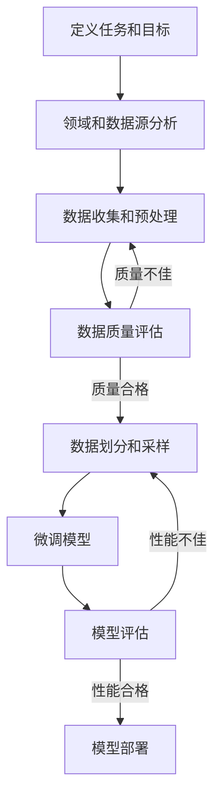

# 大语言模型原理与工程实践：有监督微调数据的选择

## 1.背景介绍

### 1.1 大语言模型的兴起

近年来,大型语言模型(Large Language Models, LLMs)在自然语言处理(NLP)领域取得了巨大成功,引起了广泛关注。这些模型通过在大规模文本语料库上进行预训练,学习了丰富的语言知识和上下文信息,展现出令人惊叹的生成能力。

代表性的大语言模型包括:

- GPT-3(Generative Pre-trained Transformer 3)
- BERT(Bidirectional Encoder Representations from Transformers)
- XLNet
- RoBERTa
- ALBERT
- T5(Text-to-Text Transfer Transformer)

它们在广泛的自然语言处理任务中表现出色,例如文本生成、机器翻译、问答系统、文本摘要等,极大推动了NLP技术的发展。

### 1.2 大语言模型的挑战

尽管大语言模型取得了令人瞩目的成就,但它们也面临着一些挑战:

1. **数据量需求巨大**: 预训练阶段需要消耗大量计算资源和存储空间,对训练数据的规模要求非常高。
2. **缺乏领域适应性**: 通用预训练语料库可能与特定领域存在差距,模型在特定领域的表现可能不尽如人意。
3. **知识一致性**: 模型生成的内容可能存在内部矛盾或与事实不符的情况。
4. **偏差和公平性**: 训练数据中的偏差可能会导致模型在特定群体或主题上表现不佳。

为了应对这些挑战,研究人员提出了一种常见的解决方案:有监督微调(Supervised Fine-tuning)。

## 2.核心概念与联系

### 2.1 什么是有监督微调?

有监督微调是指在大语言模型的预训练基础上,利用与目标任务相关的标注数据集,对模型进行进一步的专门化训练。这个过程可以提高模型在特定任务和领域的表现。

微调的基本思路是:

1. 加载预训练的大语言模型权重
2. 在目标任务的标注数据集上进行有监督训练
3. 根据任务目标设计适当的损失函数和优化策略
4. 对模型参数进行微调,使其更好地适应目标任务

通过有监督微调,模型可以学习到特定任务和领域的知识,提高性能并减少偏差。

### 2.2 微调数据的重要性

在有监督微调过程中,训练数据的质量和数量对模型性能有着至关重要的影响。合适的微调数据集可以帮助模型:

1. **提高领域适应性**: 来自目标领域的数据可以使模型更好地理解该领域的语言模式和知识。
2. **减少偏差**: 通过包含多样化的数据,可以减少模型在特定群体或主题上的偏差。
3. **提高一致性**: 高质量的数据可以帮助模型生成更加一致和准确的输出。
4. **提升泛化能力**: 丰富多样的数据有助于模型学习更好的泛化能力,应对各种情况。

因此,选择合适的微调数据集是提高大语言模型性能的关键步骤之一。

### 2.3 微调数据选择的挑战

尽管微调数据的重要性不言而喻,但选择合适的数据集并非一件容易的事情。主要挑战包括:

1. **数据可获得性**: 某些领域或任务可能缺乏高质量的标注数据。
2. **数据质量**: 现有数据可能存在噪声、偏差或不一致性。
3. **数据多样性**: 确保数据涵盖足够多样化的情况,以提高模型的泛化能力。
4. **数据隐私**: 某些数据可能涉及隐私或敏感信息,需要谨慎处理。
5. **成本和时间**: 构建高质量的数据集通常需要大量的人力和时间投入。

因此,有效地选择和构建微调数据集是一项具有挑战性的任务,需要综合考虑多个因素。

## 3.核心算法原理具体操作步骤

选择合适的微调数据集是一个循序渐进的过程,需要遵循一些基本原则和最佳实践。以下是一个常见的操作流程:



### 3.1 定义任务和目标

首先需要明确微调的任务目标,例如文本分类、机器翻译、问答系统等。根据任务目标,确定所需的数据类型和格式。

### 3.2 领域和数据源分析

分析目标领域的特点和语言模式,确定潜在的数据来源。常见的数据来源包括:

- 公开数据集
- 网络爬取数据
- 内部企业数据
- 众包标注数据

### 3.3 数据收集和预处理

从确定的数据源中收集原始数据,并进行必要的预处理,如去重、清洗、格式化等。预处理的目的是提高数据质量和一致性。

### 3.4 数据质量评估

评估收集到的数据的质量,包括:

- 覆盖面: 数据是否涵盖了足够多样化的情况?
- 准确性: 数据中是否存在错误或噪声?
- 偏差: 数据是否存在明显的偏差或不平衡?
- 隐私和安全: 数据是否涉及隐私或敏感信息?

根据评估结果,决定是否需要进一步收集或清理数据。

### 3.5 数据划分和采样

将评估合格的数据划分为训练集、验证集和测试集。根据需要,可以进行采样或过采样,以平衡数据分布。

### 3.6 微调模型

使用划分好的训练集和验证集,对预训练的大语言模型进行有监督微调。需要设计合适的损失函数、优化策略和超参数,以最大限度地提高模型在目标任务上的性能。

### 3.7 模型评估

在保留的测试集上评估微调后模型的性能,包括准确性、泛化能力等指标。如果性能不佳,可以尝试调整数据划分、采样策略或微调超参数。

### 3.8 模型部署

当模型性能达到预期目标时,即可将其部署到生产环境中,用于实际应用。

需要注意的是,这个过程是循环迭代的。随着新数据的不断收集和模型性能的持续优化,可能需要重复执行上述步骤,以进一步提高模型的表现。

## 4.数学模型和公式详细讲解举例说明

在有监督微调过程中,常见的损失函数和优化策略包括:

### 4.1 交叉熵损失函数

对于分类任务,交叉熵损失函数是一种常用的选择。它衡量了模型预测的概率分布与真实标签之间的差异。

对于二分类问题,交叉熵损失函数定义为:

$$
L(y, \hat{y}) = -[y \log(\hat{y}) + (1 - y) \log(1 - \hat{y})]
$$

其中:
- $y$ 是真实标签 (0 或 1)
- $\hat{y}$ 是模型预测的概率值 (介于 0 和 1 之间)

对于多分类问题,交叉熵损失函数可以扩展为:

$$
L(Y, \hat{Y}) = -\sum_{i=1}^{C} y_i \log(\hat{y}_i)
$$

其中:
- $C$ 是类别数量
- $Y$ 是真实标签的一热编码向量
- $\hat{Y}$ 是模型预测的概率分布向量

目标是最小化交叉熵损失函数,使模型预测的概率分布尽可能接近真实标签。

### 4.2 Adam优化算法

Adam (Adaptive Moment Estimation) 是一种常用的优化算法,它结合了动量和自适应学习率的优点,可以加速模型收敛并提高性能。

Adam算法的更新规则如下:

$$
\begin{aligned}
m_t &= \beta_1 m_{t-1} + (1 - \beta_1) g_t \\
v_t &= \beta_2 v_{t-1} + (1 - \beta_2) g_t^2 \\
\hat{m}_t &= \frac{m_t}{1 - \beta_1^t} \\
\hat{v}_t &= \frac{v_t}{1 - \beta_2^t} \\
\theta_t &= \theta_{t-1} - \frac{\alpha}{\sqrt{\hat{v}_t} + \epsilon} \hat{m}_t
\end{aligned}
$$

其中:
- $m_t$ 和 $v_t$ 分别是一阶矩估计和二阶矩估计
- $\beta_1$ 和 $\beta_2$ 是指数衰减率
- $g_t$ 是当前梯度
- $\hat{m}_t$ 和 $\hat{v}_t$ 是偏差修正后的矩估计
- $\alpha$ 是学习率
- $\epsilon$ 是一个小常数,用于避免除以零

Adam算法通过自适应调整每个参数的学习率,可以加快收敛速度并提高模型性能。

### 4.3 示例: 文本分类任务

假设我们有一个二分类文本数据集,需要判断每个文本是正面评论还是负面评论。我们可以使用预训练的 BERT 模型,并在该数据集上进行有监督微调。

微调过程中,我们可以使用交叉熵损失函数和 Adam 优化算法。具体步骤如下:

1. 加载预训练的 BERT 模型权重
2. 对输入文本进行标记和编码,得到输入张量
3. 将输入张量传入 BERT 模型,得到文本表示
4. 将文本表示传入分类头 (一个简单的全连接层),得到logits
5. 计算 logits 与真实标签之间的交叉熵损失
6. 使用 Adam 优化算法,根据损失值更新模型参数

通过多次迭代训练,模型将逐步学习到文本分类任务的知识,提高在该数据集上的分类准确率。

需要注意的是,除了损失函数和优化算法之外,还需要合理设置其他超参数,如学习率、批量大小、训练轮数等,以获得最佳性能。

## 5.项目实践:代码实例和详细解释说明

为了更好地理解有监督微调过程,我们将通过一个实际的代码示例来演示如何在文本分类任务上微调 BERT 模型。

我们将使用 PyTorch 框架和 HuggingFace Transformers 库,在 IMDb 电影评论数据集上进行二分类任务 (正面评论 vs 负面评论)。

### 5.1 导入必要的库

```python
import torch
from torch.utils.data import DataLoader
from transformers import BertTokenizer, BertForSequenceClassification
from datasets import load_dataset
```

### 5.2 加载数据集

```python
dataset = load_dataset("imdb")
```

### 5.3 数据预处理

```python
tokenizer = BertTokenizer.from_pretrained('bert-base-uncased')

def preprocess_data(examples):
    return tokenizer(examples['text'], truncation=True, padding='max_length', max_length=512)

encoded_dataset = dataset.map(preprocess_data, batched=True, remove_columns=['text'])
```

### 5.4 创建数据加载器

```python
batch_size = 16
train_dataloader = DataLoader(encoded_dataset['train'], batch_size=batch_size, shuffle=True)
val_dataloader = DataLoader(encoded_dataset['test'], batch_size=batch_size)
```

### 5.5 加载预训练模型

```python
model = BertForSequenceClassification.from_pretrained('bert-base-uncased', num_labels=2)
```

### 5.6 定义训练函数

```python
from tqdm import tqdm

device = torch.device('cuda' if torch.cuda.is_available() else 'cpu')
model.to(device)

optimizer = torch.optim.Adam(model.parameters(), lr=2e-5)

epochs = 3
for epoch in range(epochs):
    model.train()
    loop = tqdm(train_dataloader, leave=True)
    for batch in loop:
        batch = {k: v.to(device) for k, v in batch.items()}
        outputs =