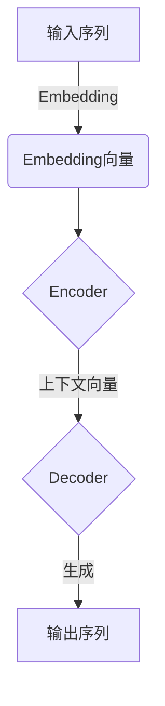
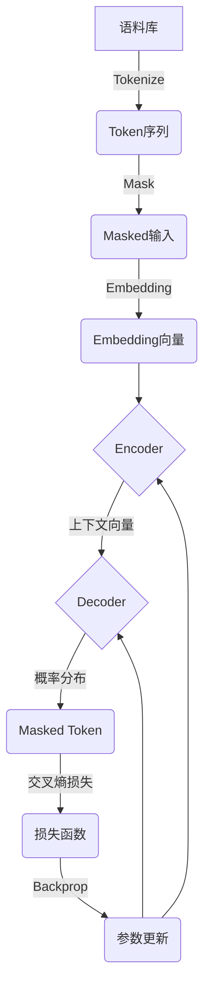
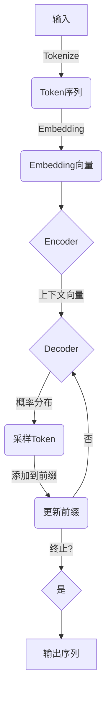

# 大语言模型原理与工程实践：自动生成数据的风险

## 1.背景介绍

### 1.1 大语言模型的崛起

近年来,大型语言模型(Large Language Models, LLMs)在自然语言处理领域取得了令人瞩目的成就。这些模型通过在海量文本数据上进行预训练,学习了丰富的语言知识和上下文关联性,从而能够生成看似人性化且内容丰富的文本。

代表性的大语言模型包括GPT-3、BERT、PALM等,它们展现出惊人的文本生成能力,可以撰写新闻报道、小说故事、代码、诗歌等多种形式的内容。这些模型的出现,为自动内容生成带来了革命性的变化,在内容创作、问答系统、机器翻译等领域发挥着重要作用。

### 1.2 自动生成数据的风险

然而,大语言模型生成的内容也存在着一些潜在风险和挑战。由于这些模型是通过机器学习方式训练而来,其生成的内容可能存在偏差、错误甚至是有害的内容。例如,生成的内容可能包含种族歧视、仇恨言论、虚假信息等不当内容,这对于一些敏感领域(如新闻报道、政府公告等)来说是难以接受的。

此外,大语言模型生成的内容也可能侵犯知识产权,例如抄袭现有作品。由于模型训练所使用的数据集中可能包含了大量的版权内容,因此生成的内容存在潜在的侵权风险。

因此,如何评估和控制大语言模型生成内容的风险,已经成为该领域亟待解决的重要问题。本文将深入探讨大语言模型原理、自动生成数据的风险,并提出相应的缓解措施和最佳实践。

## 2.核心概念与联系

### 2.1 大语言模型的工作原理

大语言模型本质上是一种基于transformer架构的序列到序列(Sequence-to-Sequence)模型,它能够捕捉输入序列中的上下文信息,并基于此生成相应的输出序列。

模型的核心部分是transformer的编码器(Encoder)和解码器(Decoder)。编码器将输入序列(如文本)映射为一系列向量表示,解码器则根据这些向量表示生成输出序列。两者之间通过注意力机制(Attention Mechanism)建立联系,使得解码器在生成每个新token时,都可以关注到输入序列中的相关上下文信息。

大语言模型的训练过程采用了自监督学习(Self-Supervised Learning)的方式。模型会基于大量的文本语料,预测被掩码(Mask)的单词或句子,从而学习到丰富的语言知识。一些常见的预训练目标包括:

- 掩码语言模型(Masked Language Model, MLM):预测被掩码的单词
- 下一句预测(Next Sentence Prediction, NSP):判断两个句子是否连贯
- 因果语言模型(Causal Language Model):基于前文预测下一个token

通过预训练,大语言模型能够学习到丰富的语义和语法知识,从而在下游任务(如文本生成、问答等)上表现出色。

### 2.2 自动生成数据的风险分析

虽然大语言模型展现出了强大的文本生成能力,但其生成的内容也存在一些潜在风险,主要包括:

1. **偏差和不当内容**: 由于训练数据的局限性和算法本身的缺陷,生成的内容可能存在种族、性别、政治等方面的偏差,或包含仇恨、暴力、色情等不当内容。

2. **事实错误和虚假信息**: 大语言模型生成的内容并不能保证其中的事实和陈述是正确的,很可能存在错误信息、虚假陈述等问题。

3. **知识产权侵犯**: 模型在生成内容时,可能会复制或改编现有的版权作品,从而侵犯了知识产权。

4. **缺乏逻辑一致性**: 生成的长文本内容可能缺乏逻辑连贯性和一致性,出现自相矛盾或前后不一致的情况。

5. **缺乏创新性**: 大语言模型生成的内容往往只是在现有知识和语料的基础上进行拼凑和改编,缺乏真正的创新性和原创性。

这些风险如果得不到有效控制,将会极大限制大语言模型在实际应用中的潜力,特别是在一些对内容质量和安全性要求较高的领域(如新闻、法律、金融等)。因此,评估和缓解这些风险,是大语言模型能否被广泛应用的关键所在。

## 3.核心算法原理具体操作步骤  

### 3.1 大语言模型的训练过程

大语言模型的训练过程可以概括为以下几个主要步骤:

1. **数据预处理**:首先需要收集和清洗大量的文本语料,并将其转化为模型可以接受的格式(如词元序列)。

2. **词嵌入**:将每个词元(token)映射为一个固定长度的向量表示(embedding),作为模型的输入。

3. **编码器处理**:输入序列的embedding向量被送入编码器(Encoder),编码器通过多层self-attention和前馈神经网络,捕捉输入序列中的上下文信息,并输出对应的上下文向量表示。

4. **掩码/遮罩**:在预训练阶段,需要对部分输入token进行掩码(mask),以构建预训练目标(如MLM)。

5. **解码器处理**:上下文向量被送入解码器(Decoder),解码器也由多层self-attention和交叉注意力(cross-attention)组成。它根据上下文向量和前缀(prefix),生成相应的输出token概率分布。

6. **损失计算与优化**:将解码器的输出概率分布与真实的标签(如被掩码的token)进行对比,计算损失函数(如交叉熵损失),并通过优化算法(如Adam)对模型参数进行更新。

以MLM(Masked Language Modeling)为例,具体的训练过程如下所示:

通过上述迭代训练,模型可以不断提高对语言的理解能力,并在下游任务(如文本生成)上表现出色。

### 3.2 文本生成过程

在完成预训练后,大语言模型可以被应用于各种下游任务,其中文本生成是一个重要的应用场景。文本生成的过程可以概括为:

1. **输入编码**:将生成任务的输入(如题目、提示等)编码为token序列,并通过embedding层获得对应的向量表示。

2. **上下文构建**:将输入的embedding向量送入编码器,获得对应的上下文向量表示。

3. **生成循环**:
   a. 将上下文向量和前缀(prefix,已生成的token序列)送入解码器,解码器输出当前位置的token概率分布。
   b. 根据一定的策略(如贪婪搜索、beam search、top-k/top-p采样等)从概率分布中采样出一个token。
   c. 将新采样的token添加到前缀序列中,重复上述过程,直至达到终止条件(如生成长度上限、出现终止token等)。

4. **后处理**:对生成的token序列进行必要的后处理(如去除特殊token、大小写转换等),得到最终的文本输出。

该过程可以用下图表示:

通过上述迭代生成过程,大语言模型可以产生看似自然流畅的文本输出。但同时,这种"黑盒"式的生成方式也带来了一些潜在的风险,如生成内容的可控性和安全性等,需要进一步的优化和控制。

## 4.数学模型和公式详细讲解举例说明

### 4.1 Transformer模型

Transformer是大语言模型的核心架构,其中的自注意力(Self-Attention)机制是捕捉长距离依赖关系的关键。自注意力的计算过程可以用下式表示:

$$\begin{aligned}
\text{Attention}(Q, K, V) &= \text{softmax}\left(\frac{QK^T}{\sqrt{d_k}}\right)V \\
\text{MultiHead}(Q, K, V) &= \text{Concat}(head_1, ..., head_h)W^O\\
\text{where}\ head_i &= \text{Attention}(QW_i^Q, KW_i^K, VW_i^V)
\end{aligned}$$

其中 $Q$、$K$、$V$ 分别代表Query、Key和Value，它们都是通过线性投影从输入序列中得到的。$d_k$ 是缩放因子,用于防止点积过大导致的梯度不稳定问题。

MultiHead Attention则是将多个注意力头(head)的结果进行拼接,并通过一个额外的线性投影得到最终的注意力表示。这种多头机制可以让模型同时关注到输入的不同的子空间表示,提高了模型的表达能力。

除了Self-Attention之外,Transformer还包括前馈神经网络(Feed-Forward Network,FFN)子层,对注意力的输出进行进一步的非线性变换,其计算过程为:

$$\text{FFN}(x) = \max(0, xW_1 + b_1)W_2 + b_2$$

其中 $W_1$、$W_2$、$b_1$、$b_2$ 是可学习的参数。

通过多层的Self-Attention和FFN的交替堆叠,Transformer可以高效地建模长距离的依赖关系,成为大语言模型的核心组件。

### 4.2 交叉熵损失

在大语言模型的训练过程中,常用的损失函数是交叉熵损失(Cross-Entropy Loss),它可以衡量模型预测的概率分布与真实标签之间的差异。

设模型对于第 $i$ 个token的预测概率分布为 $p_i = (p_{i1}, p_{i2}, ..., p_{iV})$,其中 $V$ 是词表大小,真实标签为 one-hot 编码 $y_i = (0, ..., 1, ..., 0)$,则交叉熵损失可以表示为:

$$\mathcal{L}_i = -\sum_{j=1}^V y_{ij} \log p_{ij}$$

对于一个长度为 $N$ 的序列,总的交叉熵损失为:

$$\mathcal{L} = \frac{1}{N}\sum_{i=1}^N \mathcal{L}_i$$

在实际训练中,我们希望最小化这个损失函数,使模型的预测概率分布尽可能接近真实标签。通过反向传播算法和优化器(如Adam),可以不断更新模型参数,提高其在训练数据上的表现。

### 4.3 生成策略

在文本生成过程中,我们需要从解码器输出的概率分布中采样出一个token。常见的采样策略包括:

1. **贪婪搜索(Greedy Search)**:每次选择概率最大的token。
   $$t_i = \arg\max_j p_{ij}$$
   这种策略简单高效,但往往会导致生成的文本缺乏多样性。

2. **Beam Search**: 保留概率最高的 $k$ 个候选序列,在下一步时基于这 $k$ 个序列进行扩展,最终选择概率最高的一个作为输出。这种方法可以产生相对高质量的输出,但计算开销较大。

3. **Top-k 采样**:从概率分布的前 $k$ 个最高概率token